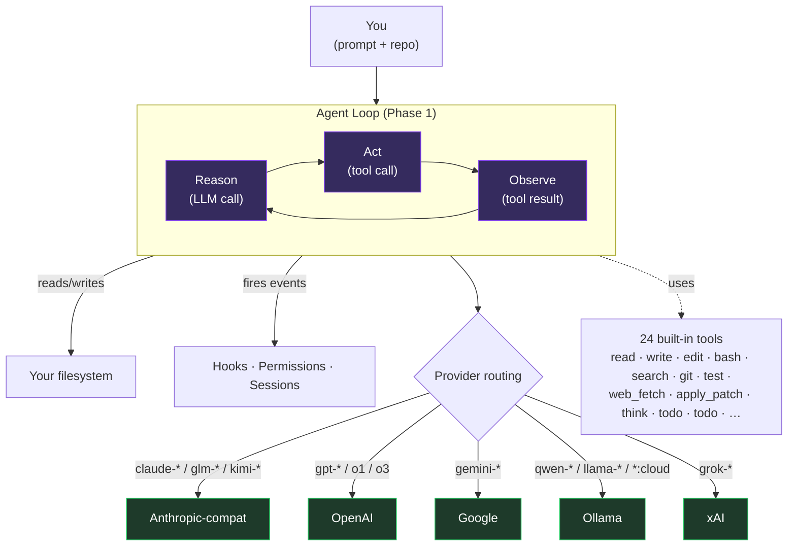
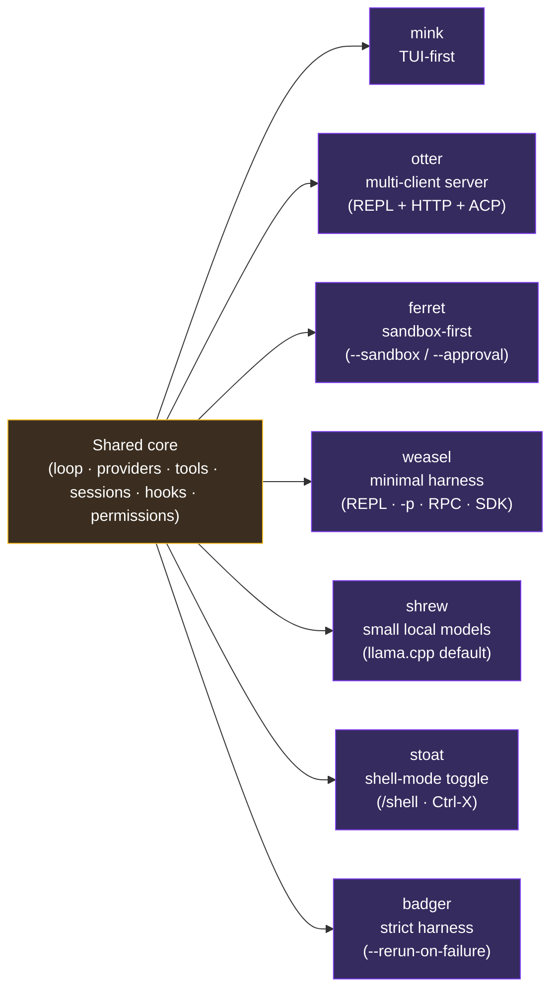

# Chimera

[](https://pypi.org/project/chimera-run/) [](https://pypi.org/project/chimera-run/) [](LICENSE) [](https://github.com/0bserver07/chimera/actions/workflows/ci.yml) [](https://github.com/0bserver07/chimera/actions) [](https://0bserver07.github.io/chimera/)

**An open-source Python framework for building coding agents.** Pick your provider, pick your tools, pick your loop. Chimera wires them together. Recreate SWE-Agent, Aider, Cline, or Codex in a few lines, or design something entirely new.

```bash
pip install chimera-run
chimera mink                        # TUI-first coding agent
chimera agents                      # list all 7 CLIs with one-line pitches
```

**v0.9.0 status** — 8549 passing tests, 97 skipped, 0 failed. ruff + mypy (675 modules) + 7 trademark scrubs all green. Reproducible benchmarks: HumanEval 92.7% pass@1 with GLM-5.1 (152/164; 4-model run up to Opus 4.7 at 100%), MBPP 87.4%, SWE-bench Lite 10% (2/20, gap analysis documented). New in 0.9.0: the TUI multiplexer (below) — plus resumable cohorts, heterogeneous lanes (`model[:preset[:loop]]`), live reasoning display, and markdown transcripts. Raw results in `data/`.

## New in 0.9.0 — the multiplexer: race N agents on one task

Chimera's comparison mission as a live interface: N agent lanes — different
models, presets, or genuinely different reasoning loops — attack the **same
task side by side**, each in its own isolated git worktree, while you watch
cost, tokens, steps, time, and the actual produced code diverge in real time.

```bash
pip install 'chimera-run[tui,anthropic]'
chimera code --tui --models glm-5.2,glm-4.6      # two models race one task
chimera code --tui --models glm-5.2              # one full-featured lane, edits your tree
chimera code --tui --models glm-5.2,glm-5.2:coding_agent:plan-execute
#                            same model, genuinely different reasoning loops
```

Broadcast a prompt to start the race (`Ctrl+B` targets one lane). `Ctrl+R`
opens a ranked scoreboard over per-lane diffs (side-by-side split with `s`);
`Ctrl+E` reveals the model's reasoning; `Ctrl+T` shows a tool-call sidebar.
Every run persists a comparison artifact under `~/.chimera/cohorts/<id>/`
(manifest, ranked summary, per-lane transcripts + diffs) and is resumable —
`/cohorts` in-app, or `--resume <id>`. Full notes:
[docs/releases/0.9.0.md](docs/releases/0.9.0.md).

## Who This Is For

**You build with CLI coding agents.**
You use terminal-native AI tools daily and you know what it feels like when an agent reads your codebase, edits files, and runs tests from your shell. You want to build your own — with your model, your tools, your rules — or take apart how these agents work to understand why they behave differently.

**You're curious about coding agents.**
You've seen demos of AI writing entire apps. You want to understand what's actually happening — what the pieces are, how the loop works, why some agents are better at certain tasks. Chimera breaks it all down into parts you can inspect, modify, and run yourself.

## What It Does

A coding agent is an LLM connected to your filesystem. It reads code, decides what to change, edits files, runs tests, and repeats until the task is done.

Chimera gives you two things:

1. **A coding-agent harness with a plugin system** — codebase search, auto-testing, code review, and context management, exposed as hooks, MCP servers, and skills you can wire into any compatible host.

2. **A Python library** for building your own coding agents from modular pieces — pick your LLM, pick your tools, pick your strategy, wire them together.

## How It Works



Seven CLIs share one substrate. Each codename is a thin posture — different defaults, different tool subset, different transport — over the same agent loop, the same provider factory, the same event-sourced session store.



`chimera which --task "build a TUI dashboard"` recommends the right codename for a given task. `chimera agents` lists all seven with one-liner pitches and the upstream tool that inspired each.

See [docs/architecture.md](docs/architecture.md) for the full 8-phase decomposition (state, sub-agents, permissions, prompts, hooks, commands, infrastructure, snapshots) and per-phase entry points.

## Install

Latest release: **v0.8.0** ([release notes](https://github.com/0bserver07/chimera/releases/tag/v0.8.0) · [PyPI](https://pypi.org/project/chimera-run/0.8.0/)).

```bash
pip install chimera-run                       # core
pip install "chimera-run[anthropic]"          # + Anthropic / Claude / GLM (Anthropic-compatible)
pip install "chimera-run[openai]"             # + OpenAI / GPT / OpenRouter
pip install "chimera-run[ollama]"             # + Ollama for local models
pip install "chimera-run[tui]"                # + textual TUI (mink/otter)
pip install "chimera-run[all]"                # everything above + browser + remote
```

Requires Python 3.11+. Or with [uv](https://docs.astral.sh/uv/): `uv pip install chimera-run`.

## Build Your Own Coding Agent

```python
from chimera.assembly.coding_agent import CodingAgent

# One line — full-featured coding agent with 24 tools.
# Requires ANTHROPIC_BASE_URL=https://api.z.ai/api/anthropic and ANTHROPIC_AUTH_TOKEN in env.
agent = CodingAgent(model="glm-5")

# Run a task
import asyncio

async def main():
    async for event in agent.run("Fix the bug in auth.py"):
        print(event.type.value, getattr(event.data, 'content', '')[:100])

asyncio.run(main())
```

### Presets

| Preset | Tools | Features |
|--------|-------|----------|
| `coding_agent` | 24 (bash, read, write, edit, search, git, test, agent, skill, ...) | Permissions, hooks, transcripts, compaction, streaming |
| `codex` | 24 | Permissions, transcripts (no hooks) |
| `minimal` | 4 (bash, read, write, edit) | No extras |
| `explore` | 3 (read, search, list) | Read-only |

```python
# Codex-style agent
agent = CodingAgent.from_preset("codex", model="gpt-4o")

# Minimal agent for simple tasks
agent = CodingAgent.from_preset("minimal", model="claude-haiku-3.5")

# Custom API endpoint (any Anthropic-compatible API)
import os
os.environ["ANTHROPIC_BASE_URL"] = "https://your-api.com/v1"
os.environ["ANTHROPIC_AUTH_TOKEN"] = "your-key"
agent = CodingAgent(model="your-model")
```

### Architecture

Chimera is modular — every component is replaceable:

```
CodingAgent
├── Provider (Anthropic, OpenAI, Google, Ollama, or any compatible API)
├── Tools (20+ built-in, plus custom tools, MCP servers, skills)
├── AgentLoop (async generator with streaming, error recovery, abort)
├── Permissions (multi-source rules, 6 modes, interactive prompts)
├── Hooks (27 lifecycle events, shell/LLM/function hooks)
├── Commands (slash commands, skills from .chimera/skills/)
├── Sub-Agents (3-tier context isolation, background tasks)
├── State (content replacement, file cache, session transcripts)
└── Infrastructure (feature flags, analytics, memory, compaction)
```

See [Architecture](https://0bserver07.github.io/chimera/architecture/) for the full module map.

## Run It Standalone

The Mink CLI ships a fully assembled coding agent with no extra setup:

```bash
chimera mink                                    # interactive REPL on Ollama Kimi K2.6 by default
chimera mink -p "summarize this repo"           # one-shot, prints to stdout
chimera mink runs list                          # inspect every persisted run
chimera mink agents list                        # show available agent presets
chimera code                                    # legacy stack with slash commands and session save
```

`chimera mink` is the v0.3.0 coding REPL: streaming tool calls, hooks,
permissions from `.claude/settings.json`, MCP, subagents, and a rich
TUI on a TTY (auto-disabled when piping; force off with `--no-color`).
See the [Mink quickstart](docs/mink/quickstart.md) for the walking
skeleton, env vars, and the runs/agents subcommand surface, and
[`docs/mink/providers.md`](docs/mink/providers.md) for the full
provider matrix (Ollama, Anthropic, OpenAI, Google, OpenAI-compat).

**Hooks** run automatically on every edit:
- Path validation — blocks edits to files that don't exist (no more hallucinated paths)
- Auto-test — finds and runs related tests after every file change
- Auto-lint — runs your linter after every edit
- Security scan — blocks dangerous bash commands
- Verify done — runs the full test suite before the agent can declare "done"

**MCP servers** give the agent new tools to call:
- `chimera-search` — semantic codebase search + symbol lookup
- `chimera-review` — multi-perspective code review (logic, security, tests, architecture, and 4 more)
- `chimera-testgen` — generate test skeletons from source analysis
- `chimera-migration` — scan for and apply code migrations (Python 2 to 3, CJS to ESM)

The plugin honors a `settings.json` schema for ecosystem interop, so the same hooks/MCP/skills also drop into any host that follows that convention.

[Setup guide](docs/playbooks/00-quick-start.md) — install in 2 minutes.

> **Discoverability note:** Each of the 7 coding-agent CLIs has a purpose alias for tab-friendly invocation: `chimera tui` ≡ `chimera mink`, `chimera multi` ≡ `chimera otter`, `chimera sandbox` ≡ `chimera ferret`, `chimera mini` ≡ `chimera weasel`, `chimera tiny` ≡ `chimera shrew`, `chimera shell` ≡ `chimera stoat`, `chimera strict` ≡ `chimera badger`. Run `chimera agents` to list all seven with one-liner pitches and the upstream tool that inspired each. See [docs/inspirations.md](docs/inspirations.md).

### Otter — server-first coding agent

`chimera otter` is the second coding-agent CLI. Where `chimera mink` mirrors a TUI-first agent, otter mirrors a server-first / multi-client open-source coding agent: a single ReAct loop you can drive from a one-shot CLI, an interactive REPL, an HTTP server with SSE streaming, or an ACP JSON-RPC transport — all backed by the same `LoopConfig`, tool registry, and event-sourced session store the rest of Chimera uses.

Quick install + first run with `glm-5.1:cloud` (via Ollama's Anthropic-compatible bridge):

```bash
uv sync --extra dev --extra anthropic
export ANTHROPIC_BASE_URL=http://localhost:11434
export ANTHROPIC_AUTH_TOKEN=ollama
chimera otter --model glm-5.1:cloud -p "summarize this repo"   # one-shot
chimera otter --model glm-5.1:cloud                            # interactive REPL
chimera otter --model glm-5.1:cloud serve --port 5173          # HTTP + SSE
chimera otter --model glm-5.1:cloud serve --acp                # ACP over stdio
```

Three transports, one loop:

- **REPL** — streaming text + tool calls, mid-turn steering, `Ctrl-C` cancel, 26-entry slash-command palette (`/help`, `/share`, `/agent`, `/model`, `/sessions`, `/compact`, …).
- **HTTP + SSE** — `/sessions`, `/sessions/{id}`, `/sessions/{id}/turns`, `/sessions/{id}/events` (Server-Sent Events). Optional `OTTER_SERVER_TOKEN` Bearer auth.
- **ACP** — JSON-RPC over stdio for IDE clients that already speak the Agent Client Protocol.

Key flag surface:

```bash
chimera otter --model glm-5.1:cloud -p "..."     # pick the provider/model
chimera otter --no-mcp -p "..."                  # disable MCP tool sources
chimera otter --no-rules -p "..."                # ignore project + user rules files
chimera otter --no-plugins -p "..."              # skip directory-loaded plugins
chimera otter --no-lsp -p "..."                  # disable LSP-backed edit verification
```

Every persisted run lives under `~/.chimera/eventlog/otter-<utc>-<uuid>/` and is listable, showable, and shareable (`chimera otter sessions list | show | --since 7d`, `chimera otter share <id> --sink http|file|stdout --format html|md|json`).

See the [Otter quickstart](docs/otter/quickstart.md) for the full walkthrough — provider resolution order, env vars, on-disk layout, and pointers to `providers.md`, `models.md`, `sessions.md`, `share.md`, and `server.md`.

### Ferret — sandbox-first IDE-flagship coding agent

`chimera ferret` is the third coding-agent CLI. Where mink is TUI-first and otter is server-first, ferret mirrors the upstream IDE-flagship posture: a sandbox-first runner with single-flag approval presets, an ACP JSON-RPC transport that ships as the *default* `serve` transport (HTTP is opt-in), and an optional cloud bridge so a local ferret session can be driven from a remote UI. The two headline guardrails compose: `--sandbox` blocks at the OS level, `--approval` blocks at the policy level, and a tool call has to pass both.

```bash
uv sync --extra dev --extra openai
export OPENAI_API_KEY=sk-...
chimera ferret -p "audit the repo"                                       # default: read-only sandbox + read-only approval
chimera ferret --sandbox workspace-write --approval auto -p "fix tests"  # writes inside cwd, no asks for safe ops
chimera ferret                                                           # interactive REPL
chimera ferret serve                                                     # ACP over stdio (the default)
chimera ferret serve --http --port 5173                                  # HTTP, opt-in
```

See the [Ferret quickstart](docs/ferret/quickstart.md) for the four entry points, sandbox modes, approval presets, IDE-bridge wiring, and cloud-bridge setup.

### Weasel — minimal harness with four operating modes

`chimera weasel` is the fourth coding-agent CLI. Where mink/otter/ferret each ship strong opinions, weasel mirrors the *minimal harness* posture: powerful defaults, no sub-agents, no plan mode, no built-in approval presets — just one ReAct loop reachable through four interchangeable I/O envelopes (interactive REPL, one-shot print, stdio JSON-RPC, embedded SDK), an auto-discovered `.weasel/extensions/` directory, and an embeddable `Agent` class. If you want more, you build it (or install an extension); weasel will not get in the way.

```bash
uv sync --extra dev --extra anthropic
export ANTHROPIC_API_KEY=sk-ant-...
chimera weasel                                       # mode 1: interactive REPL
chimera weasel -p "summarize TODO comments in src/"  # mode 2: one-shot print (add --json for a single JSON blob)
chimera weasel --mode rpc < requests.jsonl           # mode 3: stdio JSON-RPC server
python -c "from chimera.weasel.sdk import Agent; print(Agent(model='claude-sonnet-4-6').run('list files').text)"  # mode 4: SDK
```

See the [Weasel quickstart](docs/weasel/quickstart.md) for the four modes in detail, the extension layout, and the SDK recipe.

### Shrew — coding agent tuned for small local models

`chimera shrew` is the fifth coding-agent CLI, **explicitly tuned for small local models** (Qwen3.5-9B, Qwen3.6-35B-A3B MoE, and friends). It is a thin layer on top of weasel — same four modes, same session schema, same extension surface — but with three small-model adjustments: the default model is `qwen3.6-35b-a3b` served by llama.cpp on `127.0.0.1:8888`, `--max-steps` defaults to 30 (smaller than mink/otter's 50; small models don't benefit from long horizons), and the default `--allowed-tools` is the restricted `Read,Write,Edit,Bash` set so a 4-bit quantised model doesn't burn its context budget on tool selection. Cloud fallbacks (`anthropic/claude-haiku-4-5`, `openai/gpt-4o-mini`) work via `--model vendor/name`.

```bash
# Build llama.cpp and serve a GGUF on :8888 (see docs/shrew/small-model-setup.md)
./llama-server -m qwen3.6-35b-a3b.Q4_K_M.gguf --host 127.0.0.1 --port 8888 &

uv sync --extra dev
chimera shrew -p "explain this repo"                    # one-shot against the local llama.cpp server
chimera shrew                                           # interactive REPL
chimera shrew --list-models                             # known model identifiers
chimera shrew bench aider-polyglot --bench-limit 5      # small-model benchmark harness
chimera shrew --model anthropic/claude-haiku-4-5 -p "..."  # cloud fallback
```

See the [Shrew quickstart](docs/shrew/quickstart.md) for the small-model setup walkthrough and benchmark harness.

### Stoat — shell-mode-toggle coding agent

`chimera stoat` is the sixth coding-agent CLI. Where the first five each ship rich opinionated postures, stoat's distinguishing ergonomic is the **shell-mode toggle**: in the same REPL, each line either feeds the LLM agent or runs as a direct shell command, and the user flips between the two with `/shell` (or `--shell-mode` on boot). Stoat is for users who live in their terminal and want one buffer for both `ls -la` and "explain this repo". The provider chain is Kimi-first via `$MOONSHOT_API_KEY` (`kimi-k2.6` on `api.moonshot.ai/v1`), with Anthropic / OpenAI / OpenRouter / Ollama fallthroughs.

```bash
uv sync --extra dev --extra anthropic
export MOONSHOT_API_KEY=...
chimera stoat -p "summarize TODO comments in src/"   # one-shot
chimera stoat                                        # interactive REPL — toggle with /shell
chimera stoat --shell-mode                           # boot directly into shell mode
```

In the REPL, `stoat>` is agent mode, `stoat$` is shell mode; `/shell` toggles. Mode-tagged history (`/history` renders `>` and `$` markers) keeps both modes visible inline. See the [Stoat quickstart](docs/stoat/quickstart.md) for the full shell-mode walkthrough.

### Badger — harness-rewrite coding agent

`chimera badger` is the seventh coding-agent CLI. Where stoat's headline is ergonomic, badger's is **harness discipline**: tighter step budget (`--max-steps` defaults to 25 vs 50 for the other six), rerun-on-failure as a first-class flag (`--rerun-on-failure --max-reruns 2`), and a parity-tracker subcommand (`chimera badger parity --against PARITY.md`) that diffs a declared schema against the live agent's defaults. The provider chain is Anthropic-first.

```bash
uv sync --extra dev --extra anthropic
export ANTHROPIC_API_KEY=sk-ant-...
chimera badger -p "Refactor src/util.py to remove duplicated string formatting"
chimera badger -p "fix the failing tests" --rerun-on-failure --max-reruns 3
chimera badger parity --against PARITY.json          # rc=0 on match, rc=1 on diff
```

The rerun-on-failure detector is a conservative marker list (pytest summaries, Python tracebacks, Rust E0xxx, syntax errors, explicit `BUILD FAILED`). When fired, the refined-prompt directive names the markers and asks the agent to verify before reporting done. See the [Badger quickstart](docs/badger/quickstart.md) for the rationale and full surface.

## How It's Organized

Chimera is an 8-layer stack. Each layer has a documented API boundary; swap any provider, tool, env, or strategy without touching the rest.

```
What you run        CLI commands: chimera code / synthesize / eval / review / ci-fix / fs
                    ─────────────────────────────────────────────────────────────────
Automated           CI repair, code review, research, migration planning, doc and
workflows           test generation — multi-step pipelines built on the agent layer
                    ─────────────────────────────────────────────────────────────────
Iterating on code   Give it a spec and tests, it keeps trying until the tests pass.
                    Strategies: converge on tests, search a tree of approaches,
                    generate-then-verify (CEGIS), curriculum learning
                    ─────────────────────────────────────────────────────────────────
Measuring quality   Run benchmarks (HumanEval, SWE-bench, AIMO, custom), collect
                    pass rates and costs, compare agent configurations
                    ─────────────────────────────────────────────────────────────────
The agent itself    An LLM in a loop: think, call a tool, observe the result,
                    repeat. 24 built-in tools (read, write, edit, bash, search,
                    git, test, web fetch, etc). 4 loop strategies.
                    ─────────────────────────────────────────────────────────────────
LLM providers       Anthropic, OpenAI, Google, Ollama, Modal, or any
                    OpenAI-compatible API. Streaming, async, cost tracking.
                    ─────────────────────────────────────────────────────────────────
Plumbing            Auth, sessions (save/resume/fork), event bus, permissions,
                    context compaction, secrets, plugins, MCP, LSP
                    ─────────────────────────────────────────────────────────────────
Where code runs     Your filesystem, a Docker container, a git branch,
                    a remote server, or a cloud sandbox
```

## Benchmarks

Reproducible runs with raw data in `data/`:

| Benchmark | GLM-5.1 | Raw data |
|-----------|---------|----------|
| HumanEval (164 problems) | 92.7% pass@1 (152/164) | `data/humaneval-glm51-results.json` |
| HumanEval+ (164, EvalPlus tests) | 89.6% (147/164) | `data/humanevalplus-glm-5.1-results.json` |
| MBPP (sanitized 427) | 87.4% (373/427) | `data/mbpp-glm-5.1-results.json` |
| SWE-bench Lite (20 smallest patches) | 10% (2/20) | `data/swebench-lite-glm51-results.jsonl` |

(The previously published HumanEval 66.5% was a harness extraction bug, fixed and re-run 2026-05-20.) The same runs cover Haiku 4.5, Sonnet 4.6, and Opus 4.7 — see the [full transparency report](docs/benchmarks/README.md) for every benchmark's status, methodology, and known gaps.

**Controlled comparisons** (new in 0.8.0): `chimera bench-compare` runs the same tasks, model, tools, and per-task budget across multiple agent loops and reports `pass_rate × cost × steps × budget_hits` — the [first published matrix](docs/benchmarks/2026-06-11-first-controlled-matrix.md) (react vs plan-execute on GLM-5.1) costs about five cents to reproduce and emits ATIF v1.7 trajectories that Pier's viewer can open.

## Run It Free with Ollama

Chimera speaks Ollama's Anthropic-compatible API out of the box. You can run the full agent against `kimi-k2.6:cloud`, `glm-5.1:cloud`, or any local Qwen/Llama with zero code changes:

```bash
export ANTHROPIC_BASE_URL=http://localhost:11434
export ANTHROPIC_AUTH_TOKEN=ollama
python examples/agent/ollama_coding_agent.py --model kimi-k2.6:cloud
```

[Full Ollama setup guide](https://0bserver07.github.io/chimera/guides/use-with-ollama/) — prerequisites, recommended models, context window notes, troubleshooting.

## When to Reach for Chimera

Use Chimera if you want to:
- Run a coding agent on your own model (local Ollama, GLM, GPT, Anthropic-compatible) with hooks, MCP, and skills wired in
- Build your own coding agent — different LLM, different tools, different strategy
- Understand how coding agents work — every major architecture decomposed into swappable pieces
- Research and benchmark — compare agent architectures with controlled experiments

## Links

- [Quick Start](docs/playbooks/00-quick-start.md) — hooks, MCP servers, skills
- [Coding Agents Overview](docs/coding-agents.md) — comparative tour of the seven-strong family (mink, otter, ferret, weasel, shrew, stoat, badger)
- [Mink Quickstart](docs/mink/quickstart.md) — `chimera mink` REPL, runs/agents subcommands
- [Mink Providers](docs/mink/providers.md) — backend matrix, env vars, troubleshooting
- [Otter Quickstart](docs/otter/quickstart.md) — `chimera otter` one-shot, REPL, HTTP+SSE, ACP
- [Ferret Quickstart](docs/ferret/quickstart.md) — `chimera ferret` sandbox + approval presets, ACP-default `serve`, cloud bridge
- [Weasel Quickstart](docs/weasel/quickstart.md) — `chimera weasel` four modes (REPL / print / RPC / SDK), extensions
- [Shrew Quickstart](docs/shrew/quickstart.md) — `chimera shrew` small-model defaults, llama.cpp setup, benchmark harness
- [Stoat Quickstart](docs/stoat/quickstart.md) — `chimera stoat` shell-mode toggle, Kimi-first provider chain
- [Badger Quickstart](docs/badger/quickstart.md) — `chimera badger` harness discipline, rerun-on-failure, parity-tracker
- [Build Your Own Agent](docs/playbooks/08-building-agents.md) — full library guide
- [All Playbooks](docs/playbooks/) — 13 guides covering every feature
- [Examples](examples/) — 28 curated runnable scripts across 7 categories
- [Function Synthesis](docs/function-synthesis.md) — compile specs into callable `.chi` bundles
  - 3 runtime backends (llama.cpp, transformers, ONNX), schema validation, streaming invoke
  - `LocalCompiler` for real PEFT fine-tuning; publish and fetch bundles via `chimera fs push | pull` (Hugging Face Hub + S3)
  - 10 CLI sub-verbs: `compile`, `run`, `list`, `rm`, `info`, `push`, `pull`, `import-peft`, `login`, `rename`
- [Benchmarks](docs/benchmarks/README.md) — transparency framework
- [Benchmark adapters](docs/mink/benchmarks.md) — every adapter under `chimera/eval/benchmarks/`, status, and how to run
- [Field Guide to Coding Agents](https://0bserver07.github.io/chimera/field-guide/) — architecture catalog of the 10 replicated agents (new in 0.8.0)
- [Release notes: 0.8.0](docs/releases/0.8.0.md) — the comparative-methodology release
- [Contributing](CONTRIBUTING.md) — setup, workflow, code style
- [Changelog](CHANGELOG.md) — version history

## License

[MIT](LICENSE)
