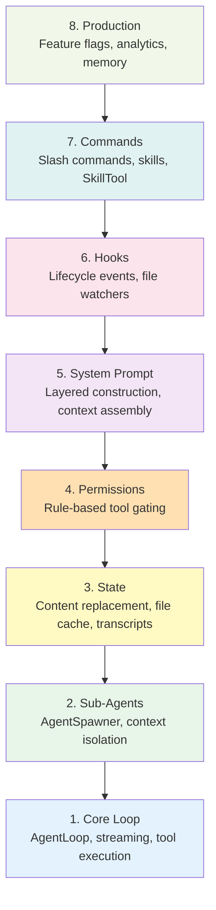
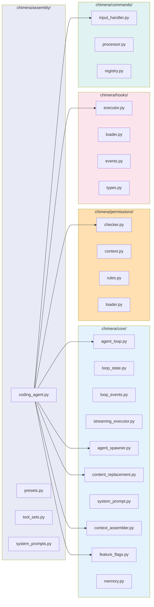
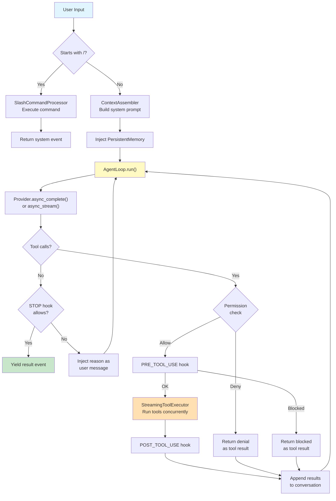

# Chimera Architecture

Chimera is a layered framework for building tool-augmented LLM agents. The architecture is organized around **CodingAgent**, a single assembly point that wires together 8 phases into a fully functional coding agent.

## CodingAgent: The Assembly Point

`CodingAgent` (`chimera/assembly/coding_agent.py`) is the top-level entry point. It composes all 8 architectural phases into a working agent in a single constructor call:

```python
agent = CodingAgent(model="claude-sonnet-4-20250514")
async for event in agent.run("Fix the bug in auth.py"):
    print(event)
```

Presets (`claude_code`, `codex`, `minimal`, `explore`) control which phases are activated and how they are configured.

## The 8 Layers



### Layer 1: Core Loop

The async-generator `AgentLoop` that alternates between LLM calls and tool execution. Handles streaming, error recovery, compaction, abort signals, and turn counting.

**Key modules:** `agent_loop.py`, `loop_state.py`, `loop_events.py`, `streaming_executor.py`, `recovery.py`, `abort.py`

### Layer 2: Sub-Agents

`AgentSpawner` creates isolated sub-agent instances from `AgentDefinition` descriptors. Each sub-agent gets its own `AgentContext` with scoped tools and conversation history.

**Key modules:** `agent_spawner.py`, `agent_context.py`, `agent_definition.py`, `builtin_agents.py`

### Layer 3: State

Tracks mutable state across the loop. `ContentReplacementState` decides when to persist large tool results to disk. `FileStateCache` provides LRU caching for file reads. `TranscriptStorage` records conversations to JSONL.

**Key modules:** `content_replacement.py`, `file_state_cache.py`, `transcript.py`, `resume.py`

### Layer 4: Permissions

Multi-source rule-based permission checking for tool calls. Rules are loaded from project-level and user-level settings files. Supports ALLOW, DENY, and ASK behaviors with denial tracking.

**Key modules:** `checker.py`, `context.py`, `rules.py`, `loader.py`, `modes.py`, `decisions.py`, `denial_tracking.py`

### Layer 5: System Prompt

Layered system prompt construction. `ContextAssembler` builds the prompt from project context (git status, directory listing, tool schemas). `SystemPromptBuilder` stacks cacheable and non-cacheable layers. Persistent memory is injected as a final layer.

**Key modules:** `context_assembler.py`, `system_prompt.py`, `system_prompts.py`

### Layer 6: Hooks

Lifecycle hook system that fires events at key points: `SESSION_START`, `PRE_TOOL_USE`, `POST_TOOL_USE`, `STOP`, `SESSION_END`, and more. Hooks can block tool execution, modify inputs, or prevent the agent from stopping.

**Key modules:** `executor.py`, `loader.py`, `events.py`, `types.py`, `emitter.py`, `file_watcher.py`

### Layer 7: Commands

Slash-command system for user input. `InputHandler` intercepts `/command` input before it reaches the model. `CommandRegistry` manages builtins, skills, and plugin commands. `SkillTool` lets the model invoke skills programmatically.

**Key modules:** `input_handler.py`, `processor.py`, `registry.py`, `builtins.py`, `skill_tool.py`

### Layer 8: Production

Cross-cutting production concerns. `FeatureFlags` gates experimental features via environment variables. `AnalyticsManager` routes events to pluggable sinks. `PersistentMemory` stores cross-session facts in a Markdown file.

**Key modules:** `feature_flags.py`, `manager.py`, `sinks.py`, `memory.py`

## Module Map



## Data Flow

The path from user input to agent response:



### Step-by-step

1. **Slash check** -- `InputHandler` inspects user input. If it starts with `/`, route to `SlashCommandProcessor` and return without calling the model.
2. **System prompt assembly** -- `ContextAssembler` gathers project context (git status, directory structure, tool schemas, user-supplied prompt text). `PersistentMemory` content is appended as a non-cacheable layer.
3. **AgentLoop** -- The core async-generator loop. Each iteration calls the provider, checks for tool calls, and either completes or continues.
4. **Provider call** -- Sends the full message history (system prompt + conversation) to the LLM. Supports both streaming (`async_stream`) and non-streaming (`async_complete`) modes.
5. **Permission check** -- If a `PermissionChecker` is configured, each tool call is checked against loaded rules. DENY returns an error result without executing. ASK requires interactive approval (or defaults to denial in non-interactive mode).
6. **Hook gates** -- `PRE_TOOL_USE` hooks can block execution or modify tool arguments. `POST_TOOL_USE` hooks observe results. `STOP` hooks can prevent the agent from finishing.
7. **Tool execution** -- `StreamingToolExecutor` runs non-blocked tool calls concurrently with configurable parallelism.
8. **Context update** -- Tool results are appended to the conversation as tool-result messages, then the loop iterates.
