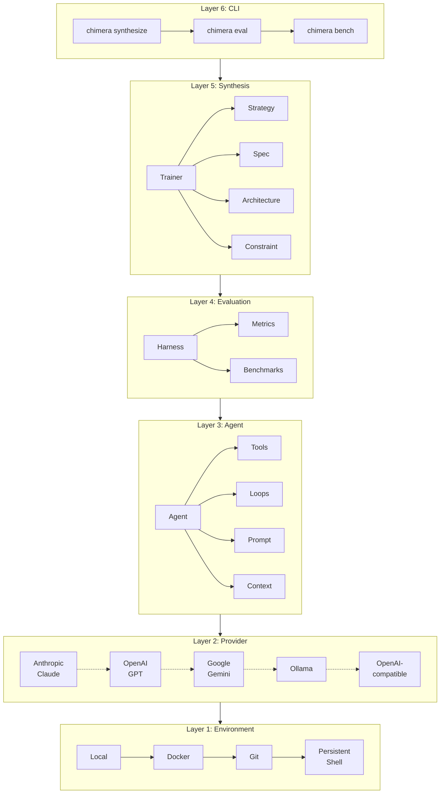
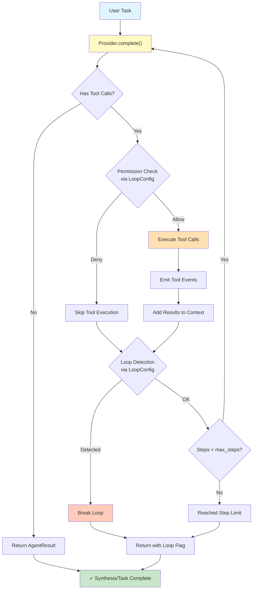
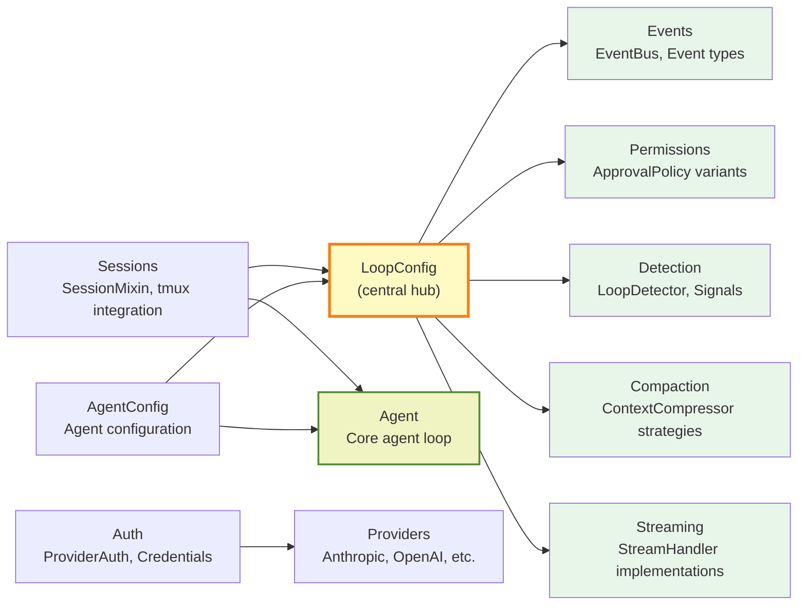
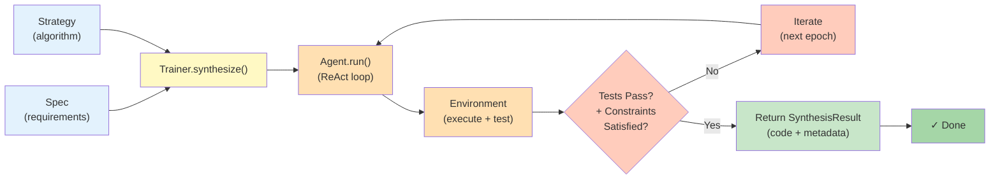

# Chimera Architecture

Chimera is a layered framework designed to synthesize codebases from specifications using AI agents. The architecture is organized into six distinct layers, each of which can be used independently or composed together for increasingly sophisticated workflows.

## Layer Stack

Chimera's architecture follows a modular, layered approach where each layer builds upon the lower layers and provides specific functionality:

### Layer Descriptions

**Layer 1: Environment** — Execution contexts for running code and tests. Supports local filesystem operations, Docker containers, Git-based checkpointing, and persistent tmux-based shell sessions that maintain state across agent steps.

**Layer 2: Provider** — LLM backends abstracted behind a common interface. Supports Anthropic Claude, OpenAI GPT, Google Gemini, Ollama, and any OpenAI-compatible endpoint (OpenRouter, vLLM, Groq, GLM-5).

**Layer 3: Agent** — The agent loop system combining Provider, Tools, Loop strategies, Prompt templates, and Context management. The ReAct loop (default) implements Reason → Act → Observe cycles with tool use.

**Layer 4: Evaluation** — Benchmarking and metrics for assessing synthesis quality. Includes harness abstraction, metric calculators (pass@k, resolve rate, cost), and adapters for SWE-bench, HumanEval, and custom benchmarks.

**Layer 5: Synthesis** — The training system for code synthesis. Trainer orchestrates Architecture (layer dependencies), Spec (requirements), Strategies (synthesis algorithms), and Constraints (success criteria).

**Layer 6: CLI** — Command-line interface exposing synthesize, eval, and bench operations to end users.

### Using Each Layer

The layers are designed to be composable:

- **Layers 1–3**: Use as an agent toolkit for building agentic applications
- **Layers 1–5**: Use as a full synthesis framework for generating code from specs
- **Layer 6**: Use the CLI for terminal-based synthesis, evaluation, and benchmarking

For example, you can build a simple agent using only Layers 1–3, or a complete code generation pipeline using all five lower layers before adding the CLI.

---

## Agent Loop Flow

The ReAct (Reason → Act → Observe) loop is the core execution engine for agents in Chimera. It iterates between asking the LLM provider for the next action and executing tool calls until the agent produces a final response.

### Loop Mechanics

**Provider.complete()** — Queries the LLM with the current conversation context and tool schemas. Returns the next response with optional tool calls.

**Permission Check** — Uses the `ApprovalPolicy` from `LoopConfig` to decide whether to execute a tool call. Policies include:
- `AutoApprove`: execute all tools
- `AlwaysDeny`: reject all tools
- `AllowList`: execute only whitelisted tools
- Custom policies for fine-grained control

**Tool Execution** — Runs the requested tool (file read/write, bash, test, git, etc.) and captures the output.

**Event Emission** — Publishes `ToolCallEvent` and `ToolResultEvent` to the event bus for logging and observability.

**Loop Detection** — Detects infinite loops by maintaining a sliding window of recent action signatures. If the agent repeats the same sequence, execution breaks.

**Context Management** — Tool results are added back to the conversation context, allowing the LLM to reason about the output in the next iteration.

---

## Module Dependency Map

Chimera's extension modules (Phase 19+) are organized around `LoopConfig`, which acts as a central hub for configurable loop behaviors.

### Module Roles

**LoopConfig** — Central configuration object that plugs extensions into the ReAct loop. Holds references to event bus, approval policy, loop detector, context compressor, and stream handler.

**Events** — Publish-subscribe system for observing agent execution (step start, tool calls, tool results, errors). Decouples logging/monitoring from the core loop.

**Permissions** — Approval policies that gate tool execution. Enables human-in-the-loop, safety constraints, and debugging workflows.

**Detection** — Loop detection algorithms to prevent infinite cycles. Maintains signatures of recent actions and breaks on repetition.

**Compaction** — Context compression strategies (keep-first, keep-last, summarize) to manage token usage in long conversations.

**Streaming** — Streaming handlers for real-time output observation. Allows printing to stdout or collecting results without blocking.

**Sessions** — Persistent shell sessions via SessionMixin. Enables stateful command execution across agent steps using tmux.

**Auth** — Provider authentication and credential management. Supports environment variable loading, token refresh, and multi-provider auth.

**AgentConfig** — High-level agent configuration builder. Wraps Agent, LoopConfig, and related settings into a single configuration object.

---

## Training Pipeline

The synthesis process (Layers 5) orchestrates agents with specifications and constraints to generate code that passes tests. The pipeline iterates until constraints are satisfied.

### Pipeline Stages

**Spec + Strategy** — The specification defines what code should do (from tests, documentation, or examples). The strategy determines how to synthesize (TestConvergence, TreeSearch, Curriculum, Ensemble, etc.).

**Trainer.synthesize()** — Main entry point. Orchestrates the strategy with the agent, environment, and constraints.

**Agent.run()** — Executes the ReAct loop with the current codebase and specification. The agent reads files, thinks about changes, and writes code.

**Environment (execute + test)** — Runs tests to validate the generated code. LocalEnvironment, DockerEnvironment, and GitEnvironment all support test execution.

**Tests Pass?** — Check if all test constraints are satisfied. If not, the agent iterates with feedback about what failed.

**Iterate** — If tests fail, loop back with refined prompts, checkpoints, or branch exploration (for tree search).

**Return SynthesisResult** — When constraints are satisfied, return the generated code, metrics, and synthesis history.

### Strategy Variants

Chimera includes multiple synthesis strategies:

- **TestConvergence** (default) — Iterate until all tests pass
- **TreeSearch** — Explore multiple branches in parallel, prune low-scoring paths
- **Curriculum** — Synthesize layers in topological order (dependencies first)
- **Ensemble** — Run multiple agents in parallel, pick the best result
- **MajorityVoting** — Combine multiple attempts via consensus
- **AIMOEnsemble** — Voting with tree search fallback for harder problems
- **Passthrough** — Single-shot synthesis (no iteration)

---

## Extension Architecture

Chimera supports custom extensions through well-defined interfaces:

- **Custom Tools** — Subclass `BaseTool` to add new agent capabilities
- **Custom Loops** — Subclass `Loop` base class for new reasoning strategies (e.g., multi-agent loops)
- **Custom Strategies** — Subclass `Strategy` for new synthesis algorithms
- **Custom Constraints** — Implement constraint functions for custom success criteria
- **Custom Environments** — Subclass `Environment` to support new execution contexts (e.g., Kubernetes, cloud functions)
- **Custom Providers** — Subclass `Provider` to integrate new LLM backends

All extensions integrate seamlessly via the public API exports in `chimera/__init__.py`.
