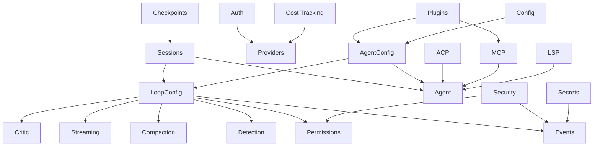

# Extension Modules

Chimera ships with eighteen extension modules that were added to support building
interactive coding agents (like Claude Code or OpenCode) on top of the core
framework.  Every loop-level feature -- events, permissions, compaction,
detection, and streaming -- is wired through `LoopConfig` so that the agent
loop can be configured declaratively.

## Module overview

| Module | Package | Purpose |
|--------|---------|---------|
| [Events](events.md) | `chimera.events` | Publish/subscribe event bus with middleware |
| [Compaction](compaction.md) | `chimera.compaction` | Context window management and message pruning |
| [Detection](detection.md) | `chimera.detection` | Loop and repetition detection for tool calls |
| [Permissions](permissions.md) | `chimera.permissions` | Rule-based tool permission policies |
| [Streaming](streaming.md) | `chimera.streaming` | Real-time streaming output handlers |
| [Sessions](sessions.md) | `chimera.sessions` | Multi-turn conversation persistence |
| [Auth](auth.md) | `chimera.auth` | Credential management for LLM providers |
| [Agents & Config](agents-config.md) | `chimera.agents` | Declarative agent definitions and presets |
| [Security](security.md) | `chimera.security` | Tool call risk analysis and confirmation policies |
| [Secrets](secrets.md) | `chimera.secrets` | Secret detection and redaction in event streams |
| [Critic](critic.md) | `chimera.critic` | In-loop action evaluation with LLM or rule-based critics |
| [ACP](acp.md) | `chimera.acp` | Agent Client Protocol for external agent interop |
| [Plugins](plugins.md) | `chimera.plugins` | Plugin lifecycle, extension registry, marketplace |
| [Config](config.md) | `chimera.config` | Polymorphic config serialization, project config |
| [Checkpoints](checkpoints.md) | `chimera.checkpoints` | Named checkpoints with create/restore/undo |
| [Cost Tracking](cost-tracking.md) | `chimera.providers.cost_tracker` | Granular token and cost tracking with budgets |
| [MCP](mcp.md) | `chimera.mcp` | Model Context Protocol client (stdio/HTTP) |
| [LSP](lsp.md) | `chimera.lsp` | Language Server Protocol for diagnostics, completion, rename |

## Dependency diagram

The diagram below shows how the modules relate to each other.  `LoopConfig`
sits at the centre, aggregating the loop-level modules.  `Sessions` and
`AgentConfig` build on top by composing agents with their configuration.



## Quick start

Most users interact with these modules indirectly through `AgentConfig` or a
preset agent.  For example, creating a build agent with streaming and
persistence takes only a few lines:

```python
from chimera.agents import BuildAgent
from chimera.providers.anthropic import AnthropicProvider
from chimera.sessions import Session, FileStorage
from chimera.streaming import ConsoleStreamHandler

provider = AnthropicProvider()
agent = BuildAgent(provider)

session = Session(agent, storage=FileStorage())
result = session.chat("Add a health-check endpoint to the FastAPI app.")
session.save()
```

The following pages document each module in detail, starting with the event
system that underpins observability across the entire framework.
