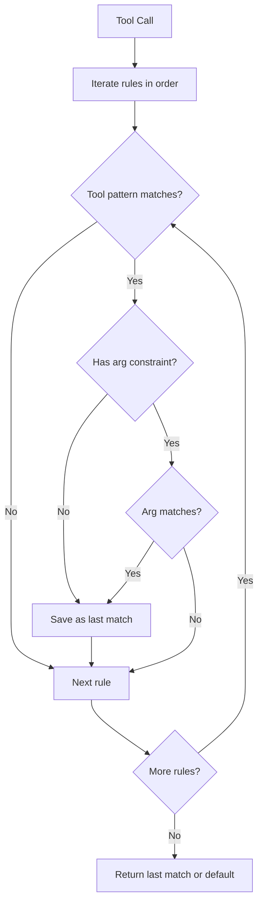

# Permissions

`chimera.permissions` provides a rule-based system that decides whether each
tool invocation should be allowed, denied, or require user confirmation.  It
ships with five presets covering common use cases and a `PermissionRuleset`
for fine-grained control.

## Core types

### PermissionAction (enum)

Every permission evaluation returns one of three outcomes:

| Value | Meaning |
|-------|---------|
| `ALLOW` | Tool call proceeds without user input |
| `DENY` | Tool call is blocked |
| `ASK` | User is prompted for confirmation |

### PermissionPolicy (ABC)

The interface that every policy must implement:

```python
class PermissionPolicy(ABC):
    @abstractmethod
    def evaluate(self, tool_name: str, args: dict[str, Any]) -> PermissionAction: ...
```

## Rule and PermissionRuleset

### Rule dataclass

A single matching rule with glob-based patterns:

| Field | Type | Description |
|-------|------|-------------|
| `tool_pattern` | `str` | Glob pattern for the tool name (e.g. `"bash"`, `"write_*"`, `"*"`) |
| `action` | `PermissionAction` | Action to apply when matched |
| `arg_key` | `str \| None` | Optional argument key to inspect |
| `arg_pattern` | `str \| None` | Glob pattern for `args[arg_key]` |
| `description` | `str` | Human-readable description |

### PermissionRuleset

An ordered list of `Rule` objects evaluated with **last-match-wins** semantics
(similar to `.gitignore`).  Pattern matching uses `fnmatch.fnmatch`.

```python
from chimera.permissions import PermissionRuleset, Rule, PermissionAction

policy = PermissionRuleset(
    rules=[
        Rule(tool_pattern="*", action=PermissionAction.ASK),
        Rule(tool_pattern="read_file", action=PermissionAction.ALLOW),
        Rule(tool_pattern="search", action=PermissionAction.ALLOW),
        Rule(
            tool_pattern="bash",
            action=PermissionAction.DENY,
            arg_key="command",
            arg_pattern="rm *",
            description="Block destructive shell commands",
        ),
    ],
    default=PermissionAction.ASK,
)

action = policy.evaluate("bash", {"command": "rm -rf /"})
# -> PermissionAction.DENY (last matching rule wins)
```

## Evaluation flow



## Presets

Five convenience policies cover the most common scenarios:

| Preset | Behaviour |
|--------|-----------|
| `AutoApprove` | Allow everything unconditionally |
| `AlwaysDeny` | Deny everything unconditionally |
| `AllowList(allowed)` | Allow only named tools; deny all others |
| `ReadOnly` | Allow `read_file`, `search`, `list_files`, `repo_map`; deny the rest |
| `Interactive` | Auto-allow reads; prompt for `bash`, `write_file`, `edit_file`, `replace_in_file`, `git` |

```python
from chimera.permissions import ReadOnly, Interactive

# Read-only agent
policy = ReadOnly()
policy.evaluate("read_file", {})   # ALLOW
policy.evaluate("bash", {})        # DENY

# Interactive confirmation for writes
policy = Interactive()
policy.evaluate("read_file", {})   # ALLOW
policy.evaluate("write_file", {})  # ASK
```

## Custom policies

Implement `PermissionPolicy` for domain-specific logic:

```python
from chimera.permissions import PermissionPolicy, PermissionAction

class TimeBasedPolicy(PermissionPolicy):
    """Deny writes outside business hours."""
    def evaluate(self, tool_name, args):
        import datetime
        hour = datetime.datetime.now().hour
        if tool_name.startswith("write") and not (9 <= hour < 17):
            return PermissionAction.DENY
        return PermissionAction.ALLOW
```
