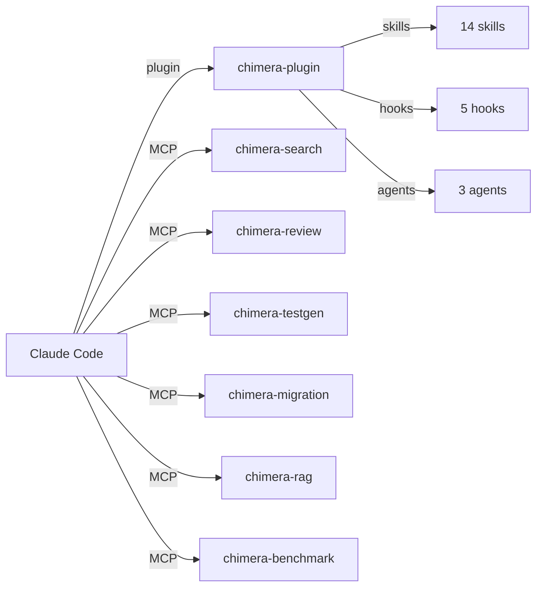

# Playbook 00: Quick Start

Set up all Chimera integrations with Claude Code in one go: MCP servers, hooks, skills, agents, and commands.

## What This Solves

Without Chimera, Claude Code operates with built-in tools only. It has no semantic codebase search, no automatic test/lint feedback, no path validation, and no security scanning of bash commands. This playbook installs every Chimera integration in one pass so you get all of those capabilities immediately.

## Architecture



Chimera connects to Claude Code through four integration points:

- **MCP servers** expose Chimera's Python modules as tools Claude Code can call (JSON-RPC 2.0 over stdio).
- **Hooks** are scripts that run before or after tool calls. PreToolUse hooks can block dangerous operations. PostToolUse hooks provide feedback. Stop hooks run before the agent finishes.
- **Skills** are markdown files with YAML frontmatter that teach Claude Code behavioral patterns (retry protocols, context management, investigation strategies).
- **Agents** are preset configurations (reviewer, investigator, tester) that Claude Code can delegate to.

## Setup

### Step 1: Install Chimera

```bash
pip install chimera-run
# or with uv
uv pip install chimera-run
```

Verify the installation:

```bash
python3 -c "import chimera; print(chimera.__version__)"
```

### Step 2: Install the Plugin

Copy or symlink the `chimera-plugin/` directory into your Claude Code plugins directory:

```bash
# Option A: symlink (recommended for development)
ln -s /path/to/chimera/chimera-plugin ~/.claude/plugins/chimera

# Option B: copy
cp -r /path/to/chimera/chimera-plugin ~/.claude/plugins/chimera
```

The plugin directory contains:

```
chimera-plugin/
  agents/
    reviewer.md          # Code review agent
    investigator.md      # Bug investigation agent
    tester.md            # Test writing agent
  commands/
    search.md            # Deep codebase search command
    review.md            # Code review command
    testgen.md           # Test generation command
    migrate.md           # Migration command
    benchmark.md         # Benchmarking command
  skills/
    retry-loop.md        # Retry protocol for failed fixes
    plan-act.md          # Plan before acting
    lint-feedback.md     # Use lint output to guide fixes
    focus-chain.md       # Stay focused on the current task
    ghost-commits.md     # Checkpoint with temporary commits
    investigate-first.md # Investigate before changing code
    test-convergence.md  # Converge on passing tests iteratively
    context-management.md # Manage context window efficiently
```

### Step 3: Configure MCP Servers

Create or edit `.mcp.json` in your project root (or `~/.claude/.mcp.json` for global config):

```json
{
  "mcpServers": {
    "chimera-search": {
      "command": "python3",
      "args": ["-m", "chimera.mcp_servers.search_server"],
      "env": {}
    },
    "chimera-review": {
      "command": "python3",
      "args": ["-m", "chimera.mcp_servers.review_server"],
      "env": {}
    },
    "chimera-testgen": {
      "command": "python3",
      "args": ["-m", "chimera.mcp_servers.testgen_server"],
      "env": {}
    },
    "chimera-migration": {
      "command": "python3",
      "args": ["-m", "chimera.mcp_servers.migration_server"],
      "env": {}
    },
    "chimera-rag": {
      "command": "python3",
      "args": ["-m", "chimera.mcp_servers.rag_server"],
      "env": {}
    },
    "chimera-benchmark": {
      "command": "python3",
      "args": ["-m", "chimera.mcp_servers.benchmark_server"],
      "env": {}
    }
  }
}
```

Each server auto-indexes the current working directory on startup. No additional configuration is required for basic use.

### Step 4: Configure Hooks

Create or edit `.claude/hooks.json` in your project root:

```json
{
  "hooks": {
    "PreToolUse": [
      {
        "matcher": "Write|Edit",
        "hooks": [
          { "type": "command", "command": "python3 -m chimera.hooks.validate_path" }
        ]
      },
      {
        "matcher": "Bash",
        "hooks": [
          { "type": "command", "command": "python3 -m chimera.hooks.security_scan" }
        ]
      }
    ],
    "PostToolUse": [
      {
        "matcher": "Write|Edit",
        "hooks": [
          { "type": "command", "command": "python3 -m chimera.hooks.auto_test" },
          { "type": "command", "command": "python3 -m chimera.hooks.auto_lint" }
        ]
      }
    ],
    "Stop": [
      {
        "matcher": "",
        "hooks": [
          { "type": "command", "command": "python3 -m chimera.hooks.verify_done" }
        ]
      }
    ]
  }
}
```

This matches Claude Code's plugin hook schema (each matcher has a `"hooks": [{"type": "command", ...}]` array). The flat `command` form some older docs show is NOT the current schema and will silently no-op.

### Step 5: Verify

Run these commands to confirm everything is working:

```bash
# Check that MCP servers start without errors
echo '{"jsonrpc":"2.0","id":1,"method":"initialize","params":{}}' | python3 -m chimera.mcp_servers.search_server

# Check that hooks run
echo '{"tool_name":"Write","tool_input":{"file_path":"nonexistent_file_xyz.py"}}' | python3 -m chimera.hooks.validate_path
# Should exit 2 (file not found)

# Check that skills are discovered
ls ~/.claude/plugins/chimera/skills/
```

## Configuration Reference

### Environment Variables

| Variable | Default | Description |
|----------|---------|-------------|
| `CHIMERA_TEST_CMD` | `python -m pytest --tb=short -q` | Test command for auto_test and verify_done hooks |
| `CHIMERA_LINTER` | Auto-detect by extension | Override the linter command for auto_lint hook |
| `CHIMERA_SEARCH_EXTENSIONS` | Common code files | Comma-separated file extensions to index |
| `CHIMERA_MAX_FILE_SIZE` | `500000` | Skip files larger than this (bytes) during indexing |

### MCP Server Options

All MCP servers accept configuration through environment variables in the `env` field of `.mcp.json`:

| Server | Env Var | Description |
|--------|---------|-------------|
| chimera-search | `CHIMERA_WORKDIR` | Override the directory to index |
| chimera-review | `CHIMERA_PROVIDER` | LLM provider for review analysis |
| chimera-testgen | `CHIMERA_PROVIDER` | LLM provider for test generation |
| chimera-migration | `CHIMERA_PRESETS` | Migration presets to load (e.g., `python2-to-3`) |
| chimera-rag | `CHIMERA_EMBED_MODEL` | Embedding model for RAG indexing |
| chimera-benchmark | `CHIMERA_BENCH_SUITE` | Benchmark suite to run |

## Recipe

This section is a complete component inventory. An AI agent reading this section can recreate the entire Chimera-to-Claude-Code integration layer.

### Component Inventory

**6 MCP Servers** (all in `chimera/mcp_servers/`):

| Server | Module | Tools Exposed | Wraps |
|--------|--------|---------------|-------|
| chimera-search | `search_server.py` | `chimera_search`, `chimera_symbols` | `CodebaseIndex` (TF-IDF), `DefinitionFinder` (AST+regex) |
| chimera-review | `review_server.py` | `chimera_review`, `chimera_security_scan` | `ReviewOrchestrator`, `SecurityAnalyzer` |
| chimera-testgen | `testgen_server.py` | `chimera_testgen`, `chimera_coverage` | `TestGenerator` (AST analysis + skeleton generation) |
| chimera-migration | `migration_server.py` | `chimera_migrate`, `chimera_migrate_preview` | `MigrationPlanner` (rule-based transforms) |
| chimera-rag | `rag_server.py` | `chimera_rag_query`, `chimera_rag_index` | RAG pipeline (chunking + retrieval) |
| chimera-benchmark | `benchmark_server.py` | `chimera_bench_run`, `chimera_bench_list` | `Harness`, `Benchmark` (SWE-bench, HumanEval, AIMO) |

Each server follows the same pattern:
1. Implements the MCP stdio protocol (JSON-RPC 2.0 over stdin/stdout, newline-delimited).
2. Defines `TOOL_DEFINITIONS` as a list of dicts with `name`, `description`, `inputSchema`.
3. Has a `handle_message()` dispatcher for `initialize`, `tools/list`, `tools/call`, `ping`.
4. Auto-indexes or loads resources in `_handle_initialize()`.
5. Entry point: `if __name__ == "__main__": main()` which instantiates and calls `server.run()`.

**5 Hooks** (all in `chimera/hooks/`):

| Hook | Type | Trigger | Exit Codes | Module |
|------|------|---------|------------|--------|
| `validate_path.py` | PreToolUse | Write, Edit | 0=allow, 2=block | Standalone (difflib) |
| `security_scan.py` | PreToolUse | Bash | 0=allow, 2=block | Standalone + optional `chimera.permissions.risk` |
| `auto_test.py` | PostToolUse | Write, Edit | 0 always | Runs pytest on related test files |
| `auto_lint.py` | PostToolUse | Write, Edit | 0 always | Runs ruff/eslint by file extension |
| `verify_done.py` | Stop | Agent finish | 0=pass, 1=fail | Runs full test suite via `CHIMERA_TEST_CMD` |

All hooks follow the same protocol:
1. Read JSON from stdin (tool_name + tool_input), fallback to `TOOL_INPUT` env var.
2. Check if `tool_name` matches their `_CHECKED_TOOLS` set; pass through if not.
3. Perform validation or analysis.
4. Exit with appropriate code. PreToolUse exit 2 blocks; PostToolUse exit code is informational only.
5. Output on stdout is relayed to Claude. Output on stderr is shown for blocked actions.

**8 Skills** (all in `chimera-plugin/skills/`):

| Skill | Triggers | Purpose |
|-------|----------|---------|
| `retry-loop.md` | fix, bug, failing test | Undo and try different approach instead of iterating on same idea |
| `plan-act.md` | plan, design, architect | Plan before acting on multi-step tasks |
| `lint-feedback.md` | lint, style, format | Use lint output to guide fixes |
| `focus-chain.md` | focus, distracted, tangent | Stay on task, defer tangential work |
| `ghost-commits.md` | checkpoint, save, backup | Checkpoint progress with temporary commits |
| `investigate-first.md` | investigate, understand, explore | Read and understand before changing |
| `test-convergence.md` | test, converge, iterate | Converge on passing tests through iteration |
| `context-management.md` | context, long conversation, forgot | Manage context window efficiently |

Skill format: YAML frontmatter with `name`, `description`, `triggers` fields, followed by markdown body with actionable instructions. Claude Code matches skills by trigger keywords in user messages.

**3 Agents** (all in `chimera-plugin/agents/`):

| Agent | File | Role |
|-------|------|------|
| Reviewer | `reviewer.md` | Code review with security analysis |
| Investigator | `investigator.md` | Bug investigation and root cause analysis |
| Tester | `tester.md` | Test writing and coverage analysis |

**5 Commands** (all in `chimera-plugin/commands/`):

| Command | File | Action |
|---------|------|--------|
| search | `search.md` | Deep codebase search with dependency tracing |
| review | `review.md` | Code review workflow |
| testgen | `testgen.md` | Test generation workflow |
| migrate | `migrate.md` | Code migration workflow |
| benchmark | `benchmark.md` | Benchmarking workflow |

### How to Test Each Component Standalone

**MCP servers:** Pipe JSON-RPC messages through stdin:
```bash
echo '{"jsonrpc":"2.0","id":1,"method":"initialize","params":{}}' | python3 -m chimera.mcp_servers.search_server
echo '{"jsonrpc":"2.0","id":2,"method":"tools/list","params":{}}' | python3 -m chimera.mcp_servers.search_server
```

**Hooks:** Pipe tool input JSON through stdin and check exit code:
```bash
echo '{"tool_name":"Write","tool_input":{"file_path":"exists.py"}}' | python3 -m chimera.hooks.validate_path; echo $?
echo '{"tool_name":"Bash","tool_input":{"command":"rm -rf /"}}' | python3 -m chimera.hooks.security_scan; echo $?
```

**Skills:** Skills are passive (markdown files). Verify discovery:
```bash
python3 -c "from chimera.skills.discovery import discover_skills; print([s.name for s in discover_skills('chimera-plugin/skills')])"
```

### Recreating the Integration Layer

To build a new integration of this shape from scratch, an AI agent would need to:

1. **MCP server scaffold:** Create a Python module that reads newline-delimited JSON-RPC from stdin, dispatches `initialize`/`tools/list`/`tools/call`/`ping`, writes JSON responses to stdout. The `SearchMCPServer` class in `chimera/mcp_servers/search_server.py` is the canonical reference (325 lines).

2. **Hook scaffold:** Create a Python script that reads JSON from stdin, checks `tool_name` against a set, performs validation, exits with code 0 (allow) or 2 (block). The `validate_path.py` hook in `chimera/hooks/validate_path.py` is the canonical reference (203 lines).

3. **Skill scaffold:** Create a markdown file with YAML frontmatter containing `name` (string), `description` (string), `triggers` (list of strings). Body contains actionable instructions organized with headings. The `retry-loop.md` skill in `chimera-plugin/skills/retry-loop.md` is the canonical reference (37 lines).

4. **Agent scaffold:** Create a markdown file with agent configuration following the AgentConfig format. Agents in `chimera-plugin/agents/` use the format parsed by `chimera/agents/loader.py`.

5. **Command scaffold:** Create a markdown file with `name`, `description` frontmatter and step-by-step instructions. Commands in `chimera-plugin/commands/` follow the format in `chimera-plugin/commands/search.md`.

6. **Wiring:** Configure `.mcp.json` for MCP servers and `.claude/hooks.json` for hooks. Skills and agents are discovered automatically from the plugin directory.
