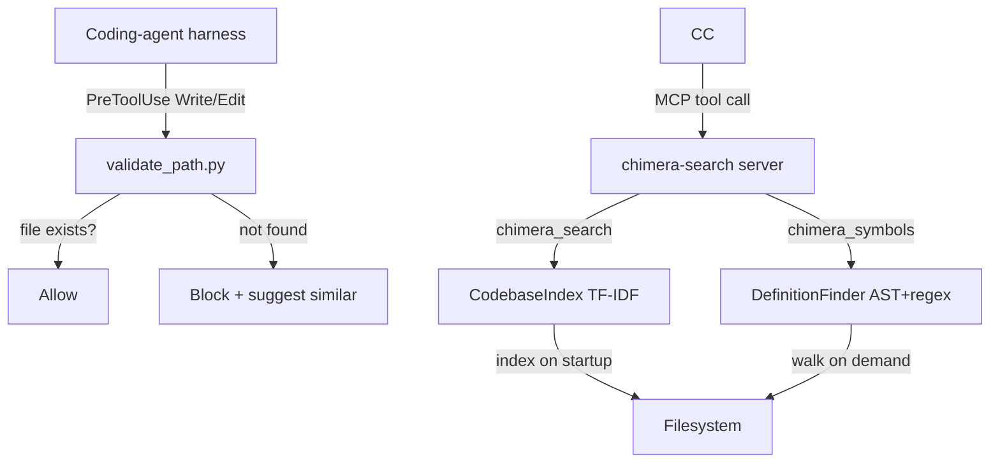

# Playbook 01: Codebase Search

Eliminate hallucinated file paths and give your coding-agent harness real codebase awareness through TF-IDF search, symbol lookup, and path validation.

## What This Solves

Coding-agent harnesses sometimes edit files that do not exist, search for symbols they hallucinated, or refer to paths from a different project. This happens because the agent has no built-in codebase index -- it relies on Grep and Glob, which require knowing what to search for.

Chimera's codebase search solves this in two ways:

1. **Prevention:** The `validate_path` hook intercepts Write/Edit tool calls and blocks them if the target file does not exist, suggesting similar paths via fuzzy matching.
2. **Discovery:** The `chimera-search` MCP server exposes TF-IDF ranked search and AST-based symbol lookup, so the harness can find files by concept (not just exact string) and locate definitions across languages.

## Architecture



The two components are independent. You can use the hook without the MCP server and vice versa. Together they form a complete solution: the MCP server helps the agent find the right files, and the hook catches it if it still gets the path wrong.

## Setup

### MCP Server Configuration

Add to your `.mcp.json`:

```json
{
  "mcpServers": {
    "chimera-search": {
      "command": "python3",
      "args": ["-m", "chimera.mcp_servers.search_server"],
      "env": {}
    }
  }
}
```

The server indexes the current working directory on first connection. For large codebases, the initial index takes a few seconds. After that, search queries return instantly.

### Hook Configuration

Add to your `.claude/hooks.json`:

```json
{
  "hooks": {
    "PreToolUse": [
      {
        "matcher": "Write|Edit",
        "command": "python3 -m chimera.hooks.validate_path",
        "description": "Block edits to nonexistent files and suggest corrections"
      }
    ]
  }
}
```

### Verification

Test the MCP server:

```bash
# Initialize and search
echo '{"jsonrpc":"2.0","id":1,"method":"initialize","params":{}}
{"jsonrpc":"2.0","id":2,"method":"tools/call","params":{"name":"chimera_search","arguments":{"query":"authentication handler","max_results":5}}}' | python3 -m chimera.mcp_servers.search_server
```

Test the hook:

```bash
# Should exit 2 and print suggestions
echo '{"tool_name":"Edit","tool_input":{"file_path":"src/nonexistent_file.py"}}' | python3 -m chimera.hooks.validate_path
echo "Exit code: $?"
```

## How It Works

### CodebaseIndex (TF-IDF search)

**Module:** `chimera/tools/codebase_index.py`

The `CodebaseIndex` class implements TF-IDF (Term Frequency -- Inverse Document Frequency) ranking using only the Python standard library (no numpy, no sklearn).

**Indexing:**

1. `index_directory(path, extensions, max_file_size)` walks the filesystem starting from `path`.
2. Skips hidden directories, `node_modules`, `__pycache__`, `.venv`, and files larger than `max_file_size` (default 500KB).
3. Indexes files with code extensions: `.py`, `.js`, `.ts`, `.jsx`, `.tsx`, `.go`, `.rs`, `.java`, `.c`, `.cpp`, `.h`, `.hpp`, `.rb`, `.php`, `.swift`, `.kt`, `.scala`, `.sh`, `.bash`, `.yml`, `.yaml`, `.json`, `.toml`, `.md`, `.txt`, `.sql`, `.html`, `.css`.
4. Tokenizes each file: extracts identifier-like tokens via regex (`[a-z_][a-z0-9_]*`), splits on underscores for sub-word matching (e.g., `create_provider` yields tokens `create_provider`, `create`, `provider`).
5. Builds an `IndexEntry` per file with path, tokens, line count, and byte size.
6. Computes IDF across all documents, then TF-IDF vectors per file.

**Searching:**

- `search(query, max_results)` tokenizes the query, computes TF-IDF similarity against all indexed files, and returns `SearchResult` objects sorted by score.
- Results include path, relevance score, and optional snippet.

**Incremental updates:**

- `index_file(path, content)` adds or updates a single file.
- `remove_file(path)` removes a file from the index.
- After incremental changes, call `_build_tfidf()` to recompute IDF weights.

**Key classes:**

```
CodebaseIndex
  .index_directory(path) -> int           # bulk index, returns file count
  .index_file(path, content) -> None      # add/update one file
  .remove_file(path) -> None              # remove one file
  .search(query, max_results) -> list[SearchResult]
  .file_count -> int                      # number of indexed files

IndexEntry
  .path: str
  .tokens: list[str]
  .line_count: int
  .size_bytes: int

SearchResult
  .path: str
  .score: float
  .snippet: str
```

### DefinitionFinder (symbol lookup)

**Module:** `chimera/tools/definition_lookup.py`

The `DefinitionFinder` class locates symbol definitions across a codebase. It uses AST parsing for Python and regex patterns for other languages.

**How it works:**

1. `find(symbol, file_hint)` walks the workspace looking for definitions of `symbol`.
2. For `.py` files: parses with `ast` module, walks the AST for `FunctionDef`, `AsyncFunctionDef`, `ClassDef`, and assignment targets matching the symbol name.
3. For `.ts`, `.tsx`, `.js`, `.jsx` files: regex patterns for `function`, `class`, `const/let/var`, `interface`, `type`, and `export` declarations.
4. For `.go` files: regex patterns for `func`, `type ... struct`, `type ... interface`, `var`, `const`.
5. For `.rs` files: regex patterns for `fn`, `struct`, `enum`, `trait`, `impl`, `type`, `const`, `static`.
6. Returns `Definition` objects with symbol name, kind, file path, line number, and source snippet.

**Language parsers** in `chimera/tools/parsers/`:

| Parser | Module | Extensions | Strategy |
|--------|--------|------------|----------|
| Python | `python_parser.py` | `.py` | `ast` module (full AST) |
| TypeScript | `typescript.py` | `.ts`, `.tsx`, `.js`, `.jsx` | Regex patterns |
| Go | `go.py` | `.go` | Regex patterns |
| Rust | `rust.py` | `.rs` | Regex patterns |
| Tree-sitter | `tree_sitter.py` | All (optional) | Tree-sitter bindings |

Each parser implements the `LanguageParser` ABC from `chimera/tools/parsers/base.py`:

```
class LanguageParser(ABC):
    extensions: tuple[str, ...]
    def parse(self, source: str) -> list[Symbol]

@dataclass
class Symbol:
    name: str
    kind: str    # "class", "function", "method", "interface", "struct", "trait", "impl"
    children: list[Symbol]
```

### validate_path Hook

**Module:** `chimera/hooks/validate_path.py`

The hook intercepts Write and Edit tool calls before they execute.

**Data flow:**

1. The harness passes tool input as JSON on stdin: `{"tool_name": "Edit", "tool_input": {"file_path": "src/auth.py"}}`.
2. Hook checks if `tool_name` is in `{"Write", "Edit", "write", "edit"}`. If not, exits 0 (pass through).
3. Extracts `file_path` from tool_input. Resolves relative paths against cwd.
4. If the file exists: exit 0 (allow).
5. If the file does not exist: collect suggestions and exit 2 (block).

**Suggestion strategies** (in priority order):

1. Exact filename match in a different directory (e.g., `src/auth.py` not found, but `lib/auth.py` exists).
2. Fuzzy match on full path using `difflib.get_close_matches` with cutoff 0.4.
3. Fuzzy match on filename only using `difflib.get_close_matches` with cutoff 0.6.

Results are deduplicated and limited to 5 suggestions. The error message on stderr tells Claude what happened and suggests alternatives:

```
File not found: src/authn.py
Did you mean one of these?
  - src/auth.py
  - src/auth_test.py
  - lib/auth.py

If you intend to create a new file, use the Write tool instead of Edit.
```

**Performance:** The hook walks up to 50,000 files for fuzzy matching. It skips `.git`, `node_modules`, `__pycache__`, `.venv`, `dist`, `build`, and other build artifact directories.

### SearchMCPServer

**Module:** `chimera/mcp_servers/search_server.py`

The server wraps `CodebaseIndex` and `DefinitionFinder` as MCP tools:

| MCP Tool | Arguments | Returns |
|----------|-----------|---------|
| `chimera_search` | `query` (string, required), `max_results` (int, default 10) | Ranked file paths with TF-IDF scores |
| `chimera_symbols` | `name` (string, required) | Definition locations with file, line, kind, source snippet |

**Protocol:** MCP stdio (JSON-RPC 2.0, newline-delimited on stdin/stdout). Handles `initialize`, `tools/list`, `tools/call`, `ping`.

**Lifecycle:**
1. The harness spawns the server as a subprocess.
2. On `initialize`, the server indexes the workspace directory.
3. Subsequent `tools/call` requests execute against the in-memory index.
4. Server runs until stdin is closed.

## Recipe

This section contains enough detail for an AI agent to recreate the codebase search integration from scratch.

### Building the TF-IDF Index

**Goal:** Given a directory, build an in-memory index that supports keyword search ranked by relevance.

1. Walk the directory recursively. Skip hidden dirs, `node_modules`, `__pycache__`, `.venv`. Skip files over 500KB. Only index files with known code extensions.

2. For each file, tokenize the content:
   - Lowercase the text.
   - Extract identifier-like tokens with regex: `[a-z_][a-z0-9_]*`.
   - Split each token on underscores to produce sub-words. Keep both the original and the parts.
   - Example: `"def create_provider"` yields `["def", "create_provider", "create", "provider"]`.

3. Build a term frequency (TF) vector per document: `Counter(tokens)`.

4. Compute inverse document frequency (IDF) for each token: `log(N / df)` where N is total documents and df is number of documents containing the token.

5. Combine into TF-IDF: for each document and each token, `tfidf[doc][token] = tf * idf`.

6. To search: tokenize the query, compute a TF-IDF vector for the query, score each document by dot product (or cosine similarity) with the query vector. Return top-k results sorted by score.

### Building the Symbol Finder

**Goal:** Given a symbol name, find all files and line numbers where it is defined.

1. For Python files: parse with `ast.parse()`, walk the tree for `FunctionDef`, `AsyncFunctionDef`, `ClassDef` nodes. Also check `Assign` targets for variable definitions. Extract name, kind, line number, and source text.

2. For TypeScript/JavaScript: use regex patterns:
   - `(export\s+)?(async\s+)?function\s+NAME`
   - `(export\s+)?class\s+NAME`
   - `(export\s+)?(const|let|var)\s+NAME`
   - `(export\s+)?(interface|type)\s+NAME`

3. For Go: use regex patterns:
   - `func\s+(\([^)]+\)\s+)?NAME`
   - `type\s+NAME\s+(struct|interface)`
   - `(var|const)\s+NAME`

4. For Rust: use regex patterns:
   - `(pub\s+)?fn\s+NAME`
   - `(pub\s+)?(struct|enum|trait)\s+NAME`
   - `(pub\s+)?(type|const|static)\s+NAME`
   - `impl\s+NAME`

5. Return `Definition` objects sorted by relevance (exact match first, then partial).

### Building the Path Validator

**Goal:** Intercept file-modifying tool calls and block those targeting nonexistent files.

1. Read JSON from stdin. Extract `tool_name` and `file_path`.
2. If tool is not Write or Edit, exit 0 immediately.
3. Resolve the file path (handle relative paths by joining with cwd).
4. If the file exists on disk, exit 0.
5. If not found: walk the workspace (up to 50k files), collect relative paths.
6. Run three suggestion strategies in order: exact filename match, full-path fuzzy match (cutoff 0.4), filename-only fuzzy match (cutoff 0.6). Use `difflib.get_close_matches`.
7. Deduplicate suggestions, limit to 5.
8. Print error and suggestions to stderr. Exit 2 to block.

### Building the MCP Server

**Goal:** Expose the index and symbol finder as MCP tools.

1. Create a class with `handle_message(dict) -> dict` that dispatches JSON-RPC methods.
2. Support four methods: `initialize`, `tools/list`, `tools/call`, `ping`.
3. In `initialize`: index the workspace, return server info and capabilities.
4. In `tools/list`: return tool definitions with JSON Schema input schemas.
5. In `tools/call`: dispatch by tool name to handler functions.
6. `run()` method: read lines from stdin, parse as JSON, call `handle_message`, write response + newline to stdout, flush.
7. Entry point: `if __name__ == "__main__": server = Server(); server.run()`.

### Extending the Search

To add a new language to symbol lookup:

1. Create a parser in `chimera/tools/parsers/` implementing the `LanguageParser` ABC.
2. Define `extensions` tuple and `parse(source) -> list[Symbol]` method.
3. Register the parser in `DefinitionFinder` by adding it to the language dispatch.

To add a new MCP tool to the search server:

1. Add a tool definition dict to `TOOL_DEFINITIONS` with name, description, and inputSchema.
2. Add a dispatch case in `_handle_tools_call`.
3. Implement the handler method following the pattern of `_call_search` or `_call_symbols`.
