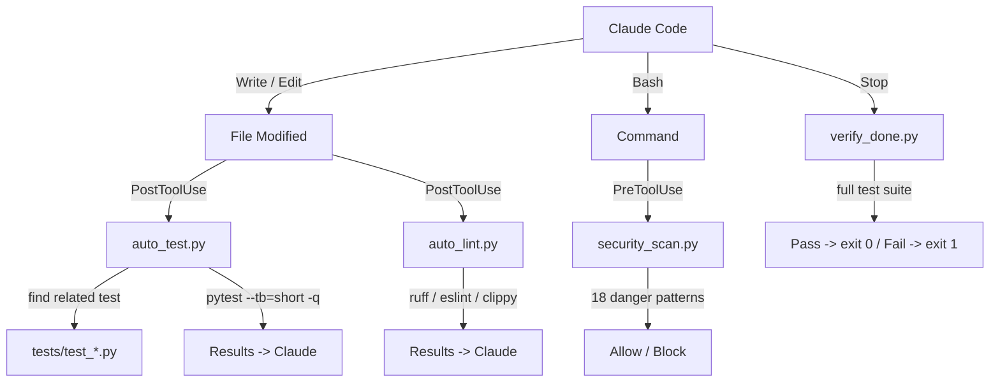

# Playbook: Auto-Test & Lint

> Edits break tests and introduce lint violations that go unnoticed until much later -- catch them immediately after every file change.

## What This Solves

Claude Code edits files freely but has no built-in feedback loop to tell it whether those edits broke tests or introduced style violations. Problems compound: a bad import in turn 3 causes a cascade of failures by turn 20, and the agent has long forgotten what it changed. Chimera's hook scripts wire automatic test runs and lint checks into every Write/Edit tool call, feeding results back to the agent immediately so it can fix issues while context is fresh.

## Architecture



Four hooks form a quality gate around the agent's tool use:

| Hook | Event | Tools | Purpose |
|------|-------|-------|---------|
| `auto_test.py` | PostToolUse | Write, Edit | Run related tests after each edit |
| `auto_lint.py` | PostToolUse | Write, Edit | Run linter on modified file |
| `security_scan.py` | PreToolUse | Bash | Block dangerous commands before execution |
| `verify_done.py` | Stop | (all) | Run full test suite before agent declares done |

## Setup

### Hook Configuration

Add all four hooks to your Claude Code hooks configuration. If you use the Chimera plugin, these are pre-configured in `chimera-plugin/hooks/hooks.json`:

```json
{
  "hooks": [
    {
      "event": "PreToolUse",
      "tools": ["Bash"],
      "command": "python3 chimera/hooks/security_scan.py",
      "description": "Block dangerous bash commands (rm -rf /, chmod 777, etc.)"
    },
    {
      "event": "PostToolUse",
      "tools": ["Write", "Edit"],
      "command": "python3 chimera/hooks/auto_test.py",
      "description": "Run related tests after every file edit"
    },
    {
      "event": "PostToolUse",
      "tools": ["Write", "Edit"],
      "command": "python3 chimera/hooks/auto_lint.py",
      "description": "Run linter on modified files after every edit"
    },
    {
      "event": "Stop",
      "command": "python3 chimera/hooks/verify_done.py",
      "description": "Verify all tests pass before declaring done"
    }
  ]
}
```

### Environment Variables

| Variable | Default | Description |
|----------|---------|-------------|
| `CHIMERA_TEST_CMD` | `python -m pytest --tb=short -q` | Test command for `verify_done.py`. Receives the full test suite. |
| `CHIMERA_LINTER` | Auto-detected by extension | Custom linter command. Use `{file}` as placeholder for the file path. |
| `TOOL_INPUT` | (set by Claude Code) | Fallback for hook input when stdin is not available. |

Examples:

```bash
# Use a custom test runner
export CHIMERA_TEST_CMD="npm test"

# Use a specific linter for all file types
export CHIMERA_LINTER="biome check {file}"
```

## How It Works

### auto_test.py -- PostToolUse Hook

**Module:** `chimera/hooks/auto_test.py`

Receives tool input as JSON on stdin with the shape `{"tool_name": "Write", "tool_input": {"file_path": "chimera/foo.py", ...}}`. Extracts the modified file path and searches for related test files using four strategies in order:

1. **Convention:** `foo.py` maps to `tests/test_foo.py` at project root.
2. **Co-located:** `test_foo.py` in the same directory as the source file.
3. **Subdirectory:** `tests/test_foo.py` relative to the source file's parent.
4. **Content search:** Scans all `test_*.py` files under `tests/` for mentions of the module name (used as fallback when conventions do not match).

Only Python files (`.py`) trigger test discovery. If the modified file is itself a test file (`test_*.py`), it runs that file directly.

Tests run via `pytest --tb=short -q` with a 120-second timeout. Output is printed to stdout, which Claude Code relays back to the agent.

**Exit code:** Always 0. PostToolUse hooks are informational -- they cannot block the tool call. The agent sees the test output and decides whether to fix failures.

### auto_lint.py -- PostToolUse Hook

**Module:** `chimera/hooks/auto_lint.py`

Same input format as `auto_test.py`. Determines the appropriate linter by file extension:

| Extension | Default Linter |
|-----------|---------------|
| `.py` | `ruff check {file}` |
| `.js`, `.jsx`, `.ts`, `.tsx` | `eslint {file}` |
| `.rs` | `cargo clippy -- -D warnings` |
| `.go` | `golangci-lint run {file}` |

The `CHIMERA_LINTER` environment variable overrides the default for all file types. If the configured linter is not installed, the hook prints a "not found" message and exits cleanly.

Lint commands run with a 60-second timeout. Output format:

- Clean: `[auto-lint] Lint clean: foo.py`
- Issues: `[auto-lint] Issues found in foo.py:` followed by the linter output

**Exit code:** Always 0 (informational).

### verify_done.py -- Stop Hook

**Module:** `chimera/hooks/verify_done.py`

Runs when the agent is about to declare it is finished. Executes the full project test suite using the command from `CHIMERA_TEST_CMD` (default: `python -m pytest --tb=short -q`). The test suite has a 300-second (5 minute) timeout.

**Exit codes:**
- **0:** All tests passed. Agent may stop. Output: `[verify-done] All tests passed.`
- **1:** Tests failed. Agent should continue fixing. Output: `[verify-done] Tests FAILED -- not done yet.` followed by failure details.

This is the critical gate: it prevents the agent from declaring "done" when tests are broken.

### security_scan.py -- PreToolUse Hook

**Module:** `chimera/hooks/security_scan.py`

Runs before every Bash tool call. Checks the command string against 18 built-in dangerous patterns:

- `rm -rf /` (recursive delete of root or system paths)
- `chmod 777` (world-writable permissions)
- `curl ... | sh` or `wget ... | sh` (piping remote scripts to shell)
- `curl ... | python` or `wget ... | python` (piping to Python)
- `mkfs` (formatting filesystems)
- `dd ... of=/dev/` (raw disk writes)
- Fork bombs
- `> /dev/sda` (overwriting disk devices)
- `git push --force` to main/master
- `sudo rm` (sudo deletes)
- `DROP TABLE` / `TRUNCATE TABLE` (destructive SQL)
- `eval(... base64 ...)` (eval of encoded content)
- `nc -e /bin/` (reverse shells)
- `/dev/tcp/` (bash network sockets)

When Chimera is installed, the hook also consults `chimera.permissions.risk.classify_risk()` for additional CRITICAL-level patterns.

**Exit codes:**
- **0:** Command is safe. Allow execution.
- **2:** Command is blocked. Reason printed to stderr. (Exit code 2 signals "block" to Claude Code.)

## Configuration Reference

### Hook Input Format (stdin JSON)

All hooks receive JSON on stdin from Claude Code:

```json
{
  "tool_name": "Write",
  "tool_input": {
    "file_path": "/absolute/path/to/file.py",
    "content": "..."
  }
}
```

For Bash:

```json
{
  "tool_name": "Bash",
  "tool_input": {
    "command": "rm -rf /tmp/test"
  }
}
```

Hooks also check the `TOOL_INPUT` environment variable as a fallback when stdin is not available.

### Exit Code Semantics

| Exit Code | PreToolUse | PostToolUse | Stop |
|-----------|-----------|-------------|------|
| 0 | Allow | (informational) | Agent may stop |
| 1 | (unused) | (informational) | Agent should continue |
| 2 | Block | (unused) | (unused) |

### Extending with Custom Hooks

To add a custom PostToolUse hook, create a script that:

1. Reads JSON from stdin (or `TOOL_INPUT` env var)
2. Checks `tool_name` against the tools you care about
3. Extracts parameters from `tool_input`
4. Prints output to stdout (relayed to the agent)
5. Exits 0

Example custom type-check hook:

```python
#!/usr/bin/env python3
import json, sys, subprocess
from pathlib import Path

data = json.loads(sys.stdin.read())
if data.get("tool_name") not in ("Write", "Edit"):
    sys.exit(0)

path = data.get("tool_input", {}).get("file_path", "")
if path.endswith(".py"):
    result = subprocess.run(
        ["mypy", "--no-error-summary", path],
        capture_output=True, text=True, timeout=30
    )
    if result.returncode != 0:
        print(f"[type-check] Issues in {Path(path).name}:\n{result.stdout}")

sys.exit(0)
```

## Verification

Confirm each hook works:

```bash
# Test auto_test.py with a sample input
echo '{"tool_name": "Write", "tool_input": {"file_path": "chimera/core/agent.py"}}' | python3 chimera/hooks/auto_test.py

# Test auto_lint.py
echo '{"tool_name": "Edit", "tool_input": {"file_path": "chimera/core/agent.py"}}' | python3 chimera/hooks/auto_lint.py

# Test verify_done.py (runs full suite)
python3 chimera/hooks/verify_done.py

# Test security_scan.py (should block)
echo '{"tool_name": "Bash", "tool_input": {"command": "rm -rf /"}}' | python3 chimera/hooks/security_scan.py
echo $?  # Should print 2

# Test security_scan.py (should allow)
echo '{"tool_name": "Bash", "tool_input": {"command": "ls -la"}}' | python3 chimera/hooks/security_scan.py
echo $?  # Should print 0
```

## Recipe: Auto-Test & Lint Pipeline

### Components

| Component | Module | Protocol |
|-----------|--------|----------|
| Auto-test hook | `chimera/hooks/auto_test.py` | PostToolUse (stdin JSON, exit 0) |
| Auto-lint hook | `chimera/hooks/auto_lint.py` | PostToolUse (stdin JSON, exit 0) |
| Security scan hook | `chimera/hooks/security_scan.py` | PreToolUse (stdin JSON, exit 0/2) |
| Verify-done hook | `chimera/hooks/verify_done.py` | Stop (no stdin, exit 0/1) |

### Key Functions

**auto_test.py:**
- `find_test_files(file_path, project_root)` -- 4-strategy test discovery, returns list of absolute paths
- `run_tests(test_files, project_root)` -- runs pytest, returns `(passed: bool, output: str)`
- `handle(tool_input, project_root)` -- entry point for programmatic use

**auto_lint.py:**
- `get_linter_commands(file_path, custom_linter)` -- resolves linter by extension or custom override
- `run_lint(file_path, custom_linter, project_root)` -- runs linter, returns `(clean: bool, output: str)`
- `handle(tool_input, custom_linter, project_root)` -- entry point for programmatic use

**security_scan.py:**
- `scan_command(command)` -- checks against 18 patterns, returns `(allowed: bool, reason: str)`
- `handle(tool_input)` -- entry point for programmatic use

**verify_done.py:**
- `get_test_command()` -- reads `CHIMERA_TEST_CMD` or returns default
- `run_test_suite(project_root, test_command)` -- runs full suite, returns `(passed: bool, output: str)`

### Data Flow

1. Claude Code calls Write/Edit tool
2. Claude Code invokes PostToolUse hooks, piping `{"tool_name", "tool_input"}` as JSON to stdin
3. `auto_test.py` extracts `file_path`, discovers related tests, runs pytest, prints results
4. `auto_lint.py` extracts `file_path`, selects linter by extension, runs it, prints results
5. Claude sees test/lint output in the tool response and fixes issues
6. When the agent tries to stop, `verify_done.py` runs the full suite as a final gate
7. Before any Bash call, `security_scan.py` checks the command and blocks dangerous patterns (exit 2)

### How to Add a New Linter

Add an entry to `_DEFAULT_LINTERS` in `chimera/hooks/auto_lint.py`:

```python
_DEFAULT_LINTERS: dict[str, list[list[str]]] = {
    # ... existing entries ...
    ".rb": [["rubocop", "{file}"]],
    ".swift": [["swiftlint", "lint", "--path", "{file}"]],
}
```

### How to Add a New Dangerous Pattern

Add a tuple to `_DANGEROUS_PATTERNS` in `chimera/hooks/security_scan.py`:

```python
_DANGEROUS_PATTERNS: list[tuple[re.Pattern[str], str]] = [
    # ... existing patterns ...
    (re.compile(r"\bssh\s+.*-o\s+StrictHostKeyChecking=no"), "disabled SSH host key checking"),
]
```
