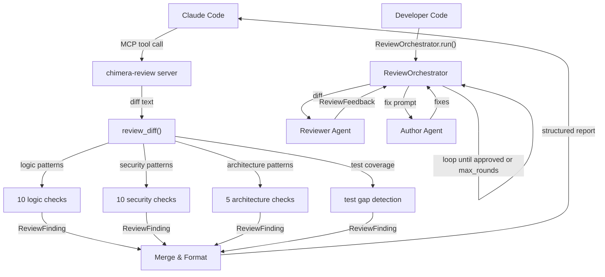

# Playbook: Code Review

> Self-review is shallow and misses bugs, security issues, and architectural problems -- use multi-perspective automated review.

## What This Solves

When Claude Code reviews its own changes, it tends to confirm its own reasoning rather than challenge it. It misses security vulnerabilities, untested edge cases, and architectural regressions because it wrote the code and assumes its own intent. Chimera provides two layers of review: a rule-based MCP server that catches common patterns across four categories (logic, security, tests, architecture), and a `ReviewOrchestrator` that runs a reviewer agent against an author agent in iterative fix cycles.

## Architecture



Two paths to review:

| Path | When to Use | Integration |
|------|------------|-------------|
| **MCP server** (`chimera-review`) | Quick review during a session | Claude Code calls `chimera_review_diff` as an MCP tool |
| **ReviewOrchestrator** | Full review workflow | Developer code creates reviewer + author agents |

## Setup

### MCP Server Configuration

Add to your `.mcp.json`:

```json
{
  "mcpServers": {
    "chimera-review": {
      "command": "python3",
      "args": ["chimera/mcp_servers/review_server.py"]
    }
  }
}
```

This exposes one tool: `chimera_review_diff(diff_text: str)`.

### Reviewer Agent

The Chimera plugin includes a pre-built reviewer agent at `chimera-plugin/agents/reviewer.md`. This agent is configured with Read, Grep, Glob, and Bash tools, and follows a structured review process:

1. Reads the diff and every modified file in full
2. Checks for correctness (code paths, off-by-one, null handling, resource leaks)
3. Checks for security (injection, path traversal, hardcoded secrets, unsafe deserialization)
4. Checks for maintainability (docstrings, naming, magic numbers, duplication)
5. Checks test coverage (edge cases, behavior vs implementation assertions)

Output format: structured findings with severity (critical/warning/info), file:line, issue description, and fix suggestion. Ends with a verdict: APPROVE, REQUEST CHANGES, or NEEDS DISCUSSION.

### Review Command

Use the Chimera CLI for one-shot review:

```bash
# Review staged changes
git diff --cached | chimera review --perspectives logic,security,tests,architecture

# Review a specific commit
git show HEAD | chimera review
```

## How It Works

### MCP Review Server (Rule-Based)

**Module:** `chimera/mcp_servers/review_server.py`

The `ReviewMCPServer` class implements JSON-RPC 2.0 over stdin/stdout. It exposes one tool, `chimera_review_diff`, which accepts a unified diff and returns findings.

The review engine (`review_diff()`) parses the diff into per-file added lines, then checks each line against four sets of regex patterns:

**Security patterns** (10 rules):
- `eval()`, `exec()` -- code injection risk
- `subprocess.call(shell=True)` -- shell injection
- `os.system()` -- prefer subprocess
- Hardcoded passwords and API keys (regex for `password = "..."` and `api_key = "..."` with 8+ char values)
- `pickle.loads()` -- arbitrary code execution via deserialization
- `yaml.load()` without Loader -- unsafe YAML parsing
- `import marshal` -- trusted input only
- `chmod 777` -- overly permissive

**Logic patterns** (10 rules):
- Bare `except:` -- catches SystemExit
- Broad `except Exception:` -- consider specific exceptions
- `TODO`, `FIXME`, `HACK` comments -- unfinished work
- Chained `.get().method` -- None risk
- `== None` / `!= None` -- use `is None`
- `type(x) ==` -- use `isinstance()`
- `while True:` -- verify break condition

**Architecture patterns** (5 rules):
- Deep relative imports (`from ...`) -- consider absolute
- `global` mutation -- reduces testability
- Class with many bases -- consider composition
- Function with many parameters (200+ chars) -- use config object
- Wildcard imports (`import *`) -- namespace pollution

**Test coverage analysis:**
Compares source files (files with new public functions) against test files in the diff. Warns when new public functions are added but no test file changes appear in the same diff.

Each finding is a `ReviewFinding` dataclass with `severity`, `file`, `line`, `category`, and `message`. The MCP response includes both a human-readable summary and structured JSON.

### ReviewOrchestrator (Agent-Based)

**Module:** `chimera/review/orchestrator.py`

The `ReviewOrchestrator` manages iterative review-fix cycles between a reviewer agent and an author agent. It tracks `ReviewRound` objects, each containing a `ReviewFeedback` with structured comments.

**Constructor:** `ReviewOrchestrator(max_rounds=3)`

**The `run()` method:**

```python
def run(self, diff: str, reviewer: Agent, author: Agent, env: Environment | None = None) -> bool
```

1. Sends the diff to the reviewer agent with the prompt `"Review this diff:\n\n{diff}"`
2. The reviewer returns text output, parsed via `ReviewFeedback.parse_from_text()`
3. If approved (text contains "approved" and no errors/critical findings), the loop ends
4. Otherwise, constructs a fix prompt from the comment summaries and sends it to the author agent
5. Marks the round as fixed and loops
6. Stops when approved or `max_rounds` reached

**ReviewFeedback** (at `chimera/review/feedback.py`):
- Parses `[SEVERITY] file:line: message` patterns from text
- Severity levels: `INFO`, `SUGGESTION`, `WARNING`, `ERROR`, `CRITICAL`
- Properties: `approved`, `has_critical`, `has_errors`, `comment_count`, `files_reviewed`
- Methods: `by_severity(severity)`, `by_file(file)`, `parse_from_text(text)`

**ReviewOrchestrator properties:**
- `current_round: int` -- number of completed rounds
- `is_approved: bool` -- whether the last round was approved
- `is_complete: bool` -- approved or reached max_rounds
- `total_comments: int` -- sum of comments across all rounds
- `rounds: list[ReviewRound]` -- full history

## Configuration Reference

### MCP Server

| Setting | Value |
|---------|-------|
| Server name | `chimera-review` |
| Protocol version | `2024-11-05` |
| Transport | stdin/stdout, newline-delimited JSON-RPC 2.0 |
| Tools | `chimera_review_diff(diff_text: str)` |

### ReviewOrchestrator

| Parameter | Default | Description |
|-----------|---------|-------------|
| `max_rounds` | 3 | Maximum review-fix iterations |

### ReviewFeedback Parsing

The parser expects findings in the format `[SEVERITY] file:line: message`. Recognized severities: `INFO`, `SUGGESTION`, `WARNING`, `ERROR`, `CRITICAL`. Approval is detected by the word "approved" appearing in the text, provided there are no ERROR or CRITICAL findings.

## Verification

```bash
# Test the MCP server directly
echo '{"jsonrpc": "2.0", "id": 1, "method": "initialize", "params": {}}' | python3 chimera/mcp_servers/review_server.py &
PID=$!

# Send a review request
echo '{"jsonrpc": "2.0", "id": 2, "method": "tools/call", "params": {"name": "chimera_review_diff", "arguments": {"diff_text": "+++ b/test.py\n@@ -0,0 +1 @@\n+eval(input())"}}}' | python3 chimera/mcp_servers/review_server.py

# Test review_diff programmatically
python3 -c "
from chimera.mcp_servers.review_server import review_diff
findings = review_diff('+++ b/test.py\n@@ -0,0 +1 @@\n+eval(user_input)')
for f in findings:
    print(f'[{f.severity.upper()}] ({f.category}) {f.file}:{f.line}: {f.message}')
"
```

## Recipe: Multi-Perspective Code Review

### Components

| Component | Module | Purpose |
|-----------|--------|---------|
| Review MCP server | `chimera/mcp_servers/review_server.py` | JSON-RPC 2.0 server exposing `chimera_review_diff` |
| `review_diff()` | `chimera/mcp_servers/review_server.py` | Rule-based 4-perspective review engine |
| `ReviewFinding` | `chimera/mcp_servers/review_server.py` | Dataclass: `severity`, `file`, `line`, `category`, `message` |
| `ReviewMCPServer` | `chimera/mcp_servers/review_server.py` | MCP server class with JSON-RPC dispatch |
| `ReviewOrchestrator` | `chimera/review/orchestrator.py` | Iterative reviewer-author agent loop |
| `ReviewFeedback` | `chimera/review/feedback.py` | Parsed feedback: comments, approved, severities |
| `ReviewComment` | `chimera/review/feedback.py` | Single comment: file, line, severity, message, suggestion |
| `Severity` | `chimera/review/feedback.py` | Enum: INFO, SUGGESTION, WARNING, ERROR, CRITICAL |
| Reviewer agent | `chimera-plugin/agents/reviewer.md` | Pre-built review agent with structured process |

### Key Interfaces

**ReviewOrchestrator:**
```python
orchestrator = ReviewOrchestrator(max_rounds=3)
approved = orchestrator.run(diff, reviewer_agent, author_agent, env)
# approved: bool -- whether the review was approved
# orchestrator.rounds -- list of ReviewRound objects
# orchestrator.total_comments -- total findings across all rounds
```

**review_diff():**
```python
findings: list[ReviewFinding] = review_diff(diff_text)
# Each finding has: severity, file, line, category, message
```

**ReviewFeedback.parse_from_text():**
```python
feedback = ReviewFeedback.parse_from_text(agent_output_text)
# feedback.approved: bool
# feedback.comments: list[ReviewComment]
# feedback.has_critical: bool
```

### Adding Custom Review Perspectives

To add a new review perspective to the rule-based engine, add a pattern list to `chimera/mcp_servers/review_server.py`:

```python
# Each tuple: (regex_pattern, severity, message)
_PERFORMANCE_PATTERNS: list[tuple[str, str, str]] = [
    (r"for\s+\w+\s+in\s+range\(len\(", "info", "Use enumerate() instead of range(len())"),
    (r"\.append\(.*\)\s*$", "info", "Consider list comprehension for bulk appends"),
]
```

Then add it to the `review_diff()` function:

```python
findings.extend(_check_patterns(file_name, lines, _PERFORMANCE_PATTERNS, "performance"))
```

### Integrating with PR Workflows

```python
import subprocess
from chimera.mcp_servers.review_server import review_diff

# Get PR diff
diff = subprocess.check_output(["git", "diff", "main...HEAD"], text=True)

# Review
findings = review_diff(diff)

# Filter to actionable items
critical = [f for f in findings if f.severity in ("error", "critical")]
if critical:
    print(f"Blocking: {len(critical)} critical/error findings")
    for f in critical:
        print(f"  {f.file}:{f.line}: {f.message}")
```
