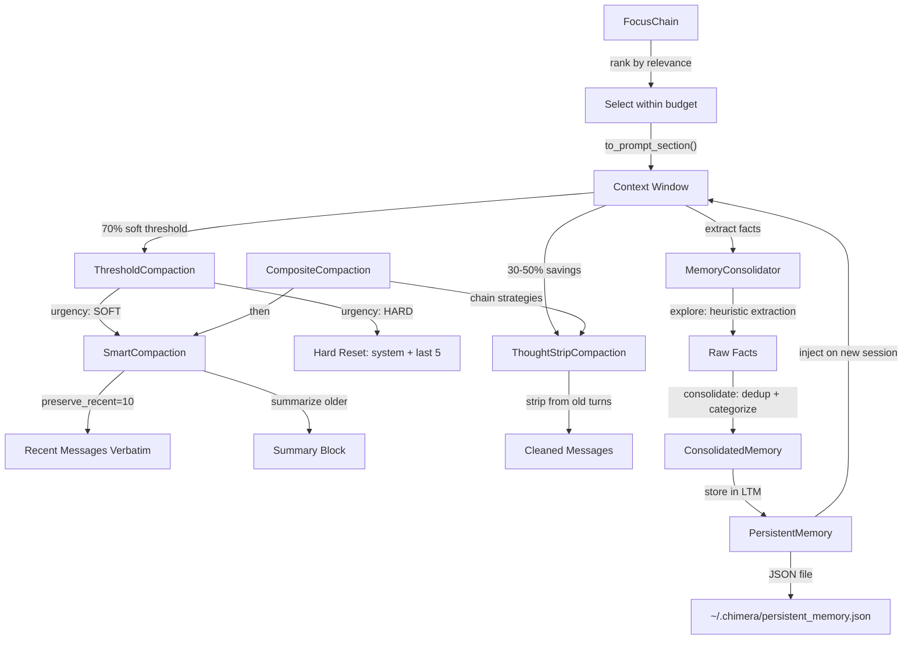

# Playbook: Context Management

> Long sessions degrade as the context window fills up -- the agent forgets earlier decisions, re-reads files, and loses coherence.

## What This Solves

Claude Code operates within a finite context window. In long sessions (50+ turns), older messages get pushed out or the agent loses track of what it learned earlier. This manifests as repeated file reads, contradictory decisions, and gradual loss of task coherence. Chimera provides five composable strategies to manage context: SmartCompaction (summarize old messages), ThoughtStripCompaction (strip thinking blocks), MemoryConsolidation (extract and persist facts), PersistentMemory (survive session resets), and FocusChain (budget-aware context selection).

## Architecture



## How It Works

### SmartCompaction

**Module:** `chimera/compaction/smart.py`

Keeps the last N messages verbatim and replaces everything before them with a condensed summary block.

**Class:** `SmartCompaction(config: SmartCompactionConfig | None = None)`

**Config dataclass** (`SmartCompactionConfig`):
- `preserve_recent: int = 10` -- number of recent messages to keep verbatim
- `summary_prefix: str = "[Conversation summary]"` -- prefix for the summary message
- `max_summary_chars: int = 2000` -- approximate max characters for the summary

**How summarization works:**
- Splits messages into `older` (to summarize) and `recent` (to keep)
- For each older message:
  - Tool calls: `[assistant: called tool_a, tool_b]`
  - Tool results: `[tool result: first 100 chars...]`
  - Other messages: `[role: first 200 chars...]`
- Joins summaries with newlines, truncates to `max_summary_chars`
- Returns `[summary_message] + recent_messages`

**Method:** `compact(messages: list[Message], budget: int) -> list[Message]`

```python
from chimera.compaction.smart import SmartCompaction, SmartCompactionConfig

compaction = SmartCompaction(SmartCompactionConfig(preserve_recent=5))
compacted = compaction.compact(messages, budget=4000)
```

### ThoughtStripCompaction

**Module:** `chimera/compaction/thought_strip.py`

Strips `<thinking>...</thinking>` and `[thinking]...[/thinking]` blocks from older assistant messages. These blocks are valuable during the turn they were generated but have diminishing returns afterward. Can reclaim 30-50% of context in sessions with extended thinking enabled.

**Class:** `ThoughtStripCompaction(preserve_recent: int = 2)`

The `preserve_recent` parameter controls how many of the most recent assistant messages keep their thinking blocks intact. All older assistant messages have thinking content removed.

**Method:** `compact(messages: list[Message], budget: int) -> list[Message]`

**Utility function:** `estimate_thinking_tokens(messages: list[Message]) -> int`
Estimates how many tokens are consumed by thinking blocks across all messages (rough estimate: `len(text) // 4`).

```python
from chimera.compaction.thought_strip import ThoughtStripCompaction, estimate_thinking_tokens

# Check how much thinking content exists
thinking_tokens = estimate_thinking_tokens(messages)
print(f"Thinking blocks consume ~{thinking_tokens} tokens")

# Strip thinking from all but the last 2 assistant messages
compaction = ThoughtStripCompaction(preserve_recent=2)
compacted = compaction.compact(messages, budget=8000)
```

### MemoryConsolidation

**Module:** `chimera/context/consolidation.py`

A two-phase pipeline that extracts factual statements from conversation history, deduplicates them, and organizes them by category.

**Phase 1 -- Explore:** The `MemoryConsolidator` scans messages for declarative sentences using heuristic keyword matching. It looks for lines (10-200 chars) containing indicator words: `is`, `uses`, `has`, `are`, `runs`, `requires`, `supports`, `contains`, `provides`. These are added as `Fact` objects.

**Phase 2 -- Consolidate:** The `consolidate()` method deduplicates facts by normalized content (keeping the higher-confidence version), auto-categorizes uncategorized facts, groups them by category, and builds a text summary.

**Key classes:**

`Fact(content, source, category, confidence)` -- a single extracted fact:
- `content: str` -- the fact text
- `source: str` -- where it came from (e.g., tool name, file path)
- `category: str` -- tag (e.g., "architecture", "testing", "dependencies")
- `confidence: float` -- 0.0 to 1.0

`ConsolidatedMemory(facts, categories, summary)` -- the output of consolidation:
- `facts: list[Fact]` -- deduplicated, categorized facts
- `categories: dict[str, list[Fact]]` -- facts grouped by category
- `summary: str` -- compact text summary
- `query(keyword) -> list[Fact]` -- search facts by content
- `by_category(category) -> list[Fact]` -- filter by category

`MemoryConsolidator` -- the pipeline:
- `add_fact(content, source, category, confidence)` -- manually add a fact
- `extract_from_messages(messages, source) -> int` -- scan messages for facts (returns count)
- `consolidate() -> ConsolidatedMemory` -- deduplicate and structure
- `clear()` -- reset collected facts

**Auto-categorization** (keyword-based):
- "test", "pytest", "unittest", "spec" -> `testing`
- "import", "dependency", "package", "install" -> `dependencies`
- "api", "endpoint", "route", "http", "rest" -> `api`
- "database", "sql", "table", "schema", "model" -> `data`
- "config", "setting", "environment", "env" -> `config`
- "architecture", "layer", "module", "pattern" -> `architecture`
- Everything else -> `general`

```python
from chimera.context.consolidation import MemoryConsolidator

consolidator = MemoryConsolidator()
consolidator.add_fact("The project uses pytest for testing.", category="testing")
consolidator.extract_from_messages(messages, source="conversation")
memory = consolidator.consolidate()

# Query stored knowledge
for fact in memory.query("pytest"):
    print(f"[{fact.category}] {fact.content}")
```

### PersistentMemory

**Module:** `chimera/context/persistent_memory.py`

Extends `MemoryConsolidator` with persistence. Automatically extracts facts every N turns, stores them in a JSON file, and re-injects them as context when a new session starts. Survives session resets, `/compact`, and `/clear`.

**Class:** `PersistentMemory(path, auto_save_interval, max_facts, config)`

**Config dataclass** (`PersistentMemoryConfig`):
- `path: str = "~/.chimera/persistent_memory.json"` -- backing store location
- `auto_save_interval: int = 5` -- extract and save every N turns (0 to disable)
- `max_facts: int = 200` -- maximum facts to retain
- `categories: list[str] | None = None` -- which categories to inject (None = all)

**Key methods:**
- `record_turn(messages) -> str | None` -- accumulate messages; returns nudge string if facts were saved
- `on_compaction(messages) -> int` -- handle compaction event, extract from all pending messages
- `store_fact(key, content, category)` -- manually store a fact
- `recall(key) -> str | None` -- look up a fact by key
- `search(query) -> list[MemoryEntry]` -- search by content substring
- `get_context_injection() -> str` -- render all memories as a Markdown prompt section
- `attach(event_bus)` -- subscribe to Chimera `compaction` events for automatic extraction
- `clear()` -- reset everything

**Properties:**
- `fact_count: int` -- number of stored facts
- `turn_count: int` -- number of recorded turns
- `entries: list[MemoryEntry]` -- all stored entries

```python
from chimera.context.persistent_memory import PersistentMemory, PersistentMemoryConfig

memory = PersistentMemory(config=PersistentMemoryConfig(
    path="~/.chimera/project_memory.json",
    auto_save_interval=5,
    max_facts=200,
))

# During agent execution
nudge = memory.record_turn(messages)
if nudge:
    print(nudge)  # "[memory] Extracted 3 facts from conversation."

# On compaction (or attach to EventBus for automatic handling)
memory.on_compaction(full_conversation)

# In a new session
context = memory.get_context_injection()
# Returns Markdown like:
# ## Persistent Memory
# ### testing
# - The project uses pytest for testing
# ### architecture
# - The codebase has 8 layers
```

### FocusChain

**Module:** `chimera/context/focus.py`

Ranks context items by relevance and selects those that fit within a token budget. Use this when you have many potential context sources (files, history, documentation) but limited space.

**Class:** `FocusChain(token_budget: int = 4000)`

**Key types:**

`ContextItem(content, source, tokens, relevance)`:
- `content: str` -- raw text content
- `source: str` -- origin label (e.g., `"file:utils.py"`, `"history:turn_3"`)
- `tokens: int` -- estimated token count (`len(content) // 4`)
- `relevance: float` -- 0.0 (lowest) to 1.0 (highest)

**Key methods:**
- `add(content, source, relevance=0.5)` -- add a context item (token count auto-estimated)
- `add_file(path, env, relevance=0.5)` -- read a file from an Environment and add it
- `add_files(paths, env, relevance=0.5)` -- add multiple files
- `select() -> list[ContextItem]` -- rank by relevance descending, greedily select within budget
- `to_prompt_section() -> str` -- render selected items as `## Context` with `### source` headings
- `clear()` -- remove all items

```python
from chimera.context.focus import FocusChain

focus = FocusChain(token_budget=4000)
focus.add("Auth flow: token -> validate -> session", source="notes", relevance=0.9)
focus.add(file_content, source="file:auth.py", relevance=0.8)
focus.add(old_discussion, source="history:turn_2", relevance=0.3)

selected = focus.select()  # highest relevance first, within budget
prompt_section = focus.to_prompt_section()
```

### ThresholdCompaction

**Module:** `chimera/compaction/thresholds.py`

Wraps any `CompactionStrategy` with soft/hard threshold triggers based on context usage ratio. Provides graceful degradation: soft threshold triggers the strategy; hard threshold triggers an emergency reset.

**Class:** `ThresholdCompaction(strategy, soft_threshold, hard_threshold, max_context_tokens, keep_last)`

| Parameter | Default | Description |
|-----------|---------|-------------|
| `strategy` | (required) | Underlying `CompactionStrategy` to apply |
| `soft_threshold` | 0.7 | Ratio of context usage to trigger soft compaction |
| `hard_threshold` | 0.9 | Ratio to trigger emergency hard reset |
| `max_context_tokens` | 128000 | Maximum context window size |
| `keep_last` | 5 | Messages to keep during hard reset |

**Urgency levels** (`CompactionUrgency` enum):
- `NONE` -- below soft threshold, no compaction needed
- `SOFT` -- above soft threshold, apply strategy
- `HARD` -- above hard threshold, emergency reset if strategy insufficient

**Key methods:**
- `check_urgency(view: CompactionView) -> CompactionUrgency`
- `compact(view: CompactionView) -> CompactionView`

**CompactionView** (at `chimera/compaction/base.py`):
- Wraps messages with atomic group tracking
- Auto-detects tool call/result pairs as atomic groups (cannot be split)
- `safe_removal_indices` -- message indices not protected by atomic groups
- `token_estimate` -- rough token count (`len(content) // 4`)

**Hard reset behavior:** keeps the system prompt (first message if role=system) + a "[Previous context was compressed]" notice + the last `keep_last` messages.

### CompositeCompaction

**Module:** `chimera/compaction/composite.py`

Chains multiple `CompactionStrategy` instances. Applies them in order, stopping as soon as the result fits within the token budget.

**Class:** `CompositeCompaction(strategies: list[CompactionStrategy])`

```python
from chimera.compaction.composite import CompositeCompaction
from chimera.compaction.thought_strip import ThoughtStripCompaction
from chimera.compaction.smart import SmartCompaction, SmartCompactionConfig

# First strip thinking blocks (cheap), then summarize if still over budget
composite = CompositeCompaction([
    ThoughtStripCompaction(preserve_recent=2),
    SmartCompaction(SmartCompactionConfig(preserve_recent=5)),
])

compacted = composite.compact(messages, budget=8000)
```

## Configuration Reference

### Compaction Strategies

| Strategy | Module | Key Config | Effect |
|----------|--------|-----------|--------|
| `SmartCompaction` | `chimera/compaction/smart.py` | `preserve_recent=10`, `max_summary_chars=2000` | Summarize old, keep recent verbatim |
| `ThoughtStripCompaction` | `chimera/compaction/thought_strip.py` | `preserve_recent=2` | Strip thinking blocks from older turns |
| `CompositeCompaction` | `chimera/compaction/composite.py` | `strategies: list` | Chain strategies, stop when within budget |
| `ThresholdCompaction` | `chimera/compaction/thresholds.py` | `soft=0.7`, `hard=0.9`, `max_tokens=128000` | Trigger compaction based on usage ratio |

### Memory Components

| Component | Module | Persistence | Key Config |
|-----------|--------|------------|-----------|
| `MemoryConsolidator` | `chimera/context/consolidation.py` | In-memory only | None |
| `PersistentMemory` | `chimera/context/persistent_memory.py` | JSON file | `path`, `auto_save_interval=5`, `max_facts=200` |
| `FocusChain` | `chimera/context/focus.py` | In-memory only | `token_budget=4000` |

### Recommended Composition

For a long-running coding session:

```python
from chimera.compaction.composite import CompositeCompaction
from chimera.compaction.smart import SmartCompaction, SmartCompactionConfig
from chimera.compaction.thought_strip import ThoughtStripCompaction
from chimera.compaction.thresholds import ThresholdCompaction
from chimera.context.persistent_memory import PersistentMemory, PersistentMemoryConfig

# 1. Compaction pipeline: strip thinking, then summarize
strategy = CompositeCompaction([
    ThoughtStripCompaction(preserve_recent=2),
    SmartCompaction(SmartCompactionConfig(preserve_recent=10, max_summary_chars=3000)),
])

# 2. Threshold wrapper: trigger at 70%, emergency at 90%
threshold = ThresholdCompaction(
    strategy=strategy,
    soft_threshold=0.7,
    hard_threshold=0.9,
    max_context_tokens=200000,
    keep_last=5,
)

# 3. Persistent memory: extract facts every 5 turns
memory = PersistentMemory(config=PersistentMemoryConfig(
    path="~/.chimera/project_memory.json",
    auto_save_interval=5,
    max_facts=200,
))

# 4. Attach memory to EventBus for automatic extraction on compaction
memory.attach(event_bus)
```

## Verification

```bash
# Test SmartCompaction
python3 -c "
from chimera.compaction.smart import SmartCompaction, SmartCompactionConfig
from chimera.types import Message
msgs = [Message.user(f'Turn {i}') for i in range(20)]
sc = SmartCompaction(SmartCompactionConfig(preserve_recent=5))
result = sc.compact(msgs, budget=4000)
print(f'Input: {len(msgs)} messages, Output: {len(result)} messages')
print(f'First message role: {result[0].role}')
"

# Test ThoughtStripCompaction
python3 -c "
from chimera.compaction.thought_strip import ThoughtStripCompaction, estimate_thinking_tokens
from chimera.types import Message
msgs = [
    Message.user('Hello'),
    Message.assistant('<thinking>Long reasoning here...</thinking>The answer is 42.'),
    Message.user('Thanks'),
    Message.assistant('<thinking>More thinking...</thinking>You are welcome.'),
]
print(f'Thinking tokens before: {estimate_thinking_tokens(msgs)}')
ts = ThoughtStripCompaction(preserve_recent=1)
result = ts.compact(msgs, budget=8000)
print(f'Thinking tokens after: {estimate_thinking_tokens(result)}')
"

# Test MemoryConsolidator
python3 -c "
from chimera.context.consolidation import MemoryConsolidator
mc = MemoryConsolidator()
mc.add_fact('The project uses pytest for testing.', category='testing')
mc.add_fact('The project uses pytest for testing.', confidence=0.5)  # duplicate, lower confidence
mc.add_fact('The API has 3 endpoints.', category='api')
memory = mc.consolidate()
print(f'Facts: {len(memory.facts)}, Categories: {list(memory.categories.keys())}')
print(memory.summary)
"
```

## Recipe: Context Management Pipeline

### Components

| Component | Module | Type |
|-----------|--------|------|
| `SmartCompaction` | `chimera/compaction/smart.py` | `CompactionStrategy` |
| `SmartCompactionConfig` | `chimera/compaction/smart.py` | Dataclass |
| `ThoughtStripCompaction` | `chimera/compaction/thought_strip.py` | `CompactionStrategy` |
| `estimate_thinking_tokens()` | `chimera/compaction/thought_strip.py` | Function |
| `MemoryConsolidator` | `chimera/context/consolidation.py` | Class |
| `Fact` | `chimera/context/consolidation.py` | Dataclass |
| `ConsolidatedMemory` | `chimera/context/consolidation.py` | Dataclass |
| `PersistentMemory` | `chimera/context/persistent_memory.py` | Class |
| `PersistentMemoryConfig` | `chimera/context/persistent_memory.py` | Dataclass |
| `FocusChain` | `chimera/context/focus.py` | Class |
| `ContextItem` | `chimera/context/focus.py` | Dataclass |
| `ThresholdCompaction` | `chimera/compaction/thresholds.py` | Class |
| `CompactionView` | `chimera/compaction/base.py` | Class |
| `CompactionUrgency` | `chimera/compaction/base.py` | Enum (NONE, SOFT, HARD) |
| `AtomicGroup` | `chimera/compaction/base.py` | Dataclass |
| `CompactionMetadata` | `chimera/compaction/base.py` | Dataclass |
| `FileAwareCompaction` | `chimera/compaction/base.py` | `CompactionStrategy` mixin |
| `CompositeCompaction` | `chimera/compaction/composite.py` | `CompactionStrategy` |
| `CompactionStrategy` | `chimera/compaction/base.py` | ABC (abstract method: `compact`) |

### Data Flow

1. Agent executes turns, accumulating messages in the context window
2. `ThresholdCompaction` monitors token usage via `CompactionView.token_estimate`
3. At 70% usage (SOFT), applies the underlying strategy pipeline:
   a. `ThoughtStripCompaction` strips `<thinking>` blocks from older assistant messages
   b. `SmartCompaction` summarizes messages older than `preserve_recent`
4. At 90% usage (HARD), if the strategy cannot free enough space, performs hard reset: keeps system prompt + "[compressed]" notice + last 5 messages
5. On each compaction, `PersistentMemory.on_compaction()` extracts facts from pending messages using `MemoryConsolidator.extract_from_messages()`, consolidates (deduplicates + categorizes), and persists to JSON
6. On new session start, `PersistentMemory.get_context_injection()` renders stored facts as Markdown for system prompt injection
7. `FocusChain` independently manages which context items (files, notes, history) are included in the prompt, selecting by relevance within a token budget

### Implementing a Custom CompactionStrategy

Subclass `CompactionStrategy` from `chimera/compaction/base.py`:

```python
from chimera.compaction.base import CompactionStrategy
from chimera.types import Message

class MyStrategy(CompactionStrategy):
    def compact(self, messages: list[Message], budget: int) -> list[Message]:
        # Must not mutate the original list
        # Must return messages fitting within budget tokens
        ...
```

Then compose it with existing strategies:

```python
from chimera.compaction.composite import CompositeCompaction

pipeline = CompositeCompaction([
    ThoughtStripCompaction(preserve_recent=2),
    MyStrategy(),
    SmartCompaction(),
])
```
