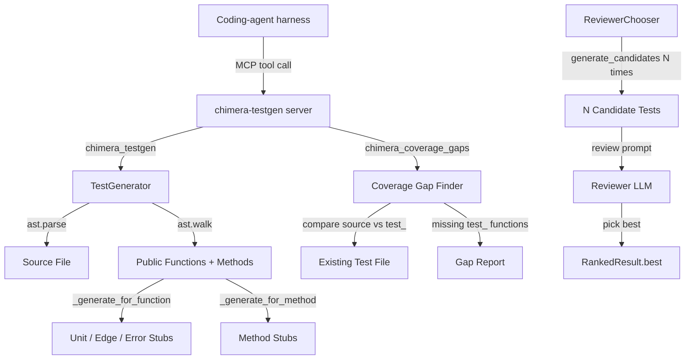

# Playbook: Test Generation

> Writing tests is tedious. Coding agents often write shallow tests or mock too aggressively. Chimera generates comprehensive test skeletons from source analysis, then ranks multiple candidates to pick the best.

## What This Solves

Manual test writing is slow and produces uneven coverage. When an LLM writes tests, it tends to produce shallow assertions (`assert result is not None`) or over-mock dependencies, hiding real bugs behind a green test suite. Chimera's TestGenerator analyzes your source code with Python's AST module to extract every public function and method, then generates categorized test skeletons (unit, edge, error) that cover the actual interface. The ReviewerChooser can then generate multiple candidate test suites and use a second LLM call to rank them, selecting the most thorough version.

## Architecture



## Setup

### 1. MCP Server Configuration

Add the testgen server to your `.mcp.json`:

```json
{
  "mcpServers": {
    "chimera-testgen": {
      "command": "python3",
      "args": ["chimera/mcp_servers/testgen_server.py"]
    }
  }
}
```

### 2. Verify

Restart your harness. You should see `chimera_testgen` and `chimera_coverage_gaps` in your available MCP tools.

## How It Works

### TestGenerator (`chimera/testgen/generator.py`)

The `TestGenerator` class uses Python's `ast` module to analyze source files without executing them.

**Analysis flow:**

1. `analyze(filepath)` reads the file and calls `analyze_source()`.
2. `analyze_source()` parses the source with `ast.parse()`, then walks the AST.
3. For each `ast.FunctionDef` that does not start with `_`, it calls `_generate_for_function()`.
4. For each `ast.ClassDef`, it iterates the body and calls `_generate_for_method()` on each public method.

**Test categories generated per function:**

| Category | Test Name | What It Covers |
|----------|-----------|----------------|
| `unit` | `test_{func}` | Basic call with placeholder args, asserts result is not None |
| `edge` | `test_{func}_edge_empty` | Edge-case inputs (generated when function has arguments) |
| `error` | `test_{func}_error` | Error handling path |

For class methods, a single `unit` test is generated: `test_{ClassName}_{method}`.

**Key class: `TestCase`** (dataclass):
- `name`: test function name
- `target_function`: the function or `Class.method` being tested
- `target_file`: source file path
- `test_code`: the generated test stub as a string
- `category`: `"unit"`, `"edge"`, or `"error"`

### Testgen MCP Server (`chimera/mcp_servers/testgen_server.py`)

The `TestgenMCPServer` class implements JSON-RPC 2.0 over stdio with two tools:

**`chimera_testgen(file_path)`** -- Analyzes a Python source file and returns test case skeletons for all public functions and methods. Returns a formatted text block with each skeleton labeled by name and category.

**`chimera_coverage_gaps(file_path)`** -- Identifies public functions and methods that lack corresponding `test_` functions. Works by:

1. Parsing the source file to extract all public function/method names.
2. Locating the test file using a search strategy (checks `test_{stem}.py` in the same directory, a `tests/` subdirectory, the parent's `tests/` directory, and the project root's `tests/` directory).
3. Parsing the test file and collecting all `test_` function names.
4. Reporting any source function where `test_{name}` is missing from the test file.

The output includes the function name, line number, kind (function or method), and the path to the test file if found.

### ReviewerChooser (`chimera/core/reviewer.py`)

The `ReviewerChooser` generates multiple candidate solutions and uses a second LLM call to select the best one. This is useful for test generation because different LLM samples produce tests of varying quality.

**Pipeline:**

1. `generate_candidates(messages, tools, n=3)` -- calls the generator provider N times at `temperature=0.7` to produce diverse candidates.
2. `review(candidates)` -- formats all candidates into a numbered list and sends them to the reviewer provider at `temperature=0.0` with a prompt asking it to evaluate correctness, completeness, and code quality. Returns the best candidate's index.
3. `choose(messages, tools, n=3)` -- the full pipeline, calling `generate_candidates` then `review`.

**Key class: `RankedResult`** (dataclass):
- `best`: the chosen `Response`
- `best_index`: 0-based index of the winner
- `all_responses`: all N candidates
- `review_reasoning`: the reviewer's raw output

## Configuration Reference

| Option | Default | Description |
|--------|---------|-------------|
| MCP server command | `python3 chimera/mcp_servers/testgen_server.py` | Server entry point |
| `ReviewerChooser.temperature` | `0.7` | Sampling temperature for candidate generation |
| `ReviewerChooser` N | `3` | Number of candidates to generate |
| Test file search locations | Same dir, `tests/`, parent `tests/`, project `tests/` | Where coverage gap finder looks for test files |

## Verification

```bash
# Verify the MCP server starts
echo '{"jsonrpc":"2.0","id":1,"method":"initialize","params":{}}' | python3 chimera/mcp_servers/testgen_server.py

# Verify TestGenerator works on a source file
python3 -c "
from chimera.testgen.generator import TestGenerator
gen = TestGenerator()
cases = gen.analyze('chimera/core/agent.py')
print(f'{len(cases)} test cases generated')
for c in cases[:3]:
    print(f'  {c.name} ({c.category})')
"

# Verify coverage gaps
python3 -c "
from chimera.mcp_servers.testgen_server import find_coverage_gaps
from pathlib import Path
source = Path('chimera/core/agent.py').read_text()
gaps = find_coverage_gaps(source, filepath='chimera/core/agent.py')
print(f'{len(gaps)} coverage gaps found')
for g in gaps[:5]:
    print(f'  line {g[\"line\"]}: {g[\"name\"]} ({g[\"kind\"]})')
"
```

## Recipe: Test Generation System

### Components

| Component | Module | Role |
|-----------|--------|------|
| `TestGenerator` | `chimera/testgen/generator.py` | AST-based skeleton generation |
| `TestCase` | `chimera/testgen/generator.py` | Dataclass for a single test case |
| `TestgenMCPServer` | `chimera/mcp_servers/testgen_server.py` | JSON-RPC server exposing two tools |
| `find_coverage_gaps` | `chimera/mcp_servers/testgen_server.py` | Standalone function for gap detection |
| `ReviewerChooser` | `chimera/core/reviewer.py` | Multi-candidate ranking via LLM |
| `RankedResult` | `chimera/core/reviewer.py` | Dataclass for ranked output |

### Data Flow

```
Source file path
  -> ast.parse() -> AST tree
  -> ast.walk() -> FunctionDef / ClassDef nodes
  -> filter public (not _.startswith("_"))
  -> generate test stubs (unit + edge + error)
  -> TestCase list

For coverage gaps:
  Source AST -> set of public function names
  Test file AST -> set of test_ function names
  Difference -> gap list with line numbers
```

### Interfaces

```python
# Generate test skeletons
from chimera.testgen.generator import TestGenerator

gen = TestGenerator()
cases = gen.analyze("path/to/module.py")
# cases: list[TestCase] with .name, .target_function, .test_code, .category

# Find untested functions
from chimera.mcp_servers.testgen_server import find_coverage_gaps

gaps = find_coverage_gaps(source_code, test_source_code, filepath="module.py")
# gaps: list[dict] with keys "name", "line", "kind", "file"

# Rank multiple test candidates
from chimera.core.reviewer import ReviewerChooser

chooser = ReviewerChooser(generator=provider, reviewer=provider)
result = chooser.choose(messages, n=3)
# result.best: Response, result.best_index: int
```

### Adding a Custom Test Category

To extend the test categories beyond unit/edge/error, subclass `TestGenerator` and override `_generate_for_function`:

```python
class ExtendedTestGenerator(TestGenerator):
    def _generate_for_function(self, node, filepath, module_name):
        cases = super()._generate_for_function(node, filepath, module_name)
        # Add a concurrency test for async functions
        if any(isinstance(n, ast.AsyncFunctionDef) for n in ast.walk(node)):
            cases.append(TestCase(
                name=f"test_{node.name}_concurrent",
                target_function=node.name,
                target_file=filepath,
                test_code=self._make_concurrent_test(node.name, module_name),
                category="concurrency",
            ))
        return cases
```
