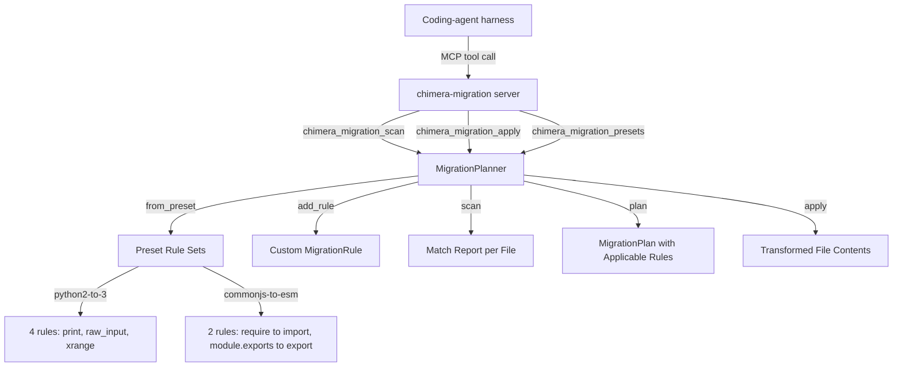

# Playbook: Migration Planning

> Manual code migration is error-prone and tedious. Chimera automates scanning, planning, and applying rule-based transforms with built-in presets and custom rule support.

## What This Solves

Migrating a codebase between language versions (Python 2 to 3) or module systems (CommonJS to ESM) involves hundreds of repetitive find-and-replace operations that are easy to get wrong by hand. An LLM doing these transforms one at a time wastes context and makes inconsistent choices. Chimera's MigrationPlanner provides regex-based transformation rules organized into presets. You scan to see what needs to change, review the plan, and apply it atomically -- every matching file gets the same correct transform.

## Architecture



## Setup

### 1. MCP Server Configuration

Add the migration server to your `.mcp.json`:

```json
{
  "mcpServers": {
    "chimera-migration": {
      "command": "python3",
      "args": ["chimera/mcp_servers/migration_server.py"]
    }
  }
}
```

### 2. Verify

Restart your harness. You should see `chimera_migration_scan`, `chimera_migration_apply`, and `chimera_migration_presets` in your available MCP tools.

## How It Works

### MigrationRule (`chimera/migration/planner.py`)

A `MigrationRule` is a single find-and-replace transform defined by four fields:

| Field | Type | Description |
|-------|------|-------------|
| `pattern` | `str` | Regex pattern to match in source text |
| `replacement` | `str` | Replacement string (supports backreferences like `\1`) |
| `description` | `str` | Human-readable explanation of what the rule does |
| `file_glob` | `str` | Glob pattern restricting which files the rule applies to (default: `"*"`) |

Two methods:
- `matches(source)` -- returns a list containing `description` once per regex match found. Used for scanning.
- `apply(source)` -- runs `re.sub(pattern, replacement, source)` and returns the transformed text.

### MigrationPlan (`chimera/migration/planner.py`)

A `MigrationPlan` is an ordered collection of rules with a name and description.

- `validate(source)` -- collects all match descriptions across all rules. Useful for preview.
- `apply(source)` -- applies all rules sequentially. Later rules see the output of earlier rules, so rule order matters.

### MigrationPlanner (`chimera/migration/planner.py`)

The `MigrationPlanner` is the main orchestrator. It holds a list of rules and operates on file collections (dicts mapping file paths to contents).

**Core methods:**

| Method | What It Does |
|--------|--------------|
| `add_rule(rule)` | Append a `MigrationRule` to the planner's rule list |
| `scan(files)` | Check which rules match which files. Returns `{path: [descriptions]}` for files with matches. Only checks files whose path matches a rule's `file_glob` (using `fnmatch`). |
| `plan(files)` | Create a `MigrationPlan` containing only rules that match at least one file |
| `apply(files)` | Apply all rules to matching files and return the transformed file contents |
| `from_preset(name)` | Class method. Create a planner pre-loaded with a built-in rule set |

### Built-in Presets

**`python2-to-3`** (4 rules, `*.py` files):

| Rule | Pattern | Replacement |
|------|---------|-------------|
| Print (double-quoted) | `\bprint\s+"([^"]*)"` | `print("\1")` |
| Print (single-quoted) | `\bprint\s+'([^']*)'` | `print('\1')` |
| raw_input | `\braw_input\s*\(` | `input(` |
| xrange | `\bxrange\s*\(` | `range(` |

**`commonjs-to-esm`** (2 rules, `*.js` files):

| Rule | Pattern | Replacement |
|------|---------|-------------|
| require to import | `const\s+(\w+)\s*=\s*require\(['"]([^'"]+)['"]\);?` | `import \1 from "\2";` |
| module.exports | `module\.exports\s*=\s*` | `export default ` |

### Migration MCP Server (`chimera/mcp_servers/migration_server.py`)

The `MigrationMCPServer` class implements JSON-RPC 2.0 over stdio with three tools:

**`chimera_migration_scan(files, preset)`** -- Scans file contents for migration opportunities using a named preset. The `files` parameter is a JSON object mapping file paths to their contents. Returns a per-file list of matching rule descriptions.

**`chimera_migration_apply(files, preset)`** -- Applies a preset migration to the provided files and returns the transformed contents. Returns both a human-readable diff view and a JSON object with the transformed file contents.

**`chimera_migration_presets()`** -- Lists all available migration presets with their descriptions and rule counts. Currently returns `python2-to-3` (4 rules) and `commonjs-to-esm` (2 rules).

## Configuration Reference

| Option | Default | Description |
|--------|---------|-------------|
| MCP server command | `python3 chimera/mcp_servers/migration_server.py` | Server entry point |
| Available presets | `python2-to-3`, `commonjs-to-esm` | Built-in rule sets |
| `MigrationRule.file_glob` | `"*"` | Which files a rule applies to |

## Verification

```bash
# Verify the MCP server starts
echo '{"jsonrpc":"2.0","id":1,"method":"initialize","params":{}}' | python3 chimera/mcp_servers/migration_server.py

# Verify scanning works
python3 -c "
from chimera.migration.planner import MigrationPlanner
planner = MigrationPlanner.from_preset('python2-to-3')
files = {'app.py': 'print \"hello\"\nx = raw_input(\"name: \")'}
results = planner.scan(files)
for path, matches in results.items():
    print(f'{path}:')
    for m in matches:
        print(f'  - {m}')
"

# Verify applying works
python3 -c "
from chimera.migration.planner import MigrationPlanner
planner = MigrationPlanner.from_preset('commonjs-to-esm')
files = {'index.js': 'const fs = require(\"fs\");\nmodule.exports = main;'}
result = planner.apply(files)
print(result['index.js'])
"
```

## Recipe: Migration System

### Components

| Component | Module | Role |
|-----------|--------|------|
| `MigrationRule` | `chimera/migration/planner.py` | Single regex find-and-replace rule |
| `MigrationPlan` | `chimera/migration/planner.py` | Ordered collection of rules |
| `MigrationPlanner` | `chimera/migration/planner.py` | Orchestrator: scan, plan, apply |
| `MigrationMCPServer` | `chimera/mcp_servers/migration_server.py` | JSON-RPC server exposing three tools |

### Data Flow

```
Preset name (e.g. "python2-to-3")
  -> MigrationPlanner.from_preset() -> planner with 4 rules
  -> planner.scan(files) -> {path: [match descriptions]}
  -> planner.apply(files) -> {path: transformed_content}

Each rule:
  file_glob check (fnmatch) -> pattern match (re.findall) -> substitution (re.sub)
```

### Interfaces

```python
# Use a built-in preset
from chimera.migration.planner import MigrationPlanner

planner = MigrationPlanner.from_preset("python2-to-3")
files = {"app.py": open("app.py").read()}
scan_results = planner.scan(files)      # preview what will change
transformed = planner.apply(files)       # apply transforms

# Create a custom rule
from chimera.migration.planner import MigrationRule

rule = MigrationRule(
    pattern=r"from typing import Optional",
    replacement="from typing import Optional  # PEP 604: use X | None instead",
    description="Flag Optional imports for PEP 604 migration",
    file_glob="*.py",
)

planner = MigrationPlanner()
planner.add_rule(rule)
```

### Creating a Custom Preset

To add a new preset to the planner, add an entry to `MigrationPlanner._PRESETS`:

```python
MigrationPlanner._PRESETS["django-3-to-4"] = [
    MigrationRule(
        pattern=r"from django\.utils\.encoding import force_text",
        replacement="from django.utils.encoding import force_str",
        description="Rename force_text to force_str (Django 4.0)",
        file_glob="*.py",
    ),
    MigrationRule(
        pattern=r"\bforce_text\b",
        replacement="force_str",
        description="Replace force_text calls with force_str",
        file_glob="*.py",
    ),
]
```

Then update `PRESET_DESCRIPTIONS` in `chimera/mcp_servers/migration_server.py` so the MCP tool reports it correctly.

### Adding Rules at Runtime

For one-off migrations that do not need a preset, build the planner directly:

```python
planner = MigrationPlanner()
planner.add_rule(MigrationRule(
    pattern=r"import os\nfrom os import path",
    replacement="from pathlib import Path",
    description="Replace os.path with pathlib",
    file_glob="*.py",
))
plan = planner.plan(files)   # MigrationPlan with only matching rules
result = plan.apply(source)  # apply to a single source string
```
