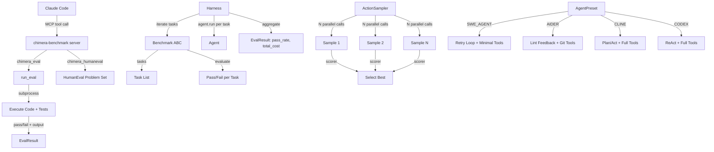

# Playbook: Benchmarking Your Workflow

> No way to measure whether your coding agent workflow is actually good. Chimera's eval harness lets you run standardized benchmarks, compare agent architectures, and A/B test approaches.

## What This Solves

Without benchmarks, you are flying blind. You cannot tell whether a prompt change improved your agent, whether one loop strategy outperforms another, or whether your custom tools are helping or hurting. Chimera provides a structured evaluation harness that runs agents against standardized benchmark suites (HumanEval, SWE-bench, AIMO, Custom), collects per-task metrics (pass/fail, cost, steps), and aggregates them into comparable results. The ActionSampler lets you A/B test different approaches in parallel, and Agent Presets give you one-line access to well-known agent architectures for comparison.

## Architecture



## Setup

### 1. MCP Server Configuration

Add the benchmark server to your `.mcp.json`:

```json
{
  "mcpServers": {
    "chimera-benchmark": {
      "command": "python3",
      "args": ["chimera/mcp_servers/benchmark_server.py"]
    }
  }
}
```

### 2. Verify

Restart Claude Code. You should see `chimera_eval` and `chimera_humaneval` in your available MCP tools.

## How It Works

### Eval Harness (`chimera/eval/harness.py`)

The evaluation system has three layers:

**`Benchmark` (ABC)** -- defines a benchmark suite with three abstract methods:
- `name()` -- returns the benchmark identifier (e.g., `"HumanEval"`)
- `tasks()` -- returns a list of task dicts, each with at least `"prompt"` and `"id"` keys
- `evaluate(task, agent_output, env)` -- judges whether the agent's output passes the task

**`Harness`** -- runs an agent against every task in a benchmark:
1. Iterates over `benchmark.tasks()`
2. Optionally creates a fresh `Environment` per task via `env_factory()`
3. Calls `agent.run(task["prompt"], env)` for each task
4. Calls `benchmark.evaluate()` to judge pass/fail
5. Aggregates into an `EvalResult`

**`EvalResult`** (dataclass) -- the final report:

| Field | Type | Description |
|-------|------|-------------|
| `benchmark` | `str` | Benchmark name |
| `total` | `int` | Number of tasks |
| `passed` | `int` | Number that passed |
| `pass_rate` | `float` | `passed / total` |
| `results` | `list[TaskEvalResult]` | Per-task breakdown |
| `total_cost` | `float` | Sum of all task costs |

Each `TaskEvalResult` contains `task_id`, `passed`, `output`, `cost`, and `steps`.

### Benchmark MCP Server (`chimera/mcp_servers/benchmark_server.py`)

The `BenchmarkMCPServer` implements JSON-RPC 2.0 over stdio with two tools:

**`chimera_eval(code, test_code, timeout=30)`** -- Combines Python code and test code into a temporary file, executes it in a subprocess, and reports pass/fail. The `timeout` parameter defaults to 30 seconds. Returns an `EvalResult` with `passed` (bool), `output` (stdout + stderr), `error` (if failed), and `returncode`.

**`chimera_humaneval(problem_id)`** -- Returns a HumanEval problem prompt by ID. The server includes a built-in subset of 5 problems (IDs 0-4) for offline use. Each problem includes the function signature, docstring with examples, and test assertions. Problem IDs can be passed as `"0"` or `"HumanEval/0"`.

### ActionSampler (`chimera/core/sampler.py`)

The `ActionSampler` generates N completions in parallel and selects the best one using a configurable scorer. This is useful for benchmarking because it lets you test whether sampling multiple solutions and picking the best one outperforms a single attempt.

**Constructor parameters:**

| Parameter | Default | Description |
|-----------|---------|-------------|
| `provider` | required | LLM provider for completions |
| `n` | `3` | Number of parallel samples |
| `temperature` | `0.8` | Sampling temperature (higher = more diverse) |
| `max_workers` | `n` | Max parallel threads |

**Methods:**
- `sample(messages, tools, scorer)` -- parallel sampling via `ThreadPoolExecutor`
- `sample_sequential(messages, tools, scorer)` -- sequential fallback for providers that do not support concurrent requests

**Built-in scorers:**
- `default_scorer` -- scores by content length (longer = more detailed)
- `tool_call_scorer` -- adds 1000 points if the response includes tool calls (prefers action-oriented responses)

**`SampledResult`** (dataclass):
- `best`: highest-scoring `Response`
- `all_responses`: all N candidates
- `scores`: parallel list of float scores
- `best_index`: index of the winner

### Agent Presets (`chimera/agents/presets/agent_styles.py`)

Four built-in presets that compose Chimera primitives to replicate well-known agent architectures:

| Preset | Loop | Tools | Max Steps | Key Trait |
|--------|------|-------|-----------|-----------|
| `SWE_AGENT` | Retry (3 retries) | read, edit, bash, search, list_files | 30 | Minimal tools, retry on failure, benchmark-focused |
| `CODEX` | ReAct | All agent tools | 50 | Full tool access, high step limit, memory-aware |
| `AIDER` | Lint Feedback | read, edit, bash, search, list_files, git, test, repo_map | 20 | Auto-lint after edits, git-aware, pair-programming style |
| `CLINE` | Plan/Act | All agent tools | 25 | Read-only planning phase, then full execution |

Each preset defines a `system_prompt` tuned for its approach. Build any preset with one call:

```python
from chimera.agents.presets.agent_styles import AgentPreset

agent = AgentPreset.SWE_AGENT.build(provider)
```

## Configuration Reference

| Option | Default | Description |
|--------|---------|-------------|
| MCP server command | `python3 chimera/mcp_servers/benchmark_server.py` | Server entry point |
| `chimera_eval` timeout | `30` seconds | Max execution time per eval |
| Built-in HumanEval problems | 0-4 | Offline subset (full dataset requires `datasets` library) |
| `ActionSampler.n` | `3` | Number of parallel samples |
| `ActionSampler.temperature` | `0.8` | Sampling diversity |

## Verification

```bash
# Verify the MCP server starts
echo '{"jsonrpc":"2.0","id":1,"method":"initialize","params":{}}' | python3 chimera/mcp_servers/benchmark_server.py

# Verify eval works
python3 -c "
from chimera.mcp_servers.benchmark_server import run_eval
result = run_eval(
    'def add(a, b): return a + b',
    'assert add(1, 2) == 3; assert add(-1, 1) == 0; print(\"pass\")',
)
print(f'Passed: {result.passed}, Output: {result.output}')
"

# Verify HumanEval problems load
python3 -c "
from chimera.mcp_servers.benchmark_server import get_humaneval_problem
p = get_humaneval_problem('0')
print(f'Problem 0: {p[\"prompt\"][:60]}...')
"

# Verify agent presets build
python3 -c "
from chimera.agents.presets.agent_styles import AgentPreset
for name in ['SWE_AGENT', 'CODEX', 'AIDER', 'CLINE']:
    preset = getattr(AgentPreset, name)
    print(f'{preset.name}: {preset.loop_type}, {len(preset.tool_names)} tool(s), max_steps={preset.max_steps}')
"
```

## Recipe: Benchmarking System

### Components

| Component | Module | Role |
|-----------|--------|------|
| `Benchmark` | `chimera/eval/harness.py` | ABC for benchmark suites |
| `Harness` | `chimera/eval/harness.py` | Runner: agent + benchmark -> EvalResult |
| `EvalResult` | `chimera/eval/harness.py` | Aggregated pass rate, cost, per-task results |
| `TaskEvalResult` | `chimera/eval/harness.py` | Single task outcome |
| `BenchmarkMCPServer` | `chimera/mcp_servers/benchmark_server.py` | JSON-RPC server with eval + humaneval tools |
| `run_eval` | `chimera/mcp_servers/benchmark_server.py` | Subprocess-based code execution |
| `ActionSampler` | `chimera/core/sampler.py` | Parallel sampling with scoring |
| `SampledResult` | `chimera/core/sampler.py` | Sampled output with scores |
| `AgentPreset` | `chimera/agents/presets/agent_styles.py` | Named agent configurations |

### Data Flow

```
Benchmark.tasks() -> list of task dicts
  -> Harness iterates each task
  -> agent.run(prompt, env) -> AgentResult (output, cost, steps)
  -> Benchmark.evaluate(task, output, env) -> bool
  -> aggregate -> EvalResult (pass_rate, total_cost)

For A/B testing:
  ActionSampler.sample(messages, tools, scorer)
  -> ThreadPoolExecutor spawns N provider.complete() calls
  -> scorer(response) -> float for each
  -> max(scores) -> SampledResult.best
```

### Interfaces

```python
# Run a benchmark with the harness
from chimera.eval.harness import Harness

harness = Harness(benchmark=my_benchmark, agent=my_agent, env_factory=lambda: DockerEnvironment())
result = harness.run()
print(f"Pass rate: {result.pass_rate:.1%}, Cost: ${result.total_cost:.2f}")

# Evaluate code directly
from chimera.mcp_servers.benchmark_server import run_eval

result = run_eval(code="def fib(n): ...", test_code="assert fib(10) == 55")
print(f"Passed: {result.passed}")

# A/B test with ActionSampler
from chimera.core.sampler import ActionSampler, tool_call_scorer

sampler = ActionSampler(provider, n=5, temperature=0.8)
result = sampler.sample(messages, tools, scorer=tool_call_scorer)
print(f"Best response (index {result.best_index}): score {result.scores[result.best_index]}")

# Compare agent presets
from chimera.agents.presets.agent_styles import AgentPreset

for preset_name in ["SWE_AGENT", "AIDER", "CLINE", "CODEX"]:
    preset = getattr(AgentPreset, preset_name)
    agent = preset.build(provider)
    harness = Harness(benchmark=my_benchmark, agent=agent)
    result = harness.run()
    print(f"{preset.name}: {result.pass_rate:.1%}")
```

### Creating a Custom Benchmark

Subclass `Benchmark` and implement the three abstract methods:

```python
from chimera.eval.harness import Benchmark

class ProjectBenchmark(Benchmark):
    def name(self) -> str:
        return "my-project"

    def tasks(self) -> list[dict]:
        return [
            {"id": "fix-auth", "prompt": "Fix the authentication bug in auth.py"},
            {"id": "add-logging", "prompt": "Add structured logging to the API layer"},
        ]

    def evaluate(self, task, agent_output, env) -> bool:
        # Run project tests as the success criterion
        import subprocess
        result = subprocess.run(["pytest", "tests/", "-x"], capture_output=True)
        return result.returncode == 0
```

### Comparing Architectures

To determine which agent style works best for your codebase:

1. Define a benchmark with 10-20 representative tasks
2. Build agents from each preset: `AgentPreset.SWE_AGENT.build(provider)`, etc.
3. Run each agent through the harness
4. Compare pass_rate, total_cost, and average steps per task
5. Use `ActionSampler` with the winning preset to determine optimal sample count
