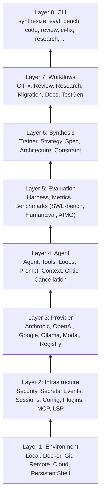

# Playbook: Building a Coding Agent on Chimera

> You want to build your own Claude Code-like tool using Chimera as a library.

## What This Solves

Building a coding agent from scratch means wiring together LLM calls, tool execution, context management, permissions, streaming, session persistence, and composition -- before you write any product logic. Chimera gives you an 8-layer stack where each layer is independently usable, composable, and testable. You pick the layers you need, configure them, and ship.

## Architecture

The full Chimera stack, from execution environments up to CLI:



Each layer depends only on layers below it. You can use Layer 3 (Provider) without Layer 4 (Agent). You can use Layer 4 without Layer 5 (Evaluation). Build only what you need.

## The 3-Tier API Pattern

Every Chimera feature follows the same design: a one-liner for getting started, a configuration surface for customization, and an extension point for framework authors.

### Tier 1: One-Liner

Five lines to a working agent:

```python
from chimera.core.agent import Agent
from chimera.providers.factory import create_provider

provider = create_provider(model="glm-5")
agent = Agent(provider=provider)
result = agent.run("Write a hello-world script.", env=None)
print(result.output)
```

`create_provider` auto-detects the provider type from the model name. `Agent` defaults to the `ReAct` loop and a generic system prompt. `env=None` means no filesystem access -- the agent can only reason and respond.

### Tier 2: Configuration

Wire in tools, swap the loop, set a system prompt, limit steps:

```python
from chimera.core.agent import Agent
from chimera.core.loop import ReAct
from chimera.core.loop_config import LoopConfig
from chimera.core.prompt import Prompt
from chimera.core.tool_group import create_default_tools
from chimera.env.local import LocalEnvironment
from chimera.events.base import EventBus
from chimera.providers.factory import create_provider

provider = create_provider(model="glm-5")
env = LocalEnvironment(workdir="/tmp/sandbox")

event_bus = EventBus()
config = LoopConfig(event_bus=event_bus)
loop = ReAct(max_steps=30, config=config)

agent = Agent(
    provider=provider,
    tools=create_default_tools(),
    loop=loop,
    prompt=Prompt.from_string("You are a senior Python developer. Write clean, tested code."),
    name="coder",
)
result = agent.run("Create a CLI calculator with add, subtract, multiply, divide.", env=env)
```

### Tier 3: Subclass and Extend

Extend `BaseTool`, `Provider`, or any loop class to build custom behaviour:

```python
from chimera.core.tool import BaseTool
from chimera.providers.base import Provider
from chimera.core.loop import ReAct

class MyTool(BaseTool):
    name = "my_tool"
    description = "Does something custom"
    parameters = {"type": "object", "properties": {"input": {"type": "string"}}}

    def execute(self, args, env):
        return {"output": f"Processed: {args['input']}"}

class MyLoop(ReAct):
    """ReAct with custom post-step logic."""
    # Override iter_steps to add behaviour between steps
```

---

## Custom Tools

Chimera provides two ways to define tools the agent can invoke.

### The `@tool` Decorator

For simple tools, use the decorator. The function must accept `(args: dict, env: Environment | None)` and return a `ToolResult` (a dict with an `"output"` key):

```python
from chimera.core.tool import tool

@tool(
    name="word_count",
    description="Count words in a string.",
    parameters={
        "type": "object",
        "properties": {
            "text": {"type": "string", "description": "Text to count words in"},
        },
        "required": ["text"],
    },
)
def word_count(args, env):
    count = len(args["text"].split())
    return {"output": f"{count} words"}
```

Use the tool by passing it to the agent:

```python
agent = Agent(provider=provider, tools=[word_count])
```

### The `BaseTool` ABC

For tools that need state, async execution, or approval gating, subclass `BaseTool`:

```python
from chimera.core.tool import BaseTool
from chimera.types import ToolResult

class DatabaseQuery(BaseTool):
    name = "db_query"
    description = "Run a read-only SQL query against the project database."
    parameters = {
        "type": "object",
        "properties": {
            "sql": {"type": "string", "description": "SQL SELECT query"},
        },
        "required": ["sql"],
    }
    requires_approval = True  # Pause for user confirmation

    def __init__(self, connection_string: str) -> None:
        self._conn_str = connection_string

    def execute(self, args, env):
        # Your database logic here
        return ToolResult(output="query results...")

    async def async_execute(self, args, env):
        # Native async version -- override for true non-blocking I/O
        return ToolResult(output="async query results...")
```

Key `BaseTool` attributes:

| Attribute | Type | Purpose |
|-----------|------|---------|
| `name` | `str` | Unique tool name exposed to the model |
| `description` | `str` | Human-readable description for the tool schema |
| `parameters` | `dict` | JSON Schema defining accepted arguments |
| `requires_approval` | `bool` | If `True`, the framework pauses for user confirmation |

Key methods:

| Method | Signature | Purpose |
|--------|-----------|---------|
| `execute` | `(args: dict, env: Environment \| None) -> ToolResult` | Synchronous execution (required) |
| `async_execute` | `(args: dict, env: Environment \| None) -> ToolResult` | Async execution (optional, defaults to threadpool) |
| `to_openai_schema` | `() -> dict` | Convert to OpenAI function calling format |
| `to_anthropic_schema` | `() -> dict` | Convert to Anthropic tool use format |

There is also `ContextAwareTool` -- a `BaseTool` subclass that receives a reference to the agent's `Context` via `bind_context()` before the loop starts. Use it for tools that need to inspect or modify conversation history.

---

## Choosing a Loop

The loop controls how the agent reasons and acts. Chimera ships four loops, all sharing the same interface: `run()`, `iter_steps()`, and `async_run()`.

### ReAct (default)

**Module:** `chimera/core/loop.py` -- class `ReAct`

```python
from chimera.core.loop import ReAct
loop = ReAct(max_steps=50, config=None)
```

Reason, Act (tool call), Observe (tool result), repeat. The model decides when to stop. Best for: **general-purpose tasks** where the model can self-direct.

### PlanAndExecute

**Module:** `chimera/core/loops/plan_execute.py` -- class `PlanAndExecute`

```python
from chimera.core.loops.plan_execute import PlanAndExecute
loop = PlanAndExecute(max_steps=50, config=None)
```

Two phases: (1) generate a plan with no tool calls, (2) execute it step by step. The loop automatically injects `"Now execute the plan you just created, step by step."` after the plan phase. Best for: **complex multi-step tasks** where upfront planning reduces wasted steps.

### Reflexion

**Module:** `chimera/core/loops/reflexion.py` -- class `Reflexion`

```python
from chimera.core.loops.reflexion import Reflexion
loop = Reflexion(max_steps=50, reflect_every=3, config=None)
```

After every N action cycles, injects a reflection prompt: *"Reflect on what you just did. What worked? What didn't? What should you do differently?"* The model's reflection is added to context, improving subsequent actions. Best for: **debugging and iterative refinement** tasks where self-correction matters.

### TreeOfThought

**Module:** `chimera/core/loops/tree_of_thought.py` -- class `TreeOfThought`

```python
from chimera.core.loops.tree_of_thought import TreeOfThought
loop = TreeOfThought(max_steps=50, n_candidates=3, config=None)
```

At each step, generates N candidate responses (with `temperature=0.7`), then asks the model to evaluate and pick the best one. Falls back to ReAct-style execution for tool calls. Best for: **reasoning-heavy tasks** (math, logic, algorithm design) where exploring multiple paths improves accuracy. Costs N times more per step.

### Loop Comparison

| Loop | Steps per turn | Cost multiplier | Best for |
|------|---------------|-----------------|----------|
| `ReAct` | 1 | 1x | General-purpose |
| `PlanAndExecute` | 1 + plan | ~1.1x | Complex multi-step |
| `Reflexion` | 1 + reflection every N | ~1.3x | Debugging, iteration |
| `TreeOfThought` | N candidates + evaluation | Nx | Reasoning, math |

All loops accept a `LoopConfig` for enabling permissions, events, streaming, compaction, cancellation, and more. See the **LoopConfig** section below.

---

## Streaming

Use `iter_steps()` to get one `StepResult` per LLM turn. This is how you build real-time UIs.

### Synchronous Streaming

```python
from chimera.core.agent import Agent
from chimera.providers.factory import create_provider

provider = create_provider(model="glm-5")
agent = Agent(provider=provider)

gen = agent.iter_steps("Explain recursion.", env=None)
try:
    while True:
        step = next(gen)
        print(f"Step {step.step}: {step.message.content[:100]}...")
        if step.tool_calls:
            for tc in step.tool_calls:
                print(f"  Tool: {tc.name}({tc.arguments})")
        if step.done:
            break
except StopIteration as e:
    result = e.value  # AgentResult is the generator return value
    print(f"Done: {result.output}")
```

### Async Streaming

```python
import asyncio
from chimera.core.agent import Agent
from chimera.core.loop import async_drain_steps
from chimera.providers.factory import create_provider

async def main():
    provider = create_provider(model="glm-5")
    agent = Agent(provider=provider)

    async for step in agent.async_run.__self__.loop.async_iter_steps(
        provider, agent.tools, context, env
    ):
        print(f"Step {step.step}: done={step.done}")

asyncio.run(main())
```

### Token-Level Streaming

For token-by-token output (typewriter effect), configure a `StreamHandler` via `LoopConfig`:

```python
from chimera.core.loop import ReAct
from chimera.core.loop_config import LoopConfig
from chimera.streaming.base import StreamHandler
from chimera.providers.base import StreamEvent

class TerminalHandler(StreamHandler):
    def handle_event(self, event: StreamEvent) -> None:
        if event.type == "text_delta":
            print(event.content, end="", flush=True)

    def on_step_start(self, step: int) -> None:
        print(f"\n--- Step {step} ---")

    def on_step_end(self, step: int) -> None:
        pass

    def on_tool_start(self, tool_name: str, call_id: str) -> None:
        print(f"\n[Tool: {tool_name}]")

    def on_tool_end(self, call_id: str, result: str) -> None:
        print(f"[Result: {result[:200]}]")

    def on_done(self) -> None:
        print("\n--- Done ---")

config = LoopConfig(handler=TerminalHandler())
loop = ReAct(max_steps=30, config=config)
```

When a `StreamHandler` is configured, the loop calls `provider.stream()` instead of `provider.complete()`, yielding `StreamEvent` objects with types: `text_delta`, `tool_call_start`, `tool_call_delta`, `tool_call_complete`, `done`.

---

## Interactive Permissions

When a tool has `requires_approval = True` or a `PermissionPolicy` returns ASK, the loop pauses and yields a `StepResult` with a `pending_approval` field. Your UI must call `approve()` or `deny()` before iterating further.

### The PendingApproval Dataclass

Defined in `chimera/types.py`:

```python
@dataclass
class PendingApproval:
    tool_call: ToolCall       # The tool call awaiting approval
    tool_name: str            # Tool name (convenience)
    arguments: dict[str, Any] # Arguments (convenience)
    reason: str               # Why approval is needed

    def approve(self) -> None: ...
    def deny(self, message: str = "User denied") -> None: ...

    @property
    def decided(self) -> bool: ...
    @property
    def approved(self) -> bool: ...
```

### Building an Interactive Terminal

```python
agent = Agent(provider=provider, tools=[my_dangerous_tool])
gen = agent.iter_steps("Do something risky.", env=env)

try:
    while True:
        step = next(gen)

        if step.pending_approval:
            pa = step.pending_approval
            print(f"Tool '{pa.tool_name}' wants to run with: {pa.arguments}")
            answer = input("Allow? [y/n]: ").strip().lower()
            if answer == "y":
                pa.approve()
            else:
                pa.deny("User rejected this action")
            # The next call to next(gen) resumes execution

        if step.done:
            break
except StopIteration as e:
    result = e.value
```

### Permission Policies

For programmatic approval, use `LoopConfig.permissions`:

```python
from chimera.permissions.base import AutoApprove, AllowList, DenyList
from chimera.core.loop_config import LoopConfig

# Auto-approve everything (YOLO mode)
config = LoopConfig(permissions=AutoApprove())

# Only allow specific tools
config = LoopConfig(permissions=AllowList(allowed=["read", "search", "list_files"]))

# Block specific tools, allow everything else
config = LoopConfig(permissions=DenyList(denied=["bash", "write"]))
```

---

## Session Persistence

`Session` wraps an `Agent` with multi-turn conversation state and pluggable storage.

### Basic Usage

```python
from chimera.core.agent import Agent
from chimera.providers.factory import create_provider
from chimera.sessions.session import Session

provider = create_provider(model="glm-5")
agent = Agent(provider=provider)
session = Session(agent=agent, env=None)

# Multi-turn conversation
result1 = session.chat("What is recursion?")
result2 = session.chat("Give me a Python example.")  # Sees full history
```

### Session Methods

| Method | Signature | Purpose |
|--------|-----------|---------|
| `chat` | `(message: str) -> AgentResult` | Send a message, run the loop, return result |
| `iter_chat` | `(message: str) -> Generator[StepResult, None, AgentResult]` | Streaming version of `chat` |
| `fork` | `() -> Session` | Deep-copy context into a new branch |
| `save` | `() -> None` | Persist to storage backend |
| `resume` | `(session_id, agent, storage) -> Session` | Class method -- restore from storage |
| `steer` | `(message: str) -> None` | Inject a steering message mid-turn |
| `queue` | `(message: str) -> None` | Queue a follow-up for after the current turn |
| `cancel` | `() -> None` | Cancel the running agent turn |
| `switch_branch` | `(leaf_id: str) -> None` | Switch to a different branch in the session tree |

### Storage Backends

**InMemoryStorage** -- no persistence, useful for tests:

```python
from chimera.sessions.storage.memory import InMemoryStorage
session = Session(agent=agent, storage=InMemoryStorage())
```

**FileStorage** -- one JSON file per session:

```python
from chimera.sessions.storage.file import FileStorage
storage = FileStorage(directory="~/.chimera/sessions/")
session = Session(agent=agent, storage=storage)
session.chat("Hello")
session.save()

# Later: resume
restored = Session.resume(session.session_id, agent=agent, storage=storage)
```

**SQLiteStorage** -- single database file, WAL mode:

```python
from chimera.sessions.storage.sqlite import SQLiteStorage
storage = SQLiteStorage(db_path="~/.chimera/sessions.db")
session = Session(agent=agent, storage=storage)
```

### Auto-Compaction

Sessions can automatically compact context when it approaches the provider's context window:

```python
from chimera.compaction.summary import SummaryCompaction

session = Session(
    agent=agent,
    auto_compact=True,
    compaction=SummaryCompaction(provider=provider),
)
```

When `auto_compact=True`, after every `chat()` turn the session checks whether estimated tokens exceed 80% of the provider's context window. If so, it applies the compaction strategy -- keeping recent messages verbatim and summarizing older ones.

---

## Composition

Chimera provides three patterns for composing multiple agents.

### Pipeline -- Sequential

Output of agent N becomes input of agent N+1. Stops early on failure.

**Module:** `chimera/composition/pipeline.py`

```python
from chimera.composition.pipeline import Pipeline

planner = Agent(provider=provider, name="planner",
    prompt=Prompt.from_string("You are a technical planner. Output a detailed plan."))
coder = Agent(provider=provider, tools=dev_tools, name="coder",
    prompt=Prompt.from_string("You are a senior developer. Implement the plan."))
reviewer = Agent(provider=provider, name="reviewer",
    prompt=Prompt.from_string("You are a code reviewer. Review the implementation."))

pipeline = Pipeline(agents=[planner, coder, reviewer])
result = pipeline.run("Build a REST API for user management.", env=sandbox)
# result.steps = sum of all agents' steps
# result.cost = sum of all agents' costs
```

### Ensemble -- Parallel Fan-Out

All agents run the same task independently. Pick the best result.

**Module:** `chimera/composition/ensemble.py`

```python
from chimera.composition.ensemble import Ensemble

conservative = Agent(provider=provider, loop=ReAct(max_steps=10), name="conservative")
creative = Agent(provider=provider, loop=TreeOfThought(n_candidates=3), name="creative")
methodical = Agent(provider=provider, loop=PlanAndExecute(), name="methodical")

ensemble = Ensemble(agents=[conservative, creative, methodical], timeout=120.0)
results = ensemble.run("Solve this optimization problem.", env=None)
winner = ensemble.best(results)  # First successful result
```

If the environment supports `clone()`, agents run in parallel via `ThreadPoolExecutor`. Otherwise they run sequentially. Async version available via `ensemble.async_run()`.

### Supervisor -- Coordinator + Workers

A coordinator agent gets delegate tools for dispatching sub-tasks to worker agents.

**Module:** `chimera/composition/supervisor.py`

```python
from chimera.composition.supervisor import Supervisor

manager = Agent(provider=provider, name="manager",
    prompt=Prompt.from_string("You are a project manager. Delegate tasks to your team."))
researcher = Agent(provider=provider, name="researcher")
coder = Agent(provider=provider, tools=dev_tools, name="coder")
tester = Agent(provider=provider, tools=test_tools, name="tester")

supervisor = Supervisor(
    coordinator=manager,
    workers={"research": researcher, "code": coder, "test": tester},
)
result = supervisor.run("Implement and test a caching layer.", env=sandbox)
```

The `Supervisor` automatically creates `DelegateTool` instances for each worker and appends them to the coordinator's tool list. The coordinator can call `research("Find caching libraries")`, `code("Implement LRU cache")`, etc.

### When to Use Each

| Pattern | Use When | Agent Count | Cost |
|---------|----------|-------------|------|
| Pipeline | Tasks have clear sequential stages | 2-5 | Sum of stages |
| Ensemble | You want the best of multiple approaches | 2-5 | Sum of all (parallel) |
| Supervisor | Complex tasks requiring delegation | 1 coordinator + N workers | Varies |

---

## Events and Observability

The `EventBus` provides publish/subscribe for 26 event types emitted by the loop.

### Subscribing to Events

```python
from chimera.events.base import EventBus
from chimera.events.types import ToolCallEvent, AgentEndEvent, StepCostEvent

bus = EventBus()

# Subscribe by event type string
bus.subscribe("tool_call", lambda e: print(f"Tool called: {e.tool_name}"))
bus.subscribe("agent_end", lambda e: print(f"Done in {e.steps} steps, cost: ${e.total_cost:.4f}"))

# Decorator form
@bus.on("step_cost")
def track_cost(event: StepCostEvent):
    print(f"Step {event.step_index}: ${event.cost:.4f} "
          f"({event.input_tokens}in/{event.output_tokens}out)")

# Wildcard: receive every event
bus.subscribe("*", lambda e: log_to_file(e))
```

### Wiring EventBus to the Loop

```python
from chimera.core.loop import ReAct
from chimera.core.loop_config import LoopConfig

bus = EventBus()
config = LoopConfig(event_bus=bus)
loop = ReAct(max_steps=50, config=config)
agent = Agent(provider=provider, loop=loop)
```

### Event Types Reference

The loop emits these events during execution (defined in `chimera/events/types.py`):

| Event | Type String | Key Fields | When Emitted |
|-------|------------|------------|--------------|
| `AgentStartEvent` | `agent_start` | `max_steps` | Loop begins |
| `AgentEndEvent` | `agent_end` | `steps`, `success`, `total_cost` | Loop finishes |
| `TurnStartEvent` | `turn_start` | `turn_number` | Each LLM turn begins |
| `TurnEndEvent` | `turn_end` | `turn_number`, `tool_calls_count` | Each LLM turn ends |
| `ModelRequestEvent` | `model_request` | `model`, `message_count`, `tool_count` | Before LLM call |
| `ModelResponseEvent` | `model_response` | `model`, `content_length`, `input_tokens`, `output_tokens` | After LLM call |
| `StreamStartEvent` | `stream_start` | `model` | Streaming begins |
| `StreamEndEvent` | `stream_end` | `total_tokens` | Streaming ends |
| `ToolCallEvent` | `tool_call` | `tool_name`, `arguments`, `call_id` | Tool invoked |
| `ToolResultEvent` | `tool_result` | `call_id`, `output`, `success` | Tool completes |
| `StepEvent` | `step` | `step_number`, `content` | Step completes |
| `StepCostEvent` | `step_cost` | `step_index`, `cost`, `input_tokens`, `output_tokens` | Cost recorded |
| `ErrorEvent` | `error` | `error`, `recoverable` | Error occurs |
| `LoopDetectedEvent` | `loop_detected` | `pattern` | Repeating pattern found |
| `CompactionEvent` | `compaction` | `messages_before`, `messages_after` | Context compacted |
| `PermissionEvent` | `permission` | `tool_name`, `action`, `granted` | Permission decision |
| `SecurityEvent` | `security` | `tool_name`, `risk`, `action` | Security analysis |
| `CriticEvent` | `critic` | `score`, `passed`, `feedback` | Critic evaluates |
| `SessionEvent` | `session` | `action`, `session_id` | Session lifecycle |
| `SteeringEvent` | `steering` | `content` | Steering message injected |
| `CancellationEvent` | `cancellation` | `at_step` | Agent cancelled |
| `TextDeltaEvent` | `text_delta` | `content` | Streaming text chunk |
| `ExternalAgentStartEvent` | `external_agent_start` | `agent_name`, `task` | ACP agent starts |
| `ExternalAgentCompleteEvent` | `external_agent_complete` | `agent_name`, `cost` | ACP agent finishes |
| `ExternalAgentToolCallEvent` | `external_agent_tool_call` | `agent_name`, `tool_call_id` | ACP agent calls tool |

### Middleware

EventBus supports middleware for cross-cutting concerns (e.g., secret redaction):

```python
from chimera.events.middleware import Middleware

class LoggingMiddleware(Middleware):
    def process(self, event, next_handler):
        print(f"[{event.type}] {event.timestamp:.2f}")
        next_handler(event)  # Call next in chain

bus.use(LoggingMiddleware())
```

---

## Auth Integration

Use `AuthManager` to handle credential lifecycle and inject tokens into providers automatically.

**Module:** `chimera/auth/manager.py`

```python
from chimera.auth.manager import AuthManager
from chimera.providers.factory import create_provider

auth = AuthManager()

# Login (caches credential in ~/.chimera/credentials/)
auth.login(provider="anthropic", method="api_key")

# create_provider uses auth_manager to fetch tokens
provider = create_provider(model="glm-5", auth_manager=auth)
```

`AuthManager` methods:

| Method | Signature | Purpose |
|--------|-----------|---------|
| `register` | `(auth_provider: AuthProvider) -> None` | Register a custom auth provider |
| `login` | `(provider: str, method: str) -> Credential` | Authenticate and cache |
| `get_token` | `(provider: str) -> str` | Get valid token, auto-refresh |
| `logout` | `(provider: str) -> None` | Remove stored credentials |

The factory function `create_provider()` accepts `auth_manager=` and will call `auth_manager.get_token()` before falling back to environment variables.

---

## LoopConfig -- The Configuration Hub

`LoopConfig` is the single dataclass that controls all loop-level behaviour. Every field is optional and defaults to `None` (disabled).

**Module:** `chimera/core/loop_config.py`

```python
from chimera.core.loop_config import LoopConfig

config = LoopConfig(
    permissions=...,          # PermissionPolicy -- control tool approval
    detector=...,             # LoopDetector -- detect repeating patterns
    compaction=...,           # CompactionStrategy -- context management
    handler=...,              # StreamHandler -- token-level streaming
    event_bus=...,            # EventBus -- publish/subscribe events
    auto_compact_threshold=0.8,  # float -- when to trigger compaction
    lsp=...,                  # LSPManager -- language server integration
    cost_tracker=...,         # CostTracker -- per-step cost tracking
    audit_log=...,            # AuditLog -- record permission decisions
    checkpoint_manager=...,   # CheckpointManager -- create/restore checkpoints
    git_workflow=...,         # GitWorkflow -- branch isolation, commit strategies
    wire=...,                 # Wire -- bidirectional channel for UI/RPC
    middleware=...,           # list[LoopMiddleware] -- before/after model hooks
    truncation=...,           # TruncationConfig -- message truncation
    ghost_commits=...,        # GhostCommitManager -- checkpoint via git commits
    file_tracker=...,         # FileTracker -- track files read/modified
    cancellation=...,         # CancellationToken -- cooperative cancel
    message_queues=...,       # MessageQueues -- steering + follow-up queues
)
```

---

## Recipe: Layer-by-Layer Reference

For each layer: module path, key classes, key constructors/methods, and how to test independently.

### Layer 1: Environment

**Module:** `chimera/env/`

| Class | Module | Constructor | Key Methods |
|-------|--------|-------------|-------------|
| `Environment` | `chimera/env/base.py` | ABC | `execute(cmd)`, `read(path)`, `write(path, content)`, `clone()`, `cleanup()` |
| `LocalEnvironment` | `chimera/env/local.py` | `LocalEnvironment(workdir=...)` | Filesystem ops via stdlib |
| `GitEnvironment` | `chimera/env/git.py` | `GitEnvironment(repo_path=..., branch=...)` | Branch isolation |
| `DockerEnvironment` | `chimera/env/docker.py` | `DockerEnvironment(image=...)` | Container isolation |
| `RemoteEnvironment` | `chimera/env/remote.py` | `RemoteEnvironment(url=...)` | HTTP client to remote server |
| `CloudEnvironment` | `chimera/env/cloud.py` | `CloudEnvironment(provider=...)` | Managed sandbox provisioning |
| `PersistentShell` | `chimera/env/shell.py` | `PersistentShell(name=...)` | tmux session |

**Test independently:**
```python
from chimera.env.local import LocalEnvironment
env = LocalEnvironment(workdir="/tmp/test")
result = env.execute("echo hello")
assert result.stdout.strip() == "hello"
```

### Layer 2: Infrastructure

**Module:** `chimera/events/`, `chimera/sessions/`, `chimera/security/`, `chimera/secrets/`, `chimera/permissions/`, `chimera/config/`, `chimera/plugins/`, `chimera/mcp/`, `chimera/lsp/`

| Class | Module | Constructor |
|-------|--------|-------------|
| `EventBus` | `chimera/events/base.py` | `EventBus()` |
| `Session` | `chimera/sessions/session.py` | `Session(agent, env, storage, ...)` |
| `SessionTree` | `chimera/sessions/tree.py` | `SessionTree(path=...)` |
| `SecretDetector` | `chimera/secrets/detector.py` | `SecretDetector()` |
| `SecretRegistry` | `chimera/secrets/registry.py` | `SecretRegistry()` |
| `AuditLog` | `chimera/permissions/audit.py` | `AuditLog()` |
| `ChimeraConfig` | `chimera/config/config_file.py` | `ChimeraConfig.load(path)` |
| `PluginManager` | `chimera/plugins/manager.py` | `PluginManager()` |
| `MCPClient` | `chimera/mcp/client.py` | `MCPClient.from_config(...)` |

**Test independently:**
```python
from chimera.events.base import EventBus
bus = EventBus()
received = []
bus.subscribe("test", lambda e: received.append(e))
from chimera.events.base import Event
bus.publish(Event(type="test"))
assert len(received) == 1
```

### Layer 3: Provider

**Module:** `chimera/providers/`

| Class | Module | Constructor |
|-------|--------|-------------|
| `Provider` | `chimera/providers/base.py` | ABC with `complete()`, `stream()`, `async_complete()` |
| `create_provider` | `chimera/providers/factory.py` | `create_provider(model=..., api_key=..., base_url=..., auth_manager=...)` |
| `ThinkingLevel` | `chimera/providers/thinking.py` | Enum: `OFF`, `MINIMAL`, `LOW`, `MEDIUM`, `HIGH`, `MAX` |
| `CostTracker` | `chimera/providers/cost_tracker.py` | `CostTracker(limit=...)` |

Key `Provider` methods:

| Method | Returns | Purpose |
|--------|---------|---------|
| `complete(messages, tools, temperature, max_tokens, thinking)` | `Response` | Single-shot completion |
| `stream(messages, tools, ...)` | `Iterator[StreamEvent]` | Streaming completion |
| `async_complete(messages, tools, ...)` | `Response` | Async completion |
| `async_stream(messages, tools, ...)` | `AsyncIterator[StreamEvent]` | Async streaming |

**Test independently:**
```python
from chimera.providers.factory import create_provider
provider = create_provider(model="glm-5")
from chimera.types import Message
response = provider.complete([Message.user("Say hello")])
assert len(response.content) > 0
```

### Layer 4: Agent

**Module:** `chimera/core/`

| Class | Module | Constructor |
|-------|--------|-------------|
| `Agent` | `chimera/core/agent.py` | `Agent(provider, tools, loop, prompt, name)` |
| `ReAct` | `chimera/core/loop.py` | `ReAct(max_steps, config)` |
| `PlanAndExecute` | `chimera/core/loops/plan_execute.py` | `PlanAndExecute(max_steps, config)` |
| `Reflexion` | `chimera/core/loops/reflexion.py` | `Reflexion(max_steps, reflect_every, config)` |
| `TreeOfThought` | `chimera/core/loops/tree_of_thought.py` | `TreeOfThought(max_steps, n_candidates, config)` |
| `Context` | `chimera/core/context.py` | `Context(system=...)` |
| `Prompt` | `chimera/core/prompt.py` | `Prompt.from_string(...)` or `Prompt.from_file(...)` |
| `BaseTool` | `chimera/core/tool.py` | ABC -- subclass and implement `execute()` |
| `LoopConfig` | `chimera/core/loop_config.py` | `LoopConfig(permissions=..., event_bus=..., ...)` |
| `CancellationToken` | `chimera/core/cancellation.py` | `CancellationToken()` |
| `MessageQueues` | `chimera/core/message_queue.py` | `MessageQueues()` |
| `FileTracker` | `chimera/core/file_tracker.py` | `FileTracker()` |

Key `Agent` methods:

| Method | Returns | Purpose |
|--------|---------|---------|
| `run(task, env)` | `AgentResult` | Run to completion |
| `iter_steps(task, env)` | `Generator[StepResult, None, AgentResult]` | Step-by-step iteration |
| `async_run(task, env)` | `AgentResult` | Async run to completion |

**Test independently:**
```python
from chimera.core.agent import Agent
from chimera.providers.factory import create_provider
agent = Agent(provider=create_provider(model="glm-5"))
result = agent.run("What is 2+2?", env=None)
assert result.success
assert "4" in result.output
```

### Layer 5: Evaluation

**Module:** `chimera/eval/`

| Class | Module | Purpose |
|-------|--------|---------|
| `Harness` | `chimera/eval/harness.py` | Run benchmarks, collect metrics |
| `Benchmark` | `chimera/eval/benchmark.py` | ABC for benchmark suites |
| `HumanEval` | `chimera/eval/benchmarks/` | 164-problem code generation |
| `SWEBench` | `chimera/eval/benchmarks/` | Real-world GitHub issues |
| `AIMO` | `chimera/eval/benchmarks/` | Math olympiad problems |

### Layer 6: Synthesis

**Module:** `chimera/training/`

| Class | Module | Purpose |
|-------|--------|---------|
| `Trainer` | `chimera/training/trainer.py` | Orchestrate multi-strategy training |
| `Spec` | `chimera/training/spec.py` | Task specification |
| `Architecture` | `chimera/training/architecture.py` | Multi-layer build definitions |
| `TestConvergence` | `chimera/training/strategies/` | Run until tests pass |
| `TreeSearch` | `chimera/training/strategies/` | Explore solution tree |
| `Ensemble` | `chimera/training/strategies/` | Try multiple approaches |

### Layer 7: Workflows

**Module:** `chimera/workflows/`, `chimera/ci/`, `chimera/review/`, `chimera/research/`, `chimera/migration/`, `chimera/docs/`, `chimera/testgen/`

| Class | Module | Purpose |
|-------|--------|---------|
| `GitWorkflow` | `chimera/workflows/git_workflow.py` | Branch isolation, diff context, commit strategies |
| `CIFixWorkflow` | `chimera/ci/fix_workflow.py` | Parse CI logs, prompt, retry loop |
| `ReviewOrchestrator` | `chimera/review/orchestrator.py` | Multi-perspective code review |
| `Researcher` | `chimera/research/researcher.py` | Plan decomposition, synthesis |
| `MigrationPlanner` | `chimera/migration/planner.py` | Rule-based code transforms |
| `DocGenerator` | `chimera/docs/generator.py` | AST-based documentation |
| `TestGenerator` | `chimera/testgen/generator.py` | Source analysis, test skeletons |

### Layer 8: CLI

**Module:** `chimera/cli/`

| Command | Module | Purpose |
|---------|--------|---------|
| `chimera code` | `chimera/cli/code.py` | Interactive REPL with 19 slash commands |
| `chimera synthesize` | `chimera/cli/main.py` | Codebase synthesis from specs |
| `chimera eval` | `chimera/cli/main.py` | Run evaluations |
| `chimera bench` | `chimera/cli/main.py` | Run benchmarks |
| `chimera review` | `chimera/cli/main.py` | Code review workflow |
| `chimera ci-fix` | `chimera/cli/main.py` | CI failure diagnosis and fix |
| `chimera research` | `chimera/cli/main.py` | Research workflow |
| `chimera docs` | `chimera/cli/main.py` | Documentation generation |
| `chimera testgen` | `chimera/cli/main.py` | Test generation |
| `chimera migrate` | `chimera/cli/main.py` | Migration planning |
| `chimera plugins` | `chimera/cli/main.py` | Plugin management |

---

## Putting It All Together

Here is a complete, production-ready coding agent in under 50 lines:

```python
"""A minimal but complete coding agent with streaming, permissions, and persistence."""

from chimera.core.agent import Agent
from chimera.core.loop import ReAct
from chimera.core.loop_config import LoopConfig
from chimera.core.tool_group import create_default_tools
from chimera.env.local import LocalEnvironment
from chimera.events.base import EventBus
from chimera.events.types import ToolCallEvent, AgentEndEvent
from chimera.permissions.base import AllowList
from chimera.providers.factory import create_provider
from chimera.sessions.session import Session
from chimera.sessions.storage.file import FileStorage

# 1. Provider
provider = create_provider(model="glm-5")

# 2. Environment
env = LocalEnvironment(workdir="/tmp/my-project")

# 3. Events
bus = EventBus()
bus.subscribe("tool_call", lambda e: print(f"  [{e.tool_name}]"))
bus.subscribe("agent_end", lambda e: print(f"  Done: {e.steps} steps, ${e.total_cost:.4f}"))

# 4. Loop with permissions and events
config = LoopConfig(
    permissions=AllowList(allowed=["read", "search", "list_files", "write", "edit"]),
    event_bus=bus,
)
loop = ReAct(max_steps=30, config=config)

# 5. Agent
agent = Agent(
    provider=provider,
    tools=create_default_tools(),
    loop=loop,
    name="my-agent",
)

# 6. Session with persistence
storage = FileStorage(directory="~/.my-agent/sessions/")
session = Session(agent=agent, env=env, storage=storage)

# 7. Chat loop
while True:
    user_input = input("\n> ").strip()
    if user_input in ("exit", "quit"):
        session.save()
        break
    result = session.chat(user_input)
    print(result.output)
```

## Verification

After following this playbook, verify your setup:

```bash
# 1. Chimera is installed
python -c "import chimera; print('OK')"

# 2. Provider connects
python -c "
from chimera.providers.factory import create_provider
p = create_provider(model='glm-5')
from chimera.types import Message
r = p.complete([Message.user('ping')])
print(r.content[:50])
"

# 3. Agent runs
python -c "
from chimera.core.agent import Agent
from chimera.providers.factory import create_provider
a = Agent(provider=create_provider(model='glm-5'))
r = a.run('Say hello', env=None)
print(r.output[:50])
print(f'Steps: {r.steps}, Cost: \${r.cost:.4f}')
"

# 4. Tests pass
uv run pytest tests/ -x -q
```
