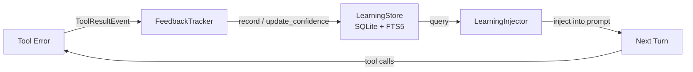

# Playbook 09: Adaptive Learning

Agents learn from tool errors across sessions. When the same error recurs, Chimera injects the proven fix into the prompt automatically.

## What This Solves

Without adaptive learning, every agent session starts from zero. If an agent discovers that `import foo` fails because the package is named `foo-python`, that knowledge evaporates when the session ends. The next session hits the same error, wastes the same tokens, and rediscovers the same fix.

Adaptive learning solves this by:

1. **Recording** observations when tool calls fail (error text, normalized signature, project scope).
2. **Tracking outcomes** -- if the error disappears within a feedback window, the fix is marked as successful; if it reappears, confidence drops.
3. **Injecting** proven fixes into the prompt at the start of each turn, so the agent avoids repeating known mistakes.

## Architecture



The loop is closed: errors flow into the store, and the injector pulls relevant observations back out before the model sees the next prompt.

## Setup

### Step 1: Create a LearningStore

```python
from chimera.learning.store import LearningStore

# Default path: ~/.chimera/learning/observations.db
store = LearningStore()

# Or specify a project-local database
store = LearningStore(db_path="./chimera-learning.db")
```

The store creates the SQLite database, enables WAL mode, and builds the FTS5 index on first use.

### Step 2: Create the FeedbackTracker and LearningInjector

```python
from chimera.learning.feedback import FeedbackTracker
from chimera.learning.injector import LearningInjector

tracker = FeedbackTracker(store, window_size=3)
injector = LearningInjector(store, max_injections=3)
```

### Step 3: Wire into LoopConfig

```python
from chimera.core.loop_config import LoopConfig

config = LoopConfig(
    learning=store,
    feedback_tracker=tracker,
    learning_injector=injector,
)
```

### Step 4: Run the Agent

```python
from chimera.core.agent import Agent
from chimera.core.loop import ReAct
from chimera.providers.factory import create_provider

provider = create_provider("glm-5")
loop = ReAct(max_steps=30, config=config)
agent = Agent(provider=provider, loop=loop)
result = agent.run("Fix the failing import in utils.py")
```

On every tool result, `FeedbackTracker.on_tool_result()` is called by the tool executor. On every turn start, `LearningInjector.get_injections()` is called by the ReAct loop.

## How It Works

### Observations

An `Observation` is a single learned fact:

| Field | Type | Default | Description |
|-------|------|---------|-------------|
| `topic` | `str` | -- | High-level topic (e.g. `"error"`, `"import_error"`) |
| `key` | `str` | -- | Specific key within the topic |
| `value` | `str` | -- | The learned fix / pattern / insight |
| `category` | `ObservationCategory` | -- | One of: `ERROR`, `DEBUG`, `DESIGN`, `REVIEW`, `EFFECTIVENESS` |
| `confidence` | `float` | `0.5` | Score in [0.0, 1.0] |
| `tags` | `list[str]` | `[]` | Free-form tags for filtering |
| `source` | `str` | `""` | Where this observation originated |
| `project_path` | `str` | `""` | Scoped to a specific project directory |
| `error_signature` | `str` | `""` | MD5 of normalized error message (dedup key) |
| `observation_count` | `int` | `1` | Number of times observed |
| `success_count` | `int` | `0` | Successful fix applications |
| `failure_count` | `int` | `0` | Failed fix applications |
| `id` | `int \| None` | `None` | Database primary key (set after recording) |

### Observation Categories and Confidence Thresholds

Each category has a minimum confidence threshold. Observations below their threshold are not injected into the prompt:

| Category | Threshold | When Used |
|----------|-----------|-----------|
| `ERROR` | 0.50 | Tool errors, import failures, runtime exceptions |
| `DEBUG` | 0.60 | Debugging patterns and investigation strategies |
| `DESIGN` | 0.70 | Architectural patterns, design decisions |
| `REVIEW` | 0.70 | Code review findings, style rules |
| `EFFECTIVENESS` | 0.50 | Tool usage patterns, workflow optimizations |

### Asymmetric Confidence Updates

`LearningStore.update_confidence()` applies asymmetric deltas:

- **Success:** `+0.10` -- slow climb, requiring multiple confirmations.
- **Failure:** `-0.15` -- faster decay, so bad advice drops below threshold quickly.
- **Clamped** to `[0.0, 1.0]`.

New observations start at `confidence=0.5`. An `ERROR` observation (threshold 0.50) is injected immediately after its first recording. A `DESIGN` observation (threshold 0.70) needs at least two consecutive successes before it reaches 0.70 and gets injected.

### Feedback Window

`FeedbackTracker` monitors a window of `window_size` (default: 3) tool calls after each error:

1. A tool call fails with error text `E`. The tracker computes `error_signature = MD5(normalize(E))`.
2. If the signature is already in the store, the tracker opens a feedback window tracking that observation ID.
3. If it is new, the tracker records an `Observation` with `category=ERROR` and `confidence=0.5`, then opens a feedback window.
4. For the next `window_size` tool results:
   - If the same `error_signature` reappears, the window is marked `seen_again=True`.
5. When the window expires:
   - `seen_again=True`: `update_confidence(observation_id, success=False)` -- confidence drops by 0.15.
   - `seen_again=False`: `update_confidence(observation_id, success=True)` -- confidence rises by 0.10.

### Error Signature Normalization

Before computing the MD5, `_normalize_error()` strips volatile tokens:

- Hex addresses (`0x7fff5fbff8c0` -> `<addr>`)
- Line numbers (`:42:` -> `:<line>:`, `line 42` -> `line <N>`)
- Timestamps (`2026-03-25T14:30:00` -> `<time>`)
- Extra whitespace collapsed

This ensures the same logical error produces the same signature across runs.

### FTS5 Full-Text Search

The store uses SQLite FTS5 for fast retrieval. The `observations_fts` virtual table indexes `topic`, `key`, `value`, and `tags`. Triggers keep the FTS index in sync on INSERT, UPDATE, and DELETE.

`LearningStore.query()` ranks results by `(fts.rank * -1) * o.confidence DESC`, meaning FTS relevance is multiplied by confidence -- high-confidence observations about the current topic float to the top.

### Learning Injector Context Extraction

`LearningInjector._extract_context()` builds an FTS5 query from the last 5 conversation messages:

1. Takes the first 200 characters of each message.
2. Tokenizes to alphanumeric words (including underscores).
3. Drops common English stop words and tokens shorter than 2 characters.
4. Deduplicates while preserving order.
5. Joins the first 10 significant tokens with `OR` for an FTS5 query.

### Project Scoping

Observations can be scoped to a specific `project_path`. When `LearningInjector.get_injections()` is called with a `project_path`, queries are filtered to that project. This prevents cross-project contamination -- a fix that works for project A is not blindly injected into project B.

### Pruning

`LearningStore.prune(max_age_days=90, min_confidence=0.1)` removes observations that are both old (older than `max_age_days`) and low-confidence (below `min_confidence`). Returns the number of observations removed.

## Configuration Reference

### LearningStore

| Parameter | Type | Default | Description |
|-----------|------|---------|-------------|
| `db_path` | `str \| Path \| None` | `~/.chimera/learning/observations.db` | Path to SQLite database file |

### FeedbackTracker

| Parameter | Type | Default | Description |
|-----------|------|---------|-------------|
| `store` | `LearningStore` | -- | The learning store to record and update observations |
| `window_size` | `int` | `3` | Number of subsequent tool results to monitor after an error |

### LearningInjector

| Parameter | Type | Default | Description |
|-----------|------|---------|-------------|
| `store` | `LearningStore` | -- | The learning store to query |
| `max_injections` | `int` | `3` | Maximum observations injected per turn |

### LoopConfig Fields

| Field | Type | Description |
|-------|------|-------------|
| `learning` | `LearningStore \| None` | The backing store (currently informational; tracker and injector hold their own references) |
| `feedback_tracker` | `FeedbackTracker \| None` | Called by the tool executor on every `ToolResultEvent` |
| `learning_injector` | `LearningInjector \| None` | Called by the ReAct loop at the start of each turn |

### SessionMetrics

| Field | Type | Default | Description |
|-------|------|---------|-------------|
| `session_id` | `str` | -- | Unique session identifier |
| `start_time` | `str` | Current UTC ISO 8601 | When the session began |
| `tool_calls` | `int` | `0` | Total tool invocations |
| `files_modified` | `int` | `0` | Unique files modified |
| `errors_encountered` | `int` | `0` | Total errors seen |
| `errors_resolved` | `int` | `0` | Errors subsequently resolved |
| `observations_recorded` | `int` | `0` | New observations added |
| `total_cost` | `float` | `0.0` | Accumulated API cost |

## Verification

### Manual: Record and Query

```python
from chimera.learning.store import LearningStore
from chimera.learning.observation import Observation, ObservationCategory

store = LearningStore(db_path="/tmp/test-learning.db")

# Record an observation
obs = Observation(
    topic="import_error",
    key="missing_package",
    value="Install foo-python, not foo",
    category=ObservationCategory.ERROR,
    confidence=0.5,
    error_signature="abc123",
    project_path="/home/user/myproject",
)
store.record(obs)

# Query by full-text search
results = store.query("import foo", project_path="/home/user/myproject")
assert len(results) == 1
assert results[0].value == "Install foo-python, not foo"

# Update confidence after a successful fix
new_conf = store.update_confidence(results[0].id, success=True)
assert new_conf == 0.6  # 0.5 + 0.10

store.close()
```

### Manual: Feedback Window

```python
from chimera.learning.store import LearningStore
from chimera.learning.feedback import FeedbackTracker
from chimera.events.types import ToolResultEvent

store = LearningStore(db_path="/tmp/test-feedback.db")
tracker = FeedbackTracker(store, window_size=2)

# Simulate an error
error_event = ToolResultEvent(
    call_id="c1", output="ModuleNotFoundError: No module named 'foo'",
    success=False, tool_metadata={},
)
tracker.on_tool_result(error_event)

# Simulate two successful tool calls (error does not recur)
ok_event = ToolResultEvent(
    call_id="c2", output="OK", success=True, tool_metadata={},
)
tracker.on_tool_result(ok_event)
tracker.on_tool_result(ok_event)

# The observation's confidence should have increased (0.5 + 0.10 = 0.6)
results = store.query("ModuleNotFoundError foo")
assert results[0].confidence == 0.6

store.close()
```

### Metrics Collector

```python
from chimera.learning.metrics import MetricsCollector, SessionMetrics

collector = MetricsCollector()
collector.start_session("session-001")

# Simulate tool call events
from chimera.events.types import ToolCallEvent, ToolResultEvent, StepCostEvent

collector.on_tool_call(ToolCallEvent(
    tool_name="bash", arguments={"command": "pytest"}
))
collector.on_tool_result(ToolResultEvent(
    call_id="c1", output="FAILED", success=False, tool_metadata={},
))
collector.on_step_cost(StepCostEvent(cost=0.003))

m = collector.metrics
assert m.tool_calls == 1
assert m.errors_encountered == 1
assert m.total_cost == 0.003
```

## Recipe

### Module Inventory

| Module | Path | Key Classes |
|--------|------|-------------|
| Observation | `chimera/learning/observation.py` | `Observation`, `ObservationCategory`, `CATEGORY_THRESHOLDS` |
| Store | `chimera/learning/store.py` | `LearningStore` |
| Feedback | `chimera/learning/feedback.py` | `FeedbackTracker` |
| Injector | `chimera/learning/injector.py` | `LearningInjector` |
| Metrics | `chimera/learning/metrics.py` | `SessionMetrics`, `MetricsCollector` |
| LoopConfig | `chimera/core/loop_config.py` | `LoopConfig` (fields: `learning`, `feedback_tracker`, `learning_injector`) |
| Tool Executor | `chimera/core/tool_executor.py` | Calls `config.feedback_tracker.on_tool_result()` after each tool execution |
| ReAct Loop | `chimera/core/loop.py` | Calls `config.learning_injector.get_injections()` at the start of each turn |

### Method Signatures

```python
# LearningStore
LearningStore(db_path: str | Path | None = None)
LearningStore.record(observation: Observation) -> None
LearningStore.query(
    text: str,
    *,
    category: ObservationCategory | None = None,
    project_path: str | None = None,
    min_confidence: float | None = None,
    limit: int = 5,
) -> list[Observation]
LearningStore.query_by_signature(error_signature: str) -> Observation | None
LearningStore.update_confidence(observation_id: int, success: bool) -> float
LearningStore.prune(max_age_days: int = 90, min_confidence: float = 0.1) -> int
LearningStore.close() -> None

# FeedbackTracker
FeedbackTracker(store: LearningStore, window_size: int = 3)
FeedbackTracker.on_tool_result(event: Event) -> None

# LearningInjector
LearningInjector(store: LearningStore, max_injections: int = 3)
LearningInjector.get_injections(
    context: list[Message],
    project_path: str = "",
) -> list[str]

# MetricsCollector
MetricsCollector(store: LearningStore | None = None)
MetricsCollector.start_session(session_id: str) -> None
MetricsCollector.on_tool_call(event: Event) -> None
MetricsCollector.on_tool_result(event: Event) -> None
MetricsCollector.on_step_cost(event: Event) -> None
MetricsCollector.metrics -> SessionMetrics
```

### Injection Format

When the injector finds a relevant observation above its category threshold, it formats it as:

```
[Learned/error] import_error: Install foo-python, not foo (confidence: 60%)
```

This string is added as a `Message.user(...)` at the start of the turn, before the model sees the conversation.

### Database Schema

The SQLite database has two tables:

- `observations` -- main table with UNIQUE constraint on `error_signature` (ON CONFLICT REPLACE).
- `observations_fts` -- FTS5 virtual table indexing `topic`, `key`, `value`, `tags` with triggers for insert/update/delete sync.

WAL mode is enabled for concurrent read access. Foreign keys are enforced.
