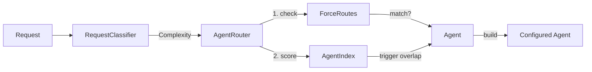

# Playbook 10: Smart Dispatch

Automatically select the right agent for each request. No manual agent naming -- just describe what you need and the dispatcher picks the best match.

## What This Solves

When you have multiple agents (build, review, explore, plan, etc.), you have to know which one to call. The user says "debug this test" -- is that the investigator agent? The tester? The general agent? With smart dispatch, a `Dispatcher` classifies the request complexity, matches it against agent triggers, and returns a fully configured `Agent` ready to run.

Dispatch is deterministic and fast. Classification uses pure heuristics (no LLM call). Routing uses an inverted keyword index with O(1) lookups. Force-routes override everything for known patterns.

## Architecture



Routing flow:

1. **Force-routes** are checked first. If any regex pattern matches the request, that agent is selected with `score=1.0`. Done.
2. If no force-route matches, the router builds a keyword set from the request and looks up the **AgentIndex**.
3. For each agent, the index counts keyword overlap with the agent's trigger list. Score = `overlap_count / len(agent_triggers)`.
4. Results are sorted by score descending. The top result is used.

## Setup

### Step 1: Create an AgentRegistry with Agents

```python
from chimera.agents.config import AgentConfig
from chimera.agents.registry import AgentRegistry

registry = AgentRegistry()

# Register agents with triggers
build_agent = AgentConfig(
    name="build",
    description="Build and implement features",
    system_prompt="You are a build agent...",
    tools=["read_file", "write_file", "edit_file", "bash"],
    triggers=["build", "implement", "create", "feature", "add"],
)
registry.register(build_agent.name, build_agent)

review_agent = AgentConfig(
    name="review",
    description="Review code for quality and security",
    system_prompt="You are a code review agent...",
    tools=["read_file", "search"],
    triggers=["review", "check", "audit", "security", "quality"],
)
registry.register(review_agent.name, review_agent)

debug_agent = AgentConfig(
    name="debug",
    description="Debug failing tests and investigate errors",
    system_prompt="You are a debug agent...",
    tools=["read_file", "bash", "search"],
    triggers=["debug", "test", "failing", "error", "investigate", "fix"],
)
registry.register(debug_agent.name, debug_agent)
```

### Step 2: Create a Dispatcher

```python
from chimera.agents.dispatch.dispatcher import Dispatcher
from chimera.providers.factory import create_provider

provider = create_provider("glm-5")
dispatcher = Dispatcher(registry)
```

### Step 3: Dispatch a Request

```python
agent = dispatcher.dispatch("debug this failing test", provider)
result = agent.run("debug this failing test")
# The dispatcher selected the 'debug' agent based on trigger overlap
```

## How It Works

### Complexity Classification

`RequestClassifier.classify()` is a pure heuristic classifier -- no LLM call. It returns one of four levels:

| Level | Rule |
|-------|------|
| `TRIVIAL` | Fewer than 10 words AND ends with `?` |
| `SIMPLE` | 0-1 complex signals AND fewer than 30 words |
| `MODERATE` | 1-2 complex signals OR any multi-step signal |
| `COMPLEX` | 2+ complex signals, OR (1+ complex signal AND multi-step), OR (50+ words AND multi-step) |

**Complex signals** (checked as whole words):

```
implement, create, build, refactor, review, debug,
migrate, redesign, architect, integrate
```

**Multi-step signals** (checked as substrings):

```
and also, then, first, after that, finally,
step 1, step 2, both, across, , and
```

Examples:

- `"what does this function do?"` -- TRIVIAL (7 words, ends with `?`)
- `"fix the typo in README"` -- SIMPLE (5 words, 0 complex signals)
- `"refactor the auth module"` -- MODERATE (1 complex signal: `refactor`)
- `"implement OAuth and also migrate the database"` -- COMPLEX (2 complex signals + multi-step)

### Trigger Matching

Each `AgentConfig` has a `triggers` field -- a list of keywords that describe what the agent handles. When the `AgentIndex` is built, it creates an inverted index mapping each trigger keyword to the agents that claim it.

At routing time:

1. The request is lowercased and split into keywords via `re.findall(r"[a-z]+", ...)`.
2. For each agent, the index counts how many of the request keywords appear in the agent's trigger list.
3. Score = `hit_count / total_trigger_count` for each agent. Zero overlap means exclusion.
4. Results are sorted by score descending.

If an agent has no explicit `triggers`, the index falls back to extracting keywords (3+ characters) from the agent's `description`.

### Force Routes

A `ForceRoute` is a deterministic override. Its `pattern` is a regex matched case-insensitively against the request text. If it matches, the named agent is returned with `score=1.0`, skipping all trigger scoring.

```python
from chimera.agents.dispatch.rules import ForceRoute

force_routes = [
    ForceRoute(
        pattern=r"security\s+(audit|scan|review)",
        agent_name="review",
        reason="Security-related requests always go to the review agent",
    ),
    ForceRoute(
        pattern=r"^fix\s+ci\b",
        agent_name="build",
        reason="CI fix requests go to the build agent",
    ),
]

dispatcher = Dispatcher(registry, force_routes=force_routes)
```

Force-routes are evaluated in order. The first match wins.

### Route Rules

A `RouteRule` is a soft routing rule with a weight:

| Field | Type | Default | Description |
|-------|------|---------|-------------|
| `pattern` | `str` | -- | Regex pattern matched against request text |
| `agent_name` | `str` | -- | Registry name of the agent this rule favours |
| `weight` | `float` | `1.0` | Weight multiplier for this rule's score contribution |

### AgentIndex

`AgentIndex` pre-computes a keyword-to-agent inverted index for O(1) lookups. It is built automatically when a `Dispatcher` or `AgentRouter` is constructed.

The index can be serialized to JSON for caching:

```python
from pathlib import Path
from chimera.agents.dispatch.index import AgentIndex

index = AgentIndex(registry)
index.build()

# Save to disk
index.save(Path("agent-index.json"))

# Load from disk later
loaded_index = AgentIndex.load(Path("agent-index.json"), registry)
```

The `agent_triggers` property returns a read-only `dict[str, list[str]]` mapping agent names to their trigger keywords.

### RouteResult

When the router returns matches, each is a `RouteResult` dataclass:

| Field | Type | Description |
|-------|------|-------------|
| `agent_config` | `AgentConfig` | The matched agent configuration |
| `score` | `float` | Match score from 0.0 to 1.0 |
| `reason` | `str` | Human-readable explanation of the selection |
| `complexity` | `Complexity` | Classified complexity of the request |

### Explain Without Executing

`Dispatcher.explain()` returns a human-readable routing explanation without building an agent:

```python
explanation = dispatcher.explain("refactor the auth module")
# "Complexity: MODERATE | Agent: build | Score: 0.40 | Reason: Trigger match score 0.40 for agent 'build'"

explanation = dispatcher.explain("what is this?")
# "Complexity: TRIVIAL | Agent: none | Score: 0.00 | Reason: no matching agent"
```

## Configuration Reference

### Dispatcher

| Parameter | Type | Default | Description |
|-----------|------|---------|-------------|
| `registry` | `AgentRegistry` | -- | The agent registry to resolve agent configs |
| `force_routes` | `list[ForceRoute] \| None` | `None` | Deterministic routing overrides |
| `learning_store` | `Any \| None` | `None` | Optional learning store for logging dispatch decisions |

### ForceRoute

| Field | Type | Description |
|-------|------|-------------|
| `pattern` | `str` | Regex pattern matched against request text (case-insensitive) |
| `agent_name` | `str` | Registry name of the agent to force-select |
| `reason` | `str` | Human-readable explanation |

### AgentConfig.triggers

| Field | Type | Default | Description |
|-------|------|---------|-------------|
| `triggers` | `list[str]` | `[]` | Keywords that describe what this agent handles; used by the dispatch index |

### Complexity Enum

| Value | String |
|-------|--------|
| `Complexity.TRIVIAL` | `"trivial"` |
| `Complexity.SIMPLE` | `"simple"` |
| `Complexity.MODERATE` | `"moderate"` |
| `Complexity.COMPLEX` | `"complex"` |

## Verification

### Classify a Request

```python
from chimera.agents.dispatch.classifier import RequestClassifier, Complexity

classifier = RequestClassifier()

assert classifier.classify("what does this do?") == Complexity.TRIVIAL
assert classifier.classify("fix the typo") == Complexity.SIMPLE
assert classifier.classify("refactor the auth module") == Complexity.MODERATE
assert classifier.classify(
    "implement OAuth and also migrate the database"
) == Complexity.COMPLEX
```

### Dispatch and Explain

```python
from chimera.agents.config import AgentConfig
from chimera.agents.registry import AgentRegistry
from chimera.agents.dispatch.dispatcher import Dispatcher
from chimera.agents.dispatch.rules import ForceRoute

registry = AgentRegistry()
registry.register("build", AgentConfig(
    name="build",
    description="Build features",
    system_prompt="You build things.",
    tools=["read_file", "write_file", "bash"],
    triggers=["build", "implement", "create"],
))
registry.register("review", AgentConfig(
    name="review",
    description="Review code",
    system_prompt="You review code.",
    tools=["read_file", "search"],
    triggers=["review", "audit", "security"],
))

dispatcher = Dispatcher(
    registry,
    force_routes=[
        ForceRoute(
            pattern=r"security scan",
            agent_name="review",
            reason="Security scans always go to review",
        ),
    ],
)

# Explain routing (no agent built)
print(dispatcher.explain("implement a new feature"))
# Complexity: MODERATE | Agent: build | Score: 0.33 | Reason: Trigger match score 0.33 for agent 'build'

print(dispatcher.explain("security scan the auth module"))
# Complexity: MODERATE | Agent: review | Score: 1.00 | Reason: Security scans always go to review
```

### Build and Save an AgentIndex

```python
from pathlib import Path
from chimera.agents.dispatch.index import AgentIndex

index = AgentIndex(registry)
index.build()

# Inspect triggers
print(index.agent_triggers)
# {'build': ['build', 'implement', 'create'], 'review': ['review', 'audit', 'security']}

# Lookup
matches = index.lookup(["implement", "new", "feature"])
print(matches)
# [('build', 0.333...)]

# Save and reload
index.save(Path("/tmp/agent-index.json"))
loaded = AgentIndex.load(Path("/tmp/agent-index.json"), registry)
assert loaded.agent_triggers == index.agent_triggers
```

## Recipe

### Module Inventory

| Module | Path | Key Classes / Functions |
|--------|------|------------------------|
| Classifier | `chimera/agents/dispatch/classifier.py` | `RequestClassifier`, `Complexity`, `COMPLEX_SIGNALS`, `MULTI_STEP_SIGNALS` |
| Router | `chimera/agents/dispatch/router.py` | `AgentRouter`, `RouteResult` |
| Rules | `chimera/agents/dispatch/rules.py` | `ForceRoute`, `RouteRule` |
| Index | `chimera/agents/dispatch/index.py` | `AgentIndex` |
| Dispatcher | `chimera/agents/dispatch/dispatcher.py` | `Dispatcher` |
| Config | `chimera/agents/config.py` | `AgentConfig` (has `triggers` field) |
| Registry | `chimera/agents/registry.py` | `AgentRegistry` |

### Method Signatures

```python
# RequestClassifier
RequestClassifier.classify(request: str) -> Complexity

# AgentRouter
AgentRouter(
    registry: AgentRegistry,
    force_routes: list[ForceRoute] | None = None,
    index: AgentIndex | None = None,
)
AgentRouter.route(request: str) -> list[RouteResult]

# AgentIndex
AgentIndex(registry: AgentRegistry)
AgentIndex.build() -> None
AgentIndex.lookup(keywords: list[str]) -> list[tuple[str, float]]
AgentIndex.save(path: Path) -> None
AgentIndex.load(path: Path, registry: AgentRegistry) -> AgentIndex  # classmethod
AgentIndex.agent_triggers -> dict[str, list[str]]  # property

# ForceRoute
ForceRoute(pattern: str, agent_name: str, reason: str)
ForceRoute.matches(request: str) -> bool

# RouteRule
RouteRule(pattern: str, agent_name: str, weight: float = 1.0)

# Dispatcher
Dispatcher(
    registry: AgentRegistry,
    force_routes: list[ForceRoute] | None = None,
    learning_store: Any | None = None,
)
Dispatcher.dispatch(
    request: str,
    provider: Provider,
    **agent_kwargs: Any,
) -> Agent
Dispatcher.explain(request: str) -> str
```

### Routing Flow Summary

1. `Dispatcher.dispatch(request, provider)` calls `RequestClassifier.classify(request)`.
2. `AgentRouter.route(request)` checks force-routes first (regex match, case-insensitive).
3. If no force-route matches, the router extracts keywords and calls `AgentIndex.lookup(keywords)`.
4. The index computes `score = hit_count / total_triggers` per agent, excludes zero-overlap agents, sorts descending.
5. The dispatcher takes the top `RouteResult`, calls `AgentConfig.build(provider)`, and returns the agent.
6. If no agent matches, `ValueError` is raised.
