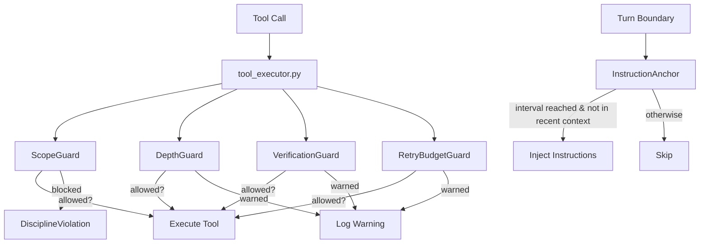

# Playbook 11: Workflow Discipline

Structural constraints that keep agents focused: phase gates enforce workflow order, scope guards detect drift, depth guards prevent rabbit holes, retry budgets force new approaches, and instruction anchors combat context degradation.

## What This Solves

Without discipline constraints, agents exhibit four failure modes:

1. **Drift.** The agent modifies files outside the task scope, introducing unrelated changes.
2. **Rabbit holes.** The agent reads dozens of files without committing to an approach, burning context.
3. **Cargo-cult retries.** The agent applies the same failing edit repeatedly, never trying a different strategy.
4. **Forgotten instructions.** After compaction or long conversations, the agent loses track of key constraints it was given at the start.

The discipline subsystem addresses all four with fast, deterministic guards (no LLM calls) checked before every tool execution, plus an instruction anchor that periodically re-injects key instructions into the conversation.

## Architecture



Guards are checked in `tool_executor.py` before every tool execution. The `InstructionAnchor` is checked in `loop.py` at the start of each turn.

## Setup

### Basic: LoopConfig with Pre-built Pattern

```python
from chimera.core.loop_config import LoopConfig
from chimera.discipline.patterns import STRICT

config = LoopConfig(discipline=STRICT)
```

`STRICT` includes all four guards: `ScopeGuard()`, `VerificationGuard()`, `RetryBudgetGuard(max_retries=3)`, `DepthGuard(max_depth=10)`.

### With Instruction Anchor

```python
from chimera.core.loop_config import LoopConfig
from chimera.discipline.anchor import InstructionAnchor
from chimera.discipline.patterns import STRICT

anchor = InstructionAnchor(
    instructions=[
        "You MUST run pytest before declaring done.",
        "Only modify files in chimera/core/.",
        "Do NOT refactor unrelated code.",
    ],
    interval=10,  # re-inject every 10 turns
)

config = LoopConfig(
    discipline=STRICT,
    instruction_anchor=anchor,
)
```

## How It Works

### Guards

All guards implement the `DisciplineGuard` ABC with a single method:

```python
def check(self, action: str, context: dict[str, Any]) -> GuardResult
```

`GuardResult` has three fields:

| Field | Type | Description |
|-------|------|-------------|
| `allowed` | `bool` | Whether the action is permitted |
| `reason` | `str` | Explanation when not allowed (empty when allowed) |
| `severity` | `str` | `"warning"` (log only) or `"block"` (raise `DisciplineViolation`) |

Guards are advisory by default (`severity="warning"`). Only `severity="block"` raises `DisciplineViolation`.

#### ScopeGuard

Flags write/edit operations to files not in the task scope.

```python
from chimera.discipline.guard import ScopeGuard

guard = ScopeGuard(
    task_files={"chimera/core/loop.py", "chimera/core/agent.py"},
    severity="warning",  # default; use "block" to hard-stop
)
```

- Checks `write_file`, `edit_file`, `replace_in_file`, `bash` actions only.
- If `task_files` is `None`, the guard always allows (nothing to check).
- Reads the `file_path` key from the context dict.

#### DepthGuard

Limits consecutive read/search operations without a write. Prevents rabbit-hole exploration.

```python
from chimera.discipline.guard import DepthGuard

guard = DepthGuard(max_depth=10)  # default
```

- Counts consecutive `read_file`, `grep`, `glob`, `search`, `list_files`, `repo_map` operations.
- Resets counter on any `write_file`, `edit_file`, `replace_in_file`, `bash` operation.
- After `max_depth` consecutive reads, returns a warning suggesting the agent commit to an approach.

#### VerificationGuard

Requires at least one test execution before completion.

```python
from chimera.discipline.guard import VerificationGuard

guard = VerificationGuard()
```

- Tracks whether a `bash` action with a test-related command (`pytest`, `test`, `unittest`, `nose`) has been executed.
- When the agent signals `done`, returns a warning if no test execution was detected.

#### RetryBudgetGuard

Limits retry attempts on the same approach by tracking edit signatures.

```python
from chimera.discipline.guard import RetryBudgetGuard

guard = RetryBudgetGuard(max_retries=3)  # default
```

- Hashes `file_path` + `change` context to create a signature for each edit.
- After `max_retries` similar edits to the same file, warns the agent to try a different approach.
- Only tracks `edit_file`, `write_file`, `replace_in_file` actions.

### InstructionAnchor

Re-injects instructions every N turns to combat context drift. Compaction-aware: checks if the marker `--- INSTRUCTION ANCHOR ---` is present in the last 5 messages before injecting, avoiding duplicates.

```python
from chimera.discipline.anchor import InstructionAnchor

anchor = InstructionAnchor(
    instructions=["Always run tests.", "Do not modify setup.py."],
    interval=10,  # check every 10 turns (default)
)
```

Key methods:

- `should_inject(turn_count, context)` -- returns `True` if `turn_count % interval == 0` AND the marker is not found in the last 5 messages.
- `get_injection()` -- returns the marker header followed by newline-joined instructions.

The anchor is wired into `loop.py` at the top of each turn: if `config.instruction_anchor` is set and `should_inject()` returns `True`, the injection is added as a user message to the conversation context.

### PhasedWorkflow

Executes ordered phases with gate enforcement. Each phase has a goal, steps, and a completion gate (a callable returning `True`/`False`).

```python
from chimera.discipline.phase import Gate, Phase, PhasedWorkflow
```

The flow for each phase:

1. Run the agent with the phase goal as a task prefix.
2. Check the gate. If it passes, advance to the next phase.
3. If the gate fails, retry up to `max_retries` (default 2) with failure context in the prompt.
4. If retries are exhausted, return `AgentResult(success=False, error=...)`.

Properties:

- `current_phase` -- the phase currently being executed, or `None` if finished.
- `completed_phases` -- list of phases that have passed their gates.

### Pre-built Patterns

Patterns are lists of guards that can be composed by concatenation.

| Pattern | Guards | Description |
|---------|--------|-------------|
| `SCOPE_ONLY` | `ScopeGuard()` | Only scope checking |
| `VERIFY_FIRST` | `VerificationGuard()` | Only test verification |
| `BOUNDED_RETRY` | `RetryBudgetGuard(max_retries=3)` | Only retry limiting |
| `BOUNDED_EXPLORATION` | `DepthGuard(max_depth=10)` | Only depth limiting |
| `STRICT` | All four guards | Scope + verification + retry + depth |

Compose freely by concatenating lists:

```python
from chimera.discipline.patterns import SCOPE_ONLY, VERIFY_FIRST

my_guards = SCOPE_ONLY + VERIFY_FIRST
```

### Wiring

**Guards in tool_executor.py:** Before every tool execution, the executor iterates `config.discipline` (a `list[DisciplineGuard]` on `LoopConfig`). Each guard receives the tool name and a context dict with `file_path` (from the tool's `path` argument) and `arguments`. If `severity="block"`, raises `DisciplineViolation`. If `severity="warning"`, the result is logged but execution continues.

**Anchor in loop.py:** At the start of each turn, if `config.instruction_anchor` is set, the loop calls `anchor.should_inject(steps, context.to_messages())`. If `True`, it adds the injection as a user message via `context.add(Message.user(anchor.get_injection()))`.

## Examples

### Basic: STRICT Pattern with Agent

```python
from chimera.core.agent import Agent
from chimera.core.loop import ReAct
from chimera.core.loop_config import LoopConfig
from chimera.discipline.patterns import STRICT
from chimera.providers.factory import create_provider

provider = create_provider("glm-5")
config = LoopConfig(discipline=STRICT)
loop = ReAct(max_steps=50, config=config)
agent = Agent(provider=provider, loop=loop)

result = agent.run("Fix the failing test in chimera/core/loop.py")
```

### PhasedWorkflow: Plan, Implement, Verify

```python
import subprocess
from chimera.core.agent import Agent
from chimera.discipline.phase import Gate, Phase, PhasedWorkflow
from chimera.providers.factory import create_provider

provider = create_provider("glm-5")
agent = Agent(provider=provider)


def tests_pass() -> bool:
    result = subprocess.run(
        ["python", "-m", "pytest", "--tb=short", "-q"],
        capture_output=True,
    )
    return result.returncode == 0


workflow = PhasedWorkflow(
    phases=[
        Phase(
            number=1,
            name="understand",
            goal="Read the failing test and related source files. Do NOT modify any files.",
            read_only=True,
            gate=Gate(
                name="files_read",
                check=lambda: True,  # advisory: no hard gate
                description="Agent has read the relevant files",
            ),
        ),
        Phase(
            number=2,
            name="implement",
            goal="Fix the bug. Make minimal changes.",
            gate=Gate(
                name="tests_pass",
                check=tests_pass,
                description="All tests pass",
            ),
        ),
        Phase(
            number=3,
            name="verify",
            goal="Run the full test suite and confirm no regressions.",
            gate=Gate(
                name="full_suite",
                check=tests_pass,
                description="Full test suite passes",
            ),
        ),
    ],
    max_retries=2,
)

result = workflow.run(agent, "Fix the off-by-one error in parse_range()", env=None)
print(f"Success: {result.success}, Steps: {result.steps}, Cost: ${result.cost:.4f}")
```

### Custom Guard

```python
from typing import Any
from chimera.discipline.guard import DisciplineGuard, GuardResult


class NoNewFilesGuard(DisciplineGuard):
    """Block creation of new files -- only allow edits to existing ones."""

    name = "no_new_files"

    def __init__(self, existing_files: set[str]) -> None:
        self._existing = existing_files

    def check(self, action: str, context: dict[str, Any]) -> GuardResult:
        if action != "write_file":
            return GuardResult(allowed=True)

        file_path = context.get("file_path", "")
        if file_path in self._existing:
            return GuardResult(allowed=True)

        return GuardResult(
            allowed=False,
            reason=f"New file '{file_path}' not allowed; only edits to existing files",
            severity="block",
        )
```

Use it with other guards:

```python
from chimera.core.loop_config import LoopConfig
from chimera.discipline.patterns import VERIFY_FIRST

config = LoopConfig(
    discipline=VERIFY_FIRST + [NoNewFilesGuard(existing_files={"src/main.py", "src/utils.py"})],
)
```

### InstructionAnchor Usage

```python
from chimera.core.agent import Agent
from chimera.core.loop import ReAct
from chimera.core.loop_config import LoopConfig
from chimera.discipline.anchor import InstructionAnchor
from chimera.providers.factory import create_provider

anchor = InstructionAnchor(
    instructions=[
        "CONSTRAINT: Do not modify any file outside chimera/core/.",
        "CONSTRAINT: Run pytest after every edit.",
        "CONSTRAINT: Keep changes under 50 lines total.",
    ],
    interval=10,
)

provider = create_provider("glm-5")
config = LoopConfig(instruction_anchor=anchor)
loop = ReAct(max_steps=80, config=config)
agent = Agent(provider=provider, loop=loop)

result = agent.run("Refactor the context manager in chimera/core/context.py")
```

The anchor will re-inject those three constraints at turns 10, 20, 30, etc., but only if the marker is not already present in the last 5 messages (avoiding duplicates after compaction).

## Recipe

### Module Paths

| Component | Module |
|-----------|--------|
| `DisciplineGuard` ABC | `chimera/discipline/guard.py` |
| `GuardResult` | `chimera/discipline/guard.py` |
| `DisciplineViolation` | `chimera/discipline/guard.py` |
| `ScopeGuard` | `chimera/discipline/guard.py` |
| `DepthGuard` | `chimera/discipline/guard.py` |
| `VerificationGuard` | `chimera/discipline/guard.py` |
| `RetryBudgetGuard` | `chimera/discipline/guard.py` |
| `InstructionAnchor` | `chimera/discipline/anchor.py` |
| `Gate` | `chimera/discipline/phase.py` |
| `Phase` | `chimera/discipline/phase.py` |
| `PhasedWorkflow` | `chimera/discipline/phase.py` |
| Pre-built patterns | `chimera/discipline/patterns.py` |
| `LoopConfig.discipline` | `chimera/core/loop_config.py` |
| `LoopConfig.instruction_anchor` | `chimera/core/loop_config.py` |
| Guard wiring | `chimera/core/tool_executor.py` |
| Anchor wiring | `chimera/core/loop.py` |

### Re-exports

Everything is re-exported from `chimera/discipline/__init__.py`: `Gate`, `Phase`, `PhasedWorkflow`, `DisciplineGuard`, `DisciplineViolation`, `DepthGuard`, `GuardResult`, `RetryBudgetGuard`, `ScopeGuard`, `VerificationGuard`, `InstructionAnchor`, `DisciplinePattern`, `BOUNDED_EXPLORATION`, `BOUNDED_RETRY`, `SCOPE_ONLY`, `STRICT`, `VERIFY_FIRST`.

### Internal Constants

- `_READ_ACTIONS`: `read_file`, `grep`, `glob`, `search`, `list_files`, `repo_map`
- `_WRITE_ACTIONS`: `write_file`, `edit_file`, `replace_in_file`, `bash`
- `_MARKER`: `"--- INSTRUCTION ANCHOR ---"` (used by `InstructionAnchor` to detect duplicates)
