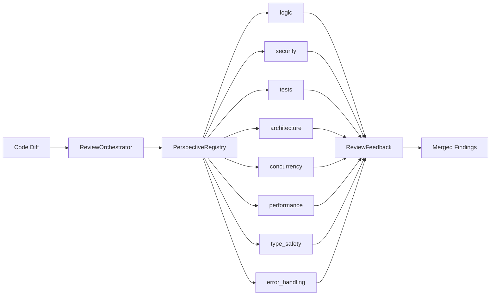
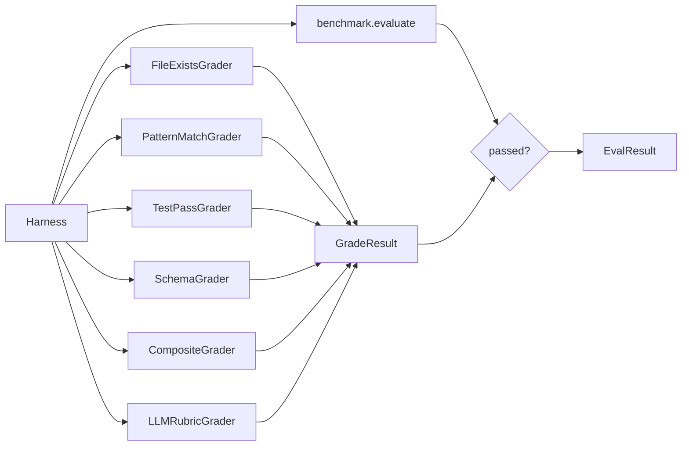

# Playbook 12: Review Perspectives and Eval Graders

Pluggable review lenses for multi-angle code review, and composable graders for evaluating agent task results beyond pass/fail.

## What This Solves

**Reviews:** A single-pass review misses entire categories of issues. A reviewer focused on logic correctness will not notice concurrency bugs, and one focused on security will skip performance problems. The perspective system lets you run the same diff through multiple focused review lenses and merge the findings.

**Evaluation:** Benchmark `evaluate()` methods return a binary pass/fail. That is not enough when you need to verify that the agent created specific files, produced output matching a pattern, left tests passing, conformed to a schema, or satisfied a rubric judged by an LLM. Graders run after the benchmark evaluator and provide structured, composable scoring.

## Architecture

### Review



### Evaluation



A task only passes if **both** the benchmark's own `evaluate()` returns `True` **and** all graders pass.

## Setup

### Review with Custom Perspectives

```python
from chimera.review.perspective import ReviewPerspective
from chimera.review.registry import PerspectiveRegistry
from chimera.review.orchestrator import ReviewOrchestrator

registry = PerspectiveRegistry()  # starts with 8 built-ins

# Add a custom perspective
registry.register(ReviewPerspective(
    name="accessibility",
    focus_area="WCAG compliance, ARIA labels, keyboard navigation, color contrast",
    prompt_template="Review this diff for accessibility issues:\n\n{diff}",
    languages=["html", "javascript", "typescript"],
))

orchestrator = ReviewOrchestrator(
    max_rounds=3,
    perspectives=["logic", "security", "accessibility"],
    registry=registry,
)
```

### Eval with Graders

```python
from chimera.eval.harness import Harness
from chimera.eval.graders.builtin import FileExistsGrader, TestPassGrader, CompositeGrader

graders = [
    CompositeGrader(
        graders=[
            FileExistsGrader(paths=["output/result.json"]),
            TestPassGrader(command="python -m pytest tests/ -q", timeout=60),
        ],
        mode="all",  # AND: both must pass
    ),
]

harness = Harness(
    benchmark=my_benchmark,
    agent=my_agent,
    graders=graders,
)
result = harness.run()
```

## How It Works

### ReviewPerspective

A focused review lens defined as a dataclass.

```python
@dataclass
class ReviewPerspective:
    name: str                                    # Short identifier
    focus_area: str                              # One-line description of what to look for
    prompt_template: str                         # Full prompt; uses {diff} placeholder
    severity_weights: dict[str, float] = {}      # Optional severity name -> weight
    languages: list[str] | None = None           # None = all languages
```

The `prompt_template` is formatted with `{diff}` replaced by the actual code diff. Each perspective produces its own review pass.

### PerspectiveRegistry

Manages registration and retrieval of perspectives. Initialized with the 8 built-in perspectives.

| Method | Signature | Description |
|--------|-----------|-------------|
| `register` | `(perspective: ReviewPerspective) -> None` | Add or override a perspective by name |
| `get` | `(name: str) -> ReviewPerspective` | Retrieve by name; raises `KeyError` if missing |
| `list` | `() -> list[str]` | Sorted list of all registered perspective names |
| `for_language` | `(language: str) -> list[ReviewPerspective]` | Return perspectives applicable to a language (case-insensitive); `languages=None` matches all |

### 8 Built-in Perspectives

| Name | Focus Area |
|------|------------|
| `logic` | Correctness: off-by-one, null handling, error paths, return types |
| `security` | Injection, auth gaps, secrets in code, unsafe deserialization |
| `tests` | Test coverage, edge cases, assertion quality, mock appropriateness |
| `architecture` | Naming, separation of concerns, dependency direction, patterns |
| `concurrency` | Race conditions, deadlocks, shared mutable state, atomic operations |
| `performance` | Algorithmic complexity, unnecessary allocations, N+1 queries, caching |
| `type_safety` | Type narrowing, Any escape hatches, missing annotations, generics |
| `error_handling` | Exception granularity, propagation, recovery paths, user messages |

All built-in perspectives have `languages=None` (apply to all languages) and empty `severity_weights`.

### ReviewOrchestrator

Manages the review-fix iteration cycle between a reviewer agent and an author agent.

```python
class ReviewOrchestrator:
    def __init__(
        self,
        max_rounds: int = 3,
        perspectives: list[str] | None = None,  # default: ["logic", "security", "tests", "architecture"]
        registry: PerspectiveRegistry | None = None,  # default: fresh PerspectiveRegistry()
    ) -> None
```

The `run()` method drives the loop:

```python
def run(self, diff: str, reviewer: Agent, author: Agent, env: Environment | None = None) -> bool
```

1. Build a review prompt by formatting each perspective's `prompt_template` with `{diff}` and joining them with `---` separators.
2. Run the reviewer agent with the combined prompt.
3. Parse the output into `ReviewFeedback` (structured comments with severity, file, line).
4. If approved (text contains "approved" and no error/critical findings), return `True`.
5. Otherwise, build a fix prompt from the comments and run the author agent.
6. Mark the round as fixed, repeat up to `max_rounds`.

Properties: `perspectives`, `registry`, `max_rounds`, `rounds`, `current_round`, `is_approved`, `is_complete`, `total_comments`.

### Grader ABC and GradeResult

```python
@dataclass
class GradeResult:
    passed: bool          # Whether the task met the criteria
    score: float          # 0.0 to 1.0
    reason: str = ""      # Human-readable explanation
    grader_name: str = "" # Name of the grader that produced this
```

```python
class Grader(ABC):
    name: str = ""

    @abstractmethod
    def grade(self, task: dict[str, Any], result: dict[str, Any]) -> GradeResult:
        ...
```

The `task` dict comes from the benchmark (contains `prompt`, `id`, etc.). The `result` dict is built by the harness as `{"output": agent_result.output}`.

### 6 Built-in Graders

#### FileExistsGrader

Checks that specified files exist on disk.

```python
FileExistsGrader(paths=["output/main.py", "output/test_main.py"])
```

Score = number of existing files / total files. Passes only if all exist.

#### PatternMatchGrader

Checks that the agent's output matches a regex.

```python
PatternMatchGrader(pattern=r"def solve\(", target="output")
```

`target` is the key in the result dict to search (default: `"output"`). Score is 1.0 if found, 0.0 otherwise.

#### TestPassGrader

Runs a shell command and checks for exit code 0.

```python
TestPassGrader(command="python -m pytest tests/ -q", timeout=60)
```

`timeout` defaults to 60 seconds. Returns a `GradeResult` with `passed=False` and `score=0.0` on timeout.

#### SchemaGrader

Validates JSON output against a key-type schema.

```python
SchemaGrader(schema={"name": "str", "age": "int", "tags": "list"})
```

Parses JSON from `result["output"]`, checks each key exists and has the expected type. Supported type strings: `str`/`string`, `int`/`integer`, `float`/`number`, `bool`/`boolean`, `list`/`array`, `dict`/`object`, `null`. Score = matched keys / total keys.

#### CompositeGrader

Combines graders with AND/OR logic.

```python
CompositeGrader(graders=[grader_a, grader_b], mode="all")
```

| Mode | Logic | Pass condition | Score |
|------|-------|----------------|-------|
| `"all"` | AND | All sub-graders must pass | Mean of sub-scores |
| `"any"` | OR | At least one sub-grader passes | Max of sub-scores |

#### LLMRubricGrader

Uses an LLM provider to grade output against a rubric.

```python
from chimera.providers.factory import create_provider

LLMRubricGrader(
    provider=create_provider("glm-5"),
    rubric="The output should contain a working Python function that sorts a list in O(n log n).",
)
```

Sends task description + output + rubric to the provider. Expects JSON with `score` (0.0-1.0) and `reasoning`. Pass threshold is `score >= 0.7`.

### How Graders Wire into Harness

The `Harness` accepts an optional `graders` parameter:

```python
Harness(benchmark, agent, env_factory=None, graders=None)
```

During `harness.run()`, for each task:

1. Run `benchmark.evaluate(task, agent_output, env)` to get the benchmark's pass/fail.
2. If the benchmark says passed **and** graders are configured, run each grader in order.
3. If any grader returns `passed=False`, the task is marked as failed (short-circuit).
4. Grader exceptions are caught and ignored (a failing grader does not block the task).

A task only counts as passed if both the benchmark evaluator and all graders agree.

## Examples

### Custom Review Perspective Registration

```python
from chimera.review.perspective import ReviewPerspective
from chimera.review.registry import PerspectiveRegistry

registry = PerspectiveRegistry()

# Register a domain-specific perspective
registry.register(ReviewPerspective(
    name="data_pipeline",
    focus_area="Schema drift, null propagation, idempotency, backfill safety",
    prompt_template=(
        "Review this diff for data pipeline correctness.\n\n"
        "Check for:\n"
        "1. Schema changes that could break downstream consumers\n"
        "2. Null values propagating through transforms without guards\n"
        "3. Non-idempotent operations that would produce wrong results on re-run\n"
        "4. Backfill operations that could corrupt historical data\n\n"
        "{diff}"
    ),
    languages=["python", "sql"],
))

# Query by language
python_perspectives = registry.for_language("python")
# Returns all 8 built-ins (languages=None matches all) + data_pipeline

sql_perspectives = registry.for_language("sql")
# Returns all 8 built-ins + data_pipeline
```

### Review with 6 Perspectives

```python
from chimera.core.agent import Agent
from chimera.providers.factory import create_provider
from chimera.review.orchestrator import ReviewOrchestrator

provider = create_provider("glm-5")
reviewer = Agent(provider=provider)
author = Agent(provider=provider)

orchestrator = ReviewOrchestrator(
    max_rounds=3,
    perspectives=["logic", "security", "concurrency", "performance", "type_safety", "error_handling"],
)

diff = """\
--- a/chimera/core/loop.py
+++ b/chimera/core/loop.py
@@ -45,6 +45,10 @@
     def run(self, task, env):
+        self._counter += 1
+        results = []
+        for item in self._items:
+            results.append(item.process())
"""

approved = orchestrator.run(diff, reviewer=reviewer, author=author, env=None)
print(f"Approved: {approved}")
print(f"Rounds: {orchestrator.current_round}")
print(f"Total comments: {orchestrator.total_comments}")
```

### Composed Graders: FileExists + PatternMatch

```python
from chimera.eval.graders.builtin import (
    CompositeGrader,
    FileExistsGrader,
    PatternMatchGrader,
)

# AND composition: both must pass
grader = CompositeGrader(
    graders=[
        FileExistsGrader(paths=["output/solution.py"]),
        PatternMatchGrader(pattern=r"class Solution", target="output"),
    ],
    mode="all",
)

grade = grader.grade(
    task={"id": "task-1", "prompt": "Write a Solution class"},
    result={"output": "class Solution:\n    def solve(self): ..."},
)
print(f"Passed: {grade.passed}, Score: {grade.score}")
# Score = mean of sub-scores when mode="all"
```

OR composition:

```python
# OR composition: at least one must pass
grader = CompositeGrader(
    graders=[
        PatternMatchGrader(pattern=r"def solve\("),
        PatternMatchGrader(pattern=r"class Solution"),
    ],
    mode="any",
)

grade = grader.grade(
    task={"id": "task-2"},
    result={"output": "def solve(n): return n * 2"},
)
print(f"Passed: {grade.passed}, Score: {grade.score}")
# Score = max of sub-scores when mode="any"
```

### Harness with Graders

```python
from chimera.core.agent import Agent
from chimera.eval.harness import Harness, Benchmark
from chimera.eval.graders.builtin import (
    CompositeGrader,
    FileExistsGrader,
    TestPassGrader,
)
from chimera.eval.graders.llm import LLMRubricGrader
from chimera.providers.factory import create_provider


class MyBenchmark(Benchmark):
    def name(self) -> str:
        return "my-bench"

    def tasks(self):
        return [
            {"id": "t1", "prompt": "Create a sorting function in output/sort.py"},
            {"id": "t2", "prompt": "Create a binary search in output/search.py"},
        ]

    def evaluate(self, task, agent_output, env) -> bool:
        return "def " in agent_output  # basic check


provider = create_provider("glm-5")
agent = Agent(provider=provider)

harness = Harness(
    benchmark=MyBenchmark(),
    agent=agent,
    graders=[
        FileExistsGrader(paths=["output/sort.py"]),
        TestPassGrader(command="python -m pytest tests/ -q", timeout=30),
        LLMRubricGrader(
            provider=provider,
            rubric="The function should be correct, handle edge cases, and have O(n log n) complexity.",
        ),
    ],
)

result = harness.run()
print(f"Benchmark: {result.benchmark}")
print(f"Pass rate: {result.pass_rate:.1%} ({result.passed}/{result.total})")
print(f"Total cost: ${result.total_cost:.4f}")
```

## Recipe

### Module Paths

| Component | Module |
|-----------|--------|
| `ReviewPerspective` | `chimera/review/perspective.py` |
| `BUILTIN_PERSPECTIVES` | `chimera/review/perspective.py` |
| `PerspectiveRegistry` | `chimera/review/registry.py` |
| `ReviewOrchestrator` | `chimera/review/orchestrator.py` |
| `ReviewRound` | `chimera/review/orchestrator.py` |
| `ReviewFeedback` | `chimera/review/feedback.py` |
| `ReviewComment` | `chimera/review/feedback.py` |
| `Severity` | `chimera/review/feedback.py` |
| `Grader` ABC | `chimera/eval/graders/base.py` |
| `GradeResult` | `chimera/eval/graders/base.py` |
| `FileExistsGrader` | `chimera/eval/graders/builtin.py` |
| `PatternMatchGrader` | `chimera/eval/graders/builtin.py` |
| `TestPassGrader` | `chimera/eval/graders/builtin.py` |
| `SchemaGrader` | `chimera/eval/graders/builtin.py` |
| `CompositeGrader` | `chimera/eval/graders/builtin.py` |
| `LLMRubricGrader` | `chimera/eval/graders/llm.py` |
| `Harness` | `chimera/eval/harness.py` |
| `Benchmark` ABC | `chimera/eval/harness.py` |
| `EvalResult` | `chimera/eval/harness.py` |
| `TaskEvalResult` | `chimera/eval/harness.py` |

### Re-exports

Graders are re-exported from `chimera/eval/graders/__init__.py`: `GradeResult`, `Grader`, `CompositeGrader`, `FileExistsGrader`, `LLMRubricGrader`, `PatternMatchGrader`, `SchemaGrader`, `TestPassGrader`.

### ReviewFeedback Parsing

`ReviewFeedback.parse_from_text(text)` parses structured comments from agent output. Expected format per comment:

```
[SEVERITY] file/path.py:42: description of the issue
```

Severity values: `INFO`, `SUGGESTION`, `WARNING`, `ERROR`, `CRITICAL`. Approval is detected when the text contains "approved" (case-insensitive) and there are no error/critical findings.

### Orchestrator Defaults

- `max_rounds`: 3
- `perspectives`: `["logic", "security", "tests", "architecture"]`
- `registry`: Fresh `PerspectiveRegistry()` with all 8 built-ins

### Grader Pass Threshold (LLMRubricGrader)

`score >= 0.7` is the pass threshold. Score is clamped to [0.0, 1.0].
