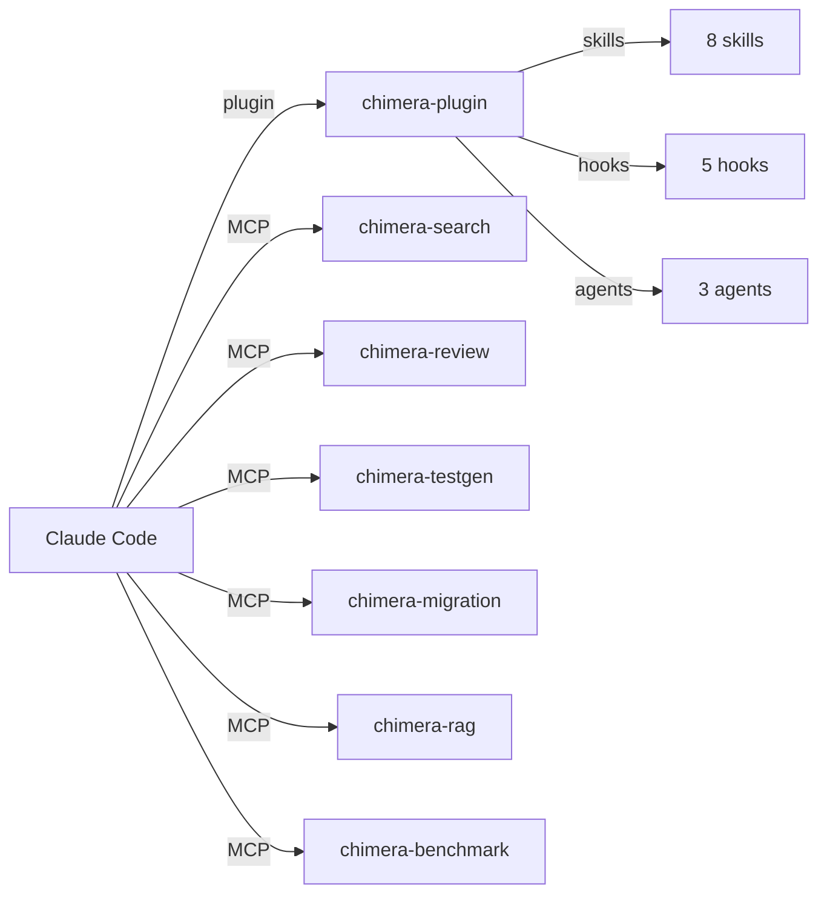
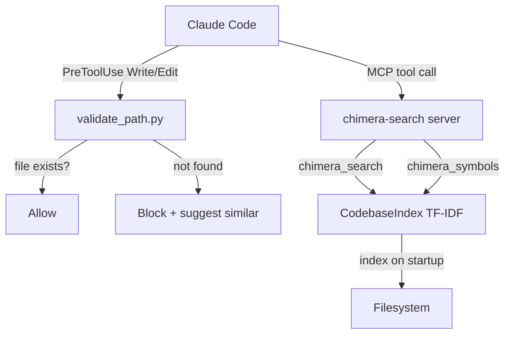
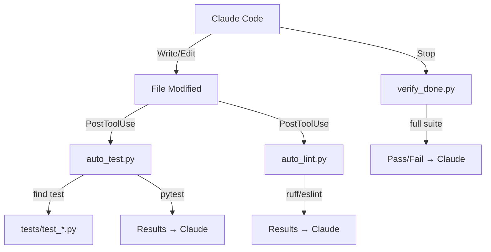
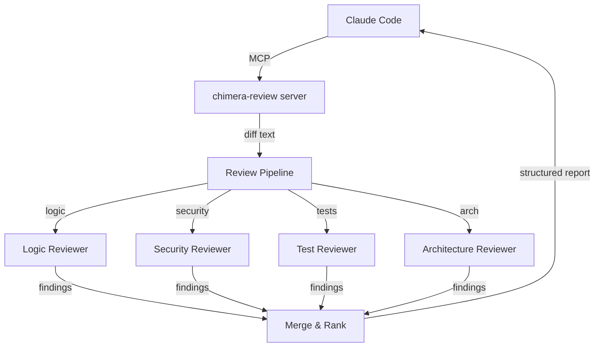
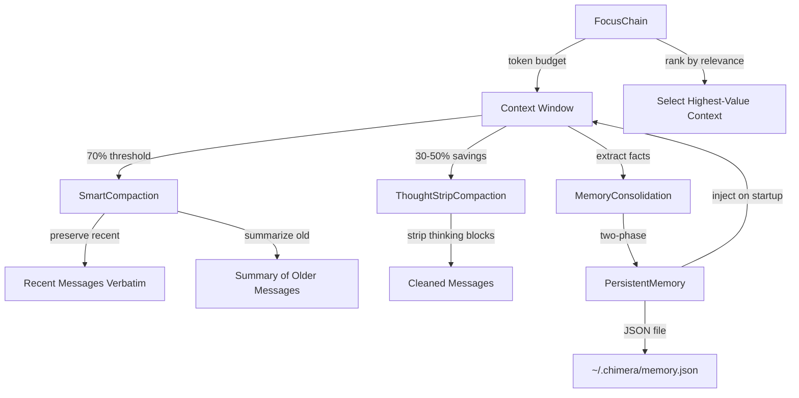
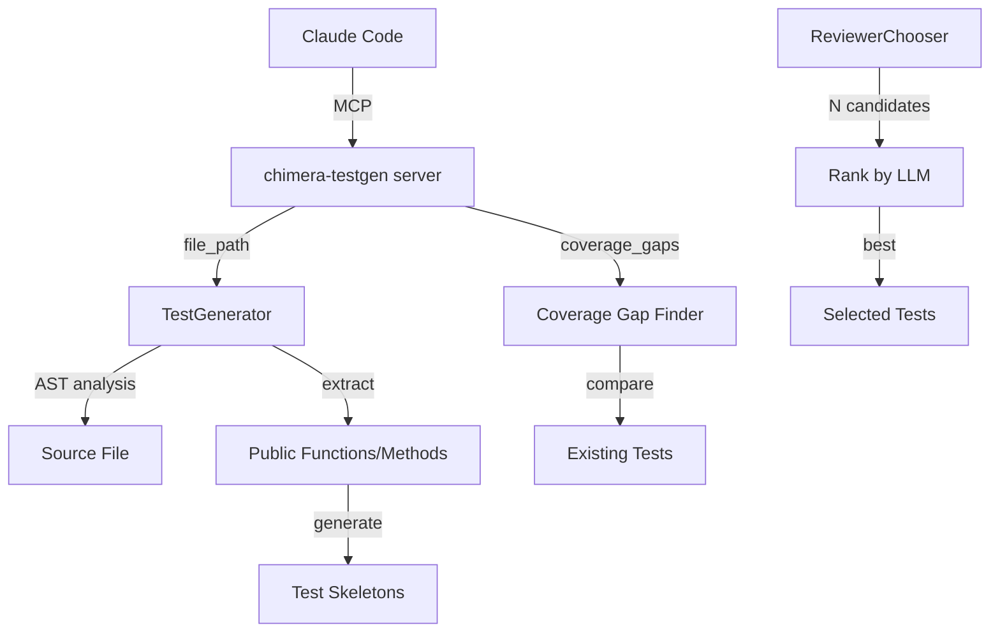
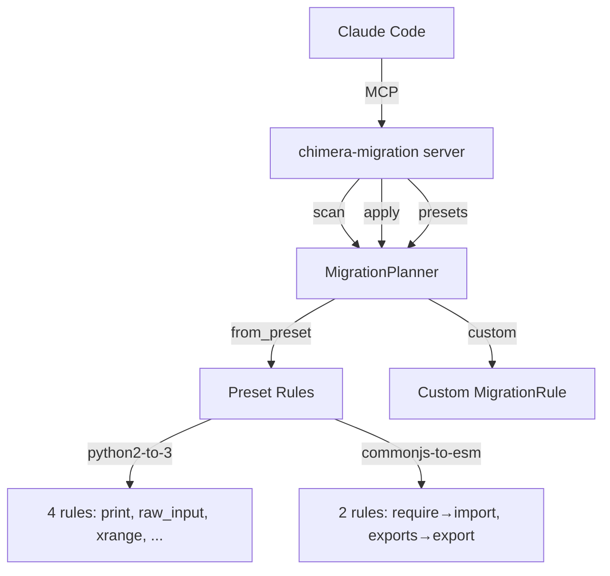
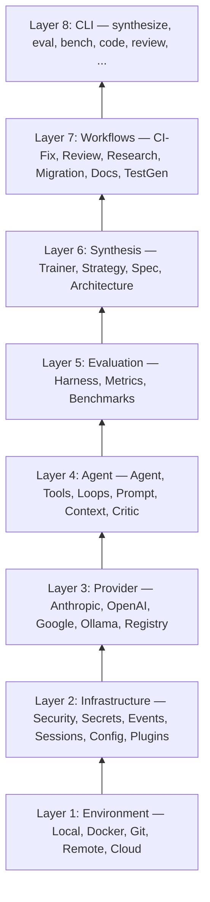

# Chimera Playbooks — Implementation Plan

> **For agentic workers:** REQUIRED: Use superpowers:subagent-driven-development (if subagents available) or superpowers:executing-plans to implement this plan. Steps use checkbox (`- [ ]`) syntax for tracking.

**Goal:** Create 9 playbooks documenting how Chimera integrates with and powers Claude Code, plus condensed skill versions in the plugin. Each playbook serves three audiences: Claude Code users (install & use), developers (build on Chimera), and Claude Code itself (machine-readable recipes for building features).

**Architecture:** Each playbook is a standalone Markdown file in `docs/playbooks/` with a consistent structure: problem statement, architecture diagram (Mermaid), step-by-step setup, code examples, verification, and a "Recipe" section that an AI agent can follow as a spec. Each playbook also gets a condensed skill version in `chimera-plugin/skills/`.

**Tech Stack:** Markdown, Mermaid diagrams, Python code examples, Claude Code hooks/MCP/plugin JSON configs

---

## File Structure

### Full Playbooks (`docs/playbooks/`)

| File | Responsibility |
|------|---------------|
| `docs/playbooks/README.md` | Index page — lists all playbooks with one-line descriptions |
| `docs/playbooks/00-quick-start.md` | Install plugin + hooks + MCP servers in one go |
| `docs/playbooks/01-codebase-search.md` | Semantic search & path validation |
| `docs/playbooks/02-auto-test-lint.md` | Auto-test & auto-lint pipeline |
| `docs/playbooks/03-code-review.md` | Multi-agent code review |
| `docs/playbooks/04-context-management.md` | SmartCompaction + MemoryConsolidation |
| `docs/playbooks/05-test-generation.md` | Test generation from source analysis |
| `docs/playbooks/06-migration.md` | Migration planning |
| `docs/playbooks/07-benchmarking.md` | Benchmarking your workflow |
| `docs/playbooks/08-building-agents.md` | Building a coding agent on Chimera |

### Condensed Skills (`chimera-plugin/skills/`)

New skills (one per playbook that has an operational use case — skip quick-start and building-agents since those are reference docs, not mid-session actions):

| File | Wraps Playbook |
|------|---------------|
| `chimera-plugin/skills/codebase-search.md` | 01 |
| `chimera-plugin/skills/auto-test-lint.md` | 02 |
| `chimera-plugin/skills/code-review.md` | 03 |
| `chimera-plugin/skills/smart-compaction.md` | 04 |
| `chimera-plugin/skills/test-generation.md` | 05 |
| `chimera-plugin/skills/migration.md` | 06 |
| `chimera-plugin/skills/benchmark.md` | 07 (already exists — update to reference playbook) |

---

## Playbook Template

Every playbook follows this structure (scale each section to its complexity):

```markdown
# Playbook: [Title]

> [One-line problem statement]

## What This Solves
[2-3 sentences: the Claude Code pain point and how Chimera addresses it]

## Architecture
[Mermaid diagram showing the data/control flow]

## Setup
[Step-by-step: what to install, configure, verify]

## How It Works
[Walkthrough with code examples — for human developers]

## Configuration Reference
[All options, env vars, defaults]

## Verification
[Commands to run to confirm everything works]

## Recipe: [Title]
[Machine-readable spec — structured so an AI agent reading this file
could implement the feature from scratch. Includes: components needed,
interfaces, data flow, implementation steps with code.]
```

---

## Chunk 1: Index + Quick Start + Codebase Search (Tasks 1-3)

### Task 1: Playbook Index

**Files:**
- Create: `docs/playbooks/README.md`

- [ ] **Step 1: Write the index page**

```markdown
# Chimera Playbooks

Recipes for integrating Chimera with Claude Code. Each playbook solves a
specific pain point, includes setup instructions, and contains a machine-readable
recipe that an AI coding agent can follow to build the feature from scratch.

## For Claude Code Users

Install the Chimera plugin and get immediate improvements:

| # | Playbook | Problem It Solves |
|---|----------|-------------------|
| 00 | [Quick Start](00-quick-start.md) | Install everything in one go |
| 01 | [Codebase Search](01-codebase-search.md) | Hallucinated file paths |
| 02 | [Auto-Test & Lint](02-auto-test-lint.md) | Silent regressions, style drift |
| 03 | [Code Review](03-code-review.md) | Shallow reviews, missed security issues |
| 04 | [Context Management](04-context-management.md) | Context degradation, forgetting |
| 05 | [Test Generation](05-test-generation.md) | Missing test coverage |
| 06 | [Migration](06-migration.md) | Manual refactoring |
| 07 | [Benchmarking](07-benchmarking.md) | No way to measure agent quality |

## For Developers

| # | Playbook | What You Build |
|---|----------|----------------|
| 08 | [Building Agents](08-building-agents.md) | Your own coding agent on Chimera |

## How Playbooks Work

Each playbook has three layers:
1. **Setup** — install and configure for immediate use
2. **How It Works** — understand the architecture and customize
3. **Recipe** — machine-readable spec an AI agent can follow to build the feature
```

- [ ] **Step 2: Commit**

```bash
git add docs/playbooks/README.md
git commit -m "docs: add playbook index"
```

---

### Task 2: Quick Start Playbook

**Files:**
- Create: `docs/playbooks/00-quick-start.md`

- [ ] **Step 1: Write the quick start playbook**

This playbook covers installing everything at once. Include:

**What This Solves:** One-command setup for all Chimera integrations.

**Architecture diagram (Mermaid):**


**Setup section must include:**
1. Prerequisites: `pip install chimera-run` (or `uv pip install chimera-run`)
2. Plugin install (copy `chimera-plugin/` to `~/.claude/plugins/chimera/` or symlink)
3. MCP server configuration — full `.mcp.json` with all 6 servers
4. Hooks configuration — full `hooks.json` (or show how the plugin's hooks.json works)
5. Verification: how to confirm each piece is working

**Configuration Reference:**
- Full `.mcp.json` block with all 6 servers
- Full `hooks.json` with all 5 hooks
- Environment variables: `CHIMERA_TEST_CMD`, `CHIMERA_LINTER`

**Recipe section:**
- List every component (6 MCP servers, 5 hooks, 8 skills, 3 agents)
- For each: what module it wraps, what protocol it uses, how to test it
- Someone reading this should be able to recreate the entire integration layer

- [ ] **Step 2: Commit**

```bash
git add docs/playbooks/00-quick-start.md
git commit -m "docs: add quick start playbook"
```

---

### Task 3: Codebase Search Playbook + Skill

**Files:**
- Create: `docs/playbooks/01-codebase-search.md`
- Create: `chimera-plugin/skills/codebase-search.md`

- [ ] **Step 1: Write the codebase search playbook**

**What This Solves:** Claude Code sometimes edits files that don't exist, or searches for symbols it hallucinated. Chimera's CodebaseIndex provides TF-IDF semantic search and the validate_path hook blocks edits to nonexistent files.

**Architecture diagram:**


**Setup:**
- MCP config for `chimera-search` server
- Hook config for `validate_path.py`

**How It Works:**
- Explain CodebaseIndex: TF-IDF with stdlib-only implementation
- Explain Symbol lookup: AST-based for Python, regex for TS/Go/Rust
- Explain validate_path: fuzzy matching with `difflib.get_close_matches`
- Code examples: using CodebaseIndex from Python

**Recipe:**
- CodebaseIndex: `chimera/tools/codebase_index.py` — TF-IDF indexer
  - `index_directory(path)` → builds inverted index
  - `search(query, max_results)` → ranked results
  - `update_file(path)` / `remove_file(path)` → incremental updates
- Search MCP: `chimera/mcp_servers/search_server.py` — JSON-RPC 2.0
  - Tools: `chimera_search`, `chimera_symbols`
- Path validation hook: `chimera/hooks/validate_path.py`
  - Exit 0 = allow, Exit 2 = block
  - Reads tool input from stdin (JSON with `tool_name`, `tool_input`)

- [ ] **Step 2: Write the condensed skill**

```markdown
---
name: codebase-search
description: Search the codebase semantically using TF-IDF ranking and symbol lookup — find definitions, trace dependencies, validate paths exist
triggers: ["search", "find", "where is", "definition of", "who uses", "file not found"]
---

Use Chimera's CodebaseIndex for semantic search when basic grep isn't enough.

## When to Use This
- Searching for a concept (not an exact string)
- Finding all definitions of a symbol across languages
- Validating that file paths exist before editing
- Understanding codebase structure without reading every file

## How to Search

1. **Semantic search:** Call the chimera_search MCP tool with a natural language query. It returns files ranked by TF-IDF relevance, not just exact matches.

2. **Symbol lookup:** Call chimera_symbols with a class or function name. Returns definitions across Python, TypeScript, Go, and Rust files.

3. **Path validation:** Before editing a file, the validate_path hook automatically checks that the file exists. If it doesn't, it suggests similar paths. You don't need to do anything — this runs automatically on Write/Edit.

## What to Do With Results
- Read the top 3-5 results to understand context
- For symbol lookup, trace imports to find the true definition
- If validate_path blocks an edit, check the suggested paths — you likely have a typo or are looking at a renamed file
```

- [ ] **Step 3: Commit**

```bash
git add docs/playbooks/01-codebase-search.md chimera-plugin/skills/codebase-search.md
git commit -m "docs: add codebase search playbook and skill"
```

---

## Chunk 2: Auto-Test/Lint + Code Review + Context Management (Tasks 4-6)

### Task 4: Auto-Test & Lint Playbook + Skill

**Files:**
- Create: `docs/playbooks/02-auto-test-lint.md`
- Create: `chimera-plugin/skills/auto-test-lint.md`

- [ ] **Step 1: Write the auto-test/lint playbook**

**What This Solves:** Claude Code edits files but doesn't know if those edits broke tests or introduced lint errors until much later. Chimera's PostToolUse hooks run tests and linters after every Write/Edit, feeding results back to Claude immediately.

**Architecture diagram:**


**Setup:**
- Hook config for `auto_test.py`, `auto_lint.py`, `verify_done.py`
- Env vars: `CHIMERA_TEST_CMD`, `CHIMERA_LINTER`
- How auto_test discovers related tests (convention, co-located, search)

**How It Works:**
- auto_test.py: reads modified file path → finds related test file → runs pytest → outputs results
- auto_lint.py: reads modified file path → detects language → runs appropriate linter → outputs results
- verify_done.py: runs full test suite before agent declares done → exit 0 (pass) or 1 (fail)
- security_scan.py: checks bash commands against 17+ dangerous patterns → blocks destructive commands

**Recipe:**
- Each hook: module path, stdin JSON format, exit code semantics
- Test discovery strategies (convention-based, co-located, search-based)
- How to add custom linters or test commands

- [ ] **Step 2: Write the condensed skill**

The skill should be a short operational guide: "After every edit, tests and lint run automatically. If tests fail, fix them before moving on. If lint fails, fix formatting. Don't declare done until verify_done passes."

- [ ] **Step 3: Commit**

```bash
git add docs/playbooks/02-auto-test-lint.md chimera-plugin/skills/auto-test-lint.md
git commit -m "docs: add auto-test and lint playbook and skill"
```

---

### Task 5: Code Review Playbook + Skill

**Files:**
- Create: `docs/playbooks/03-code-review.md`
- Create: `chimera-plugin/skills/code-review.md`

- [ ] **Step 1: Write the code review playbook**

**What This Solves:** Self-review is shallow. Claude Code reviewing its own changes misses bugs, security issues, and architectural problems. Chimera's review system uses multiple specialized perspectives (logic, security, tests, architecture) and can run as an MCP tool or a full orchestrated workflow.

**Architecture diagram:**


**Setup:**
- MCP config for `chimera-review` server
- The `reviewer.md` agent in `chimera-plugin/agents/`
- The `review` command in `chimera-plugin/commands/`

**How It Works:**
- Review MCP: sends diff text, gets multi-perspective review back
- ReviewOrchestrator: full agent workflow with reviewer + author iteration
- How perspectives work (each is a prompt template focusing on one concern)

**Recipe:**
- ReviewOrchestrator: `chimera/review/orchestrator.py`
- Review MCP: `chimera/mcp_servers/review_server.py`
- How to add custom review perspectives
- How to integrate with PR workflows

- [ ] **Step 2: Write the condensed skill**

The skill should instruct: "Before committing or declaring done, run a multi-perspective review. Get the diff, send it through the review pipeline, address all critical findings."

- [ ] **Step 3: Commit**

```bash
git add docs/playbooks/03-code-review.md chimera-plugin/skills/code-review.md
git commit -m "docs: add code review playbook and skill"
```

---

### Task 6: Context Management Playbook + Skill

**Files:**
- Create: `docs/playbooks/04-context-management.md`
- Create: `chimera-plugin/skills/smart-compaction.md`

- [ ] **Step 1: Write the context management playbook**

**What This Solves:** Claude Code loses track of earlier decisions in long sessions. Context degrades as the window fills up. Chimera provides SmartCompaction (intelligent summarization), ThoughtStripCompaction (strips thinking blocks to save 30-50% context), MemoryConsolidation (extracts and persists facts), and FocusChain (token budgeting).

**Architecture diagram:**


**How It Works:**
- SmartCompaction: keeps N recent messages verbatim, summarizes everything before them
- ThoughtStripCompaction: regex strips `<thinking>` blocks from older messages
- MemoryConsolidation: two-phase pipeline — explore (extract facts with category/confidence) then consolidate (deduplicate, merge)
- PersistentMemory: JSON-backed, auto-saves every N turns, injects on new session
- FocusChain: ranks context items by relevance, selects within token budget

**Recipe:**
- SmartCompaction: `chimera/compaction/smart.py`
- ThoughtStripCompaction: `chimera/compaction/thought_strip.py`
- MemoryConsolidation: `chimera/context/consolidation.py`
- PersistentMemory: `chimera/context/persistent_memory.py`
- FocusChain: `chimera/context/focus.py`
- ThresholdCompaction: `chimera/compaction/threshold.py` (SOFT/HARD thresholds)
- How to compose strategies with CompositeCompaction

- [ ] **Step 2: Write the condensed skill**

Operational version: "When context is getting long, proactively summarize earlier findings. Strip thinking blocks from old messages. Extract key facts to persistent memory. Use FocusChain to prioritize what stays in context."

- [ ] **Step 3: Commit**

```bash
git add docs/playbooks/04-context-management.md chimera-plugin/skills/smart-compaction.md
git commit -m "docs: add context management playbook and skill"
```

---

## Chunk 3: Test Generation + Migration + Benchmarking (Tasks 7-9)

### Task 7: Test Generation Playbook + Skill

**Files:**
- Create: `docs/playbooks/05-test-generation.md`
- Create: `chimera-plugin/skills/test-generation.md`

- [ ] **Step 1: Write the test generation playbook**

**What This Solves:** Writing tests is tedious. Claude Code often writes shallow tests or mocks too aggressively. Chimera's TestGenerator analyzes source AST to generate comprehensive test skeletons, and the ReviewerChooser ranks multiple test candidates.

**Architecture diagram:**


**How It Works + Recipe:**
- TestGenerator: `chimera/testgen/generator.py` — AST analysis, skeleton generation
- Testgen MCP: `chimera/mcp_servers/testgen_server.py` — `chimera_testgen`, `chimera_coverage_gaps`
- ReviewerChooser: `chimera/core/reviewer.py` — generate N candidates, rank with second LLM call
- How coverage gap detection works

- [ ] **Step 2: Write the condensed skill**

- [ ] **Step 3: Commit**

```bash
git add docs/playbooks/05-test-generation.md chimera-plugin/skills/test-generation.md
git commit -m "docs: add test generation playbook and skill"
```

---

### Task 8: Migration Playbook + Skill

**Files:**
- Create: `docs/playbooks/06-migration.md`
- Create: `chimera-plugin/skills/migration.md`

- [ ] **Step 1: Write the migration playbook**

**What This Solves:** Manual code migration (Python 2→3, CJS→ESM) is error-prone. Chimera's MigrationPlanner uses regex-based rules organized as presets, scans for opportunities, and applies transforms.

**Architecture diagram:**


**How It Works + Recipe:**
- MigrationPlanner: `chimera/migration/planner.py`
- Migration MCP: `chimera/mcp_servers/migration_server.py`
- How to create custom presets with MigrationRule
- How to add new presets to MigrationPlanner._PRESETS

- [ ] **Step 2: Write the condensed skill**

- [ ] **Step 3: Commit**

```bash
git add docs/playbooks/06-migration.md chimera-plugin/skills/migration.md
git commit -m "docs: add migration playbook and skill"
```

---

### Task 9: Benchmarking Playbook + Update Existing Skill

**Files:**
- Create: `docs/playbooks/07-benchmarking.md`
- Modify: `chimera-plugin/skills/benchmark.md` (was `chimera-plugin/commands/benchmark.md` — reference playbook)

- [ ] **Step 1: Write the benchmarking playbook**

**What This Solves:** No way to measure whether your coding agent workflow is actually good. Chimera's eval harness supports HumanEval, SWE-bench, AIMO, and custom benchmarks. The ActionSampler A/B tests approaches in parallel.

**Architecture diagram:**
```mermaid
graph TD
    CC[Claude Code] -->|MCP| BS[chimera-benchmark server]
    BS -->|chimera_eval| H[Harness]
    BS -->|chimera_humaneval| HE[HumanEval Problems]
    H -->|run| B[Benchmark]
    B -->|pass@k| M[Metrics]
    AS[ActionSampler] -->|N approaches| P[Parallel Execution]
    P -->|score| S[Select Best]
    AP[Agent Presets] -->|SWE_AGENT| C1[Compare]
    AP -->|AIDER| C1
    AP -->|CLINE| C1
    AP -->|CODEX| C1
```

**How It Works + Recipe:**
- Eval Harness: `chimera/eval/harness.py`
- Benchmark MCP: `chimera/mcp_servers/benchmark_server.py`
- ActionSampler: `chimera/core/sampler.py`
- Agent Presets: `chimera/agents/presets/agent_styles.py` (SWE_AGENT, AIDER, CLINE, CODEX)
- How to create custom benchmarks
- How to compare agent architectures

- [ ] **Step 2: Update the existing benchmark command to reference playbook**

Add a note at the top of `chimera-plugin/commands/benchmark.md` pointing to the full playbook.

- [ ] **Step 3: Commit**

```bash
git add docs/playbooks/07-benchmarking.md chimera-plugin/commands/benchmark.md
git commit -m "docs: add benchmarking playbook and update command"
```

---

## Chunk 4: Building Agents + Final Wiring (Tasks 10-12)

### Task 10: Building a Coding Agent Playbook

**Files:**
- Create: `docs/playbooks/08-building-agents.md`

- [ ] **Step 1: Write the building agents playbook**

This is the developer library guide. It should be the most comprehensive playbook.

**What This Solves:** A developer wants to build their own Claude Code-like tool on top of Chimera as a library. This playbook walks through the entire stack.

**Architecture diagram (the full 8-layer stack):**


**Must cover:**
1. The 3-tier API pattern: one-liner → config → subclass
2. Minimal agent in 5 lines of code
3. Adding custom tools with @tool decorator
4. Choosing a loop (ReAct, PlanAndExecute, Reflexion, TreeOfThought)
5. Streaming with iter_steps() and async_iter_steps()
6. Permission system with PendingApproval for interactive UIs
7. Session persistence (memory, file, SQLite)
8. Composition patterns (Pipeline, Ensemble, Supervisor)
9. Events and observability
10. Auth integration (new! just wired in)

**Recipe:**
- For each layer: module path, key classes, key methods
- Complete working examples (not snippets)
- How to test each layer independently

- [ ] **Step 2: Commit**

```bash
git add docs/playbooks/08-building-agents.md
git commit -m "docs: add building agents playbook"
```

---

### Task 11: Update Plugin hooks.json

**Files:**
- Modify: `chimera-plugin/hooks/hooks.json`

- [ ] **Step 1: Read current hooks.json**

Currently only has the validate_path hook. Add all 5 hooks.

- [ ] **Step 2: Update hooks.json with all hooks**

```json
{
  "hooks": [
    {
      "event": "PreToolUse",
      "tools": ["Write", "Edit"],
      "command": "python3 chimera/hooks/validate_path.py",
      "description": "Block edits to nonexistent files — suggests similar paths"
    },
    {
      "event": "PreToolUse",
      "tools": ["Bash"],
      "command": "python3 chimera/hooks/security_scan.py",
      "description": "Block dangerous bash commands (rm -rf /, chmod 777, etc.)"
    },
    {
      "event": "PostToolUse",
      "tools": ["Write", "Edit"],
      "command": "python3 chimera/hooks/auto_test.py",
      "description": "Run related tests after every file edit"
    },
    {
      "event": "PostToolUse",
      "tools": ["Write", "Edit"],
      "command": "python3 chimera/hooks/auto_lint.py",
      "description": "Run linter on modified files after every edit"
    },
    {
      "event": "Stop",
      "command": "python3 chimera/hooks/verify_done.py",
      "description": "Verify all tests pass before declaring done"
    }
  ]
}
```

- [ ] **Step 3: Commit**

```bash
git add chimera-plugin/hooks/hooks.json
git commit -m "fix: hooks.json — add all 5 hooks (was only validate_path)"
```

---

### Task 12: Update Plugin plugin.json

**Files:**
- Modify: `chimera-plugin/.claude-plugin/plugin.json`

- [ ] **Step 1: Read current plugin.json**

- [ ] **Step 2: Update with full metadata**

Update the plugin.json to include proper metadata and point to the playbooks:

```json
{
  "name": "chimera",
  "version": "0.2.0",
  "description": "Composable coding agent primitives — codebase search, code review, test generation, migration planning, context management, benchmarking",
  "author": "Chimera Contributors",
  "license": "MIT",
  "homepage": "https://github.com/chimera-run/chimera",
  "keywords": ["coding-agent", "code-review", "test-generation", "search", "migration"]
}
```

- [ ] **Step 3: Commit**

```bash
git add chimera-plugin/.claude-plugin/plugin.json
git commit -m "fix: update plugin.json version and metadata"
```

---

## Verification

After all tasks:

1. All playbook files exist and are valid Markdown:
   ```bash
   ls docs/playbooks/*.md | wc -l  # Should be 10 (README + 9 playbooks)
   ```

2. All new skills exist:
   ```bash
   ls chimera-plugin/skills/*.md | wc -l  # Should be 14 (8 existing + 6 new)
   ```

3. hooks.json has all 5 hooks:
   ```bash
   python3 -c "import json; h=json.load(open('chimera-plugin/hooks/hooks.json')); print(len(h['hooks']))"  # Should be 5
   ```

4. All tests still pass:
   ```bash
   uv run pytest tests/ -x -q
   ```

5. Lint clean:
   ```bash
   uv run ruff check chimera/
   ```
