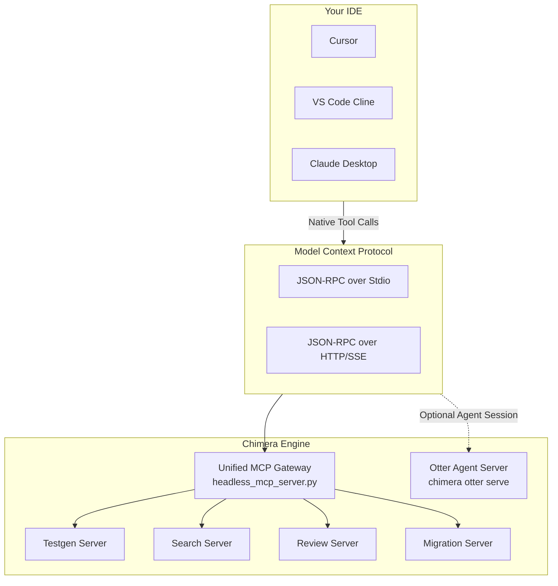

# Chimera Headless MCP / LSP Server Integration Guide

This guide explains how to expose Chimera's advanced codebase reasoning tools (AST-based search, test generation, codebase migration, and review) natively within your IDE using the Model Context Protocol (MCP).

## Architecture Overview



## Option 1: The Unified MCP Gateway (Recommended for IDEs)

We provide a custom, unified MCP gateway that aggregates all of Chimera's specialized tools into a single connection. This allows your IDE to call tools like `chimera_search`, `chimera_testgen`, and `chimera_review_diff` seamlessly.

**Gateway Script Location:** `examples/real_world/headless_mcp_server.py`

### 1. Cursor Configuration

To integrate the gateway into Cursor, add the following to your Global MCP Settings or workspace `.cursor/mcp.json`:

```json
{
  "mcpServers": {
    "chimera-unified": {
      "command": "python3",
      "args": ["/absolute/path/to/chimera/examples/real_world/headless_mcp_server.py"]
    }
  }
}
```

### 2. VS Code Cline Configuration

If you are using the Cline extension in VS Code, add the following to your Cline MCP settings:

```json
{
  "mcpServers": {
    "chimera-unified": {
      "command": "python3",
      "args": ["/absolute/path/to/chimera/examples/real_world/headless_mcp_server.py"]
    }
  }
}
```

### 3. Claude Desktop Configuration

For Claude Desktop, add this to your `claude_desktop_config.json`:

```json
{
  "mcpServers": {
    "chimera-unified": {
      "command": "python3",
      "args": ["/absolute/path/to/chimera/examples/real_world/headless_mcp_server.py"]
    }
  }
}
```

## Option 2: The Otter Agent Server (For Full Agent Sessions)

If you are building external orchestrators that require full, stateful agent sessions, use Chimera's native `otter serve` command.

```bash
# Start an HTTP/SSE server on port 5173
chimera otter serve --host 127.0.0.1 --port 5173

# Or start a standard JSON-RPC over stdio ACP server
chimera otter serve --acp
```

The Otter server exposes a REST + SSE surface (and an ACP stdio mode via `--acp`), allowing external clients to:
- Create agent sessions (`POST /session`) and send prompts (`POST /session/<id>/message`).
- Stream agent events via Server-Sent Events (`GET /session/<id>/events`, resumable with `Last-Event-ID`).
- Attach securely using Bearer tokens or TLS (via `--auth-token` and `--tls-cert`).

## AST/TF-IDF Capabilities

When your IDE connects to the Unified Gateway, it automatically gains access to:
- **`chimera_search`**: TF-IDF ranked codebase keyword search.
- **`chimera_symbols`**: AST-based precise lookup for classes and functions.
- **`chimera_testgen`**: Automatic generation of test skeletons for any python file.
- **`chimera_review_diff`**: Multi-perspective heuristic code review.
- **`chimera_coverage_gaps`**: Untested-function detection for a source file.
- **`chimera_migration_scan` / `apply` / `presets`**: Deterministic codebase refactoring.

All these tools run fully locally and offline, using Chimera's TF-IDF codebase index and AST symbol lookup.
