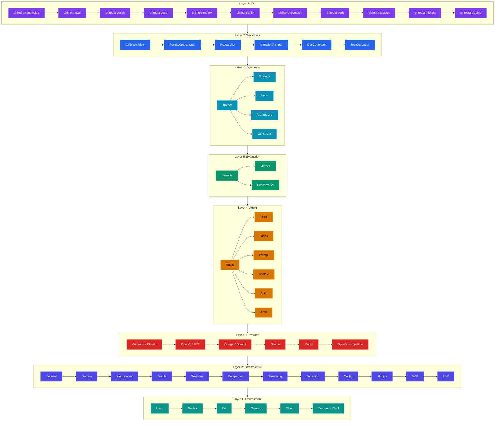
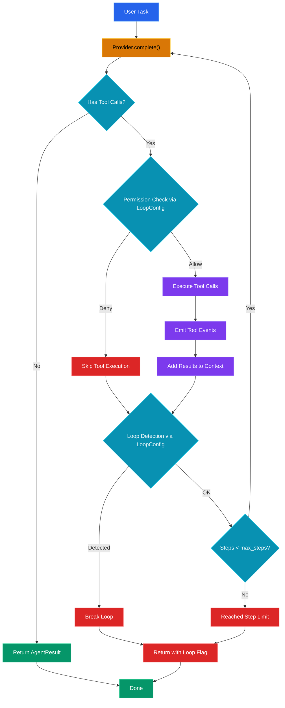
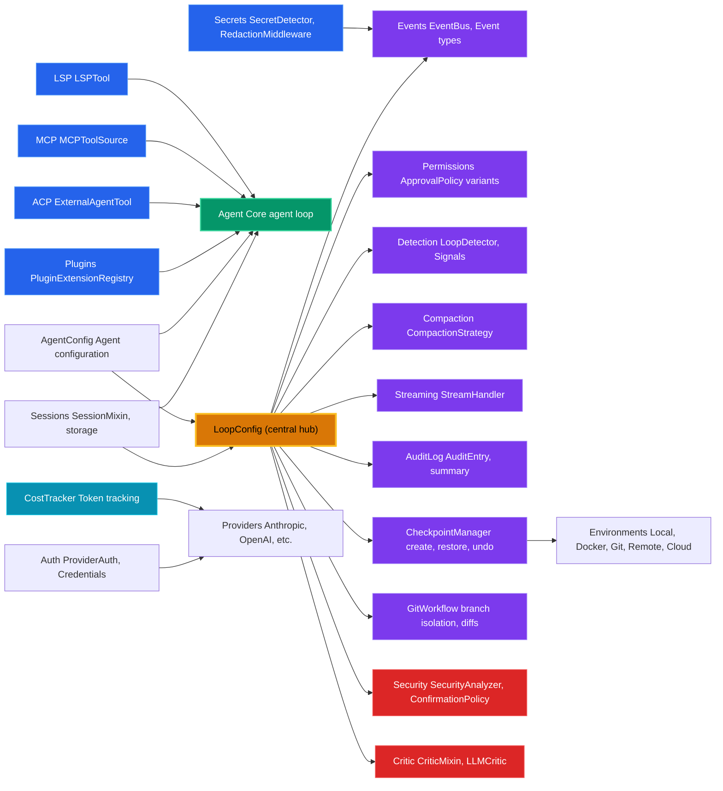
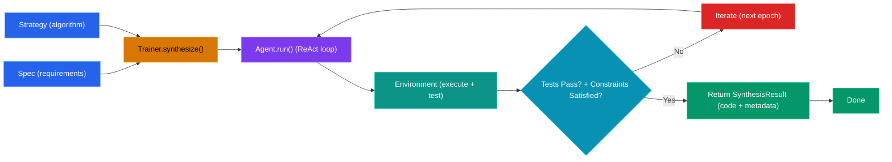

Chimera is a layered framework designed to synthesize codebases from specifications using AI agents. The architecture is organized into eight distinct layers, each of which can be used independently or composed together for increasingly sophisticated workflows.

## Layer Stack

Chimera's architecture follows a modular, layered approach where each layer builds upon the lower layers and provides specific functionality:

### Layer Descriptions

**Layer 1: Environment** — Execution contexts for running code and tests. Supports local filesystem operations, Docker containers, Git-based checkpointing, remote HTTP environments, managed cloud sandboxes, and persistent tmux-based shell sessions that maintain state across agent steps.

**Layer 2: Infrastructure** — Cross-cutting concerns wired through LoopConfig. Security analyzers evaluate tool call risk. Secrets detects and redacts sensitive data. Permissions gates tool execution. Events provides pub/sub. Sessions persists conversations. Compaction manages context window. Streaming handles real-time output. Detection catches infinite loops. Config provides polymorphic serialization. Plugins manages extensions. MCP connects to external tool servers. LSP provides language server integration.

**Layer 3: Provider** — LLM backends abstracted behind a common interface. Supports Anthropic Claude, OpenAI GPT, Google Gemini, Ollama, Modal, and any OpenAI-compatible endpoint (OpenRouter, vLLM, Groq, GLM-5). Includes per-model cost tracking with granular token breakdowns (cache, reasoning, per-step).

**Layer 4: Agent** — The agent loop system combining Provider, Tools, Loop strategies, Prompt templates, Context management, Critic evaluation, and ACP (Agent Client Protocol) for connecting external agents. The ReAct loop (default) implements Reason → Act → Observe cycles with tool use. Alternative loops include PlanAndExecute, Reflexion, and TreeOfThought.

**Layer 5: Evaluation** — Benchmarking and metrics for assessing synthesis quality. Includes harness abstraction, metric calculators (pass@k, resolve rate, cost), and adapters for SWE-bench, HumanEval, AIMO, and custom benchmarks.

**Layer 6: Synthesis** — The training system for code synthesis. Trainer orchestrates Architecture (layer dependencies), Spec (requirements), Strategies (synthesis algorithms), and Constraints (success criteria).

**Layer 7: Workflows** — Thin glue composing Agent.run() with domain-specific parsing and prompting. CIFixWorkflow parses CI logs and retries fixes. ReviewOrchestrator runs reviewer and author agent loop. Researcher does plan decomposition and synthesis. MigrationPlanner applies rule-based transforms with presets (python2-to-3, commonjs-to-esm). DocGenerator scans AST for documentation generation. TestGenerator creates test skeletons from source analysis.

**Layer 8: CLI** — Command-line interface exposing 11 subcommands: synthesize, eval, bench, code (interactive REPL), review, ci-fix, research, docs, testgen, migrate, and plugins. The `code` subcommand provides an interactive REPL with 16 slash commands for agent interaction.

### Using Each Layer

The layers are designed to be composable:

- **Layers 1-4**: Use as an agent toolkit for building agentic applications
- **Layers 1-6**: Use as a full synthesis framework for generating code from specs
- **Layers 7-8**: Use the workflows and CLI for terminal-based synthesis, evaluation, benchmarking, CI fixing, code review, research, migration, documentation, and test generation

For example, you can build a simple agent using only Layers 1-4, or a complete code generation pipeline using all six lower layers before adding workflows and the CLI.

---

## Agent Loop Flow

The ReAct (Reason → Act → Observe) loop is the core execution engine for agents in Chimera. It iterates between asking the LLM provider for the next action and executing tool calls until the agent produces a final response.

### Loop Mechanics

**Provider.complete()** — Queries the LLM with the current conversation context and tool schemas. Returns the next response with optional tool calls.

**Permission Check** — Uses the `ApprovalPolicy` from `LoopConfig` to decide whether to execute a tool call. Policies include:
- `AutoApprove`: execute all tools
- `AlwaysDeny`: reject all tools
- `AllowList`: execute only whitelisted tools
- Custom policies for fine-grained control

**Tool Execution** — Runs the requested tool (file read/write, bash, test, git, etc.) and captures the output.

**Event Emission** — Publishes `ToolCallEvent` and `ToolResultEvent` to the event bus for logging and observability.

**Loop Detection** — Detects infinite loops by maintaining a sliding window of recent action signatures. If the agent repeats the same sequence, execution breaks.

**Context Management** — Tool results are added back to the conversation context, allowing the LLM to reason about the output in the next iteration.

---

## Module Dependency Map

Chimera's modules are organized around `LoopConfig`, which acts as a central hub for configurable loop behaviors, and `Agent`, which integrates tools and extensions.

### Module Roles

**LoopConfig** — Central configuration object that plugs extensions into the ReAct loop. Holds references to event bus, approval policy, loop detector, context compressor, stream handler, audit log, checkpoint manager, git workflow, security analyzer, confirmation policy, and critic.

**Events** — Publish-subscribe system for observing agent execution (step start, tool calls, tool results, errors, security events, critic events, cost events). Decouples logging/monitoring from the core loop.

**Permissions** — Approval policies that gate tool execution. Enables human-in-the-loop, safety constraints, and debugging workflows.

**Detection** — Loop detection algorithms to prevent infinite cycles. Maintains signatures of recent actions and breaks on repetition.

**Compaction** — Context compression strategies (Summary, Prune, Counter, Composite) to manage token usage in long conversations. Supports SOFT/HARD thresholds with tool call/result atomicity.

**Streaming** — Streaming handlers for real-time output observation. Allows printing to stdout or collecting results without blocking.

**AuditLog** — Records all tool executions with timestamps, risk levels, and outcomes. Provides summary and per-tool filtering.

**CheckpointManager** — Creates and restores named checkpoints in the environment. Supports undo and listing operations.

**GitWorkflow** — Branch isolation, diff context injection, and commit strategies for agent-driven code changes.

**Security** — SecurityAnalyzer (LLM-based, rule-based, or composite) evaluates tool call risk. ConfirmationPolicy (NeverConfirm, AlwaysConfirm, ConfirmAboveThreshold) determines when to prompt for approval.

**Critic** — CriticMixin integrates LLMCritic or ChecklistCritic into the loop for iterative refinement. Operates in all_actions or finish_only mode.

**Secrets** — SecretDetector identifies sensitive data (API keys, AWS credentials, bearer tokens, private keys) and RedactionMiddleware scrubs it from the event bus.

**Sessions** — Persistent conversation sessions with save/resume/fork. Supports Memory, File, and SQLite storage backends plus event-sourced persistence.

**Auth** — Provider authentication and credential management. Supports environment variable loading, token refresh, and multi-provider auth.

**AgentConfig** — High-level agent configuration builder. Wraps Agent, LoopConfig, and related settings into a single configuration object with markdown-based presets.

**Plugins** — PluginExtensionRegistry registers tools, agents, strategies, constraints, middleware, skills, MCP servers, and hooks. Supports directory-based loading and a marketplace for discovery/install.

**ACP** — Agent Client Protocol for connecting external agents. ExternalAgentTool wraps external agents as Chimera tools via JSON-RPC 2.0 over subprocess stdio.

**MCP** — MCPToolSource connects to external tool servers (stdio or HTTP) and surfaces their tools as native Chimera tools.

**LSP** — Language Server Protocol client providing diagnostics, completion, and rename capabilities as agent tools.

**CostTracker** — Granular token tracking with cache-aware accounting, reasoning token breakdowns, and per-step cost calculation.

---

## Training Pipeline

The synthesis process (Layer 6) orchestrates agents with specifications and constraints to generate code that passes tests. The pipeline iterates until constraints are satisfied.

### Pipeline Stages

**Spec + Strategy** — The specification defines what code should do (from tests, documentation, or examples). The strategy determines how to synthesize (TestConvergence, TreeSearch, Curriculum, Ensemble, etc.).

**Trainer.synthesize()** — Main entry point. Orchestrates the strategy with the agent, environment, and constraints.

**Agent.run()** — Executes the ReAct loop with the current codebase and specification. The agent reads files, thinks about changes, and writes code.

**Environment (execute + test)** — Runs tests to validate the generated code. LocalEnvironment, DockerEnvironment, and GitEnvironment all support test execution.

**Tests Pass?** — Check if all test constraints are satisfied. If not, the agent iterates with feedback about what failed.

**Iterate** — If tests fail, loop back with refined prompts, checkpoints, or branch exploration (for tree search).

**Return SynthesisResult** — When constraints are satisfied, return the generated code, metrics, and synthesis history.

### Strategy Variants

Chimera includes multiple synthesis strategies:

- **TestConvergence** (default) — Iterate until all tests pass
- **TreeSearch** — Explore multiple branches in parallel, prune low-scoring paths
- **Curriculum** — Synthesize layers in topological order (dependencies first)
- **Ensemble** — Run multiple agents in parallel, pick the best result
- **MajorityVoting** — Combine multiple attempts via consensus
- **AIMOEnsemble** — Voting with tree search fallback for harder problems
- **Passthrough** — Single-shot synthesis (no iteration)

---

## Extension Architecture

Chimera supports custom extensions through well-defined interfaces:

- **Custom Tools** — Subclass `BaseTool` to add new agent capabilities
- **Custom Loops** — Subclass `Loop` base class for new reasoning strategies (e.g., multi-agent loops)
- **Custom Strategies** — Subclass `Strategy` for new synthesis algorithms
- **Custom Constraints** — Implement constraint functions for custom success criteria
- **Custom Environments** — Subclass `Environment` to support new execution contexts (e.g., Kubernetes, cloud functions)
- **Custom Providers** — Subclass `Provider` to integrate new LLM backends
- **Custom Security Analyzers** — Subclass `SecurityAnalyzer` to implement custom risk evaluation logic
- **Custom Critics** — Subclass `Critic` to create custom evaluation and refinement strategies
- **Custom Compaction** — Subclass `CompactionStrategy` for custom context window management
- **Custom Confirmation Policies** — Subclass `ConfirmationPolicy` for custom approval workflows
- **Custom Plugins** — Subclass `BasePlugin` to bundle tools, agents, strategies, and hooks into distributable packages

All extensions integrate seamlessly via the public API exports in `chimera/__init__.py`.
