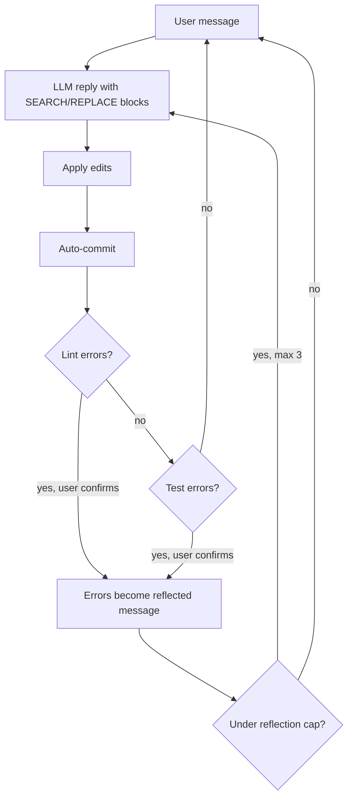

**Origin:** open-source CLI, repository created May 2023, Apache-2.0 ([Aider-AI/aider](https://github.com/Aider-AI/aider))

**Loop type:** chat-driven edit-apply-reflect loop (not ReAct; one model reply per prompt, lint/test errors reflected back for at most 3 rounds)

**Primary surface:** interactive terminal chat ("AI pair programming in your terminal")

**Chimera primitive:** `aider` style in `chimera/agents/presets/agent_styles.py` (verified at `2507d0c`)

Aider is the diff-format archetype among coding agents. The model never calls tools. It answers each chat message with edit blocks in plain text, and the harness applies them, commits them, lints them, and reports any failures back as the next message.

## Loop

One user message produces one model reply. The harness extracts edit blocks from the reply, applies them, then runs a fixed post-edit pipeline (order verified in `aider/coders/base_coder.py`): auto-commit, auto-lint, model-suggested shell commands, auto-test. When the linter or tests fail and the user confirms a fix attempt, the error output becomes a `reflected_message` and the loop re-prompts the model with it. `max_reflections = 3` caps the cycle; after that, control returns to the user.



## Tool Set

Aider exposes no function-calling API to the model. The edit format is the only model-facing "tool"; everything else runs harness-side.

| Mechanism | Purpose | Notable constraint |
|-----------|---------|--------------------|
| SEARCH/REPLACE blocks | File edits, emitted as text in the reply | SEARCH text must match current file content; the file path precedes the block |
| Repo map | Read-only structural context | Graph-ranked; 1,000-token default budget (`--map-tokens`) |
| Git auto-commit | Checkpoint after every edit | Message written by the `--weak-model` from the diffs and chat history |
| Auto-lint | Post-edit check | Built-in per-language linters; override with `--lint-cmd`, disable with `--no-auto-lint` |
| Test runner | Post-edit check (`--test-cmd`, `--auto-test`, `/test`) | Failures must print to stdout/stderr and exit non-zero |
| `/undo`, `/diff`, `/commit` | In-chat git controls | `/undo` discards the last Aider commit |

## Prompt Strategy

The edit format is the center of Aider's prompt design. The system prompt instructs the model to emit edits in a specific text syntax rather than call tools, and Aider ships five formats, configured "to use the optimal format for most popular, common models":

- **whole**: return a full, updated copy of each changed file. Simple, token-hungry.
- **diff**: search/replace blocks (below); the model returns only the changed hunks.
- **diff-fenced**: same blocks with the file path inside the fence, used "primarily with the Gemini family of models, which often fail to conform to the fencing approach specified in the diff format."
- **udiff**: a "modified and simplified" unified diff, used primarily with GPT-4 Turbo to discourage eliding code behind placeholder comments.
- **editor-diff / editor-whole**: stripped-down variants for architect mode, where one model plans the change and a second model emits the edits.

A diff-format block:

```text
src/auth.py
<<<<<<< SEARCH
def add(a, b):
    return a - b
=======
def add(a, b):
    return a + b
>>>>>>> REPLACE
```

The markers reuse git merge-conflict syntax. The SEARCH side must match the file for the block to apply, which makes ambiguous or stale edits fail loudly instead of silently.

## Context Strategy

Files split into two tiers. Files the user has added to the chat are present in full; the rest of the repository appears only through the repo map, "a concise map of your whole git repository" listing "the most important classes and functions along with their types and call signatures."

The map is built by ranking "a graph where each source file is a node and edges connect files which have dependencies," then keeping "the most important identifiers, the ones which are most often referenced by other portions of the code." A token budget (`--map-tokens`, default 1,000) bounds it. Aider "adjusts the size of the repo map dynamically based on the state of the chat" and expands it "especially when no files have been added to the chat." The map is re-sent "along with each change request from the user."

## Termination Heuristic

The human is the outer loop. Aider returns to the prompt after every message; there is no autonomous task budget and no "task complete" signal for the model to emit. The only automatic iteration is the reflection cycle, and it is doubly bounded: `max_reflections = 3`, and each lint-fix or test-fix round first asks the user ("Attempt to fix lint errors?").

## Notable Quirks

- **Per-edit commits are the safety mechanism.** "Whenever aider edits a file, it commits those changes with a descriptive commit message." The stated rationale: "This keeps your edits separate from aider's edits, and makes sure you never lose your work if aider makes an inappropriate change." `--no-auto-commits` turns it off.
- **Commit attribution.** Aider appends "(aider)" to the git author/committer name on commits it authored; `--attribute-co-authored-by` adds a Co-authored-by trailer.
- **A second model writes the commits.** Aider sends "the `--weak-model` a copy of the diffs and the chat history" to produce Conventional Commits-style messages.
- **Edit formats are per-model dialects.** diff-fenced exists because of Gemini fencing failures; udiff was added for GPT-4 Turbo's elision habit. The edit format is a compatibility surface tuned per model family, not a fixed protocol.
- **No function calling anywhere.** Any model that can imitate the text format can drive Aider, including models without a tool-use API.

## In Chimera

Chimera replicates Aider at the loop level: the `aider` style reproduces the lint-reflect cycle rather than the text edit format. The style (lines 203–219 of `chimera/agents/presets/agent_styles.py`) encodes:

- `loop_type="lint_feedback"`, which wires a `LintFeedbackLoop` (`chimera/core/loops/lint_feedback.py`) around an inner ReAct loop. After the inner run, the harness runs the linter; non-empty output is sent back as a new user message ("Fix these lint errors. Do not change functionality."), mirroring upstream's `lint_edited` feeding a `reflected_message`.
- `loop_kwargs={"linter": "ruff", "max_lint_rounds": 2}`: ruff runs with `check --no-fix`, and the loop allows two fix rounds against upstream's three reflections. Chimera's rounds run unconditionally where upstream asks the user first.
- Tools `read_file`, `edit_file`, `bash`, `search`, `list_files`, `git`, `test`, and `repo_map`: `git` and `repo_map` carry the git-aware, map-based-context posture.
- `max_steps=20` per inner run, with a pair-programming system prompt that tells the model "the linter will check your work automatically."

Two differences are deliberate: edits happen through tool calls rather than search/replace text blocks, and there is no auto-commit per edit.

The tutorial [Build Aider in 50 lines](/chimera/tutorials/build-aider-in-50-lines/) builds the other half of the posture: diff-first, conservative editing with a three-tool agent (`read_file`, `replace_in_file`, `bash`) capped at 6 steps, no repo scanning, and a verified live run.

## References

- Upstream repository: [github.com/Aider-AI/aider](https://github.com/Aider-AI/aider)
- Edit formats: [aider.chat/docs/more/edit-formats.html](https://aider.chat/docs/more/edit-formats.html)
- Repository map: [aider.chat/docs/repomap.html](https://aider.chat/docs/repomap.html)
- Git integration: [aider.chat/docs/git.html](https://aider.chat/docs/git.html)
- Linting and testing: [aider.chat/docs/usage/lint-test.html](https://aider.chat/docs/usage/lint-test.html)
- Chimera style: `chimera/agents/presets/agent_styles.py`, the `aider` preset (lines 203–219), at commit `2507d0c`; loop implementation in `chimera/core/loops/lint_feedback.py`
- Tutorial: [Build Aider in 50 lines](/chimera/tutorials/build-aider-in-50-lines/)
