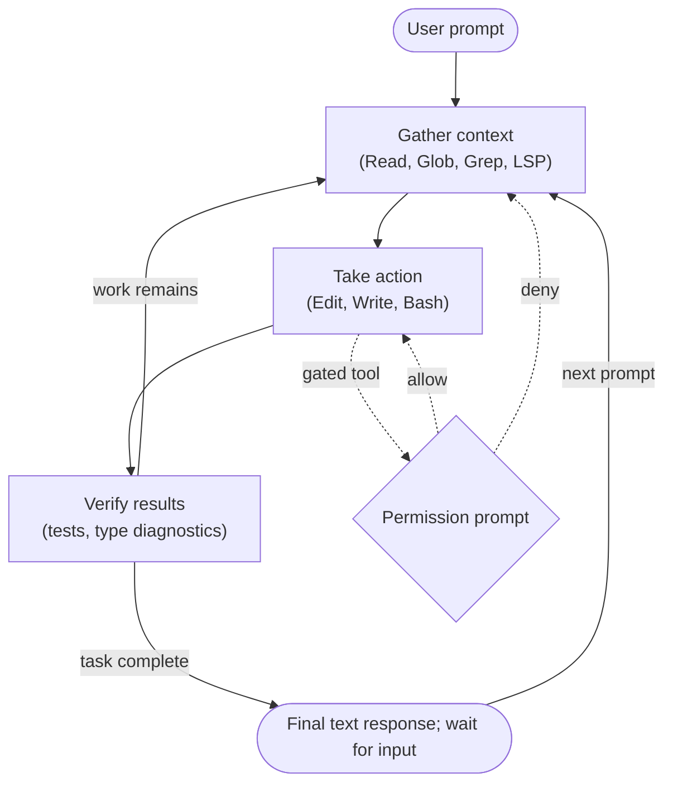

**Origin:** Anthropic, February 2025 (limited research preview, announced alongside Claude 3.7 Sonnet)

**Loop type:** single-agent tool loop — gather context, take action, verify results, repeat until the model judges the task complete

**Primary surface:** terminal TUI (interactive REPL), plus a `-p` print mode for scripting; IDE, desktop, and web front ends share the same engine

**Chimera primitive:** `chimera/mink/` (verified at `2507d0c`)

## Loop

Anthropic documents the loop as three phases that "blend together": the model picks tools each step based on what the previous step returned, and the operator can interrupt at any point.

Interrupts cut across every state: `Esc` cancels the running tool call, and text typed mid-turn is delivered at the next tool boundary so the model adjusts course without restarting the turn.

## Tool Set

The names below are the exact strings used in permission rules, hook matchers, and subagent tool lists.

| Tool | Purpose | Notable constraint |
| --- | --- | --- |
| `Read` | File contents with line numbers; also images, PDFs, notebooks | Oversized files return a partial view with offset/limit paging |
| `Edit` | Exact string replacement (`old_string` → `new_string`) | File must have been read this conversation and be unchanged on disk; match must be unique unless `replace_all` |
| `Write` | Create or overwrite a whole file | Overwriting an existing file requires a prior read |
| `Bash` | Shell commands | Fresh process per command; env vars do not persist; 2-minute default timeout (10-minute ceiling); output over 30,000 chars spills to a file |
| `Glob` | File-name pattern matching | Sorted by mtime, capped at 100 results; does not respect `.gitignore` |
| `Grep` | Regex content search (ripgrep) | Respects `.gitignore` |
| `Agent` | Spawn a subagent with its own context window | Parent sees only the final text result, not intermediate tool calls |
| `WebFetch` | Fetch a URL and answer an extraction prompt | A small model answers the prompt; the agent gets the answer, not the page |
| `WebSearch` | Web search | Returns titles and URLs only; up to 8 backend searches per call |
| `AskUserQuestion` | Multiple-choice questions to the operator | Presents options and blocks the loop until answered |
| `TaskCreate` / `TaskUpdate` / `TaskList` | Session task checklist | Replaced `TodoWrite`, which is disabled by default as of v2.1.142 |
| `Skill` | Run a packaged instruction workflow | Skill body loads into context only on use |

`Bash`, `Edit`, `Write`, `WebFetch`, `WebSearch`, and `Skill` are permission-gated; reads, searches, and subagent spawns are not. Rules use a `Tool(specifier)` grammar — `Bash(npm run *)`, `Edit(/src/**)`, `WebFetch(domain:example.com)` — and an `Edit` allow rule implies read access to the same path.

## Prompt Strategy

- The harness system prompt is fixed; per-project instruction comes from `CLAUDE.md` files (user `~/.claude/CLAUDE.md`, project `CLAUDE.md` or `.claude/CLAUDE.md`, local `CLAUDE.local.md`) read at the start of every session.
- Auto memory loads the first 200 lines or 25 KB of `MEMORY.md`, whichever comes first, at session start.
- Skills follow progressive disclosure: descriptions sit in context, full bodies load on use. MCP tool schemas are deferred by default and loaded on demand through `ToolSearch`.
- **Edit format:** exact string replacement, not unified diffs. `Edit` replaces a unique literal `old_string`; `Write` emits whole files; `NotebookEdit` addresses notebook cells by id. There is no regex or fuzzy matching in the edit path.

## Context Strategy

- Within a session, the conversation, tool outputs, `CLAUDE.md`, auto memory, and skill descriptions share one context window; `/context` reports the breakdown.
- Every message and tool result is appended to a plaintext JSONL transcript under `~/.claude/projects/`, which backs `--resume`, `--continue`, and `--fork-session`. Sessions are otherwise independent — only `CLAUDE.md` and auto memory carry across.
- **Compaction trigger:** automatic as the window approaches its limit. Older tool outputs are cleared first; if that is not enough, the conversation is summarized. `/compact <focus>` runs it manually, and a "Compact Instructions" section in `CLAUDE.md` steers what survives. If context refills immediately after each summary, auto-compaction stops after a few attempts and surfaces an error instead of looping.
- **File re-injection:** edits are refused when a file changed on disk after the last read, forcing a fresh `Read` before the model can retry — stale context cannot silently produce a patch.

## Termination Heuristic

- Interactive mode has no turn cap. The loop ends when the model stops emitting tool calls and returns a final text response; the REPL then waits for the next prompt.
- The operator is an explicit stop condition: `Esc` cancels the in-flight tool call; double-`Esc` rewinds file state to a checkpoint.
- Print mode (`claude -p`) runs one prompt to completion and exits. `--max-turns N` caps agentic turns and exits with an error when reached; there is no limit by default.
- Side bounds rather than step bounds: per-command Bash timeouts and the compaction thrashing error are the built-in halts.

## Notable Quirks

- **Lossy web access by design.** `WebFetch` pipes pages through a secondary extraction model, so "the page does not mention X" can mean only that the prompt did not ask about X. Raw pages require `curl` via Bash.
- **Stateless shell.** Each Bash call is a separate process — `export` does not persist, and a `cd` outside the project resets to the project directory with a notice in the tool result.
- **Asymmetric ignore handling.** `Glob` finds gitignored files; `Grep` skips them.
- **Background subagents never prompt.** They auto-deny any tool call that would require approval and continue without that tool.
- **Checkpoints are not git.** Files are snapshotted before every edit for double-`Esc` rewind, but actions against remote systems can't be checkpointed — hence the permission prompt on commands with external side effects.
- **Bash can satisfy read-before-edit.** Viewing a file with plain `cat`, `head`, `tail`, `sed -n`, or `grep` (single file, no pipes) counts as having read it.

## In Chimera

`chimera mink` (alias `chimera tui`) is the Chimera reimplementation of this posture. Per [inspirations](/chimera/inspirations/), it adopted the TUI ergonomics and the settings ingest, and diverged on persistence and provider routing.

Adopted, verified in `chimera/mink/`:

- Slash-command palette (31 commands: `/help`, `/clear`, `/cost`, `/context`, `/compact`, `/resume`, ...) via a shared registry.
- `~/.claude/settings.json` ingest: permission allow/ask/deny lists, hooks (accepting stock upstream hook spellings), and theme feed the live `LoopConfig`; merge order is user → project → local.
- `.claude/agents/<name>.md` subagent definitions (project scope, then user scope, then built-ins), `.mcp.json` + `~/.chimera/mcp.json` MCP server merge with `mcp__server__tool` naming, and the `Tool(arg_key:pattern)` permission grammar.
- `-p` print mode with `--output-format text|json|stream-json`, `--resume`/`-c` continuation, permission modes including the upstream `default`/`acceptEdits`/`bypassPermissions`/`plan` spellings, and experimental agent teams behind `CHIMERA_EXPERIMENTAL_AGENT_TEAMS=1` (`chimera team create/join/task/watch/approvals`).

Diverged:

- **Persistence:** per-run event-sourced JSONL under `~/.chimera/eventlog/mink-<id>/` with SQLite snapshot backends, plus a `runs` subcommand (`runs list/show/cost/share`), instead of per-project transcript files.
- **Provider routing:** a multi-provider chain defaulting to Ollama `kimi-k2.6:cloud` with a `qwen3:32b` fallback (`--model` / `$CHIMERA_MINK_MODEL`), rather than Claude models only.
- **Steps, not turns:** one-shot runs bound work with `--max-steps` (default 50), where upstream print mode is unbounded unless `--max-turns` is passed.

The [parity matrix](/chimera/mink/parity-matrix/) tracks 20 subsystems (17 at parity as of v0.4.0; MCP, the Ollama provider, and SSH remoting partial) and 41 surveyed reference tools (32 covered).

## References

- Upstream docs: [How Claude Code works](https://code.claude.com/docs/en/how-claude-code-works), [Tools reference](https://code.claude.com/docs/en/tools-reference), [CLI reference](https://code.claude.com/docs/en/cli-reference)
- Upstream repo: [anthropics/claude-code](https://github.com/anthropics/claude-code)
- Launch announcement: [Claude 3.7 Sonnet and Claude Code](https://www.anthropic.com/news/claude-3-7-sonnet) (February 24, 2025)
- Replica: `chimera/mink/` @ `2507d0c`
- [Parity matrix](/chimera/mink/parity-matrix/)
