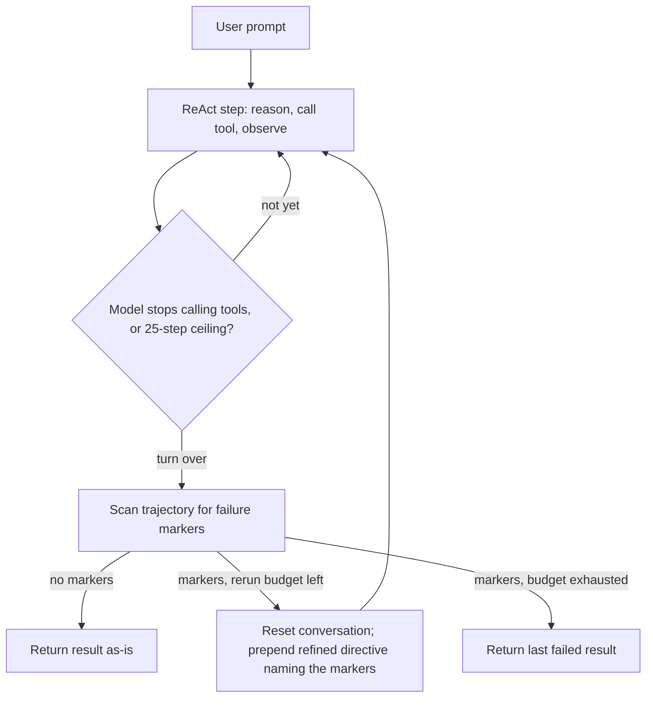

**Origin:** [ultraworkers/claw-code](https://github.com/ultraworkers/claw-code) (2026, MIT) — a public rewrite that exists downstream of a 2026 leak of a commercial agent harness's source; its README disclaims affiliation with Anthropic and "does not claim ownership of the original Claude Code source material"
**Loop type:** streaming tool-call conversation loop (a `ConversationRuntime` in the canonical Rust workspace); loop internals are not documented in the upstream READMEs — replicated in Chimera as ReAct with a 25-step ceiling plus opt-in bounded rerun
**Primary surface:** terminal REPL, one-shot prompt, and direct CLI subcommands (`rusty-claude-cli` crate: "REPL, one-shot prompt, direct CLI subcommands, streaming display")
**Chimera primitive:** `chimera/badger/` (verified at `2507d0c`)

The repo describes itself as "the public Rust implementation of the `claw` CLI agent harness" and frames itself as an "agent-managed museum exhibit." The thesis Chimera's parity notes carry forward from it: better harness tools, not merely storing the archive — a clean rewrite is worth more than a museum-quality copy of the leaked snapshot. A naming note: Chimera's badger trees (`chimera/badger/`, `docs/badger/`, `tests/badger/`, the badger site docs) never use this page's title, by [policy](/chimera/badger/security-and-trademarks/); they say "the upstream" or "the harness-rewrite tradition." This Field Guide page, like the [inspirations index](/chimera/inspirations/), is the designated factual reference — do not copy its title into badger-scoped files.

## Loop

The upstream READMEs document the harness *around* the loop — crates, tools, slash palette, parity audit — but not the turn mechanics themselves. The diagram below is the posture as made executable in `chimera/badger/` (`cli.py` + `rerun.py`), which is the loop this page can verify firsthand:

The distinguishing move is that recovery happens *across* attempts, not within one. Where sibling agents extend a long trajectory to dig out of a failure, this posture caps the trajectory (25 steps vs 50 for Chimera's other CLIs) and spends the saved budget on a fresh attempt with a refined prompt — total attempts = 1 + `--max-reruns` (default 2).

## Tool Set

The `tools` crate's own enumeration ("tool specs + execution"), mapped to badger's surface — badger ships Chimera's shared tool set, restrictable with `--allowed-tools`:

| Upstream tool | Purpose | badger equivalent |
|---|---|---|
| `Bash` | shell execution | `bash` |
| `ReadFile` / `WriteFile` / `EditFile` | read, create/overwrite, in-place edit | `read` / `write` / `edit` |
| `GlobSearch` / `GrepSearch` | filename and content search | `list_files` / `search` |
| `WebSearch` / `WebFetch` | web search and page fetch | `web_fetch` (fetch only) |
| `Agent` | sub-agent spawn | `delegate` |
| `TodoWrite` | todo list maintenance | `todo` |
| `NotebookEdit` | notebook editing | — |
| `Skill` | skill invocation | skills discovery in the shared REPL |
| `ToolSearch` | tool discovery | — |

Per-tool constraints are not documented in the workspace README; gating lives in the `runtime` crate, which owns the "permission policy." Badger's analog is the cross-CLI `--permission-mode` flag (`read-only` / `suggest` / `auto` / `yolo` / `strict`, default `suggest`).

## Prompt Strategy

- The upstream READMEs do not publish the system prompt. What they document is the surface around it: model aliases (`opus` / `sonnet` / `haiku`, default `claude-opus-4-7`), a slash palette (`/help`, `/status`, `/sandbox`, `/cost`, `/resume`, `/mcp`, `/agents`, `/skills`, `/doctor`, `/plugin`, `/subagent`), and tab completion that "expands slash commands, model aliases, permission modes, and recent session IDs."
- The replica's system prompt is a three-sentence posture statement: "You are Badger, a Chimera coding agent in the harness-rewrite tradition. Plan briefly, act with a tight tool budget, and verify before declaring success." No few-shot examples.
- On rerun, the next attempt's prompt is the original prefixed by a directive that names the detected markers and ends "Do not claim done until verification passes."
- Edit format: tool-call file edits (`EditFile` / `WriteFile` upstream; read–edit–write in the replica). No diff dialect in prompts.

## Context Strategy

- Upstream: the `runtime` crate owns "config loading, session persistence, permission policy, MCP client lifecycle"; `/resume` plus recent-session tab completion imply persistent, resumable sessions. Compaction behavior is not documented in the READMEs.
- Replica: every run persists to an event-sourced log at `~/.chimera/eventlog/badger-<utc>-<uuid8>/`, inspectable via `sessions list/show/cost` and exportable via `share`. Compaction is manual (`/compact`), history reset is manual (`/clear`).
- The 25-step ceiling bounds context growth by construction; a rerun *resets* the conversation rather than appending to it, so recovery comes from a refined fresh context, not a longer one.

## Termination Heuristic

The upstream READMEs do not document termination. The replica makes the posture's termination rules explicit:

- A turn ends when the model stops calling tools or hits the 25-step ceiling.
- With `--rerun-on-failure` set, the finished trajectory is scanned against a deliberately conservative marker list: pytest `FAILED` lines and failure summaries, `SyntaxError`, Python tracebacks, JavaScript `SyntaxError … Unexpected`, Rust `error[E…]` compile errors, node `AssertionError`, and explicit `BUILD FAILED` / `TESTS FAILED` lines.
- Markers + budget remaining → reset and rerun with the refined prompt; markers with budget exhausted → return the last failed result.
- No markers → return as-is, *even if the agent reported failure* — rerunning without an actionable marker would be guesswork. False negatives are preferred over false positives: rerun cost is treated as a real budget, not a free safety net.

## Notable Quirks

- **Museum-exhibit framing.** "This is not meant to be hand-operated like a normal product repo. It is an agent-managed exhibit: the harnesses plan, execute, verify, label, and preserve the artifact while the crabs keep the tank running." The README adds, plainly: "Claw Code is not the serious production project here."
- **The wrong-crate trap.** `cargo install claw-code` installs a deprecated crates.io stub that only prints "claw-code has been renamed to agent-code." The repo is build-from-source; the renamed upstream binary installs as `agent-code`.
- **Parity as a first-class artifact.** `PARITY.md` is "the current Rust-port checkpoint"; a mock parity harness ships 10 coverage scenarios (`mock_parity_scenarios.json`, `scripts/run_mock_parity_diff.py`) and an entire `mock-anthropic-service` crate exists for "deterministic `/v1/messages` mock for CLI parity tests."
- **Python demoted to reference.** The `src/` + `tests/` Python workspace is the "companion Python/reference workspace and audit helpers; not the primary runtime surface" — the Rust workspace (9 crates) is canonical.
- **Affiliation disclaimers up front.** "This repository is not affiliated with, endorsed by, or maintained by Anthropic," and it "does not claim ownership of the original Claude Code source material."

## In Chimera

Badger (`chimera badger`, alias `chimera strict`) reimplements the harness-rewrite posture on Chimera's shared primitives. Adopted:

- **Strict defaults** — `--max-steps` defaults to 25 vs 50 for the six sibling CLIs; `--allowed-tools` narrows the surface; named `--profile` presets (`strict` / `balanced` / `yolo`) bundle permission mode, step budget, and rerun stance into one flag.
- **The PARITY pattern, made live** — `chimera badger parity --against PARITY.md` loads a declared schema (JSON, YAML-ish, or fenced-Markdown block) and diffs it against the *running* agent's tools, max-steps, slash commands, default model, and rerun flag. The diff is asymmetric (live extras are informational; only declared fields fail) and exits 0 on match, 1 on drift, 2 on usage error — CI-enforceable, like the upstream's parity audit.
- **Rerun-on-failure as a first-class flag** — `--rerun-on-failure` / `--max-reruns` plus the `/rerun` REPL command, formalizing the tradition's verify-before-claiming-done discipline.
- **Anthropic-first provider chain** — `--model` > `$BADGER_MODEL` > Anthropic (`claude-sonnet-4-6`) > OpenAI > OpenRouter > Ollama, with a friendly error listing every supported env var.

Diverged: Python on the shared `Agent` / `ReAct` / eventlog substrate rather than a Rust workspace; parity checks a live agent against an operator schema rather than tracking port progress against a reference codebase; the default model is `claude-sonnet-4-6` rather than `claude-opus-4-7`; `serve` / `agents` / `bench` are stubs that defer to sibling CLIs; and rerun-on-failure has no documented upstream flag equivalent — it is badger's executable reading of the posture. Full surface-by-surface status: [parity matrix](/chimera/badger/parity-matrix/).

## References

- Upstream repo: [github.com/ultraworkers/claw-code](https://github.com/ultraworkers/claw-code) — root and `rust/` workspace READMEs read June 2026. Loop internals, the system prompt, compaction, and termination are **not** documented there; per the badger naming-restraint policy, those sections are written from the Chimera replica and its parity notes, and are labeled as such above.
- Chimera primitive: `chimera/badger/` (`cli.py`, `rerun.py`, `parity.py`, `slash.py`, `repl.py`, `providers.py`, `sessions.py`) at commit `2507d0c`
- [Badger parity matrix](/chimera/badger/parity-matrix/) · [Harness discipline](/chimera/badger/harness-discipline/) · [Rerun on failure](/chimera/badger/rerun-on-failure/) · [Security and trademarks](/chimera/badger/security-and-trademarks/) · [Inspirations](/chimera/inspirations/)
