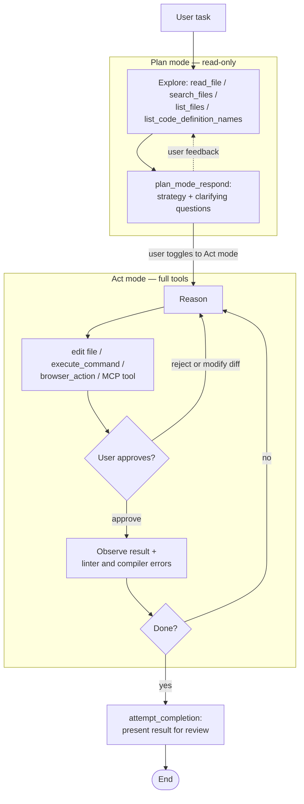

**Origin:** Cline Bot Inc., open source (Apache-2.0). Repository created July 2024 under the name "Claude Dev" — the old name survives in early upstream changelog entries — and later renamed Cline.

**Loop type:** Dual-mode ReAct — a read-only Plan mode and a tool-wielding Act mode, with the human toggling between them and approving each mutation.

**Primary surface:** IDE-embedded (VS Code extension first; now also a JetBrains plugin, CLI, and SDK).

**Chimera primitive:** `cline` style in `chimera/agents/presets/agent_styles.py` (verified at `2507d0c`)

Cline's design bet is that an autonomous loop becomes trustworthy when the human sits inside it rather than after it. From the upstream README: "Every file edit and terminal command requires your approval, so you stay in control of what actually changes."

## Loop



Plan and Act are two postures over the same conversation. In Plan mode, "Cline explores your codebase, asks clarifying questions, and lays out a strategy. Once you're aligned, switch to Act mode and Cline executes the plan" (upstream README). The toggle is a user action, not a model decision.

## Tool Set

Tool names below are from the upstream tool registry, `apps/vscode/src/shared/tools.ts` (main branch, June 2026).

| Tool | Purpose | Notable constraint |
|---|---|---|
| `read_file`, `list_files`, `search_files`, `list_code_definition_names` | Explore the codebase | Members of the upstream `READ_ONLY_TOOLS` list |
| `write_to_file`, `replace_in_file`, `apply_patch` | Create and edit files | Rendered as a reviewable diff; requires user approval |
| `execute_command` | Run terminal commands | Requires user approval |
| `browser_action` | Drive a browser | Classified read-only upstream |
| `use_mcp_tool`, `access_mcp_resource`, `load_mcp_documentation` | Call MCP servers (databases, APIs, cloud infrastructure) | Users can "ask Cline to create custom tools on the fly" |
| `plan_mode_respond`, `act_mode_respond` | Reply to the user | Plain responses are mode-tagged tool calls |
| `ask_followup_question` | Request missing information | Explicit human handoff mid-task |
| `condense`, `summarize_task` | Compact conversation history | Context management exposed as tools |
| `focus_chain` | Maintain a running todo list | — |
| `new_task`, `use_subagents`, `use_skill` | Spawn fresh tasks, subagents, or skills | `use_subagents` and `use_skill` are read-only classified |
| `attempt_completion` | Present the finished result | The termination signal |

## Prompt Strategy

- The system prompt is assembled from per-tool prompt modules; upstream keeps one source file per tool under `core/prompts/system-prompt/tools/` (e.g. `attempt_completion.ts`).
- Three edit formats coexist: whole-file (`write_to_file`), targeted search/replace (`replace_in_file`), and patch (`apply_patch`). All of them surface in the IDE as diffs the user "can review, modify, or revert."
- Project-specific guidance is injected from `.clinerules` files in the repository.

## Context Strategy

- Cline "reads your project structure, understands the relationships between files, and makes coordinated changes" (README) rather than working one file at a time.
- Compaction is model-visible: `condense` and `summarize_task` are entries in the default tool enum, so shrinking the conversation is an action the agent can take, not just background machinery.
- Checkpoints snapshot the workspace as the task proceeds: "All changes are tracked with checkpoints, so you can easily undo the agent's work."
- `focus_chain` carries a todo list across long tasks.

## Termination Heuristic

- The model ends a task by calling `attempt_completion`, which presents the result to the user — completion is a claim the human inspects, in the same review surface as every edit.
- `ask_followup_question` is the explicit off-ramp when the model needs the user mid-task.
- Because every file edit and terminal command is approval-gated, a user who stops approving stops the loop; there is no autonomous path around a denied action.

## Notable Quirks

- **The mode toggle is human-operated.** Plan-to-Act is not a phase the model exits on its own; the user decides when the strategy is good enough to execute.
- **"Read-only" is a named constant.** Upstream maintains a `READ_ONLY_TOOLS` list in `shared/tools.ts` — and `browser_action` is on it, so Plan-style exploration extends to the web.
- **Replying is a tool call.** `plan_mode_respond` and `act_mode_respond` make even plain text responses mode-tagged actions.
- **MCP as self-extension.** Beyond consuming community MCP servers, the README invites users to "ask Cline to create custom tools on the fly."
- **Renamed mid-flight.** It began as "Claude Dev" and outgrew both the name and the single surface: the same core now ships as a VS Code extension, JetBrains plugin, CLI, and SDK.

## In Chimera

The `cline` style (line 221 of `agent_styles.py`) encodes the architecture in three choices: full tool set, a two-phase plan/act loop, and an IDE-assistant prompt.

```python
AgentPreset.CLINE = AgentPreset(
    name="cline",
    description="Cline style: plan/act dual mode, full tools, IDE-like.",
    tool_names=["AGENT_TOOLS"],
    loop_type="plan_act",
    loop_kwargs={"plan_steps": 8},
    max_steps=25,
    system_prompt=(
        "You are an IDE-integrated coding assistant. First, explore the codebase "
        "in a read-only planning phase to understand the structure. Then execute "
        "your plan with full tool access. Be thorough in planning, efficient in "
        "execution."
    ),
)
```

`loop_type="plan_act"` composes a `PlanActLoop` (`chimera/core/loops/plan_act.py`). Phase 1 filters the tool list down to a read-only set (`read_file`, `search`, `list_files`, `repo_map`, `think`, `read_image`) and runs up to 8 ReAct steps to produce a written plan. Phase 2 starts a fresh context containing the original task plus the plan text, then runs up to 25 steps with full tool access. The plan survives as `loop.plan_output`, so you can log it or gate it through a reviewer between phases.

One deliberate deviation, called out in the loop's docstring: upstream Cline waits for the human to flip the toggle, while `PlanActLoop` automates the plan-to-act transition. Approval gating is likewise not baked into the style — in Chimera that lives in the permissions layer (`LoopConfig`), composable onto any loop.

To build the same posture by hand — two agents joined by a `Pipeline`, one read-only planner and one editing actor, with independently swappable models — see [Build Cline in 70 lines](/chimera/tutorials/build-cline-in-70-lines/).

## References

- Upstream repo: [github.com/cline/cline](https://github.com/cline/cline) (Apache-2.0; tool registry at `apps/vscode/src/shared/tools.ts`)
- Chimera style: `chimera/agents/presets/agent_styles.py` (`AgentPreset.CLINE`, line 221) at commit `2507d0c`; loop machinery in `chimera/core/loops/plan_act.py`
- Tutorial: [Build Cline in 70 lines](/chimera/tutorials/build-cline-in-70-lines/)
