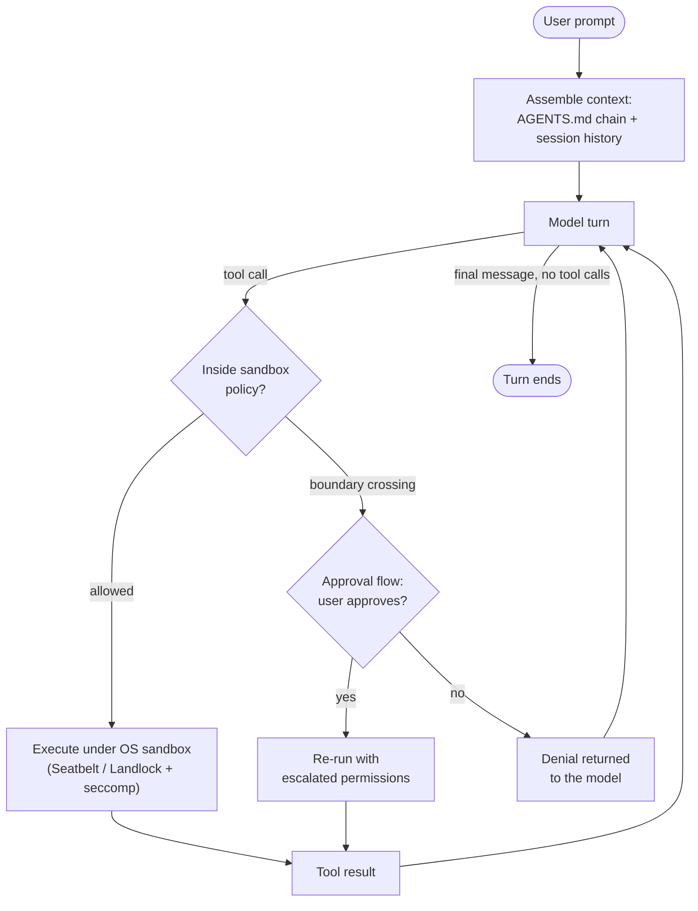

**Origin:** OpenAI; open-sourced April 2025 as a TypeScript/Node.js CLI, rewritten in Rust the same year ("Codex CLI is Going Native")
**Loop type:** ReAct-style tool loop with sandbox-mediated escalation
**Primary surface:** terminal TUI (`codex`), non-interactive `codex exec`, IDE extension (VS Code / Cursor / Windsurf), cloud
**Chimera primitive:** `chimera/ferret/` (full CLI) and the `codex` style in `chimera/agents/presets/agent_styles.py` (verified at `2507d0c`)

## Loop

The defining move is *where* the permission check happens. Most agents ask before acting; Codex CLI acts immediately inside an OS-level sandbox and asks only when a tool call crosses the sandbox boundary (network, writes outside the workspace).

Sandbox enforcement is kernel-level, not prompt-level: Seatbelt on macOS, Landlock/seccomp on Linux and WSL2, and native Windows Sandbox via PowerShell on Windows. Three modes: `read-only`, `workspace-write` (edits inside the workspace plus configured `writable_roots`; network and out-of-workspace access require approval), and `danger-full-access` (no restrictions).

Approval policy is orthogonal to sandbox mode. Named presets bundle the two: **Auto** (`workspace-write` + `on-request` approvals), **Read Only** (`read-only` sandbox + `on-request`), and **Full Access** (`--dangerously-bypass-approvals-and-sandbox`, alias `--yolo`, policy `never`). An `untrusted` policy runs only known-safe read operations automatically.

## Tool Set

| Tool | Purpose | Notable Constraint |
|---|---|---|
| `shell` | Run terminal commands | Always executes under the active sandbox mode; boundary crossings trigger the approval flow |
| `apply_patch` | Create / modify / delete files | Structured patch dialect; first-class Responses API implementation, with a freeform context-free-grammar variant |
| `update_plan` | Maintain a visible step plan | Plan updates stream into the TUI |
| `web_search` | Search the web | On by default; serves cached results to reduce prompt-injection risk |
| `view_image` | Pull an image file into context | Pairs with the `-i` flag and composer paste |
| `exec_command` / `write_stdin` | Long-lived PTY session + keystroke injection | For REPLs and streaming interactive programs |
| MCP tools | External tool servers | Configured in `~/.codex/config.toml` |

## Prompt Strategy

- The system identity is terse: "You are Codex, based on GPT-5. You are running as a coding agent in the Codex CLI on a user's computer."
- Project instructions come from an **AGENTS.md chain**: global `~/.codex/AGENTS.md` first, then every `AGENTS.md` from the git root down to the working directory, concatenated root-down and joined with blank lines. The file nearest your cwd appears last in the prompt and effectively wins. An `AGENTS.override.md` at any level substitutes for its sibling. Combined size is capped at 32 KiB by default (`project_doc_max_bytes`).
- **Edit format:** structured patches via `apply_patch`, not whole-file rewrites.
- Ships GPT-5-family defaults (`gpt-5.5` recommended at the time of writing); `/model` switches mid-session.

## Context Strategy

- The full conversation persists as a resumable session: `codex resume` reopens the last session, browses recent ones, or targets a session id.
- The merged AGENTS.md chain is applied before the agent starts work, so standing project rules hold without re-prompting.
- Web search results are cached rather than fetched live, which reduces the prompt-injection surface.

## Termination Heuristic

- A turn ends when the model returns a final message with no further tool calls. There is no explicit "task complete" tool.
- `codex exec` runs the same loop headlessly, pipes the final plan and results to stdout, and exits.
- An approval denial does not terminate the turn; it returns to the model as feedback to route around.
- At startup, Codex detects whether the folder is version-controlled and recommends **Auto** for git repos and `read-only` for everything else. Version control is treated as the undo mechanism that makes `workspace-write` safe.

## Notable Quirks

- **The permission inversion.** Ask-first agents gate every action on a human; Codex runs everything immediately inside the kernel sandbox and surfaces only boundary crossings. Enforcement lives in the OS rather than the prompt.
- **The Rust rewrite.** The original TypeScript CLI required Node 22+; the "Going Native" rewrite produced a dependency-free binary (ratatui TUI) and the npm package became a thin wrapper that downloads the platform binary. Rust is now roughly 96% of the repository.
- **Network is opt-in even in Auto.** `workspace-write` denies network by default; `pip install` prompts for approval unless configured otherwise.
- **`.git` is implicitly protected** inside a writable workspace, so the agent cannot rewrite history out from under you.
- **Full Access is deliberately ugly to type:** `--dangerously-bypass-approvals-and-sandbox` (the `--yolo` alias is documented as not recommended).
- **`!` prefix** in the TUI runs a shell command directly, skipping the model entirely.

## In Chimera

Chimera replicates Codex CLI at two depths.

### Depth 1 — `chimera/ferret/`: the full CLI

`chimera ferret` reimplements the sandbox-first posture in Python on shared Chimera primitives. Verified surface at `2507d0c`:

- **Three-tier sandbox** via `SandboxedEnvironment` (`chimera/ferret/sandbox.py`): `--sandbox read-only|workspace-write|workspace-write-network`, default `read-only`. The wrapper statically classifies commands (read-only allowlist, network-command list, write containment to the workdir) and raises `SandboxViolation` on breach.
- **OS-level second line** (`chimera/ferret/os_sandbox.py`): Seatbelt profiles via `sandbox-exec` on macOS and Landlock via ctypes on Linux, behind `--os-sandbox auto|on|off`, failing open with a single stderr warning when the platform primitive is unavailable.
- **Single-flag approvals:** `--approval read-only|auto|full`, plus the cross-CLI `--permission-mode` 5-mode surface and `--full-auto` / `--yolo` shorthands. Mid-session `/sandbox` and `/approval` slash toggles re-shape the next tool call live.
- **IDE-first serve:** `chimera ferret serve` defaults to ACP over stdio with IDE-shaped notifications (`code/diff`, `editor/open_file`, `terminal/output`, `progress/step`); HTTP+SSE is opt-in via `--http` (port 5174).
- **Config ingest:** merges `~/.codex/config.toml` with a project-level `./.codex/config.toml`, ingests `~/.codex/agent/*.md` and `~/.codex/command/*.md`, and walks up AGENTS.md files into the system prompt.
- **Upstream-shaped subcommands:** `apply`, `review`, `fork`, `mcp` / `mcp-server`, `sessions list|show`, `--resume` / `-c`, and an OpenAI-first provider chain defaulting to `gpt-5` (`$FERRET_MODEL`).

**Adopted:** the three sandbox tiers with a kernel layer, single-flag approval presets, `~/.codex/` config + agents + commands ingest, AGENTS.md walk-up, IDE-first serve transport, OpenAI-default provider chain.

**Diverged:** Python on Chimera's shared primitives instead of a Rust workspace; enforcement order (ferret classifies commands at the wrapper level first, with the OS sandbox as the second line, where upstream enforces kernel-first); network access is a distinct third mode (`workspace-write-network`) rather than a config key inside `workspace-write`; the default posture is `read-only` everywhere, where upstream recommends Auto in version-controlled folders; edits ride Chimera's standard edit/replace tools rather than the `apply_patch` dialect.

Row-by-row status lives in the [parity matrix](/chimera/ferret/parity-matrix/).

### Depth 2 — the `codex` agent style: loop-level

`AgentPreset.CODEX` (`chimera/agents/presets/agent_styles.py`, line 189 at `2507d0c`) captures only the loop shape: the full `AGENT_TOOLS` toolbox, a plain ReAct loop, `max_steps=50`, and a terse "powerful coding agent" system prompt. The canonical entry point is `CodingAgent.from_preset("codex")`. Use this depth for controlled comparisons where only the loop architecture matters and the sandbox is out of scope.

## References

- Upstream repo: [openai/codex](https://github.com/openai/codex)
- Rust rewrite announcement: ["Codex CLI is Going Native" (discussion #1174)](https://github.com/openai/codex/discussions/1174)
- Sandboxing: [developers.openai.com/codex/concepts/sandboxing](https://developers.openai.com/codex/concepts/sandboxing)
- Approvals: [developers.openai.com/codex/agent-approvals-security](https://developers.openai.com/codex/agent-approvals-security)
- AGENTS.md: [developers.openai.com/codex/guides/agents-md](https://developers.openai.com/codex/guides/agents-md)
- Tool list: [Codex prompting guide (OpenAI Cookbook)](https://developers.openai.com/cookbook/examples/gpt-5/codex_prompting_guide)
- Replicated in Chimera at commit `2507d0c`: `chimera/ferret/` (CLI), `chimera/ferret/sandbox.py` + `chimera/ferret/os_sandbox.py` (sandbox), `chimera/agents/presets/agent_styles.py` (style), `docs/ferret/parity-matrix.md` (audit)
