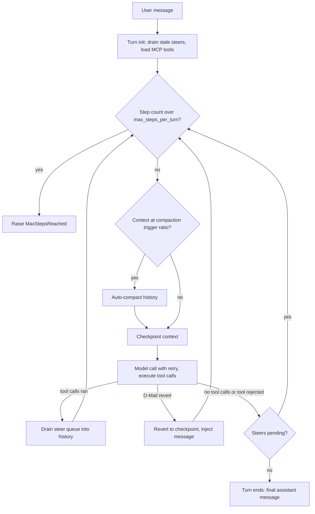

**Origin:** Moonshot AI, open-sourced October 2025 — [MoonshotAI/kimi-cli](https://github.com/MoonshotAI/kimi-cli) (Python ≥3.12, Apache-2.0)
**Loop type:** ReAct-style step loop with a context checkpoint before every model call; plan mode is an in-loop posture, not a separate phase
**Primary surface:** interactive terminal REPL (prompt-toolkit + rich), with ACP for IDE clients, a VS Code extension, and a Zsh plugin
**Chimera primitive:** `chimera/stoat/` (verified at `2507d0c`)

Kimi CLI describes itself as "an AI agent that runs in the terminal, helping you complete software development tasks and terminal operations." Its signature ergonomic is the **shell-mode toggle**: `Ctrl-X` flips the same input buffer between feeding the LLM agent and running shell commands directly, without leaving the interface. The agent core is a class literally named `KimiSoul` ("The soul of Kimi Code CLI"), built on `kosong`, an in-repo LLM-abstraction workspace package.

## Loop

The loop lives in `src/kimi_cli/soul/kimisoul.py` (`KimiSoul._agent_loop`), and its docstring spells out the lifecycle: turn initialization (drain stale steers, finish deferred MCP loading), then a step loop of guard → compaction check → checkpoint → model call + tool execution, then turn resolution.

Two details distinguish it from a plain ReAct loop. First, the context is **checkpointed before every model call**, and a tool can throw a `BackToTheFuture` exception that reverts the context to an earlier checkpoint and injects a message there (the `SendDMail` mechanism). Second, user input typed mid-turn lands in a **steer queue** that is drained between steps and injected as follow-up user messages — a pending steer even overrides a would-be stop and forces another step.

## Tool Set

The default root agent (`src/kimi_cli/agents/default/agent.yaml`) declares:

| Tool | Purpose | Notable constraint |
|---|---|---|
| `Agent` | Spawn or resume subagents (`coder`, `explore`, `plan`) | Subagents are persistent sessions; the parent sees only the final message |
| `Shell` | Run shell commands | `run_in_background=true` spawns tracked background tasks (root agent only) |
| `TaskList` / `TaskOutput` / `TaskStop` | Manage background tasks | `TaskOutput` is a non-blocking snapshot unless `block=true` |
| `ReadFile` / `ReadMediaFile` | Read text and media files | — |
| `Glob` / `Grep` | File discovery and content search | Grep is ripgrep-backed (`ripgrepy` dependency) |
| `WriteFile` | Create or overwrite a whole file | In plan mode, writes are rejected except to the plan file |
| `StrReplaceFile` | Exact string-replacement edit | Same plan-mode binding as `WriteFile` |
| `SearchWeb` / `FetchURL` | Web search and page fetch | — |
| `AskUserQuestion` | Ask the user a question | Auto-dismissed when AFK (away-from-keyboard) mode is on |
| `SetTodoList` | Maintain a todo list | — |
| `EnterPlanMode` / `ExitPlanMode` | Toggle read-only planning | Tools stay visible in plan mode; each checks the flag at call time and rejects |

`Think` and `SendDMail` exist in the codebase but ship commented out of the default toolset.

## Prompt Strategy

- One Jinja-templated system prompt (`agents/default/system.md`), opening: "You are Kimi Code CLI, an interactive general AI agent running on a user's computer."
- Template variables inject the OS and shell (`KIMI_OS`, `KIMI_SHELL`), an ISO timestamp, the working directory plus a two-level directory listing, and the merged contents of all applicable `AGENTS.md` files (deeper directories take precedence).
- Imperative rules, no few-shot examples: changes must go through tools, parallel tool calls are "HIGHLY RECOMMENDED", changes should be minimal, reply in the user's language, and no git mutations without explicit confirmation.
- A two-tier tag convention: `<system>` tags carry supplementary context, while `<system-reminder>` tags are "authoritative system directives" that may override normal behavior.
- Subagent roles are injected through a `ROLE_ADDITIONAL` template argument — `coder.yaml` extends the same prompt and tells the model it is a subagent whose caller is the parent agent.
- Edit format: whole-file `WriteFile` plus exact-string `StrReplaceFile`. No diff format.

## Context Strategy

- Linear message history with token counting; status snapshots expose `context_tokens / max_context_tokens` to the UI.
- **Auto-compaction inside the step loop**: when pending tokens cross `compaction_trigger_ratio` of the model's context size (minus a reserved budget), `SimpleCompaction` summarizes the history using a dedicated compaction prompt (`prompts/compact.md`), emitting `CompactionBegin`/`CompactionEnd` wire events.
- A checkpoint is persisted before every model call; `revert_to(checkpoint_id)` powers the D-Mail revert path.
- Dynamic injection providers append per-step reminders (plan-mode and AFK-mode reminders ship built in), and background-task snapshots and notifications are folded into context between steps.

## Termination Heuristic

A step returns one of two stop reasons (`StepStopReason = "no_tool_calls" | "tool_rejected"`):

- **No tool calls** — the assistant message is treated as the final answer and the turn ends.
- **Tool rejected** — the user denied an approval, ending the turn without a final message.
- Either stop is overridden if steer messages are pending: they are injected and the loop forces another step.
- Budget exhaustion raises `MaxStepsReached` when `max_steps_per_turn` is exceeded; fatal step errors trigger a `StopFailure` hook and abort the turn.

## Notable Quirks

- **Time-travel internals.** Checkpoint/revert is themed after time-travel fiction: the `SendDMail` tool raises `BackToTheFuture` to send a message to an earlier checkpoint, coordinated by a component named `DenwaRenji` (`soul/denwarenji.py`); an alternate agent persona ships as `agents/okabe/`.
- **`Ctrl-X` is bidirectional across surfaces.** Inside the CLI it drops to shell mode; the `zsh-kimi-cli` plugin uses the same key inside your regular Zsh to summon agent mode.
- **Shell mode has no `cd`.** The README notes built-in commands like `cd` are not yet supported.
- **AFK mode.** An away-from-keyboard posture implies auto-approval and auto-dismisses `AskUserQuestion`, for unattended runs.
- **Wire protocol.** The UI is decoupled from the soul via typed wire messages (`TurnBegin`, `StepBegin`, `StepRetry`, `CompactionBegin`, …), so alternate frontends — ACP, the VS Code extension, custom wire-mode clients — drive the same loop.
- **Rebranding mid-flight.** The project is transitioning from "Kimi CLI" to "Kimi Code CLI" as its successor, with automatic config migration.

## In Chimera

Stoat (`chimera stoat`, alias `chimera shell`) reimplements the shell-mode-toggle posture on Chimera primitives. Adopted:

- The **shell-mode toggle** — `/shell`, the `--shell-mode` boot flag, and a `Ctrl-X s` chord (prompt_toolkit when installed); agent mode prompts `stoat> `, shell mode `stoat$ `, with one mode-tagged history feeding `/history`.
- **Plan mode** as a third posture (`/plan`, `Ctrl-X p`, `--plan-mode`), with plans persisted to `~/.chimera/plans/`.
- **Kimi-first provider chain** — `$MOONSHOT_API_KEY` resolves to `kimi-k2.6` against `api.moonshot.ai/v1`, then Anthropic / OpenAI / OpenRouter / Ollama fallbacks.
- Session resume (`-c` / `--session`) over the shared eventlog, plus `SessionStart` / `SessionEnd` / `UserPromptSubmit` hooks.

Diverged: the turn loop is Chimera's shared ReAct (default 50 steps) rather than a port of the soul/kosong stack — no per-step checkpoint/revert; shell-mode commands run as isolated `bash -c` subprocesses (persistent `cwd` deliberately skipped); the chord is secondary to the slash form; and the Zsh plugin, `mcp` subcommand group, OAuth login, and ACP serve mode are not shipped (the last is a stub). Full surface-by-surface status: [parity matrix](/chimera/stoat/parity-matrix/).

## References

- Upstream repo: [github.com/MoonshotAI/kimi-cli](https://github.com/MoonshotAI/kimi-cli) — read at v1.47.0 (June 2026): `src/kimi_cli/soul/kimisoul.py`, `src/kimi_cli/agents/default/agent.yaml` + `system.md`, `README.md`, `pyproject.toml`
- Chimera primitive: `chimera/stoat/` (`cli.py`, `repl.py`, `shell_mode.py`, `keybindings.py`, `providers.py`) at commit `2507d0c`
- [Stoat parity matrix](/chimera/stoat/parity-matrix/) · [Stoat shell mode](/chimera/stoat/shell-mode/) · [Inspirations](/chimera/inspirations/)
