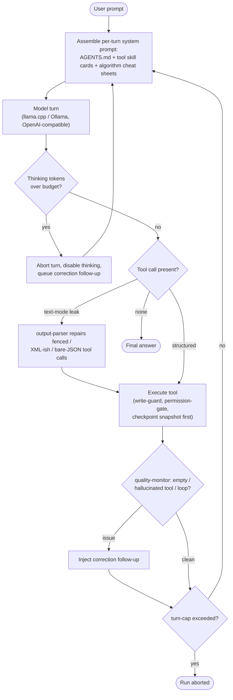

**Origin:** [itayinbarr/little-coder](https://github.com/itayinbarr/little-coder) — Itay Inbar, 2026. npm package on Node, Apache-2.0, with the whitepaper [*Honey, I Shrunk the Coding Agent*](https://open.substack.com/pub/itayinbarr/p/honey-i-shrunk-the-coding-agent).

**Loop type:** ReAct-style native tool-calling loop, inherited unmodified from [pi](https://github.com/badlogic/pi-mono) and instrumented per turn by 20 lifecycle-event extensions.

**Primary surface:** terminal (pi's interactive TUI, one-shot, and `--mode rpc`) against a local llama.cpp or Ollama server on consumer hardware.

**Chimera primitive:** `chimera/shrew/` (verified at `2507d0c`).

little-coder does not ship its own agent loop. pi is a plain dependency in `package.json` — the agent loop, provider API, TUI, session tree, and compaction all come from it. Everything little-coder-specific lives in `.pi/extensions/` (20 TypeScript extensions hooking pi's lifecycle events), `skills/` (30 markdown files the extensions inject on demand), and a Python `benchmarks/` harness. The thesis: small local models already know how to code; what they need is a scaffold matched to their capability ceiling — fewer tools, enforced edit discipline, per-turn just-in-time guidance, and hard budgets on reasoning and turns.

## Loop

## Tool Set

| Tool | Purpose | Notable Constraint |
|---|---|---|
| `Read` | File contents with line numbers | pi built-in |
| `Write` | Create files | Refuses if the file already exists (write-guard); the error returns the exact `Edit` call shape for the same path |
| `Edit` | Exact-match string replacement | `old_string` must match exactly, whitespace included; `replace_all` for repeated matches |
| `Bash` | Shell execution | 30 s default timeout; permission-gate whitelists read-only commands (`ls`, `cat`, `git log/status/diff`, …) |
| `Grep` / `Glob` | Content search / filename patterns | `Grep` from pi; `Glob` added by the extra-tools extension |
| `WebFetch` / `WebSearch` | URL fetch / DuckDuckGo search | extra-tools extension |
| `ShellSession` (`Cwd`, `Reset`) | Persistent shell | tmux-proxy and subprocess backends; mounted for Terminal-Bench runs |
| `BrowserNavigate/Click/Type/Scroll/Extract/Back/History` | Playwright browsing | Mounted per benchmark (GAIA) |
| `EvidenceAdd` / `EvidenceGet` / `EvidenceList` | Per-session evidence store | 1 KB snippet cap; survives compaction via evidence-compact |

## Prompt Strategy

- **Base:** pi's ~1,000-token system prompt plus a 61-line `AGENTS.md` project prompt that pi auto-discovers. `AGENTS.md` states the runtime invariants (Write refuses on existing files, 30 s bash timeout) in the same terms the runtime enforces.
- **Per-turn assembly:** skill-inject appends a `## Tool Usage Guidance` block — tool cards selected by error recovery > recency > intent priority under a configurable token budget. knowledge-inject appends `## Algorithm Reference` — cheat sheets scored against the problem statement by keyword (weight 1.0) and bigram (weight 2.0) matching with an inclusion threshold. The prompt tells the model to trust these blocks because they were selected for the current turn.
- **Edit format:** exact-match search-replace. `Write` is for new files only — "prefer Edit over Write" is promoted from guidance to an enforced invariant.
- **Per-model profiles:** `.pi/settings.json` carries `model_profiles[<id>]` (temperature, `max_tokens`, `thinking_budget`, skill/knowledge token budgets) plus `benchmark_overrides` for Terminal-Bench and GAIA runs.
- No few-shot examples; instructive prose only.

## Context Strategy

- Session persistence and auto-compaction come from pi's session tree; the evidence-compact extension re-injects the evidence store after compaction so collected citations survive.
- Injected skill and knowledge blocks are re-scored and **replaced** every turn, not accumulated — their context cost is bounded by the two token budgets.
- The effective window is pinned at serving time: the canonical llama.cpp incantation serves 16k context with experts in system RAM and only attention plus KV cache on GPU, so context length is the dominant VRAM consumer. A ~22 GB quantized MoE checkpoint runs within 8 GB of VRAM this way.
- `benchmark_overrides` can raise `context_limit` per benchmark.

## Termination Heuristic

- **Natural stop:** an assistant turn with no tool call ends the run (pi's loop semantics).
- **turn-cap:** counts `turn_start` events per run and calls `ctx.abort()` over the cap. Caps are per-benchmark settings — unbounded for Aider Polyglot, bounded for Terminal-Bench and GAIA — or `LITTLE_CODER_MAX_TURNS`.
- **thinking-budget:** when thinking tokens exceed the budget, the in-flight turn is aborted and retried with thinking disabled, plus a follow-up nudging the model to commit to an implementation. Turn-level, not run-level.
- **quality-monitor** never stops the run; it converts failure signatures (empty response, hallucinated tool name, repetition loop) into corrective follow-up messages that restate the user's original goal.

## Notable Quirks

- **Write refuses on existing files** — the upstream calls this "the whitepaper invariant" and credits it as the single highest-leverage mechanism. The refusal error contains the exact `Edit` call shape, so the failure itself teaches the recovery.
- **Nothing forks pi.** All 20 mechanisms are auto-discovered extensions; each can be deleted or disabled per deployment via `.pi/settings.json`.
- **Small-model extensions auto-disable** when a large or cloud model is active, so the same install hosts both.
- **The mechanisms survived a substrate swap:** v0.0.x was Python on a different agent substrate (a ClawSpring derivative); v0.1.0+ rebuilt the same adaptations as pi extensions.
- **The benchmark harness is dev-only Python** (excluded from the npm package) and drives the agent over `pi --mode rpc`.
- **Hardware target is a consumer laptop**, not a GPU server — the README's reference runs used 8 GB of VRAM with the MoE expert-offload trick.

## In Chimera

Shrew (`chimera/shrew/`, alias `chimera tiny`) replicates the posture with the same layering: shrew builds on **weasel** — Chimera's replica of pi — exactly as little-coder builds on pi, so substrate improvements flow through.

**Adopted:**

- Small-model defaults: `qwen3.6-35b-a3b` via llama.cpp, `--max-steps 30`, `--allowed-tools Read,Write,Edit,Bash` (`cli.py`).
- Curated skill markdowns under `chimera/shrew/skills/{knowledge,protocols,tools}/` with frontmatter (`name`, `description`, `triggers`) and `~/.shrew/skills/` plus project overlays.
- Scaffold-fit prompt wrapping below 13B active parameters (`extensions/scaffold_fit.py`) and tool-list trimming below 9B (`extensions/tool_filter.py`).
- MoE-aware context sizing as code (`extensions/moe_offload.py`: a `MoEModelProfile` catalog and `compute_optimal_context_window()` driven by `--vram-gb`).
- Text-mode tool-call repair (`output_parser.py`: fenced tool blocks, `<tool_call>` wrappers, bare JSON, Python call shorthand).
- Quality monitoring (`quality_monitor.py`: empty response, hallucinated tool name, self-correction language, repetition loop, plus a correction-message builder).
- Per-turn skill re-ranking (`skill_injector.py`: error > recency > intent scoring, top-K bodies injected at a system-prompt marker).
- Per-model profiles with `benchmark_overrides` (`model_profiles.py`, reading `~/.chimera/shrew/settings.json`).
- Checkpoint-before-write and bash permission-gate extensions; Aider Polyglot, GAIA, harbor, and terminal-bench adapters under `benchmarks/`.

**Diverged:**

- Packaging: a Python module inside `chimera-run`, not an npm package on Node.
- The provider chain probes live — llama.cpp `/health` first, then vLLM, SGLang, and Ollama, before any cloud key — where the upstream routes by environment variable without probing and supports llama.cpp and Ollama only.
- Extensions are stdlib-only pure functions composed as hooks, not TypeScript lifecycle-event subscribers.
- Skill content leans toward scaffold discipline and a larger protocol set, where the upstream leans toward per-tool cards and algorithm cheat sheets.
- Shrew inherits Chimera substrate the upstream lacks: cooperative cancellation, event-sourced sessions shared with the sibling CLIs, and secret redaction.

Surface-by-surface status: [parity matrix](/chimera/shrew/parity-matrix/).

## References

- Upstream repo: [github.com/itayinbarr/little-coder](https://github.com/itayinbarr/little-coder) (Apache-2.0). Read firsthand for this page: `README.md`, `AGENTS.md`, and the `.pi/extensions/` sources (turn-cap, skill-inject, thinking-budget).
- Whitepaper: [*Honey, I Shrunk the Coding Agent*](https://open.substack.com/pub/itayinbarr/p/honey-i-shrunk-the-coding-agent) (Substack, 2026).
- Substrate: [pi](/chimera/field-guide/pi/) (cited by the upstream as [badlogic/pi-mono](https://github.com/badlogic/pi-mono)) — replicated in Chimera as weasel.
- Replicated in Chimera at commit `2507d0c`: `chimera/shrew/` — CLI, REPL, providers, 12 extension modules, 21 skill markdowns, 4 benchmark adapters.
- [Shrew parity matrix](/chimera/shrew/parity-matrix/) — GREEN/YELLOW/RED per surface.
