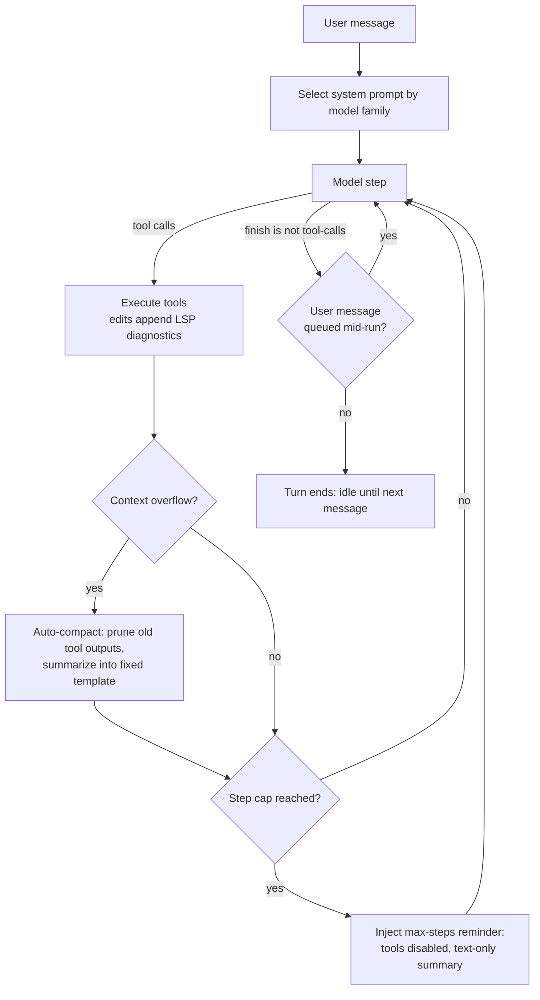

**Origin:** [sst/opencode](https://github.com/sst/opencode) — repository created April 2025 by the SST team, now published under the `anomalyco` organization (TypeScript, MIT)
**Loop type:** ReAct-style tool-calling loop; runs until the model returns a finish reason other than `tool-calls`, with an optional per-agent step cap (unbounded by default)
**Primary surface:** terminal TUI running as a client of a local headless HTTP server; a desktop app (beta) and IDE extensions drive the same server
**Chimera primitive:** `chimera/otter/` (verified at `2507d0c`)

opencode's README tagline is "The open source AI coding agent." The defining decision is the client/server split: the agent runtime is a server process, and every user interface — TUI, desktop app, IDE extension — is a client of it. Two built-in agents ship, toggled with `Tab`: **build** (default, full access) and **plan** (read-only; denies file edits by default and asks permission before running bash commands), plus a **general** subagent for multistep searches, invokable as `@general`.

## Loop

The session loop (`packages/opencode/src/session/prompt.ts`) is a single `while (true)` over model steps. Each step picks a system prompt by model family, calls the model, executes any requested tools, and re-enters. Compaction and step caps are handled in-loop.

Two details distinguish it from a plain tool-calling loop. First, the stop condition is checked against the message's recorded finish reason — the loop only exits once the last assistant message finished with something other than `tool-calls` and no tool calls are pending, so a malformed or interrupted step re-enters rather than silently ending the turn. Second, the step cap is enforced through the prompt, not the runtime: on the final allowed step the loop injects a reminder that disables tools and demands a text-only wrap-up, letting the model write its own handoff instead of being cut off.

## Tool Set

From `packages/opencode/src/tool/` and the tools documentation:

| Tool | Purpose | Notable constraint |
|---|---|---|
| `bash` | Run shell commands | Configurable timeout; on timeout the result tells the model to retry with a larger value |
| `read` | Read file contents | 2,000-line default window; lines truncated at 2,000 characters |
| `edit` | Exact string-replacement edits | Gated by the `edit` permission; appends LSP diagnostics for the touched file to its output |
| `write` | Create or overwrite whole files | Gated by the same `edit` permission |
| `apply_patch` | Apply a patch to files | Gated by the same `edit` permission |
| `grep` | Regex content search | Full regex syntax |
| `glob` | Filename pattern matching | Results sorted by modification time |
| `task` | Delegate to a subagent | Requires a `subagent_type`; its description steers simple lookups back to `read`/`grep`/`glob` |
| `todowrite` | Maintain a todo list | Disabled for subagents by default |
| `question` | Ask the user, with selectable options | — |
| `webfetch` | Fetch a web page | — |
| `websearch` | Web search | Gated behind `OPENCODE_ENABLE_EXA`; no API key required |
| `skill` | Load a `SKILL.md` into the conversation | Outputs are exempt from compaction pruning |
| `lsp` | Query language servers (definition, references, hover) | Experimental; gated behind `OPENCODE_EXPERIMENTAL_LSP_TOOL` |

## Prompt Strategy

- **Per-model-family system prompts.** `session/system.ts` switches on model-id substrings across eight prompt files: `anthropic.txt` for `claude` models, `beast.txt` for `gpt-4`/`o1`/`o3`, `codex.txt`, `gpt.txt`, `gemini.txt`, `kimi.txt`, `trinity.txt`, and `default.txt` as the fallback.
- **Plan mode is a prompt posture.** Dedicated plan prompt files (`plan.txt`, `plan-mode.txt`, an Anthropic-specific plan reminder) back the read-only plan agent; `Tab` toggles build/plan.
- **Edit format:** exact string replacement (`edit`) plus a patch tool (`apply_patch`) and whole-file `write` — no unified-diff format.
- **Rules ingest.** `session/instruction.ts` loads `AGENTS.md`, `CLAUDE.md` (unless `disableClaudeCodePrompt` is set), and the deprecated `CONTEXT.md`, plus global copies from the config directory and `~/.claude/CLAUDE.md`. The first project-level match wins — a source comment notes this avoids stacking rule files from every ancestor directory. Config `instructions` entries can add local files and URLs.

## Context Strategy

- **Auto-compaction on overflow.** `session/compaction.ts` prunes older tool outputs to 2,000 characters once prunable history crosses token thresholds (`PRUNE_MINIMUM = 20_000`, `PRUNE_PROTECT = 40_000`); `skill` outputs are protected from pruning.
- **Structured summaries.** Compaction summarizes into a fixed Markdown template ("Goal", "Constraints & Preferences", "Progress", ...) and preserves a recent tail — two turns by default, bounded between 2,000 and 8,000 tokens.
- **LSP diagnostics re-enter through tool results.** After an `edit`, diagnostics for the file are appended as "LSP errors detected in this file, please fix:". Language servers start automatically when matching file extensions are detected and auto-download unless `OPENCODE_DISABLE_LSP_DOWNLOAD` is set.
- **Subagent results are summarized forward.** After `task` output lands, a synthetic message instructs: "Summarize the task tool output above and continue with your task."

## Termination Heuristic

- The loop breaks when the last assistant message carries a finish reason other than `tool-calls` and no tool calls are pending — the model stops by answering in plain text.
- Step budgets are per-agent: `agent.steps ?? Infinity`. On the final allowed step, a "MAXIMUM STEPS REACHED" reminder disables tools and requires a text-only response summarizing accomplished work, remaining tasks, and recommended next steps.
- A user message queued mid-run overrides a would-be stop: the loop injects "Please address this message and continue with your tasks." and keeps stepping.

## Notable Quirks

- **The TUI is itself a server client.** `opencode serve` (default `127.0.0.1:4096`) exposes an OpenAPI 3.1 spec at `/doc`, an SSE `/event` stream, and a `/tui` endpoint that drives the TUI through the server.
- **Prompt engineering is per model family, not per agent.** The same agent gets a different system prompt depending on which model serves it.
- **It ships LSP and documents its tradeoffs.** The LSP docs caution that "Language servers can get out of sync, use significant memory, vary by version or project, and slow down agent workflows" and recommend lint/typecheck CLIs for many cases — while the edit tool still feeds diagnostics into every edit result.
- **Reads other agents' rule files.** Project `CLAUDE.md` and `~/.claude/CLAUDE.md` are ingested by default.
- **Name-collision etiquette.** The README asks projects using "opencode" in their names to state they are not affiliated with the upstream team.

## In Chimera

Otter (`chimera otter`, alias `chimera multi`) reimplements the server-first, multi-client posture on Chimera primitives. Adopted:

- **Server-first `serve`.** REST + SSE on `127.0.0.1:5173` by default — `/healthz`, `/session`, `/session/{id}/message`, `/session/{id}/events` (with `Last-Event-ID` resume), `/tool/approve`, `/commands`, `/runs` — implemented on stdlib `http.server` only.
- **Multi-transport.** `serve --acp` swaps in JSON-RPC 2.0 over stdio (`initialize`, `session/new`, `session/message`, `session/cancel`, permission round-trip) for IDE-style clients.
- **Config ingest.** `~/.opencode/config.json` plus project `.opencode/{config,mcp}.json`: MCP servers (stdio and HTTP), markdown agents (`.opencode/agent/*.md`), custom commands (`.opencode/command/*.md`, also served over HTTP), permissions, instructions, and plugin specs discovered under `~/.opencode/plugin/`.
- **LSP as first-class tools.** Five dedicated tools (`lsp_diagnostics`, `lsp_completion`, `lsp_rename`, `lsp_definition`, `lsp_references`) instead of one action-enum tool.
- **One-shot and session surfaces.** `-p` with `--output-format text|json|stream-json`, `-f`/`--file` attachments, `--title`, `sessions list/show/rename/cost`, `agents create`, `mcp add/auth`.

Diverged: persistence is event-sourced JSONL under `~/.chimera/eventlog/otter-*` rather than the upstream's session database; cost tracking surfaces as `sessions cost` rollups and a `/runs/cost` route; the server defaults to port 5173 (upstream: 4096) and adds an optional bearer-token model — a master token plus auto-generated per-session tokens scoped to their own session subtree; and admin surfaces (`account`, `db`, `github`, `pr`, `upgrade`, `web`) are intentionally not mirrored. Full surface-by-surface status: [parity matrix](/chimera/otter/parity-matrix/).

## References

- Upstream repo: [github.com/sst/opencode](https://github.com/sst/opencode) — read at upstream commit `1ccd14b0e` (May 2026): `packages/opencode/src/session/` (`prompt.ts`, `system.ts`, `compaction.ts`, `instruction.ts`), `packages/opencode/src/tool/`, `README.md`
- Upstream docs: [opencode.ai/docs](https://opencode.ai/docs/) — server, tools, and LSP pages
- Chimera primitive: `chimera/otter/` (`cli.py`, `server.py`, `acp.py`, `lsp.py`, `plugins.py`) at commit `2507d0c`
- [Otter parity matrix](/chimera/otter/parity-matrix/) · [Otter server](/chimera/otter/server/) · [Inspirations](/chimera/inspirations/)
