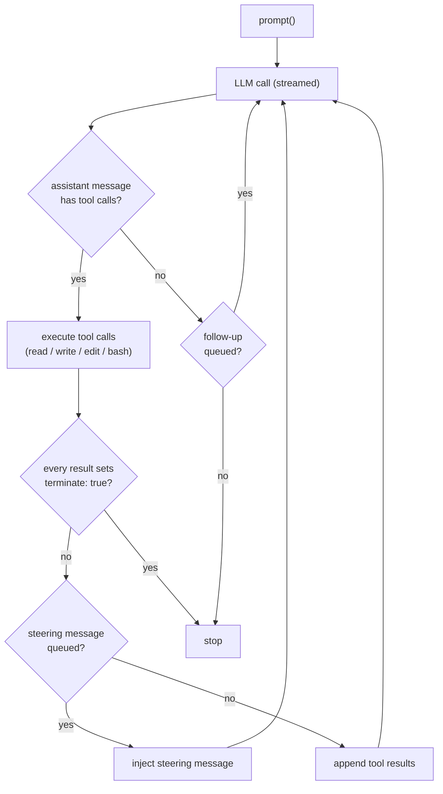

**Origin:** `earendil-works/pi` (formerly `badlogic/pi-mono`), Mario Zechner, 2025. TypeScript, MIT.
**Loop type:** ReAct-style tool-calling loop (`pi-agent-core`); stops when the assistant replies without tool calls.
**Primary surface:** terminal — interactive TUI by default, plus print (`-p`), stdio RPC, and an embeddable SDK.
**Chimera primitive:** [`chimera/weasel/`](https://github.com/0bserver07/chimera/tree/master/chimera/weasel) (verified at `2507d0c`)

pi describes itself as "a minimal terminal coding harness," built so you "adapt pi to your workflows, not the other way around." Features that other agents bake in (sub-agents, plan mode, MCP, permission prompts) are deliberately absent, replaced by a TypeScript extension API, skills, prompt templates, and installable packages.

## Loop

The loop lives in `pi-agent-core` and is orchestrated by an `AgentSession`. Two message queues feed it: *steering* messages interrupt a running turn (injected after the current tool batch finishes), and *follow-up* messages queue work for after the agent would otherwise stop.

## Tool Set

By default the model gets exactly four tools; `--tools` / `--exclude-tools` adjust the set. The codebase also ships opt-in `find`, `grep`, and `ls` tool factories, but when the model has only `bash` the system prompt tells it to "Use bash for file operations like ls, rg, find."

| Tool | Purpose | Notable Constraint |
|---|---|---|
| `read` | Read file contents | Output truncated by line/byte caps |
| `write` | Create or overwrite files | Whole-file writes |
| `edit` | Targeted in-place edits | Array of `{oldText, newText}` pairs; each `oldText` must be unique in the original file; edits must not overlap |
| `bash` | Shell execution | No permission gate — runs with the permissions of the launching user/process; no background bash (use tmux) |

## Prompt Strategy

- `buildSystemPrompt()` assembles: a tool list (one-line snippet per tool), guideline bullets conditioned on which tools are present, project context, a skills section (only when `read` is available), and finally the current date and working directory.
- Project context is `AGENTS.md` files discovered by walking up from the working directory, injected inside `<project_context>` / `<project_instructions path="...">` tags.
- A custom prompt *replaces* the default entirely; `appendSystemPrompt` appends to it.
- User-facing prompt templates are markdown files under `~/.pi/agent/prompts/` or `.pi/prompts/`, expanded in the REPL via `/name`.
- **Edit format:** exact-string search/replace. The `edit` tool applies each replacement against the original file (not incrementally) and reports a display diff plus a standard unified patch after the fact.

## Context Strategy

- Sessions auto-save as JSONL under `~/.pi/agent/sessions/`, organized by working directory. Every entry carries an `id` and `parentId`, so a session is a tree — "in-place branching without creating new files," navigated with `/tree`.
- Compaction summarizes older messages while preserving recent ones. It triggers automatically "on context overflow (recovers and retries) or when approaching the limit (proactive)," or manually via `/compact` (optionally with custom instructions).
- Compaction never destroys history: the full record stays in the session JSONL file.

## Termination Heuristic

- The loop stops when "the assistant responds without tool calls" — no task-complete tool, no self-grading.
- Tools can return `terminate: true` to skip the automatic follow-up LLM call; the loop only stops early "when every finalized tool result in that batch sets `terminate: true`."
- Follow-up messages are "checked only when there are no more tool calls and no steering messages" — a queued follow-up restarts the loop instead of stopping it.
- The SDK exposes `shouldStopAfterTurn` callbacks for caller-defined stop conditions.

## Notable Quirks

- The README lists omissions as features, each with an alternative: "No MCP" (build CLI tools with READMEs, or add MCP via an extension), "No sub-agents" (spawn pi instances via tmux), "No permission popups" (run in a container), "No plan mode" (write plans to files), "No built-in to-dos" (use a `TODO.md`), "No background bash" (use tmux).
- Self-modification is the intended workflow: ask pi to build the missing command, tool, or UI tweak as an extension, then `/reload` and keep going.
- Extensions are TypeScript modules whose default export receives an `ExtensionAPI`; they auto-discover from `~/.pi/agent/extensions/` and `.pi/extensions/`, and bundles install from npm or git (`pi install npm:...`, `pi install git:...`).
- The monorepo splits the stack into separately published packages: the agent loop (`pi-agent-core`), a unified multi-provider LLM API supporting 30+ providers (`pi-ai`), and a differential-rendering terminal UI library (`pi-tui`).
- RPC mode uses strict LF-delimited JSONL framing; the docs warn clients off generic line readers.
- Themes hot-reload on file change.

## In Chimera

pi is the upstream for **weasel** (`chimera weasel`, alias `mini`), Chimera's minimal-harness CLI.

**Adopted:**

- The four-mode architecture. `chimera/weasel/modes.py` defines a `WeaselMode` enum — `INTERACTIVE` / `PRINT` / `RPC` / `SDK` — with lazy per-mode dispatch; `chimera/weasel/cli.py` routes `-p` to one-shot print (text, `--json`, or NDJSON `--stream-json`), `--mode rpc` to a stdio server, and `--mode sdk` to an import pointer (`from chimera.weasel.sdk import Agent`).
- The minimal-by-default posture. The REPL ships four slash commands (`/help`, `/exit`, `/clear`, `/model`); sub-agents and plan mode are intentionally not shipped — that is extension territory, as upstream.
- Extension auto-discovery from `.weasel/extensions/` and `~/.weasel/extensions/`, manifest-driven (`manifest.json` or npm-style `package.json`), contributing tools, hooks, and slash commands.
- Prompt-template and theme registries with built-ins → user → project precedence (`prompt_templates.py`, `themes.py`).

**Diverged:**

- Python-first extensions. Python files load natively via importlib; TS/JS extensions run through a Node subprocess bridge (`chimera/weasel/node_executor.py`, JSON-RPC over stdio, fail-open when Node is missing) instead of in-process TypeScript.
- Shared primitives instead of a bespoke runtime: the loop is Chimera's `ReAct` with a `LoopConfig` (50-step default cap, cooperative `CancellationToken`), and persistence is the event-sourced log under `~/.chimera/eventlog/weasel-*` rather than a per-directory JSONL session tree.
- Interactive mode is a plain readline REPL, not a differential-rendering TUI.
- RPC speaks JSON-RPC 2.0 (`prompt`, `cancel`, `get_state`, `list_models`, plus `event` notifications) rather than upstream's custom JSONL protocol.
- The default tool surface is Chimera's `AGENT_TOOLS` group, wider than the fixed four-tool set.

Surface-by-surface status lives in the [parity matrix](/chimera/weasel/parity-matrix/).

## References

- Upstream repo: [github.com/badlogic/pi-mono](https://github.com/badlogic/pi-mono) (now `earendil-works/pi`) — agent CLI in `packages/coding-agent/`, loop in `packages/agent/`
- Upstream docs: [`packages/coding-agent/docs/`](https://github.com/badlogic/pi-mono/tree/main/packages/coding-agent/docs) — `extensions.md`, `rpc.md`, `sdk.md`, `compaction.md`, `session-format.md`
- Replicated in Chimera: [`chimera/weasel/`](https://github.com/0bserver07/chimera/tree/master/chimera/weasel) at commit `2507d0c`
- [Weasel parity matrix](/chimera/weasel/parity-matrix/) and [Inspirations](/chimera/inspirations/)
