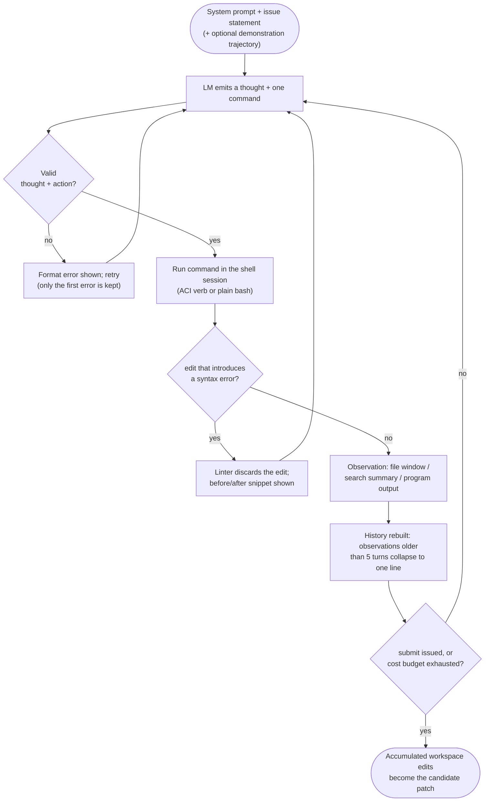

**Origin:** Princeton Language and Intelligence, Princeton University, 2024. NeurIPS 2024 paper, arXiv:2405.15793.

**Loop type:** ReAct. One thought plus one command per turn, executed in a Linux shell session.

**Primary surface:** Autonomous CLI / batch runner that fixes issues in real repositories (the SWE-bench setting).

**Chimera primitive:** `swe_agent` style in `chimera/agents/presets/agent_styles.py` (verified at `2507d0c`).

SWE-Agent is the system that named the agent-computer interface (ACI). The paper's claim: "LM agents represent a new category of end users with their own needs and abilities, and would benefit from specially-built interfaces to the software they use." Rather than handing the model a raw terminal, SWE-Agent wraps the Linux shell in a small set of commands tuned for a language model: a windowed file viewer, a line-range editor with a linter in front of it, and search commands that summarize instead of dumping matches. Plain bash stays available underneath; the ACI verbs are what the prompt documents and what the agent mostly uses.

The paper states four ACI design principles: actions should be simple and easy for agents to understand; actions should be compact and efficient; environment feedback should be informative but concise; guardrails should mitigate error propagation and hasten recovery.

## Loop



There is no separate planning phase. Every action, custom verb or ordinary shell command, runs in the same session, and the result comes back as the next observation.

## Tool Set

| Command | Purpose | Notable constraint |
| --- | --- | --- |
| `find_file`, `search_file`, `search_dir` | Locate files and strings across the repo | Output is a summary; above 50 matches the results are withheld and the agent is told to write a more specific query |
| `open`, `goto`, `scroll_up`, `scroll_down` | Windowed file viewer | At most 100 lines per turn, with the file path, total line count, and counts of lines elided above and below |
| `edit start:end` | Replace a line range in the open file | A linter runs first; syntactically invalid edits are discarded and the agent is asked to try again |
| `create` | Create a new file | A common opening move, used to write an issue-reproduction script |
| Plain bash (`python`, `pytest`, ...) | Run programs and tests | The full Linux shell remains available beneath the ACI commands |
| `submit` | End the episode | Turns the workspace's accumulated edits into the candidate patch |

## Prompt Strategy

The system prompt carries instructions, documentation for the bash and ACI commands, and optionally one demonstration: a full solved-issue trajectory shown before the real task. Each turn the model must produce both a thought and an action; a malformed response triggers an error message and a retry until a valid generation arrives.

The edit format is line-range replacement: `edit start:end` plus replacement text, applied to the currently open file. No diffs and no whole-file rewrites. After an edit applies, the file viewer automatically re-displays the updated window, so the model sees the effect of its change without issuing another command.

## Context Strategy

- The full command-and-observation history is reformatted and combined with the high-level instructions into a single input at every step.
- Observations preceding the last 5 turns are each collapsed into a single line, which keeps the plan-and-action history while dropping stale file contents.
- After a format-error retry succeeds, all past error messages except the first are omitted.
- A command with empty output is reported as "Your command ran successfully and did not produce any output," so silence is never ambiguous.
- Current file state lives in the viewer window rather than in accumulated dumps; the window is re-shown after edits and scrolls.

## Termination Heuristic

The agent ends its own episode with `submit`. A per-instance cost budget backstops it ($4 in the paper's experiments); if a run exceeds the budget, the existing edits are submitted automatically. Malformed output never ends a run; it is retried until the model produces a parseable thought and action. The paper also observes that "agents succeed quickly and fail slowly": resolved instances tend to be submitted well before the budget, while long trajectories usually mean the agent is stuck.

## Notable Quirks

- The viewer's window size is a tuned hyperparameter. The paper's ablations found agents sensitive to it in both directions: a 30-line window shows too little, the whole file too much.
- Search refuses to flood the context. Past 50 matches it returns no results at all, only advice to narrow the query.
- The edit linter targets one specific failure mode: an agent introduces a syntax error, then burns turns re-editing the same snippet while trying to recover.
- Observed trajectories open in one of two ways: `create` a reproduction script, or localize the bug with `find_file` / `search_dir`. Later turns are mostly edit-then-execute cycles.
- The lineage later reversed its own thesis. mini-SWE-agent, from the same team, drops the ACI entirely: it "does not have any tools other than bash," runs each action as an independent `subprocess.run`, and fits the agent class in roughly 100 lines. The maintainers now recommend it as the default for most uses.
- The whole agent (tools, templates, model) is configured from a single YAML file.

## In Chimera

The `swe_agent` style in `chimera/agents/presets/agent_styles.py` is a loop-level replica. It encodes the posture (a small tool set, a methodical prompt, a bounded iterative loop) rather than the windowed-viewer ACI itself:

```python
AgentPreset.SWE_AGENT = AgentPreset(
    name="swe_agent",
    description="SWE-Agent style: minimal tools, retry loop, focused on benchmarks.",
    tool_names=["read_file", "edit_file", "bash", "search", "list_files"],
    loop_type="retry",
    loop_kwargs={"max_retries": 3},
    max_steps=30,
    system_prompt=(
        "You are a software engineering agent. You solve coding tasks by reading "
        "code, making targeted edits, and running tests. Be methodical: understand "
        "the problem first, locate the relevant code, make minimal changes, and verify."
    ),
)
```

The `"retry"` loop type wraps a 30-step ReAct loop in a `RetryLoop` that re-runs a failed task up to 3 times, a coarser stand-in for upstream's in-loop recovery (lint rejections, format retries). The tools map flat: `read_file` for the viewer, `edit_file` for the guarded editor, `search` and `list_files` for the search commands, `bash` for the shell underneath. The canonical entry point is the preset API:

```python
from chimera.assembly.coding_agent import CodingAgent

agent = CodingAgent.from_preset("swebench")  # SWE_AGENT analogue
```

To build the same posture by hand from five primitives, and watch it fix a real failing test, see [Build SWE-Agent in 60 lines](/chimera/tutorials/build-swe-agent-in-60-lines/).

## References

- Paper: [SWE-agent: Agent-Computer Interfaces Enable Automated Software Engineering](https://arxiv.org/abs/2405.15793) (NeurIPS 2024)
- Upstream repo: [github.com/SWE-agent/SWE-agent](https://github.com/SWE-agent/SWE-agent) · docs at [swe-agent.com](https://swe-agent.com/latest/) · successor: [mini-swe-agent](https://github.com/SWE-agent/mini-swe-agent)
- Chimera style: `chimera/agents/presets/agent_styles.py` (`swe_agent` preset), verified at commit `2507d0c`
- Tutorial: [Build SWE-Agent in 60 lines](/chimera/tutorials/build-swe-agent-in-60-lines/)
