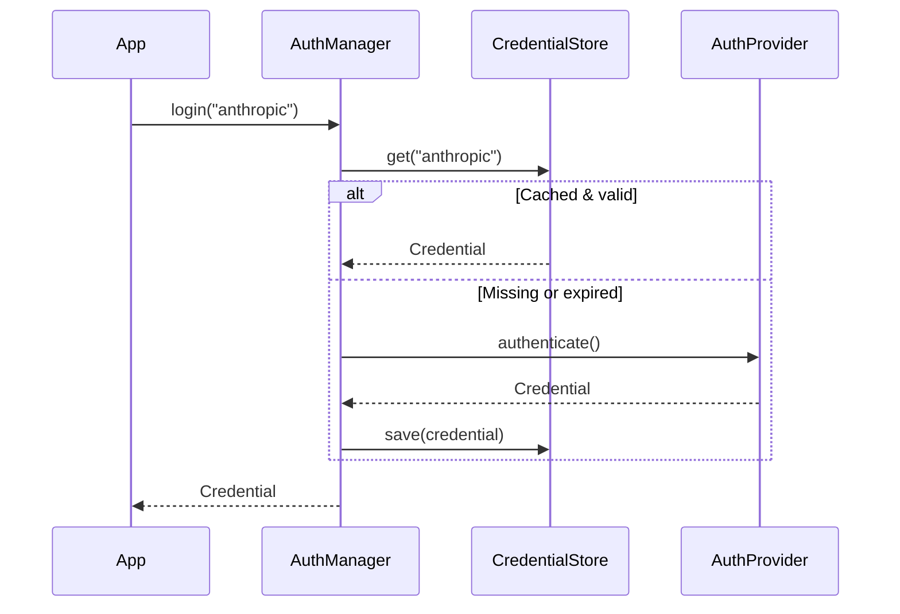

`chimera.auth` manages credential lifecycle for LLM providers.  It supports
API key authentication out of the box and provides an OAuth scaffold for
device-flow and browser-based PKCE flows.

## Credential dataclass

Represents a single authentication credential:

| Field | Type | Description |
|-------|------|-------------|
| `provider` | `str` | Provider identifier (e.g. `"anthropic"`, `"openai"`) |
| `token` | `str` | The bearer token or API key |
| `refresh_token` | `str \| None` | OAuth refresh token |
| `expires_at` | `float \| None` | Unix timestamp of expiry |
| `metadata` | `dict[str, Any]` | Arbitrary extra data |

The `is_expired` property returns `True` when `expires_at` is set and in the
past.  Credentials without an expiry are never considered expired.

## AuthProvider (ABC)

Every auth method implements:

| Method | Description |
|--------|-------------|
| `authenticate()` | Obtain a new `Credential` |
| `refresh(credential)` | Refresh an existing credential |
| `provider_name` (property) | Identifier of the target provider |

## Built-in providers

### APIKeyAuth

Resolves an API key from (in priority order):
1. An explicit `key` parameter
2. A caller-specified environment variable (`env_var`)
3. A well-known environment variable for the provider

Well-known variables: `ANTHROPIC_API_KEY`, `OPENAI_API_KEY`, `GOOGLE_API_KEY`.

```python
from chimera.auth import APIKeyAuth

auth = APIKeyAuth("anthropic")
credential = auth.authenticate()  # Reads ANTHROPIC_API_KEY

auth = APIKeyAuth("openai", key="sk-...")
credential = auth.authenticate()  # Uses the explicit key
```

### OAuthDeviceFlow

Implements RFC 8628 (device authorization grant).  Shows a code in the
terminal; the user visits a URL to authorize.  Requires `httpx` (install via
`pip install chimera-ai[auth]`).

```python
from chimera.auth import OAuthDeviceFlow

auth = OAuthDeviceFlow(
    provider_name="custom",
    client_id="...",
    device_auth_url="https://provider.example/device/code",
    token_url="https://provider.example/oauth/token",
    poll_interval=5,
    timeout=300,
)
```

### OAuthBrowserFlow

OAuth 2.0 authorization code flow with PKCE and a local redirect server.  Also
requires `httpx`.

```python
from chimera.auth import OAuthBrowserFlow

auth = OAuthBrowserFlow(
    provider_name="custom",
    client_id="...",
    auth_url="https://provider.example/authorize",
    token_url="https://provider.example/oauth/token",
    redirect_port=19876,
)
```

## CredentialStore

File-based credential persistence at `~/.chimera/credentials.json`.  The file
is written with `0o600` permissions (owner read/write only).

| Method | Description |
|--------|-------------|
| `get(provider)` | Return stored credential or `None` |
| `save(credential)` | Persist a credential to disk |
| `delete(provider)` | Remove a provider's credential |
| `list_providers()` | Return names of all stored providers |

## AuthManager facade

The `AuthManager` orchestrates the full credential lifecycle:

| Method | Description |
|--------|-------------|
| `register(auth_provider)` | Register a custom `AuthProvider` |
| `login(provider, method)` | Authenticate and cache; returns cached if valid |
| `get_token(provider)` | Return a valid token, refreshing if needed |
| `logout(provider)` | Remove stored credentials |

## Auth flow



## Full example

```python
from chimera.auth import AuthManager

manager = AuthManager()
credential = manager.login("anthropic")
token = manager.get_token("anthropic")

# Later, clear credentials
manager.logout("anthropic")
```
