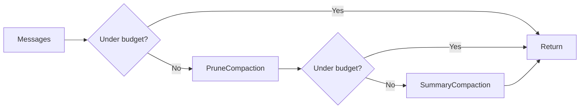

`chimera.compaction` manages context window size by reducing message lists so
they fit within a token budget.  Three strategies can be used individually or
chained together in a composite pipeline.

## CompactionStrategy (ABC)

Every strategy implements a single method:

```python
class CompactionStrategy(ABC):
    @abstractmethod
    def compact(self, messages: list[Message], budget: int) -> list[Message]:
        """Return a compacted copy that fits within *budget* tokens."""
```

Implementations must not mutate the original list or its elements.

## TokenCounter

Estimates token counts for text and message lists.

- When `tiktoken` is installed, uses the given encoding model (default
  `cl100k_base`) for precise counts.
- Otherwise falls back to a `len(text) // 4` character-based heuristic.

The counter exposes two methods:

| Method | Description |
|--------|-------------|
| `count(text)` | Token count for a single string |
| `count_messages(messages)` | Sum of tokens across all message content and serialised tool-call arguments |

## Built-in strategies

### PruneCompaction

Truncates oversized tool-result messages.  For every `tool` message exceeding
`max_tool_output_lines` (default 50), the middle is replaced with
`... [truncated] ...` while preserving the first 20 and last 20 lines.

```python
from chimera.compaction import PruneCompaction

pruner = PruneCompaction(max_tool_output_lines=80)
compacted = pruner.compact(messages, budget=8000)
```

### SummaryCompaction

Replaces the middle portion of a conversation with a summary.  The first
`keep_first` (default 2) and last `keep_last` (default 10) messages are
preserved; everything in between is summarised.

- With a `Provider` -- uses an LLM call to produce a concise summary paragraph.
- Without a provider -- produces a simple count of messages by role.

```python
from chimera.compaction import SummaryCompaction

# Text-only fallback
summary = SummaryCompaction(keep_first=2, keep_last=10)

# LLM-powered summary
summary_llm = SummaryCompaction(
    provider=my_provider,
    keep_first=2,
    keep_last=10,
    summary_max_tokens=500,
)
```

### CompositeCompaction

Chains multiple strategies sequentially.  After each strategy the token count
is re-evaluated and the pipeline **short-circuits** as soon as the result fits
within the budget.

```python
from chimera.compaction import CompositeCompaction, PruneCompaction, SummaryCompaction

pipeline = CompositeCompaction([
    PruneCompaction(max_tool_output_lines=50),
    SummaryCompaction(keep_first=2, keep_last=10),
])

compacted = pipeline.compact(messages, budget=8000)
```

## Compaction pipeline

The following diagram shows how `CompositeCompaction` processes messages
through multiple stages:



## CompactionMetadata (pi-mono)

`CompactionMetadata` is a dataclass that tracks which files were read or
modified during a session so compaction strategies can include file-aware
context in their summaries:

| Field | Type | Description |
|-------|------|-------------|
| `read_files` | `set[str]` | Paths of files the agent has read |
| `modified_files` | `set[str]` | Paths of files the agent has written or edited |

`CompactionMetadata` provides a `merge(other)` method that returns a new
instance combining both sets, useful when merging metadata from parallel
branches.

## FileAwareCompaction mixin (pi-mono)

`FileAwareCompaction` is a mixin for compaction strategies that need access to
file metadata.  It adds two methods:

| Method | Description |
|--------|-------------|
| `set_metadata(metadata)` | Attach a `CompactionMetadata` instance to this strategy |
| `get_file_prompt_section()` | Return a formatted string listing read and modified files, suitable for inclusion in a summary prompt |

`SummaryCompaction` now extends `FileAwareCompaction`.  When metadata is
attached, the LLM summary prompt automatically includes a file-activity section
so the summary preserves awareness of which files were touched.

```python
from chimera.compaction import SummaryCompaction, CompactionMetadata

meta = CompactionMetadata(
    read_files={"src/main.py", "src/utils.py"},
    modified_files={"src/main.py"},
)

summary = SummaryCompaction(provider=my_provider)
summary.set_metadata(meta)
compacted = summary.compact(messages, budget=8000)
```

## SmartCompaction

`SmartCompaction` (`chimera.compaction.smart`) is a higher-order
strategy that mixes urgency awareness with policy-driven choice between
the cheaper strategies. It accepts a `SmartCompactionConfig` carrying
soft / hard token thresholds, the LLM provider, and switches for
which sub-strategies to enable. The strategy escalates the action
based on `CompactionUrgency` (`NONE`, `SOFT`, `HARD`) returned by
`ThresholdCompaction.classify()`. See `docs/playbooks/04-context-management.md`
for a tour of the pattern.

## ThoughtStripCompaction

`ThoughtStripCompaction` (`chimera.compaction.thought_strip`) drops
extended-thinking blocks from messages so the saved transcript fits
without burning context budget on internal monologue. Use
`estimate_thinking_tokens(messages)` to see how many tokens a strip
will reclaim before applying it.

## Threshold-aware compaction

`ThresholdCompaction` (`chimera.compaction.thresholds`) wraps any
strategy with `SOFT` / `HARD` thresholds and tool-call / tool-result
atomicity. When an `AtomicGroup` (call + result pair) would be split
by truncation, the group is preserved as a unit. `InsufficientCompactionError`
is raised when even the most aggressive strategy can't bring the
transcript under the hard threshold.

## Integration with Sessions

When `auto_compact=True` is set on a `Session`, the compaction strategy runs
after every `chat` turn:

```python
from chimera.sessions import Session
from chimera.compaction import CompositeCompaction, PruneCompaction, SummaryCompaction

pipeline = CompositeCompaction([
    PruneCompaction(),
    SummaryCompaction(provider=my_provider),
])

session = Session(
    agent=agent,
    auto_compact=True,
    compaction=pipeline,
)
```
