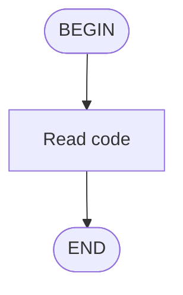

`chimera.skills.flow` lets you define agent workflows as Mermaid flowcharts,
parse them into executable decision trees, and walk an agent through them
step-by-step.  The `Flow` class is a standalone utility -- it does not require
deep framework integration.

## Quick Start

```python
import chimera

flow = chimera.Flow.from_mermaid("""
flowchart TD
    A([BEGIN]) --> B[Read the code]
    B --> C{Has tests?}
    C -->|yes| D[Run the tests]
    C -->|no| E[Write tests first]
    D --> F([END])
    E --> D
""")

provider = chimera.create_provider()
agent = chimera.Agent(provider=provider)

current = flow.begin_id
while current != flow.end_id:
    prompt = flow.to_prompt(current_node_id=current)
    result = agent.run(prompt, env=env)

    nexts = flow.next_nodes(current)
    if len(nexts) > 1:
        choice = chimera.parse_choice(result.output)
        current = flow.advance(current, choice)
    else:
        current = flow.advance(current)
```

## Mermaid Syntax

Flow supports standard Mermaid flowchart syntax:

| Syntax | Node kind |
|--------|-----------|
| `A([BEGIN])` | Begin (exactly one required) |
| `Z([END])` | End (exactly one required) |
| `B[Read code]` | Task (rectangle) |
| `C{Has tests?}` | Decision (rhombus) |
| `C -->\|yes\| D` | Labeled edge |
| `B --> C` | Plain edge |

Nodes with more than one outgoing edge are auto-detected as decision nodes.
All decision edges must have labels, and labels must be unique per node.
The end node must be reachable from the begin node.

## Core API

### Parsing

```python
flow = Flow.from_mermaid(mermaid_text)
```

Returns a `Flow` with `nodes` (dict of `FlowNode`), `edges` (list of
`FlowEdge`), `begin_id`, and `end_id`.

### Generating prompts

```python
# Full workflow overview
prompt = flow.to_prompt()

# Prompt with current position and available choices
prompt = flow.to_prompt(current_node_id="C")
```

For decision nodes, the prompt instructs the agent to respond with
`<choice>...</choice>` tags.

### Advancing

```python
# Linear node -- advance to the single successor
next_id = flow.advance(current_id)

# Decision node -- match a choice to an edge label
next_id = flow.advance(current_id, choice="yes")
```

### Parsing choices

```python
from chimera import parse_choice

choice = parse_choice(agent_output)  # extracts from <choice>yes</choice>
```

Returns `None` if no `<choice>` tag is found.

### Inspecting neighbors

```python
nexts = flow.next_nodes("C")  # [(FlowEdge, FlowNode), ...]
```

## Data Classes

| Class | Fields |
|-------|--------|
| `FlowNode` | `id`, `label`, `kind` (`"begin"`, `"end"`, `"task"`, `"decision"`) |
| `FlowEdge` | `source`, `target`, `label` (optional) |
| `Flow` | `nodes`, `edges`, `begin_id`, `end_id` |

## Error Handling

| Exception | When |
|-----------|------|
| `FlowParseError` | A node token cannot be parsed |
| `FlowValidationError` | Missing begin/end, unreachable end, unlabeled decision edges, duplicate labels |
| `FlowError` | `advance()` called at end node, or invalid choice |

## Skill Discovery

`chimera.skills.discovery` provides automatic skill discovery so the REPL and
agent loops can load skills from well-known locations without manual
registration.  See [Skill Discovery](/modules/skill-discovery/) for the full
API; the short version:

### SKILL.md format

A `SKILL.md` file is a Markdown file with a small YAML front-matter
header.  Only `name` and `description` are required; the rest of the
file is the skill body that gets injected into the system prompt:

```markdown
---
name: my-workflow
description: A short description shown in /skills
---

Step-by-step instructions for the agent. This block can include a
Mermaid flowchart that the agent runs through Flow.from_mermaid:


```

### Search path priority

`default_search_paths(workdir)` returns three paths in priority order:

1. Bundled chimera algorithm skills (read-only, ships with the package)
2. `{workdir}/.chimera/skills/` — project-local
3. `~/.chimera/skills/` — user global

Later paths override earlier ones by skill name.

### Auto-discovery in the REPL

When `chimera code` starts, it calls `discover_skills(default_search_paths())`
and registers all found skills.  Type `/skills` in the REPL to list them.

## Import Reference

```python
from chimera.skills.flow import Flow, FlowNode, FlowEdge, parse_choice
from chimera.skills.flow import FlowError, FlowParseError, FlowValidationError
from chimera.skills.discovery import discover_skills, default_search_paths
```
