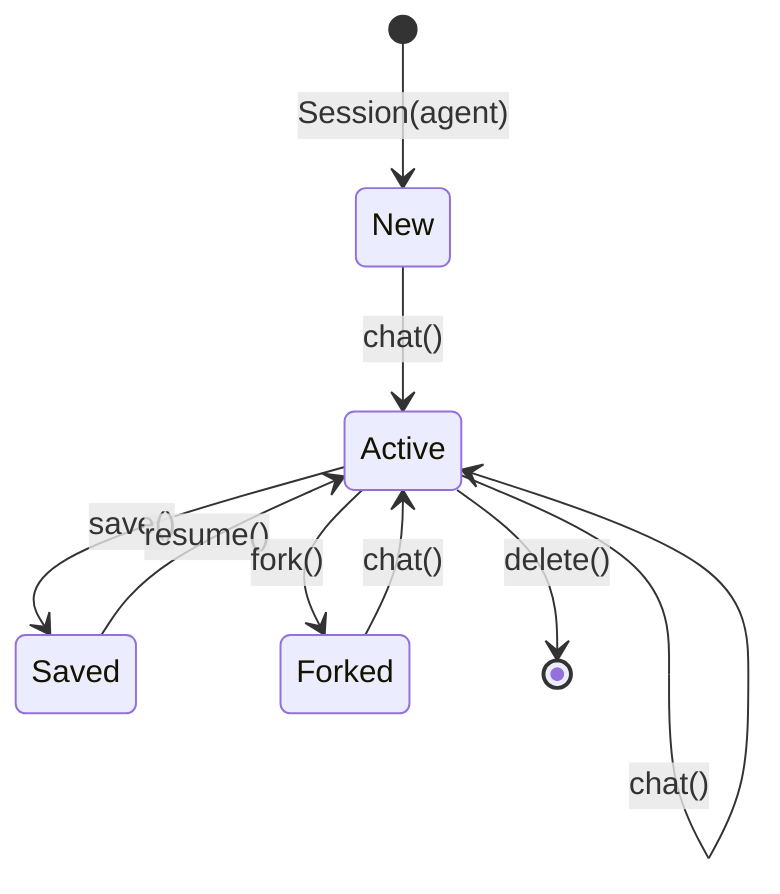

`chimera.sessions` wraps an `Agent` in a multi-turn conversation that can be
persisted, resumed, and forked.  Three storage backends are included for
different deployment scenarios.

## Session class

The `Session` owns a `Context` and a `Storage` backend.  Each call to `chat()`
appends the user message to the running context and delegates to the agent loop.

### Constructor parameters

| Parameter | Default | Description |
|-----------|---------|-------------|
| `agent` | (required) | The `Agent` powering this session |
| `env` | `None` | Optional execution environment |
| `storage` | `InMemoryStorage()` | Persistence backend |
| `session_id` | random UUID | Explicit session identifier |
| `auto_compact` | `False` | Apply compaction after every turn |
| `compaction` | `None` | `CompactionStrategy` for auto-compaction |

### Key methods

| Method | Description |
|--------|-------------|
| `chat(message)` | Send a user message and run the agent loop |
| `fork()` | Create an independent branch with a deep-copied context |
| `save()` | Persist the current state to storage |
| `Session.resume(id, agent, storage)` | Class method to restore a saved session |

### Properties

| Property | Description |
|----------|-------------|
| `session_id` | The unique session identifier |
| `messages` | Current conversation messages (excludes system) |
| `context` | Direct access to the underlying `Context` |

## SessionData dataclass

The serialisable snapshot persisted by storage backends:

| Field | Type | Description |
|-------|------|-------------|
| `session_id` | `str` | UUID-based identifier |
| `messages` | `list[Message]` | Conversation history |
| `system` | `str \| None` | System prompt |
| `parent_id` | `str \| None` | ID of the parent session (for forks) |
| `created_at` | `float` | Unix timestamp |
| `updated_at` | `float` | Unix timestamp |
| `metadata` | `dict[str, Any]` | Arbitrary extra data |

## Storage ABC

Every backend implements four methods:

| Method | Description |
|--------|-------------|
| `save(session_id, data)` | Persist a `SessionData` |
| `load(session_id)` | Load a session or return `None` |
| `list_sessions()` | Return all stored session IDs |
| `delete(session_id)` | Remove a session (no-op if missing) |

## Session lifecycle



## Storage backends

### InMemoryStorage

Dictionary-backed with no persistence.  Useful for tests and ephemeral
sessions.

```python
from chimera.sessions import Session, InMemoryStorage

session = Session(agent, storage=InMemoryStorage())
session.chat("Hello")
session.save()
```

### FileStorage

One JSON file per session under a configurable directory (default
`~/.chimera/sessions/`).

```python
from chimera.sessions import Session, FileStorage

storage = FileStorage(directory="~/.chimera/sessions/")
session = Session(agent, storage=storage)
session.chat("Hello")
session.save()  # Writes <session_id>.json

# Resume later
restored = Session.resume(session.session_id, agent, storage)
```

### SQLiteStorage

SQLite-backed using the stdlib `sqlite3` module.  Messages are stored as a
JSON blob.  Uses WAL journal mode for concurrent reads.

```python
from chimera.sessions import Session, SQLiteStorage

storage = SQLiteStorage(db_path="~/.chimera/sessions.db")
session = Session(agent, storage=storage)
session.chat("Hello")
session.save()

# List all sessions
all_ids = storage.list_sessions()
```

## Forking sessions

Forking creates an independent branch from the current conversation state.
The fork receives a deep copy of the context and records the original session
as its parent:

```python
session = Session(agent)
session.chat("Set up the project structure.")

branch = session.fork()
branch.chat("Now add authentication.")  # Diverges from original

session.chat("Now add logging.")       # Independent path
```
