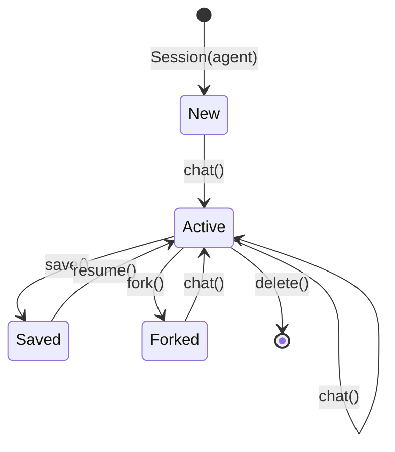

`chimera.sessions` wraps an `Agent` in a multi-turn conversation that can be
persisted, resumed, and forked.  Three storage backends are included for
different deployment scenarios.

## Session class

The `Session` owns a `Context` and a `Storage` backend.  Each call to `chat()`
appends the user message to the running context and delegates to the agent loop.

### Constructor parameters

| Parameter | Default | Description |
|-----------|---------|-------------|
| `agent` | (required) | The `Agent` powering this session |
| `env` | `None` | Optional execution environment |
| `storage` | `InMemoryStorage()` | Persistence backend |
| `session_id` | random UUID | Explicit session identifier |
| `auto_compact` | `False` | Apply compaction after every turn |
| `compaction` | `None` | `CompactionStrategy` for auto-compaction |
| `tree` | `None` | Optional `SessionTree` for branch management |

### Key methods

| Method | Description |
|--------|-------------|
| `chat(message)` | Send a user message and run the agent loop |
| `fork()` | Create an independent branch with a deep-copied context |
| `save()` | Persist the current state to storage |
| `Session.resume(id, agent, storage)` | Class method to restore a saved session |
| `steer(message)` | Inject a steering message mid-turn without interrupting the running loop |
| `queue(message)` | Queue a user message to be processed after the current turn completes |
| `cancel()` | Signal the current turn to cancel via `CancellationToken` |
| `switch_branch(session_id)` | Switch this session to a different branch managed by the `SessionTree` |

### Auto-compaction

When `auto_compact=True` is set, the session calls `_maybe_compact()` after
every `chat()` turn.  `_maybe_compact()` checks whether the context exceeds the
configured token threshold and, if so, applies the `compaction` strategy before
the next turn.  This keeps long-running sessions from hitting provider context
limits automatically.

## SessionTree

`chimera.sessions.tree.SessionTree` manages a graph of related sessions for
branch-aware workflows.  It tracks parent/child relationships, supports named
branches, and enables switching between branches within a single `Session`
object.  See the [chimera.sessions reference](/reference/sessions/) for the
full API.

### Properties

| Property | Description |
|----------|-------------|
| `session_id` | The unique session identifier |
| `messages` | Current conversation messages (excludes system) |
| `context` | Direct access to the underlying `Context` |

## SessionData dataclass

The serialisable snapshot persisted by storage backends:

| Field | Type | Description |
|-------|------|-------------|
| `session_id` | `str` | UUID-based identifier |
| `messages` | `list[Message]` | Conversation history |
| `system` | `str \| None` | System prompt |
| `parent_id` | `str \| None` | ID of the parent session (for forks) |
| `created_at` | `float` | Unix timestamp |
| `updated_at` | `float` | Unix timestamp |
| `metadata` | `dict[str, Any]` | Arbitrary extra data |

## Storage ABC

Every backend implements four methods:

| Method | Description |
|--------|-------------|
| `save(session_id, data)` | Persist a `SessionData` |
| `load(session_id)` | Load a session or return `None` |
| `list_sessions()` | Return all stored session IDs |
| `delete(session_id)` | Remove a session (no-op if missing) |

## Session lifecycle



## Storage backends

### InMemoryStorage

Dictionary-backed with no persistence.  Useful for tests and ephemeral
sessions.

```python
from chimera.sessions import Session, InMemoryStorage

session = Session(agent, storage=InMemoryStorage())
session.chat("Hello")
session.save()
```

### FileStorage

One JSON file per session under a configurable directory (default
`~/.chimera/sessions/`).

```python
from chimera.sessions import Session, FileStorage

storage = FileStorage(directory="~/.chimera/sessions/")
session = Session(agent, storage=storage)
session.chat("Hello")
session.save()  # Writes <session_id>.json

# Resume later
restored = Session.resume(session.session_id, agent, storage)
```

### SQLiteStorage

SQLite-backed using the stdlib `sqlite3` module.  Messages are stored as a
JSON blob.  Uses WAL journal mode for concurrent reads.

```python
from chimera.sessions import Session, SQLiteStorage

storage = SQLiteStorage(db_path="~/.chimera/sessions.db")
session = Session(agent, storage=storage)
session.chat("Hello")
session.save()

# List all sessions
all_ids = storage.list_sessions()
```

## Forking sessions

Forking creates an independent branch from the current conversation state.
The fork receives a deep copy of the context and records the original session
as its parent:

```python
session = Session(agent)
session.chat("Set up the project structure.")

branch = session.fork()
branch.chat("Now add authentication.")  # Diverges from original

session.chat("Now add logging.")       # Independent path
```

## Cross-CLI session sharing (W11 B9)

Per-CLI eventlogs live under `~/.chimera/eventlog/<cli>-<utc>-<uuid>/`.
Wave 11 (`B9-W11-CROSS-CLI-SESSIONS`) added a shared walker so any
CLI can list and inspect sessions minted by any of the seven
codenames (`mink`, `otter`, `ferret`, `weasel`, `shrew`, `stoat`,
`badger`).

```python
from chimera.sessions.eventlog.cross_cli import (
    iter_all_sessions,
    iter_sessions_for_cli,
    find_session_dir,
    parse_cli_origin,
    SessionRecord,
)

# Newest-first walk across every known prefix
for record in iter_all_sessions():
    print(record.session_id, record.cli_origin, record.summary.get("title"))

# Single-CLI filter (default behaviour for `<cli> sessions list`)
otter_records = list(iter_sessions_for_cli("otter"))

# By-id lookup that doesn't care which CLI minted the run
session_dir = find_session_dir("ferret-2026-05-08-abc12345")
```

Each per-CLI `sessions.py` module also accepts `--all-clis` on
`<cli> sessions list`, surfaces a new `ORIGIN` column when set, and
round-trips `cli_origin` through `--json`. `<cli> sessions show <id>`
resolves cross-CLI ids without any further changes because the
loader keys off `root / session_id`, not the prefix.

`KNOWN_CLI_ORIGINS = {mink, otter, ferret, weasel, shrew, stoat,
badger}`; unknown prefixes (`backup-…`, `shares-…`, plugin output)
return `""` from `parse_cli_origin` and are silently skipped.

### Top-level resume (W11 B12)

`chimera resume <id>` (and `chimera resume` with no id) auto-detects
the originating codename from the run-id prefix and dispatches to that
CLI's `--resume <id>`. The newest-across-all picker sorts on the
`<utc>-<uuid8>` tail rather than the full string, so chronologically
newer runs from alphabetically-earlier codenames beat older ones. See
`chimera/cli/resume_cmd.py::find_latest_across_all`.

```bash
chimera resume                              # newest run, any CLI
chimera resume otter-2026-05-08-7f3a91c2   # explicit id
chimera resume ferret-... -- --max-cost 1.0 # passthrough flags after --
```

## Otter file-level undo (W13 G5)

`chimera otter` ships a content-addressed file-snapshot store on top
of the FileTracker hooks. `/undo` and `/redo` rewind both the
conversation transcript *and* the bytes of every file the agent
touched, regardless of the underlying environment (works for
`LocalEnvironment`, not just Docker / Git environments).

```python
from chimera.otter.snapshot import (
    FileSnapshotStore,
    FileSnapshot,
    default_snapshot_root,
)

store = FileSnapshotStore(root=default_snapshot_root("session-id"))
store.snap(["src/main.py", "tests/test_main.py"])  # SHA-256 keyed blob copies
snap = store.latest()                              # FileSnapshot manifest
store.restore(snap)                                # atomic tempfile+rename
store.gc_blobs()                                   # drop unreferenced blobs
```

Layout: `~/.chimera/snapshots/<session-id>/blobs/<sha>/` for blobs,
`snaps/<turn-id>.json` for per-turn manifests. Cumulative manifests
mean editing a 1 MiB file across 10 turns costs ~1 MiB on disk, not
10 MiB — same shape as git's loose object store, but no `git` binary
is invoked. Slash commands accept `--steps N` to rewind multiple
turns at once.

## Otter session tooling (W14)

Wave 14 (`W14-2-OTTER-POLISH`) added five Tier-1 commands that round
out otter's session surface:

| Command | Module | What it does |
|---|---|---|
| `chimera otter worktree {create,list,remove}` | `chimera/otter/worktree.py` | Manifest-backed `git worktree` wrapper. Persists `~/.chimera/worktrees/index.json`. |
| `chimera otter stats` | `chimera/otter/stats.py` | Composes `chimera.mink.cost.compute_summary` over both `mink-*` and `otter-*` eventlog dirs. Renders text + JSON + flat `StatsReport` dataclass. |
| `chimera otter export <id> [--format json\|md\|html]` | `chimera/otter/export_import.py` | `ExportEnvelope` lossless JSON, Markdown / HTML renderers. |
| `chimera otter import <file>` | `chimera/otter/export_import.py` | Round-trips an exported envelope back into a session. |
| `POST /session/<id>/pty/start`, SSE `pty/stream`, `pty/{input,output,resize,stop}` | `chimera/otter/pty.py` + `chimera/otter/server.py` | POSIX-only `PtyManager` over `pty.openpty` + `subprocess.Popen`. Reader thread streams chunks to a buffer and per-subscriber SSE queues. |

The skill marketplace also gained remote download
(`fetch_remote_index`, `download_remote_skills`,
`chimera otter skills fetch <URL>`) so plugin authors can publish
SKILL.md bundles to a static URL and have agents pull them at
runtime.
